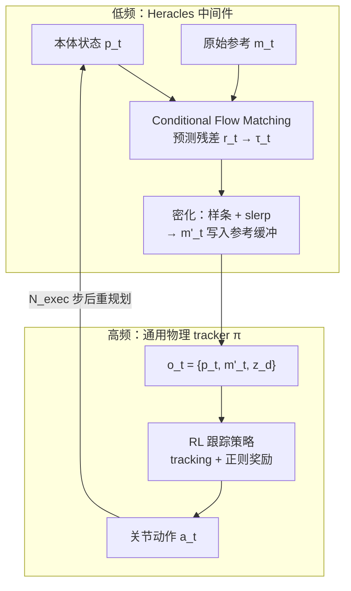

# Heracles：跟踪精度与生成式恢复的扩散中间件

**Heracles**（*Bridging Precise Tracking and Generative Synthesis for General Humanoid Control*，arXiv:2603.27756，[项目页](https://heracles-humanoid-control.github.io/)）由 **X-Humanoid Heracles Project Team** 提出：不把通用控制压成单一 rigid tracker，也不依赖显式 **tracking ↔ recovery** 状态机，而在两者之间加入 **状态条件生成中间件**，把控制从「刚性跟踪范式」推向 **开环生成 + 闭环物理执行** 的统一架构。

## 为什么重要

- **直击 tracking 的 OOD 脆弱性：** [SONIC](../methods/sonic-motion-tracking.md)、[BeyondMimic](../methods/beyondmimic.md) 等在大规模 MoCap 上极强，但严重扰动时盲目最小化即时 kinematic 误差易产生**非类人、不可恢复**的扭矩模式——Heracles 用生成先验**改写**即将执行的参考缓冲，而非仅加重 tracking 权重。
- **与 BFM 路线正交：** [BFM](./paper-behavior-foundation-model-humanoid.md) 等 **无参考** 生成式 WBC 擅自然行为但难保精确时空跟踪；Heracles **保留专用 tracker**，生成层只在偏差大时介入。
- **与 SD-AMP 对照：** [SD-AMP](./paper-unified-walk-run-recovery-sdamp.md) 在 **单策略 RL** 内用双 AMP 判别器；Heracles 是 **分层系统**（middleware + tracker），更接近「规划改参考 + 高频跟踪执行」。
- **隐式模式切换：** 条件于 $(\mathbf{p}_t,\mathbf{m}_t)$ 的 flow 模型在名义区近似 **identity map**，OOD 区变为 **generative synthesizer**——无需手调切换阈值（与 SD-AMP 的训练期 $|g_z+1|$ 门控形成方法论对比）。

## 流程总览

## 核心机制（归纳）

### 1）残差轨迹与「恒等 / 生成」统一

基线锚定在现状态 $\bm{\beta}_{t,k}=\mathbf{p}_t$，只预测残差 $\mathbf{r}_t$，$\bm{\tau}_t=\bm{\beta}_t+\mathbf{r}_t$。当 $\mathbf{p}_t\approx\mathbf{m}_t$ 时，最优残差接近 0，中间件近似透传参考；大偏差时残差编码**多步协调恢复**，目标命令 $\mathbf{m}_t$ 仅通过条件向量进入，避免绝对坐标预测浪费容量在 identity 上。

### 2）Flow matching + 推理技巧

- 训练：线性概率路径 + 速度场 MSE（连续 flow matching）。
- 网络：AdaLN-Transformer；首 token inpainting 保证与 $\mathbf{p}_t$ 运动学连续。
- 推理：**directional warm start**——以 $\mathbf{p}_t\to\mathbf{m}_t$ 线性插值构造 $\mathbf{r}^{\mathrm{init}}$，从 $t_{\mathrm{start}}<1$ 部分噪声状态积分，减少 ODE 步数（SDEdit 启发）。

### 3）闭环 receding-horizon

固定规划窗 $\Delta t$ 与执行间隔 $N_{\mathrm{exec}}$；长程恢复靠** successive replan** 涌现，不要求单次预测整条跌倒–站起轨迹。底层 tracker 观测、奖励形式与训练时一致，仅将 $\mathbf{m}_t$ 换为 middleware 输出的 $\mathbf{m}'_t$。

### 4）底层 tracker 与 token 设计（索引级）

论文 §3.3 同时升级 **通用跟踪策略**（29 DoF 观测分解、Rot6D 根误差、FSQ 运动 token 等），使中间件输出与大规模 tracking 生态兼容；细节以 [PDF](https://arxiv.org/pdf/2603.27756) 为准。

## 常见误区

1. **Heracles 取代 tracker：** 中间件**不直接输出扭矩**；物理可行性仍由 RL tracker 保证。
2. **等于开环 MDM：** 运动扩散模型（如 HY-Motion）缺接触与扭矩约束；Heracles 输出进 **closed-loop MDP**。
3. **等于 BeyondMimic 测试时 guidance：** BeyondMimic 在跟踪 formulation 内加 classifier guidance；Heracles 是**独立 middleware + 状态条件 flow**，按 $\mathbf{p}_t$ 实时改参考缓冲。

## 参考来源

- [Heracles 论文归档（arXiv:2603.27756）](../../sources/papers/heracles_humanoid_diffusion_arxiv_2603_27756.md)
- [Heracles 项目页](../../sources/sites/heracles-humanoid-control.md)

## 关联页面

- [人形运动跟踪方法选型](../queries/humanoid-motion-tracking-method-selection.md)
- [SONIC](../methods/sonic-motion-tracking.md)、[BeyondMimic](../methods/beyondmimic.md)、[扩散运动生成](../methods/diffusion-motion-generation.md)
- [BFM 人形基础模型](./paper-behavior-foundation-model-humanoid.md)、[SD-AMP](./paper-unified-walk-run-recovery-sdamp.md)
- [Balance Recovery](../tasks/balance-recovery.md)

## 推荐继续阅读

- [Heracles 项目页](https://heracles-humanoid-control.github.io/) — 演示视频与 BibTeX
- [arXiv:2603.27756](https://arxiv.org/abs/2603.27756) — 完整方法与 tracker 细节
- Lipman et al., *Flow Matching for Generative Modeling* — 中间件训练目标背景
