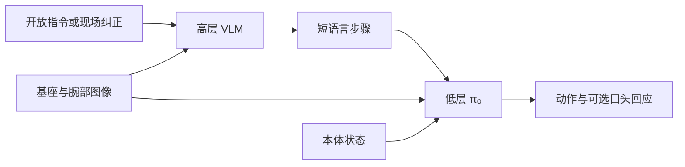

# Hi Robot：分层交互式指令跟随

**Hi Robot**（*Hi Robot: Open-Ended Instruction Following with Hierarchical Vision-Language-Action Models*，[arXiv:2502.19417](https://arxiv.org/abs/2502.19417)，[项目页](https://www.pi.website/research/hirobot)）由 **物理智能（Physical Intelligence）**、**斯坦福大学（Stanford）**、**加州大学伯克利分校（UC Berkeley）** 提出。高层策略与 π₀ 共用 VLM 骨干，但只负责把复杂提示和用户插话变成低层已经会做的短语言命令。

## 一句话定义

> **先用语言把任务说成下一步，再让 π₀ 动手；现场纠正改的是这句话，不是直接改关节。**

## 英文缩写速查

| 缩写 | 英文全称 | 简要说明 |
|------|----------|----------|
| VLM | Vision-Language Model | 高层「System 2」，输出下一步语言 |
| VLA | Vision-Language-Action | 低层 π₀，把短指令变成动作 |
| IL | Imitation Learning | 低层技能仍来自演示，不是本页新算法 |

## 为什么重要

扁平 VLA 擅长练过的原子技能，遇到「素食三明治」或「那个不是垃圾」时，缺少把开放语句拆成已知技能的接口。Hi Robot 把网页预训练擅长的「看图回答下一步」留在语言空间，避免让连续动作头同时承担语义推理。π₀.₇ 后来用多模态提示调度行为；本页是更早的「高层语言、低层动作」分法。

## 核心原理

高层观察图像和用户话语，输出低层命令（例如「拿起一片全麦面包」）。低层 π₀ 只消费这条短指令、图像和状态。用户说 “that's not trash” 时，高层把 “that” 接到当前正在抓的物体上，再改写下一步，而不是指望低层从长提示里自己推断。

训练除了带原子技能标签的演示，还合成假设的用户提示和插话，让模型见到多阶段约束与纠正。论文把这套合成标注和两级推理一起当作贡献。

## 评测

项目页在桌面清理、做三明治、购物上比较扁平 VLA、GPT-4o 作高层、Hi Robot，以及人类高层上限。博客图读数（指令跟随准确率）：桌面清理 74 / 35 / 36（Hi Robot / GPT-4o / 扁平 VLA），三明治 83 / 13 / 34，购物 72 / 41 / 39；平均一行 Hi Robot 76、扁平 VLA 36。作者另称相对 GPT-4o 的指令跟随准确率高 40%。任务进度同样是作者设置，专家人类是上限参照。

## 结论

**开放指令和中途纠正适合先落成语言步骤；不要把这篇的准确率当成可复现的公共操作榜。**

- 低层仍是练过的 π₀ 技能，高层只改「下一步说什么」
- 合成提示是为了补多轮交互，不是额外的真机成功证明
- 与 [π₀.₇](../methods/pi07-policy.md) 的提示条件不同：这里高层在线生成语言，π₀.₇ 把多种提示写进同一个通才
- 复现需要合成数据方案和两级权重，openpi 只覆盖低层家族

## 源码运行时序图

**不适用**。截至 2026-09-28，项目页与 arXiv 未列 Hi Robot 训练、合成标注或推理代码。 [openpi](https://github.com/Physical-Intelligence/openpi) 可跑 π₀ 低层，不能代替本页的高层策略。

## 局限与风险

- 数字来自作者三类操作，换本体或换提示分布不能直接外推。
- 高层和低层若技能词表对不齐，短指令会落在低层没学过的动作上。
- 确认未开源。不要把 GPT-4o 高层对照读成「任意 API VLM 都差 40 个点」。

## 关联页面

- [π₀ 策略](../methods/π0-policy.md)
- [π₀.₇](../methods/pi07-policy.md)
- [VLA](../methods/vla.md)
- [操作任务](../tasks/manipulation.md)

## 参考来源

- [hirobot_arxiv_2502_19417](../../sources/papers/hirobot_arxiv_2502_19417.md)
- [PI 官网技术文章索引](../../sources/sites/pi-website-technical-articles.md)

## 推荐继续阅读

- [arXiv:2502.19417](https://arxiv.org/abs/2502.19417)
- [项目页](https://www.pi.website/research/hirobot)
