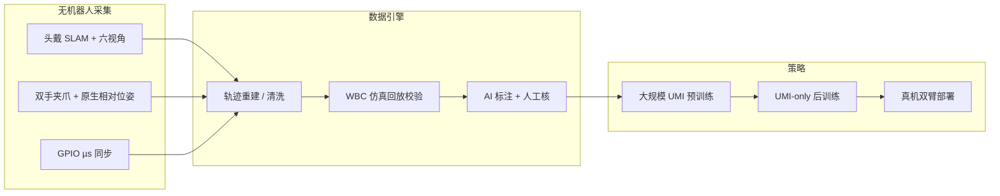

# HiFi-UMI / HiFi-UMI-2K

**HiFi-UMI**（*Learning Deployable Manipulation Policies from High-Fidelity UMI Data Alone*，[arXiv:2607.25895](https://arxiv.org/abs/2607.25895)，[项目页](https://cloud.simpleai.tech/simple-world-lab/hifi-umi/)，[HF 数据集](https://huggingface.co/datasets/simple-world-lab/HiFi-UMI-2K)）由 **简易人工智能（Simple AI）** 提出：通过共设计提升 robot-free UMI 的轨迹精度、双手相对位姿、硬件同步与视场，使 **仅用 UMI 后训练** 的策略可直接部署到真机双臂，并匹配同域遥操作基线。配套公开子集 **HiFi-UMI-2K**（**2000 小时**，CC BY 4.0，LeRobot v3 风格）。

## 一句话定义

**一套追求毫米级轨迹与微秒级同步的无机器人双臂 UMI 采数与数据引擎，用更高保真度去掉部署向后训练中的真机遥操作 anchor，并开源 2000 小时级示范语料。**

## 英文缩写速查

| 缩写 | 英文全称 | 简要说明 |
|------|----------|----------|
| UMI | Universal Manipulation Interface | 手持/可穿戴无机器人示教范式 |
| HiFi-UMI | High-Fidelity UMI | 本文采数系统与方法名 |
| HiFi-UMI-2K | HiFi-UMI 2000-hour release | 公开 2000 小时子集 |
| VLA | Vision-Language-Action | 评测骨干之一（StarVLA / OpenPI） |
| WAM | World-Action Model | 评测骨干之一（LingBot-VA） |
| WBC | Whole-Body Control | 仿真回放校验里的重定向/执行层 |
| SLAM | Simultaneous Localization and Mapping | 头戴 stereo-inertial 离线位姿 |

## 为什么重要

- **去掉后训练真机锚：** 许多 UMI 流水线仍要「大规模 UMI 预训练 + 少量真机微调」；本文用保真度换掉后半段真机依赖。
- **规模可读：** 源语料 **>20,000 h / 480+ 场景**，公开 **2,000 h**，直接服务 [数据金字塔](./paper-data-pyramid-embodied-manipulation.md) 的 UMI 层。
- **跨族骨干一致：** VLA 与 WAM 上都能贴近 teleop，说明收益主要来自 **数据几何/同步质量**，而非某一架构作弊。
- **与开源硬件对照：** 相对 [HandUMI](./handumi.md)（开源硬件+重定向），HiFi-UMI 强调 **工业级保真与大规模公开数据**；硬件 BOM/训练仓截至入库日未列。

## 核心信息

| 项 | 内容 |
|----|------|
| **机构** | 简易人工智能（Simple AI） |
| **EE 精度** | 工作空间局部约 **3 mm**（无外置追踪） |
| **同步** | GPIO 硬触发，跨传感器 **<40 µs** |
| **视角** | **6**（头立体 + 每手 2 路广角，约 200°） |
| **公开数据** | **HiFi-UMI-2K · 2000 h**（CC BY 4.0） |
| **开源** | **部分开源：数据已开；采数/训练代码未列** |

## 核心原理

### 方法栈

| 模块 | 作用 |
|------|------|
| 头戴 stereo-inertial SLAM | 离线高精度头/世界定位 |
| 双手 marker（同头相机系） | **原生** 双手相对位姿，非事后跨相机拼 |
| GPIO 共享触发 | 相机/IMU/编码器/夹爪 µs 级对齐 |
| 手套式不对称夹爪 | 保留直接接触与力分布 |
| 数据引擎 | 重建 → 自动清洗 → **仿真 WBC 回放** → AI 标注 → 人工抽检 → 导出 |

### 流程总览

## 源码运行时序图

**不适用（完整训练/采数代码未发布）。** 截至 **2026-08-04** 复检：可公开获取的是 **Hugging Face 数据集** 与论文/项目页；无官方 `train.py` / 硬件固件仓入口（与 2026-07-30 初检一致）。数据侧用法对齐 LeRobot v3（Parquet + MP4）。若后续开放采数或训练仓库，应补 `sources/repos/` 并在本节约成 `sequenceDiagram`。

## 工程实践

| 项 | 建议 / 论文设定 |
|----|----------------|
| 数据入口 | `simple-world-lab/HiFi-UMI-2K`；按 `chunk-*/part-*/...parquet` 拉取 |
| 格式 | LeRobot v3：帧级表 + MP4 + 任务文本 + 有效掩码 + 归一化统计 |
| state / action | 各 **20** 维（右+左各 10d：`xyz + rot6d + gripper`）；导出 `action` 为 **绝对 next-state**，训练时再按骨干转相对动作 |
| 有效帧 | 保留无效帧以对齐视频时间戳；训练过滤 `valid.frame == true` |
| 六视角 key | `head_main`、`head_main_stereo_right`、`{left,right}_hand_{up,down}` |
| 坐标系 | 单 episode 内头/双手共世界系；世界原点任意（跨录制勿比绝对位姿）；+Z≈重力 |
| 质控读法 | 重建/回放约 **98%**；丢帧 **<2/h**；夹爪角误差 **<0.1°**；仍按任务过滤 episode |
| 后训练对照 | 与「同场景真机 teleop 后训练」比 SR；VLA 协议约 **3200** UMI vs **300** teleop 轨迹/任务（管线对比，非等样本效率） |
| 预训练 | 论文用同语料 **4000 h** 子集做 scaling（大于公开 2k 发布） |
| 复现边界 | 骨干（StarVLA / OpenPI / LingBot）与真机栈需自备 |

## 实验与评测

- **Zero-robot post-training：** StarVLA-QwenPI / OpenPI-π₀.₅ / LingBot-VA 相对同域 teleop **ΔSR = −2.5 / +3.1 / −0.6 pp**。
- **精密插入：** 最强策略 **85%**（teleop 基线采自评测场景；UMI 轨迹不在该场景）。
- **预训练：** 4000 h → 10 未见任务动作误差 **-41%**；StarVLA-QwenPI 真机再 **+18.1 pp**。
- **场景偏移：** 报告 UMI-only 策略在外观/布局偏移下仍具竞争力（详见论文任务表）。

## 结论

**HiFi-UMI 把「UMI 能不能直接当部署数据」从经验口号变成可对账的三骨干实验：保真度（毫米轨迹 + 微秒同步 + 回放校验）足够时，后训练真机锚可以拿掉；公开 2k 小时是社区可立刻用的资产，系统源码仍待补齐。**

1. **真影响：保真度换真机锚** — 三骨干 ΔSR 落在几个百分点内。
2. **真影响：原生双手相对位姿 + 硬同步** — 双臂接触任务对相对几何与时间对齐极敏感。
3. **真影响：回放校验进数据引擎** — 约 98% WBC 回放成功，降低不可执行示范进训练集。
4. **次要代价：公开 2k < 源语料 20k+** — scaling 曲线论文用了更大内部切片。
5. **部署读法：先吃 HF 数据做预训练/后训练** — 过滤 `valid.frame`、按需把绝对 action 转相对；勿假设采数硬件可外购复刻（代码截至 2026-08-04 仍未列）。
6. **对照读法：与 HandUMI / 数据金字塔互补** — HandUMI 开源硬件重定向；HiFi-UMI 拼规模与保真；在 [数据金字塔](./paper-data-pyramid-embodied-manipulation.md) 落在 **UMI 层** 且挑战「UMI 只能预训练」叙事。

## 与其他工作对比

| 对照 | 差异读法 |
|------|----------|
| [HandUMI](./handumi.md) | 开源硬件+多臂重定向；HiFi-UMI 强调大规模高保真数据与 zero-robot 后训练证据 |
| Stanford UMI (2024) | 经典可迁移示教；HiFi-UMI 强化同步/FoV/回放工厂 |
| [BifrostUMI](./paper-bifrost-umi.md) / [HALOMI](./paper-halomi-humanoid-loco-manipulation.md) | 人形全身/loco-manip；HiFi-UMI 锚定固定基座双臂操作 |
| [Ego-OSCAR / Stereo-550](./paper-ego-oscar.md) | 同为头戴立体惯性，但是 **观测-only** 众包基底（无 EE/夹爪通道）；HiFi-UMI 走操作示范 |
| 真机 teleop 工厂 | 精度高但难扩；本文用 UMI 逼近其部署质量 |

## 局限与风险

- **开源不完整：** 数据集已开；采数硬件固件、训练脚本官方 URL **截至 2026-08-04 仍未列**。
- **具身间隙仍在：** zero-robot 匹配的是论文评测双臂与任务套件，不保证任意机器人零适配。
- **动作约定：** 导出为绝对 next-state；直接当相对动作喂 VLA/WAM 会 silently 错位。
- **统计分辨率：** 讨论节提醒任务级方差；读单点 85% 需看试验次数；3200 vs 300 是管线对比而非等样本。
- **预训练切片 > 公开集：** 复现 4000 h 曲线可能超出 HF 2k 发布。

## 关联页面

- [HandUMI](./handumi.md) — 开源无机器人双臂示教对照
- [Ego-OSCAR / Stereo-550](./paper-ego-oscar.md) — 观测向开源硬件立体头戴（非 UMI 动作通道）
- [遥操作](../tasks/teleoperation.md) — 采数范式谱系
- [双臂操作](../tasks/bimanual-manipulation.md) — 任务层
- [Manipulation](../tasks/manipulation.md) — 操作总览
- [VLA](../methods/vla.md) / [StarVLA](../methods/star-vla.md) — 评测骨干
- [World Action Models](../concepts/world-action-models.md) — WAM 侧
- [具身数据金字塔](./paper-data-pyramid-embodied-manipulation.md) — UMI 层定位
- [人形训练数据管线](../queries/humanoid-training-data-pipeline.md) — 数据工厂 checklist

## 参考来源

- [HiFi-UMI 论文摘录（arXiv:2607.25895）](../../sources/papers/hifi_umi_arxiv_2607_25895.md)
- [项目页归档](../../sources/sites/hifi-umi-project.md)
- [HiFi-UMI-2K 数据集归档](../../sources/datasets/hifi-umi-2k.md)
- [arXiv:2607.25895](https://arxiv.org/abs/2607.25895)
- [Hugging Face: HiFi-UMI-2K](https://huggingface.co/datasets/simple-world-lab/HiFi-UMI-2K)

## 推荐继续阅读

- 项目页媒体与回放：<https://cloud.simpleai.tech/simple-world-lab/hifi-umi/>
- [HandUMI 软件仓](https://github.com/robonet-ai/handumi-sw) — 开源 UMI 硬件对照
- Chi et al., Universal Manipulation Interface（Stanford UMI）
