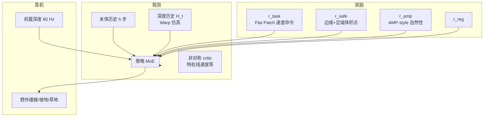

# Hiking in the Wild：可扩展感知跑酷框架

**Hiking in the Wild**（arXiv:2601.07718）由清华大学交叉信息研究院等提出，在 [42 篇 RL 身体系统栈](https://mp.weixin.qq.com/s/hz9JXtJeUPRfUGzfD-pZuA) 为 **24/42**（03 感知式高动态运动），在 [AMP 运动先验专题](https://mp.weixin.qq.com/s/YZsm3855iP3TNTTt1aou7w) 为 **09/19**（**02 人形走跑**）。策展强调：**不是典型 AMP 论文**，但应放在走跑线——它把 **深度感知 E2E locomotion** 与 **AMP-style 自然性奖励** 放在同一单阶段策略里。

## 一句话定义

**单阶段端到端 RL：原始深度图与本体历史直接映射关节目标，配合地形边缘检测与足端体积点软约束、Flat Patch Sampling 导航命令与 MoE 策略，在野外真机达 2.5 m/s 且无外部定位。**

## 英文缩写速查

| 缩写 | 英文全称 | 简要说明 |
|------|----------|----------|
| E2E | End-to-End | 深度感知不经显式建图中间层 |
| RL | Reinforcement Learning | 通过与环境交互最大化长期回报来学习策略的范式 |
| AMP | Adversarial Motion Prior | 总奖励中含 AMP-style 自然性项 |
| MoE | Mixture-of-Experts | 策略网络专家混合，消融验证有效 |
| PD | Proportional–Derivative | 关节目标 + 底层 PD 执行 |
| Sim2Real | Simulation to Real | Warp 深度仿真与真机噪声双向对齐 |

## 为什么重要

- **野外可持续穿越：** 相对 PHP、Deep Whole-body Parkour 等，更强调 **楼梯、沟壑、高台、坡地、边缘密集区** 的**持续通过**而非单障碍特技。
- **开源可复现：** 训练与部署代码开源（项目页）；相对同类工作「少开源」的痛点。
- **AMP 专题交叉：** 总奖励 $R=r_{\mathrm{task}}+r_{\mathrm{reg}}+r_{\mathrm{safe}}+r_{\mathrm{amp}}$；消融去掉 AMP 在 Small Box 上 **0% vs 99.09%**——说明感知跑酷仍需要 **运动先验/自然性** 正则。
- **与 MoRE 姊妹：** [MoRE #08](./paper-amp-survey-08-more.md) 两阶段「先穿越再 AMP」；Hiking **单阶段** 深度 E2E + AMP 项并联。

## 流程总览

## 核心机制（归纳）

### 1）感知与 sim2real

- **观测：** 本体历史 + 深度历史；**非对称 critic** 含真值线速度等。
- **深度：** NVIDIA **Warp** 并行 ray-cast；$\mathcal{F}_{sim}$ / $\mathcal{F}_{real}$ **双向对齐**噪声，零样本 sim2real。
- **动作：** 29 维关节目标 + PD（增益沿用 BeyondMimic）。

### 2）安全与防 hack

- **Terrain Edge Detection：** 任意 trimesh 自动提取边缘。
- **Foot Volume Points：** 足端穿透边缘惩罚 → 学「脚踩实面中心」。
- **Flat Patch Sampling：** 网格上采可达平面块生成相对速度命令，避免原地转圈 reward hacking。

### 3）训练与真机

| 项目 | 内容 |
|------|------|
| 策略 | 含 **MoE**；单阶段 E2E |
| 真机 | 机载前向深度 60 Hz；**无外部定位** |
| 速度 | 野外最高 **2.5 m/s** |
| 开源 | 项目页代码与文档 |

## 常见误区

1. **纯感知不需要运动先验：** 消融 **去 AMP** 在 Small Box **成功率归零**——自然性项对窄障碍关键。
2. **= MoRE 简化版：** MoRE **两阶段** + gait command + 多判别器；Hiking **单阶段** + 单一 AMP-style 项 + 不同命令生成（Flat Patch）。
3. **依赖 SLAM/建图：** **E2E 深度**，强调无定位漂移的轻量方案。
4. **仅仿真跑酷：** 项目页有野外真机视频（楼梯、坡地、草地、离散障碍）。

## 实验与评测

- **仿真 10 类地形：** 完整系统 vs 去 MoE / 去深度历史 / 去 pose-based 命令 / 去 AMP；每项消融降成功率。
- **真机：** 2.5 m/s 野外穿越；无外部定位。
- **双索引：** 42 篇栈 #24 + AMP 专题 #09。

## 与其他页面的关系

- 姊妹感知跑酷：[MoRE #08](./paper-amp-survey-08-more.md)、[Deep Whole-body Parkour](./paper-deep-whole-body-parkour.md)
- 任务：[stair-obstacle-perceptive-locomotion.md](../tasks/stair-obstacle-perceptive-locomotion.md)
- RL 栈：[humanoid-rl-motion-control-body-system-stack.md](../overview/humanoid-rl-motion-control-body-system-stack.md)
- AMP 专题：[humanoid-amp-motion-prior-survey.md](../overview/humanoid-amp-motion-prior-survey.md)（#09/19）

## 参考来源

- [Hiking in the Wild（arXiv:2601.07718）](../../sources/papers/hiking_in_the_wild_arxiv_2601_07718.md)
- [humanoid_rl_stack_24_hiking_in_the_wild_a_scalable_perceptive_parkour.md](../../sources/papers/humanoid_rl_stack_24_hiking_in_the_wild_a_scalable_perceptive_parkour.md)
- [humanoid_amp_survey_09_hiking_in_the_wild_a_scalable_perceptive_parkour.md](../../sources/papers/humanoid_amp_survey_09_hiking_in_the_wild_a_scalable_perceptive_parkour.md)
- [humanoid_amp_survey_19_catalog.md](../../sources/papers/humanoid_amp_survey_19_catalog.md)
- [wechat_embodied_ai_lab_humanoid_rl_motion_survey.md](../../sources/blogs/wechat_embodied_ai_lab_humanoid_rl_motion_survey.md)
- [wechat_embodied_ai_lab_humanoid_amp_motion_prior_survey.md](../../sources/blogs/wechat_embodied_ai_lab_humanoid_amp_motion_prior_survey.md)

## 推荐继续阅读

- [项目页](https://project-instinct.github.io/hiking-in-the-wild) — 视频与代码
- [arXiv:2601.07718](https://arxiv.org/abs/2601.07718)
- [42 篇 RL 运动控制（微信公众号）](https://mp.weixin.qq.com/s/hz9JXtJeUPRfUGzfD-pZuA)
- [SD-AMP 深读页](./paper-unified-walk-run-recovery-sdamp.md) — 另一路「自然性+统一策略」对照
