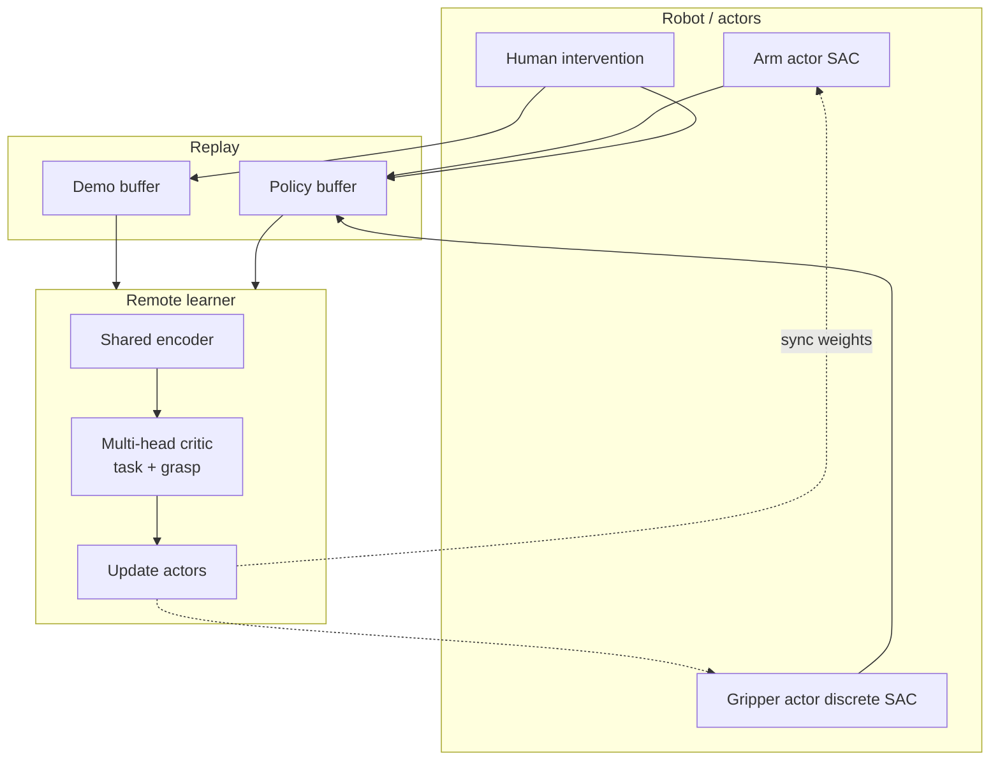

# HIL-HARC（真机在线 RL · CTDE + 分解 Critic · arXiv:2608.09762）

**HIL-HARC**（*Efficient Real-World Online Reinforcement Learning for Robot Manipulation via Centralized Training and Critic Decomposition*，[arXiv:2608.09762](https://arxiv.org/abs/2608.09762)；[项目页](https://hil-harc.github.io/)）来自 **意大利技术研究院（IIT）** HHCM / HRI²、**热那亚大学（University of Genova）**、**代尔夫特理工大学（TU Delft）**：在 **HIL-SERL / RLPD** 管线上，用 **CTDE 混合动作** 与 **HRA 多头 critic** 稳住大域随机下的真机在线学习。

## 一句话定义

**连续臂与离散夹爪分开执行、一起被集中式多头 critic 评价**——并把稀疏任务回报与抓取势奖励拆开回归，以便在大随机、噪声 RGB 的真机上少干预、快收敛。

## 英文缩写速查

| 缩写 | 英文全称 | 简要说明 |
|------|----------|----------|
| HIL | Human-in-the-Loop | 训练中人可介入纠正并写入 buffer |
| HARC | Hybrid Actors with Reward-decomposed Critic | 本文方法缩写 |
| CTDE | Centralized Training Decentralized Execution | 训练用全局联合评价，执行用本地观测 |
| HRA | Hybrid Reward Architecture | 多奖励分量对应多 Q 头 |
| RLPD | RL with Prior Data | 先验 demo 与在线数据混采（本文 50/50） |
| SAC | Soft Actor-Critic | 连续臂 + 离散夹爪均用 SAC 族目标 |

## 为什么重要

- **对准真机操纵真实动作形态：** 臂连续、爪离散；硬揉成单一策略或独立双策略都会痛。
- **放大随机后基线会塌：** 相对 HIL-SERL 常用厘米级随机，本文把工作空间随机拉到约 **5–25×**，更能暴露算法能力。
- **critic 才是噪声 RGB 上的瓶颈：** 单头长程 TD 在真机上梯度暴、易崩；分解目标降低方差。
- **人时是稀缺资源：** 收敛后干预率到 **0%**，且总专家等价 episode 低于基线。

## 核心信息

| 字段 | 内容 |
|------|------|
| 机构 | IIT（HHCM / HRI²）；University of Genova（DIBRIS）；TU Delft（Cognitive Robotics） |
| 发表 | arXiv preprint（2026-08） |
| arXiv | [2608.09762](https://arxiv.org/abs/2608.09762) |
| 项目页 | <https://hil-harc.github.io/> |
| 代码 | **确认未开源**（截至 2026-08-12） |
| 平台 | 定制 6-DoF 臂、Franka、仿真 Unitree G1 |
| 控制 | 10 Hz；6D Cartesian delta + 3 类夹爪（open/close/stay） |
| 主基线 | HIL-SERL |

## 核心原理

### 输入 / 输出

| 侧 | 内容 |
|------|------|
| 观测 | RGB（前视/腕视等）、TCP 位姿与速度、夹爪开合/力矩（视硬件） |
| Actor1 | 连续 Cartesian 策略 \(\pi^c\)（SAC） |
| Actor2 | 离散夹爪 \(\pi^d\)（categorical SAC；常仅腕视） |
| Critic | 集中式多头 \(Q^{\mathrm{task}},Q^{\mathrm{grasp}}\)，训练时评联合动作 |
| 奖励 | 稀疏 \(r_{\mathrm{task}}\) + potential-based \(r_{\mathrm{grasp}}\) |

### 流程总览

### 关键机制（压缩）

1. **RLPD 混采：** mini-batch 一半先验演示、一半在线（含干预替换动作）。
2. **CTDE 消非平稳：** 训练时 critic 看见联合动作；执行时两 actor 仍本地决策。
3. **HRA 降回归难度：** task 头吃稀疏成功；grasp 头吃 \(\gamma\Phi(s')-\Phi(s)+P\)（力矩/开口势 + 切换惩罚）。
4. **离散目标特化：** gripper 直接对 categorical logits 做 SAC；Q 对所有离散动作一并输出。
5. **异步部署：** 机器人采集、远端 4090 级 learner 高 UTD 更新后回灌权重。

## 源码运行时序图

**不适用**：截至 **2026-08-12**，[hil-harc.github.io](https://hil-harc.github.io/) Resources 无 Code/权重链接；`HIL-HARC/HIL-HARC.github.io` 仅为静态项目页。代码公开后再补本图。

## 工程实践

| 项 | 建议 / 论文设定 |
|----|----------------|
| 初始化 | 每任务 **20** 段遥操作 demo |
| 共享 RLPD | batch 256；UTD 2；buffer 100k；γ=0.97；ResNet-10 图像编码 |
| HARC | grasp 系数 1.0；离散动作维 3；腕视给夹爪 actor |
| 训练预算 | 真机约 **160 min** / 任务量级；单卡 RTX 4090 |
| 复位 | 脚本复位机器人；环境人工复位 |
| 复现现状 | **未开源**；见 [项目页归档](../../sources/sites/hil-harc-github-io.md) |

## 实验与评测

| 设定 | HIL-SERL → HIL-HARC |
|------|---------------------|
| 网球 P&P（\(50\times40\) cm） | 60% → **80%** |
| 香蕉 P&P（\(30\times30\) cm + \(360^\circ\)） | 60% → **90%** |
| 锅复位（\(40\times40\) cm） | 0% → **55%** |
| 真机三任务均值（160 min） | 40% → **75%** |
| 仿真 G1 搬块 | 25% → **95%** |
| 专家等价 episode（四任务） | 80/102/132/189 → **69/76/111/115** |
| 收敛干预率 | → **0%** |
| 增补 bottle stowing（投稿后） | **85%**（17/20；未入正文表） |

## 结论

**大随机真机在线 RL 的胜负手，往往是「混合动作如何被联合评价」以及「噪声观测下 critic 目标能否拆开」，而不只是再多采几小时。**

1. **先看随机范围再读成功率** — 与小工作空间 HIL-SERL 数字不可直接横比。
2. **CTDE 是混合动作默认选项** — 独立 SAC+DQN 式拆分容易非平稳。
3. **HRA 适合「任务稀疏 + 抓取可势函数化」** — 若奖励分量强耦合，分解收益会缩水。
4. **干预应随训练消失** — 本文强调收敛后 0% 干预；长期靠人扶不算成功。
5. **样本效率用专家等价 episode 读** — 短纠正段比堆全演示更值钱。
6. **选型边界** — 相对 [ROVE](./paper-rove-humanoid-vla-intervention.md)（人形 VLA 干预后训练）与安全 LoRA 微调路线，本文是 **RGB 桌面/人形仿真上的 on-robot RLPD 架构改进**；代码未开前作协议与消融对照。

## 局限与风险

- **确认未开源：** 无法复现异步 learner、奖励分类器与合规夹爪硬件细节。
- **人工环境复位** — 墙钟时间含操作员负担，难直接外推到无人产线。
- **HRA 假设奖励分量近似可分** — 任务设计绑定时需重划。
- **评测 20 episode / 任务** — 点估计方差需心里有数。
- **误区：** 把项目页静态仓当成训练代码；或忽略「更大随机」前提去宣称碾压 HIL-SERL。

## 与其他工作对比

| 路线 | 动作空间处理 | Critic | 开源/复现 |
|------|--------------|--------|-----------|
| SERL / HIL-SERL | 常连续 SAC + 离散 DQN 等 | 多为单体/分策略 | 视上游 |
| 参数化混合动作 | 统一参数化空间 | 视算法 | 视工作 |
| ROVE 等 VLA 干预后训练 | 干预作数据清洗/条件 | 非本架构 | 见 [ROVE](./paper-rove-humanoid-vla-intervention.md) |
| **HIL-HARC（本文）** | **CTDE：连续+离散双 SAC** | **HRA 多头联合 critic** | **未开源**；有项目页视频 |

## 关联页面

- [Reinforcement Learning](../methods/reinforcement-learning.md) — SAC / 在线 RL 总览
- [Online vs Offline RL](../comparisons/online-vs-offline-rl.md) — 在线数据流坐标
- [Safe Real-World RL Fine-tuning](../concepts/safe-real-world-rl-fine-tuning.md) — 真机微调安全对照
- [Sim2Real](../concepts/sim2real.md) — 本文刻意绕开仿真迁移、直接真机学
- [Manipulation](../tasks/manipulation.md) — 任务域
- [ROVE](./paper-rove-humanoid-vla-intervention.md) — 人形干预后训练对照

## 参考来源

- [论文归档 HIL-HARC（arXiv:2608.09762）](../../sources/papers/hil_harc_arxiv_2608_09762.md)
- [项目页归档](../../sources/sites/hil-harc-github-io.md)

## 推荐继续阅读

- [项目页](https://hil-harc.github.io/) — 视频与学习曲线
- [arXiv:2608.09762](https://arxiv.org/abs/2608.09762) — 全文与超参表
- HIL-SERL / SERL 原始工作（基线协议）— 读本文「放大随机」声明时对照
