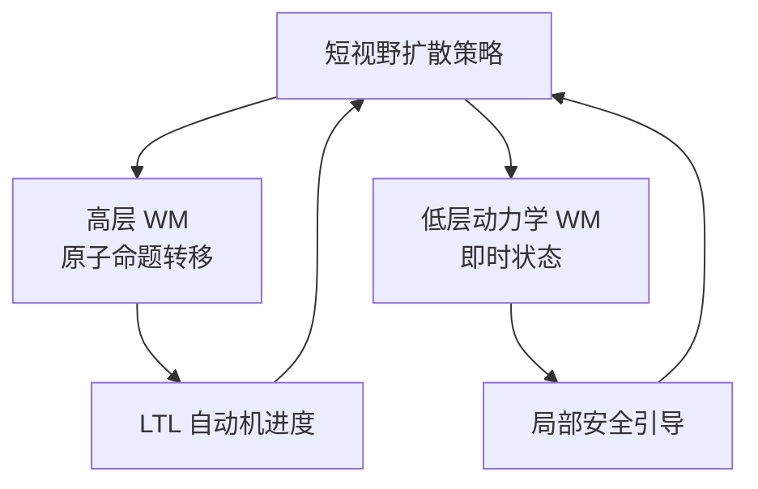

# hint²：层级世界模型推理时 LTL 引导

**hint²**（*Hierarchical World Models for Inference-Time Temporal Logic Guidance*；[arXiv:2608.13678](https://arxiv.org/abs/2608.13678)，[补充材料](https://anonymous-hint2.github.io/)）由 **Purdue** Moritz Zoellner 等提出：用 **高低两层世界模型** 在 **推理时** 引导现有短视野扩散策略，满足运行时指定的 **LTL** 活性与安全约束，无需重训策略参数。

## 一句话定义

**长时序合规不必全部写进策略参数——分层预测可在部署时持续纠偏进度与安全。**

## 英文缩写速查

| 缩写 | 英文全称 | 简要说明 |
|------|----------|----------|
| LTL | Linear Temporal Logic | 线性时序逻辑，表达活性/安全指令 |
| STL | Signal Temporal Logic | 连续信号时序逻辑，局部安全鲁棒性 |
| DBA | Deterministic Büchi Automaton | LTL 编译后的自动机 |
| WM | World Model | 预测动作后果的模型 |

## 为什么重要

- 语言条件策略擅长语义，却难处理 **非马尔可夫** 长指令与安全约束。
- 现代策略 **短 chunk + 闭环重规划**，与全长 LTL rollout 引导存在 **视野不匹配**。
- 纳入 [九篇盘点](../../sources/blogs/wechat_embodied_station_9_papers_vla_predict_grasp_2026-08-24.md) 的世界模型 + 约束规划主线。

## 核心信息

| 项 | 内容 |
|----|------|
| **机构** | 普渡大学（Purdue） |
| **被引导策略** | 预训练短视野扩散操纵策略 |
| **平台** | CALVIN 仿真；UR5e 真机 |
| **开源** | **待发布**（匿名投稿站无 GitHub；截至 2026-08-24） |

## 核心原理

- **高层** — 预测动作 chunk 引起的 **原子命题** 变化，推动自动机向接受状态前进。
- **低层** — 预测即时状态演化，提供精确 **安全/STL** 梯度。
- **推理时引导** — 等价于对扩散采样加约束分数，不改策略权重。

## 源码运行时序图

**不适用** — 截至 **2026-08-24** 无可运行官方代码。

## 工程实践

| 项 | 建议 |
|----|------|
| 何时引用 | 已有扩散操纵策略，需在 **运行时** 注入 LTL 活性/安全 |
| 与语言条件对比 | 复杂循环/有序目标语言策略常失败，hint² 用逻辑接口 |
| 与全长 LTL 扩散对比 | 避免长 rollout 复合误差 |

## 实验与评测

- **Toy Squares** — 有序触区与避障 LTL。
- **CALVIN** — 循环开关抽屉、带角度安全约束等。
- **真机 UR5e** — 倒零食多碗循环任务。

## 结论

**推理时分层世界模型可让短视野策略执行长时序 LTL，而不重训骨干。**

1. **视野匹配** — 高层抽象命题、低层精几何，对齐 chunk 重规划节奏。
2. **优于现有 LTL 扩散** — 克服全长轨迹 rollout 局限。
3. **CALVIN SOTA 级引导** — 复杂活性+安全组合优于其他 inference steering。
4. **真机可迁移** — UR5e 验证非纯仿真技巧。
5. **待开源** — 复现需跟踪匿名稿录用后发布。

## 与其他工作对比

| 对照 | 差异读法 |
|------|----------|
| 纯语言条件策略 | 长时序/安全需组合爆炸示范；LTL 接口更紧凑 |
| 全长 LTL 扩散引导 | 复合误差大；hint² 分层抽象 |
| [DreamX-Phi](./paper-dreamx-phi.md) | 视频 WM 追求动作忠实；hint² 追求 **逻辑合规** |

## 局限与风险

- **代码待发布** — 世界模型与引导实现未公开。
- **原子命题设计** — 需任务相关命题与标注函数工程。
- **策略前提** — 需已有合格扩散骨干；引导不能替代弱策略。

## 关联页面

- [生成式世界模型](../methods/generative-world-models.md)
- [Manipulation](../tasks/manipulation.md)
- [VLA·预测·抓取 9 篇技术地图](../overview/vla-predict-grasp-9-papers-technology-map.md)

## 参考来源

- [hint2_arxiv_2608_13678](../../sources/papers/hint2_arxiv_2608_13678.md)
- [hint2-github-io](../../sources/sites/hint2-github-io.md)
- [具身智能小站 9 篇盘点（2026-08-24）](../../sources/blogs/wechat_embodied_station_9_papers_vla_predict_grasp_2026-08-24.md)

## 推荐继续阅读

- [arXiv:2608.13678](https://arxiv.org/abs/2608.13678)
- [hint² 补充材料站](https://anonymous-hint2.github.io/)
