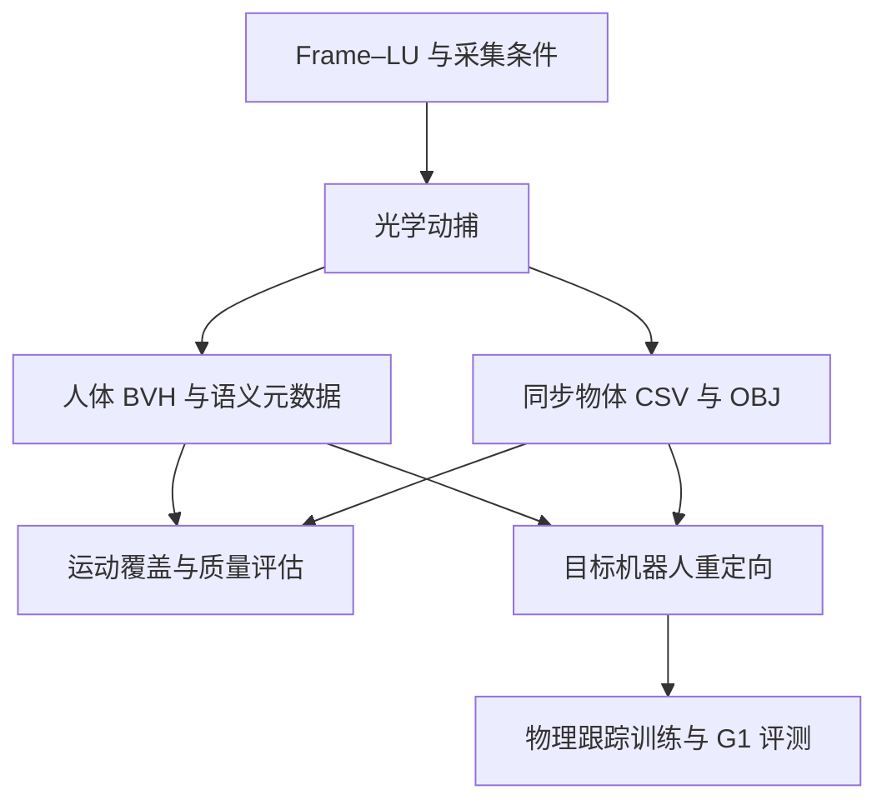
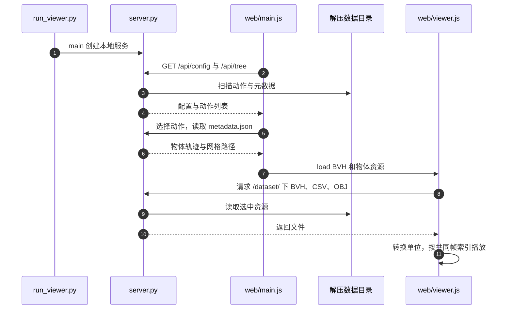

# HiPHI（高精度人体运动与人–物交互基准）

## 一句话定义

**HiPHI** 是面向人形学习的光学动捕数据集与基准：以语义结构设计运动覆盖，同时记录人体动作、物体轨迹和物体几何，作为重定向与全身模仿的参考源。

## 英文缩写速查

| 缩写 | 英文全称 | 简要说明 |
|------|----------|----------|
| MoCap | Motion Capture | 动作捕捉 |
| HOI | Human-Object Interaction | 人与物体交互 |
| LU | Lexical Unit | 特定事件框架中的词义单元 |
| BVH | Biovision Hierarchy | 骨架层级与逐帧动作格式 |
| MPJPE | Mean Per-Joint Position Error | 平均关节位置误差 |
| OBJ | Wavefront OBJ | 三维物体网格格式 |

## 为什么重要

- 动作标签多不一定代表运动覆盖广。HiPHI 从语义种子出发改变速度、方向、幅度和支撑条件，让采集设计更可检查。
- 搬箱子或坐椅子时，仅记录人体会丢失物体约束；同步物体状态与几何能支持交互重定向和物体跟踪评测。
- 对 G1 项目，它补充的是参考运动与数据评估环节，使用前仍要完成骨架映射和物理可行性验证。

## 核心信息

| 项 | 内容 |
|----|------|
| **机构** | 诺亦腾机器人（Noitom Robotics）；新加坡国立大学；清华大学深圳国际研究生院；香港科技大学；香港大学 |
| **论文** | arXiv:2608.16222，v2 为 2026-09-08；CoRL 2026 接收 |
| **规模口径** | 发布 617.5 h / 200.1M 帧，**包含镜像**；原始采集约 308.7 h |
| **子集** | Body-only 371.8 h；HOI 245.7 h（发布量的 39.8%） |
| **采集/骨架** | 光学 MoCap，90 Hz，55 关节 BVH，132 名表演者 |
| **语义组织** | 22 Frame、214 Frame–LU；语言说明和表演者元数据 |
| **交互资产** | 40 个真实物体、12 类；同步位姿 CSV 和 OBJ 网格 |
| **开放范围** | 数据已发布但需申请访问；GitHub 提供 Viewer/格式文档，未找到完整策略训练部署入口 |

## 核心原理

### 方法栈：先设计覆盖，再测下游收益

1. **Frame–LU 定义采集种子**：例如 Self_motion 下的 walk/run；再系统改变运动因素，避免只增加近似重复的任务描述。
2. **同步采集人体与物体**：人体骨架、物体位姿、物体网格一起描述交互；HOI 的对象必须是实际交互且被跟踪的物体。
3. **分层评价数据价值**：运动空间覆盖、运动质量、交互几何、机器人跟踪各自提供证据。亚毫米精度指光学 marker 跟踪，不能解释成机器人关节误差。

### 数据流与下游衔接

重定向/训练路径来自论文：纯身体评测使用 PyRoki；带物体评测使用 Omni-Retarget 并接 BeyondMimic 风格跟踪。它们与当前仓库的可运行 Viewer 是不同的复现范围。

## 源码运行时序图

当前可核对的运行路径是 **本地 Viewer**；论文训练与上机代码的运行时序 **不适用**（本次核查未找到相关入口/权重）。模块对应见[仓库归档](../../sources/repos/hiphi.md)。

入口是 `python3 viewer/run_viewer.py /path/to/HiPHI --no-browser`；无需 Node 构建，也不触发 RL 训练。

## 工程实践

| 检查项 | 操作与原因 |
|--------|------------|
| 访问与小样本 | 先申请 HF 访问，浏览在线 Viewer；本地只解压所需 archive 即可验证，不必先下载全量 |
| 空间单位 | BVH 与 OBJ 用厘米，物体 CSV 平移用米；统一到米时只缩放前两者 |
| 旋转与坐标 | 右手系 Y-up；BVH 角度为度、Z-X-Y 欧拉顺序；物体四元数 XYZW；进入 Z-up 仿真须一致变换人体与物体 |
| 时间同步 | CSV 每帧对应 BVH 一帧，以 BVH Frame Time 为准；90 Hz 是数据采样率，策略/电机频率另行配置 |
| 文件路径 | trajectory_path 相对 motion 目录，mesh_path 相对数据根目录；HOI 不能只拷 BVH |
| 镜像与评测划分 | 原始与 __mirror 配对；工程上建议整对落在同一 split，避免增强副本跨训练/测试泄漏 |
| 目标本体 | 55 关节人体不是 G1 29 关节指令；检查限位、脚滑、自碰与人–物接触，分别记录人体和物体跟踪误差 |

以“搬箱子”为例：先在 Viewer 核对人与箱子对齐，再共同转换空间单位/坐标，保留箱子轨迹重定向到目标机器人，最后在仿真检查抓持接触。单纯把人体手腕轨迹复制给 G1，不能保证箱子会随机器人移动。

## 实验与评测

| 证据 | 应如何读 |
|------|----------|
| 运动空间覆盖 | 相同采样预算的共享表征下比较覆盖；不是只比总时长或标签数量 |
| 运动质量与交互几何 | 检查抖动、穿地、悬浮、支撑漂移及人与网格关系；几何代理不提供接触力 |
| 跟踪与数据扩展 | 固定预算比较数据源；未镜像训练量 3→300 h 时，四个跨数据集评测上的 MPJPE 继续下降 |
| HOI 分任务 | 表 3 中 push 人体 MPJPE：HiPHI 99.20 mm、OMOMO 66.09 mm；“整体有优势”不代表每项最佳 |
| G1 真机 | 展示跑、坐、爬、搬箱子等行为；证明数据可用于训练，不构成任意新动作的部署保证 |

## 结论

**HiPHI 的价值是系统覆盖与同步交互参考；落地收益取决于目标本体重定向和接触验证。**

1. 统计扩展实验时使用未镜像时长，区分原始采集与发布量。
2. 要做 HOI 时一起处理人体、物体轨迹和网格，别只导入人体 BVH。
3. 先用小样本检查单位、轴向与时间对齐，再扩大训练数据。
4. 分别报告人体和物体误差，避免用单一总分掩盖失败类别。
5. 复现计划区分数据浏览、策略训练和真机部署；本仓库当前只确认了前者的运行代码。

## 与其他工作对比

| 对照 | 选型差异 |
|------|----------|
| [AMASS](./amass.md) / [LaFAN1](./lafan1-dataset.md) | 常用人体参考源；HiPHI 增加系统语义覆盖与大规模同步物体交互 |
| [OMOMO](./omomo-dataset.md) | 同为 HOI 上游；应按目标交互类别、误差和许可选择，不能只按总时长替换 |
| [PHUMA](./dataset-bfm-phuma.md) | 已提供目标机器人参考；HiPHI 的人体 BVH 需要另做重定向 |

## 局限与风险

- 单人、棚拍、运动学数据；多人接触、真实接触力和触觉不在当前范围，不能当野外视觉或真机遥操作集使用。
- **截至 2026-10-02 部分开放**：Viewer 和格式文档可获得；未找到论文完整训练/部署代码及策略权重。
- HF 数据需申请并接受 **ModalityNet Open Research License v1.0**，面向非商业研究、教育和评测；Viewer 的 **Apache-2.0** 不能推导出数据可商用。

## 关联页面

- [人形参考运动与操作数据集选型](../comparisons/humanoid-reference-motion-datasets.md)
- [Motion Retargeting](../concepts/motion-retargeting.md)
- [Motion Data Quality](../concepts/motion-data-quality.md)
- [OMOMO](./omomo-dataset.md)

## 参考来源

- [HiPHI 论文摘录](../../sources/papers/hiphi_arxiv_2608_16222.md)
- [HiPHI 项目页与数据入口归档](../../sources/sites/hiphi.md)
- [HiPHI 仓库与 Viewer 归档](../../sources/repos/hiphi.md)

## 推荐继续阅读

- [论文全文与附录 G/H](https://arxiv.org/html/2608.16222v2)
- [本地 Viewer 指南](https://github.com/noitom-robotics/hiphi/blob/main/viewer/README.md)
- [在线 Motion Viewer](https://hiphi-viewer.modalitynet.com/)
- [Hugging Face 数据卡](https://huggingface.co/datasets/noitomrobotics/HiPHI)
