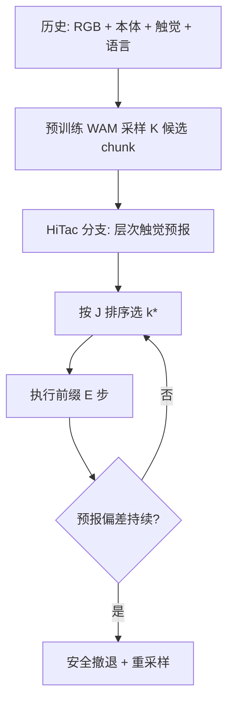

# HiTac-WAM（分层触觉世界–动作模型）

**HiTac-WAM**（*A Hierarchical Tactile World Action Model for Contact-Rich Robot Manipulation*，[arXiv:2608.19574](https://arxiv.org/abs/2608.19574)）在预训练 WAM 上增加 **触觉分支**，对每个候选 action chunk 预测 **有向层次触觉轨迹**（接触 → 3D 形变 → 滑移风险），用于 **预报引导的候选排序** 与 **在线预报验证重规划**。

## 一句话定义

**先预报每个候选动作的触觉后果，再按层次成本选 chunk，执行时用同一预报作参考监测偏差并触发纠错。**

## 英文缩写速查

| 缩写 | 英文全称 | 简要说明 |
|------|----------|----------|
| WAM | World Action Model | 联合视频与动作生成的具身策略 |
| HiTac-WAM | Hierarchical Tactile WAM | 本文：触觉未来分层因子化 |
| FG-CLTP | — | 预训练双侧触觉历史编码器 |
| KDE | Kernel Density Estimator | 在线偏差阈值校准 |
| AUPRC | Area Under Precision-Recall Curve | 稀疏滑移事件主指标 |
| RGB | Red-Green-Blue | 三视角腕部/场景相机 |
| BC | Behavior Cloning | 对照：单候选执行基线 |

## 为什么重要

- **解决「视觉同样好看、触觉后果不同」：** 多候选 WAM 采样时，独立噪声可产生 **外观相似但接触结果迥异** 的 rollout；层次触觉预报提供 **动作前可比较** 的物理信号。
- **显式物理依赖：** contact → deformation → slip 用 **stop-gradient** 编码有向因果，优于单流或独立多任务头（形变 L2 **−17.6%**，滑移 AUPRC **+60.4%**）。
- **选择与监控统一：** 选中预报 \(\widehat{\mathcal{T}}^{(k^*)}\) 贯穿执行前缀，偏差持续超阈则 **安全撤退并重规划**——把 MPC 式选择与触觉 reflex 合成单一机制。
- **真机增益大：** 芯片抓取、擦黑板、USB 插入三任务平均 **31.1% → 72.2%**（完整系统）。

## 核心方法与结构

| 模块 | 作用 |
|------|------|
| **Directed attention** | Tactile 可读 video–action；video/action **不可读** tactile |
| **层次头** | \(\widehat{C}\) → \(\Delta\widehat{D}\)（sg 条件）→ \(\widehat{p}^{\mathrm{slip}}\)（sg 条件） |
| **候选生成** | 预训练 WAM 对共享上下文采样 \(K\) 个 chunk |
| **排序** | \(J^{(k)}=-w_{\mathrm{prog}}\rho_{\mathrm{task}}+w_C J_C+w_D J_D+w_R J_R\) |
| **在线验证** | 对比 \(\mathcal{T}^{\mathrm{obs}}_{t+i}\) 与 \(\widehat{\mathcal{T}}^{(k^*)}_{t+i}\)；KDE 阈值 \(\gamma_{\mathrm{task}}\) |

### 流程总览

## 实验要点（索引级）

| 轴 | 报告口径 |
|----|----------|
| **平台** | IMETA-Y1 + 双侧 DM-Tac W2 + 3×RGB |
| **预测** | Contact F1 **0.921** |
| **选择** | 31.1% → **61.1%**（vs 单候选） |
| **完整系统** | **72.2%** 平均成功率 |
| **训练** | 每任务 10k steps，8×H100 |

## 结论

**HiTac-WAM 把触觉从「执行后反馈」前移到「候选动作的后果仿真」，并用同一预报闭环验证。**

- **层次因子化必要** — 接触门控形变与滑移；消融证明 directed hierarchy 优于单头或独立头。
- **排序比单候选翻倍成功率** — 在固定生成预算下，触觉成本 + 任务进度优于仅视觉进度排序（35.6%）。
- **在线验证再 +11pp** — 持久偏差触发重规划，将平均成功率推到 **72.2%**。
- **与 VT-WAM / 𝒩₀-TWAM 分界** — VT-WAM 联合 CFM 出动作；𝒩₀-TWAM 规模化触觉原生 WAM；HiTac-WAM 强调 **候选级预报 + 执行参考**。
- **未开源** — 截至入库日无项目页/代码；硬件绑定 DM-Tac W2。

## 工程实践与开源状态

| 项 | 状态 |
|----|------|
| **代码** | **确认未开源** |
| **源码运行时序图** | **不适用** |

## 常见误区或局限

- **误区：** 认为层次预报仅用于训练正则；本文 **排序与在线监控** 均依赖同一预报对象。
- **局限：** 正样本滑移仅 **1.39%** 帧，需加权损失；候选数 \(K\) 与重规划延迟成本未充分公开。

## 与其他页面的关系

- [VT-WAM](./paper-vt-wam-visuotactile-contact-rich.md) — 联合视触觉 CFM 出动作
- [𝒩₀-TWAM](./paper-n0-twam.md) — 触觉原生 Joint WAM
- [TACO](./paper-taco-tactile-wm-vla-posttrain.md) — VLA 后训练纠错
- [Action Chunking](../methods/action-chunking.md) — 多候选 chunk 范式
- [Bimanual Manipulation](../tasks/bimanual-manipulation.md)

## 推荐继续阅读

- [HiTac-WAM 论文（arXiv:2608.19574）](https://arxiv.org/abs/2608.19574)
- [VT-WAM 实体页](./paper-vt-wam-visuotactile-contact-rich.md)

## 参考来源

- [HiTac-WAM 论文归档](../../sources/papers/hitac_wam_arxiv_2608_19574.md)
