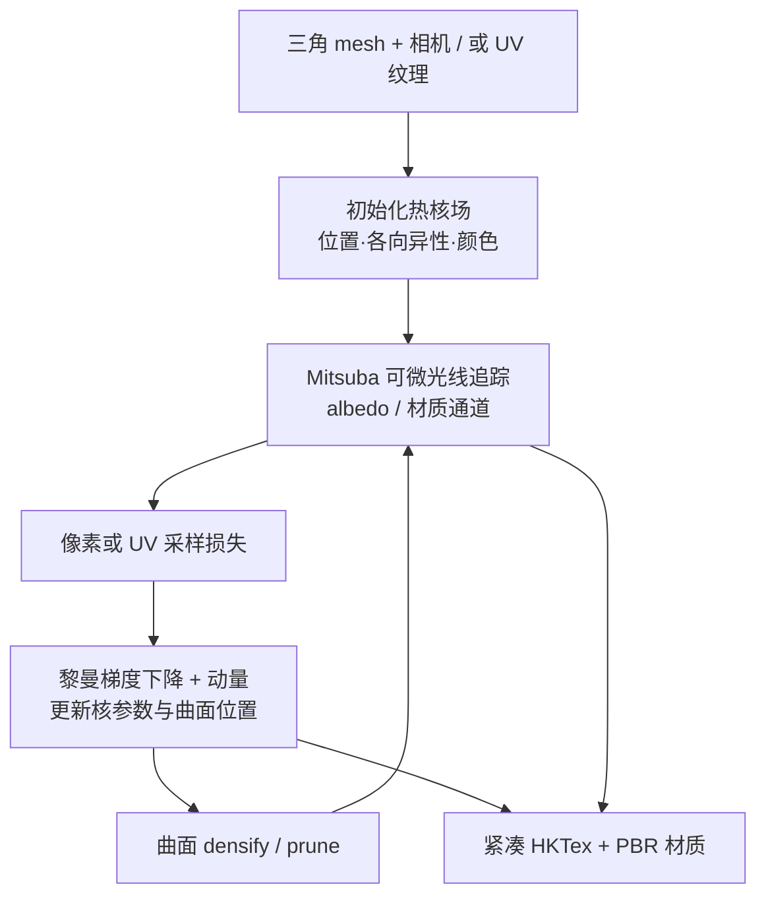
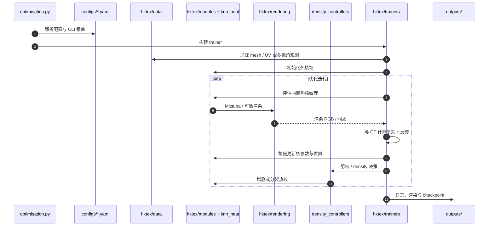

# HKTex：热核纹理（不测地线高斯，也不 Splat）

**Heat Kernel Textures（HKTex）**（*Heat Kernel Textures: the Geodesic Gaussians That Do Not Splat*，[arXiv:2609.07557](https://arxiv.org/abs/2609.07557)，[项目页](https://circle-group.github.io/research/HeatKernelTextures/)，[代码](https://github.com/circle-group/hktex)）由 **帝国理工学院（Imperial College London）** Circle Group（Foti / Korkmaz / Zafeiriou / Birdal）提出，获 **ECCV 2026 Best Paper + Long Oral**。受 3D Gaussian Splatting 启发，HKTex 把「各向异性高斯」类比搬到 **离散黎曼曲面** 上的 **热扩散核**，在三角 mesh 上直接表达外观，**无需 UV 展开**，并与 **Mitsuba 可微物理渲染** 集成，可从 **现有 UV 纹理** 或 **多视角图像** 优化。

## 一句话定义

**把纹理从 UV 图集搬到 mesh 曲面上的各向异性热核场：用测地线扩散核叠加颜色，在流形上做黎曼优化与 densify/prune，用约 UV 纹理 1/10 的存储达到优于 5–10× 存储神经基线的感知质量。**

## 英文缩写速查

| 缩写 | 英文全称 | 简要说明 |
|------|----------|----------|
| HKTex | Heat Kernel Textures | 本文无 UV 内在纹理表示 |
| PBR | Physically Based Rendering | 基于物理的材质与光照渲染；本文接 Mitsuba 光线追踪 |
| RGD | Riemannian Gradient Descent | 在曲面流形上更新核位置与参数 |
| 3DGS | 3D Gaussian Splatting | 欧氏空间高斯溅射新视角合成；HKTex 是概念类比而非 splat |
| UV | Texture coordinates mapping | 传统二维图集参数化；HKTex 旨在替代 |
| KNN | K-Nearest Neighbors | 加速热核邻域评估的实现策略 |
| NvDiffRec | NVIDIA Differentiable Rendering | 多视角逆渲染强基线之一（项目页标注 NvDiffRec*） |
| VTex | Vertex / neural texture baseline | 项目页对比的神经纹理路线之一 |

## 为什么重要

- **Real2Sim 资产的隐性瓶颈：** [SimFoundry](./paper-simfoundry-real2sim-scene-generation.md) 等管线要把真机视频变成可仿真场景；mesh 上的 **UV 接缝、扭曲与图集浪费** 会拖累纹理内存、PBR 材质一致性与批量资产吞吐。HKTex 把外观 **绑在几何上** 而非二维图集。
- **与 3DGS 机器人路线的分界：** [LEGS](./paper-legs-embodied-gaussian-splatting-vla.md)、[GS-Playground](./gs-playground.md) 用 3DGS 做 **新视角 / RL 观测**；HKTex 解决 **已知 mesh 上的紧凑纹理与材质**，更像 sim-ready 网格的 **外观层**，不是 splat 渲染器。
- **可复现且荣誉背书：** ECCV 2026 **Best Paper**；[`circle-group/hktex`](https://github.com/circle-group/hktex) **MIT 开源**，`optimisation.py` + `configs/` 可跑 UV 拟合与多视角实验。
- **压缩—质量权衡清晰：** 论文与项目页强调 **~1/10 UV 存储** 且 **优于 5–10× 存储** 的 MLP / Instant-NGP 式内在场、VTex 等——对需要大量物体实例的仿真库有选型意义。

## 核心信息

| 字段 | 内容 |
|------|------|
| 作者 | Simone Foti*, Caner Korkmaz*, Stefanos Zafeiriou, Tolga Birdal |
| 机构 | 帝国理工学院（Imperial College London） |
| 出处 | ECCV 2026 **Best Paper** + **Long Oral**；arXiv:2609.07557；DOI [10.1007/978-3-032-37595-7_17](https://doi.org/10.1007/978-3-032-37595-7_17) |
| 栈 | 离散黎曼几何 + digeo；PyTorch；KNN 热核；Mitsuba 3.7 可微光线追踪 |
| 开源（截至 2026-09-11） | **已开源、可运行**：[`circle-group/hktex`](https://github.com/circle-group/hktex)，MIT |

## 方法与核心结构

| 模块 | 作用 |
|------|------|
| **各向异性热核** | 源点位置、扩散角、各向异性（方向/拉伸）、尺度、锐度、RGB；在测地邻域扩散并叠加 |
| **黎曼优化** | 核位置与形状在 **三角 mesh 曲面** 上更新（RGD + 动量），位置约束在流形上 |
| **密度控制** | 重要性 **剪枝** 低贡献核；误差驱动 **densify**（沿流形主方向 clone / split） |
| **渲染** | Mitsuba 光线追踪可微渲染；支持 **albedo + 多材质通道** 的 PBR 分解 |
| **拟合路径 A** | 已有 UV 纹理 mesh → 曲面任意点评估 HKTex ↔ UV 采样 GT |
| **拟合路径 B** | 多相机 RGB 观测 → 渲染像素 ↔ GT 多视角监督 |
| **KNN 加速** | `texture_hktex_knn.yaml` / `multiview_hktex_knn_ray_small.yaml` 降低热核评估成本 |

与 3DGS 的关键差异：**核活在 2D 流形上、按测地线扩散、不做图像空间 splat**；优化与 densify 的邻域与主方向都 **曲面感知**。

### 流程总览

## 源码运行时序图

官方仓 [`circle-group/hktex`](https://github.com/circle-group/hktex) 的主路径由 `optimisation.py` 加载 YAML 配置，经 `hktex/trainers/` 调度数据、模型、渲染与密度控制。复现：`mamba activate hktex` → `python optimisation.py --config configs/texture_hktex_knn.yaml data.mesh_path=/path/to/mesh.obj`（多视角用 `multiview_hktex_knn_ray_small.yaml`）。

## 与相关表示的对比

| 维度 | HKTex | UV 纹理 | 神经纹理（MLP/VTex） | 3DGS（LEGS/GS-Playground） |
|------|-------|---------|----------------------|----------------------------|
| 载体 | 三角 mesh 曲面 | 2D 图集 | mesh 上隐式/顶点场 | 欧氏 3D 高斯点云 |
| 接缝/扭曲 | 无 UV | 常见痛点 | 无 UV | 不适用（场景级） |
| 存储 | ~UV 的 **1/10** | 基线 | 常需 **5–10×** 才追平感知质量 | 场景级，非单 mesh 纹理 |
| 渲染 | Mitsuba PBR 光线追踪 | 标准 raster | 依实现 | Splat / 批量光真实感 |
| 机器人语境 | sim 资产 **外观层** | 传统资产管线 | 研究基线 | RL 观测 / VLA 合成数据 |

## 评测与结果

| 设定 | 要点 |
|------|------|
| **UV 纹理拟合** | 从标准 UV 图压缩重拟合；多物体同步旋转 + 多材质切换；对比 GT UV、低分辨率 UV、MLP、Instant-NGP 内在场、VTex、ImageGS |
| **多视角逆渲染** | 直接从多视角图像优化；对比 VTex、MLP pos. encoding、NvDiffRec* |
| **存储** | HKTex 约为 UV 纹理 **1/10** 内存 footprint |
| **感知质量** | 优于使用 **5–10× 存储** 的神经纹理基线（项目页交互对比与论文结论一致） |
| **荣誉** | ECCV 2026 **Best Paper Award** |

## 工程实践

| 项 | 建议 |
|----|------|
| **环境** | `mamba create -n hktex python=3.11.13`；PyTorch 2.10+cu129；`digeo==0.0.4`；Mitsuba 3.7.1；见 README |
| **快速试跑** | `python optimisation.py --config configs/texture_hktex_knn.yaml data.mesh_path=...` |
| **多视角** | `configs/multiview_hktex_knn_ray_small.yaml` + 自备相机与图像 |
| **基线对比** | 神经纹理需 `hktex-mlp` 环境与 `texture_mlp.yaml` / `multiview_mlp_ray.yaml` |
| **输出** | 默认 `outputs/`：配置、日志、渲染、checkpoint |
| **GPU** | `--gpu 0` 或 `CUDA_VISIBLE_DEVICES`；README 目标 Linux + NVIDIA CUDA 12.9 |
| **机器人衔接** | 导出带 HKTex 的 mesh + PBR 材质后，可接入 Isaac / OmniGibson 等 sim 渲染栈；需自行桥接材质格式 |

## 局限与风险

- **输入假设：** 需要 **三角 mesh**；多视角模式依赖标定相机。不是点云 SLAM 或隐式 NeRF 的直接替代。
- **任务边界：** 论文聚焦 **外观/纹理**，不生成碰撞体、关节或动力学参数。
- **算力与实现钉定：** 热核数量与 KNN 邻域影响速度；环境版本（CUDA 12.9、Mitsuba 3.7）较新，与旧仿真栈集成需验证。
- **勿与 3DGS 机器人数据工厂混淆：** [LEGO](./paper-lego-leveled-language-gaussian-splatting.md) / [Spark](./spark-3dgs-renderer.md) 面向 **场景级 splat**；HKTex 面向 **单 mesh 紧凑纹理**。

## 结论

**HKTex 把「高斯」从欧氏 splat 搬到 mesh 测地线热核，用 ECCV 2026 Best Paper 级别的证据说明：无 UV 内在纹理可以在约 1/10 存储下打败大容量神经基线，并原生接入 PBR 可微渲染。**

- **选型：** 已有 sim-ready 三角网格、受 UV 接缝/图集内存困扰、又要 PBR 材质分解时，优先评估 HKTex 相对 VTex / 神经内在场。
- **存储—质量：** 把 **~10× 压缩** 当作硬指标；若基线已用超大 MLP/网格神经纹理仍不如 HKTex，迁移理由更强。
- **复现入口：** 从 `texture_hktex_knn.yaml` + 自有 `.obj` 开始；多视角路线再切 `multiview_hktex_knn_ray_small.yaml`。
- **机器人管线位置：** 放在 **Real2Sim 资产外观层**（与 [SimFoundry](./paper-simfoundry-real2sim-scene-generation.md) 几何/物性互补），不是替代 [GS-Playground](./gs-playground.md) 的批量 splat 观测。
- **风险：** 依赖 mesh 质量与较新 CUDA/Mitsuba 栈；跨引擎材质导出需工程胶水。
- **跟踪：** [`circle-group/hktex`](https://github.com/circle-group/hktex) MIT 仓已完整；关注 Objaverse 批量 benchmark 脚本是否补充数值表。

## 关联页面

- [SimFoundry](./paper-simfoundry-real2sim-scene-generation.md) — Real2Sim 场景资产与纹理/背景表示选型
- [LEGO](./paper-lego-leveled-language-gaussian-splatting.md) — 另一类「高斯」3D 表示，但面向开放词汇 3DGS 语义
- [GS-Playground](./gs-playground.md) — 3DGS 光真实感批量渲染服务 RL
- [Spark](./spark-3dgs-renderer.md) — Web 端 3DGS 交付，与 HKTex mesh 纹理场景不同
- [Sim2Real](../concepts/sim2real.md) — 视觉域差距与资产保真上下文

## 参考来源

- [HKTex 论文归档](../../sources/papers/hktex_eccv_2026_arxiv_2609_07557.md)
- [Circle Group 项目页归档](../../sources/sites/circle-group-heat-kernel-textures.md)
- [官方代码仓库归档](../../sources/repos/hktex.md)

## 推荐继续阅读

- Foti et al., *Heat Kernel Textures: the Geodesic Gaussians That Do Not Splat*, ECCV 2026 — <https://arxiv.org/abs/2609.07557>
- 项目页交互对比（UV 拟合 / 多视角逆渲染）— <https://circle-group.github.io/research/HeatKernelTextures/>
- [`circle-group/hktex`](https://github.com/circle-group/hktex) README — 安装、`configs/` 与 `optimisation.py` 入口
