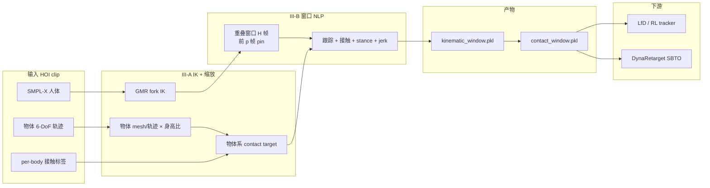
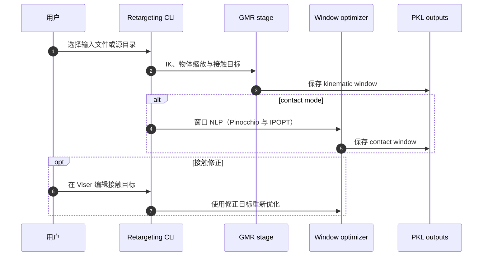

# HOI-Retarget（arXiv:2609.34674）

**HOI-Retarget**（*Contact-Centric Retargeting for Human-Object Interaction*，苏黎世联邦理工学院机器人系统实验室 ETH RSL，[arXiv:2609.34674](https://arxiv.org/abs/2609.34674)，[项目页](https://shinben0327.github.io/hoi-retarget/)）把 **人类–物体交互（HOI）** 转成 **人形机器人可模仿的 kinematic 参考**，核心不是全局 pose 对齐，而是 **在物体坐标系里复现每一次标注接触的时空位置**。

## 一句话定义

**每个接触点都是物体系里的靶点**——IK 只负责粗对齐，窗口化轨迹优化在关节限位下把掌/脚 **钉回同一物体表面**，并支持缩放物体、多机共操与单目重建修正。

## 英文缩写速查

| 缩写 | 英文全称 | 简要说明 |
|------|----------|----------|
| HOI | Human-Object Interaction | 人–物同步运动与接触 |
| IK | Inverse Kinematics | 首阶段 GMR 系骨架映射 |
| NLP | Nonlinear Program | 窗口内 CasADi/IPOPT 轨迹优化 |
| GMR | General Motion Retargeting | IK 后端（vendored fork） |
| LfD | Learning from Demonstration | 下游策略学习范式 |
| OMOMO | Object Motion Guided Human Motion | 主实验与发布数据主要源之一 |

## 为什么重要

- **LfD 的数据瓶颈在「交互几何」：** [loco-manipulation](../tasks/loco-manipulation.md) 需要 **手–物相对关系**；仅 [GMR](../methods/motion-retargeting-gmr.md) 式 body 对齐会把抓取移到错误表面，破坏示范语义。
- **相对 OmniRetarget：** [OmniRetarget](./paper-hrl-stack-03-omniretarget.md) 用 **interaction mesh** 保整体场景几何；HOI-Retarget **直接最小化每个 contact 的物体系误差**，在 **薄/局部抓取** 物体上 gap 从 **18.3 cm→0.5 cm**（OMOMO/G1）。
- **相对动力学 refinement：** [DynaRetarget](./paper-notebook-dynaretarget-dynamically-feasible-retargeting-us.md) 等修 **动力学可行**；本文专注 **kinematic 接触保真**，可作为其 **更准的初始化**（项目页对比 RL tracker / SBTO）。
- **规模数据：** HF 发布 **6,952 clips、13.8 h、75 objects、G1+H2**，含 **双机协作** 与五源混合。

## 核心信息

| 项 | 内容 |
|----|------|
| **机构** | 苏黎世联邦理工学院（ETH Zurich）Robotic Systems Lab |
| **arXiv** | [2609.34674](https://arxiv.org/abs/2609.34674) |
| **项目页** | <https://shinben0327.github.io/hoi-retarget/> |
| **代码** | [shinben0327/hoi-retarget](https://github.com/shinben0327/hoi-retarget)（BSD-3-Clause） |
| **数据集** | [HF: shinben0327/hoi-retarget](https://huggingface.co/datasets/shinben0327/hoi-retarget) |
| **平台** | Unitree G1、H2 |
| **开源状态** | **已开源**（代码+重定向数据）；SMPL-X / 源 mocap **许可外载** |

## 流程总览

## 核心原理

1. **统一接触标注：** 人体 mesh 与物体距离阈值 + 脚 stance（高度/速度）→ 机器人接触链 \(\mathcal{C}=\) 双掌+双脚；活跃帧把人体接触点变换到 **物体系** \(p^{o*}_{c,i,t}\)。
2. **物体缩放：** 与 GMR 相同 **身高比** 缩放物体几何与轨迹；因 target 在物体系，**×0.25–×1.5 增广** 无需重标接触。
3. **窗口优化：** 决策变量为 \(\{q_t\}\)；对象轨迹 **固定参数**（不优化物体）；重叠窗 + pin 前 \(p\) 帧保证 **长 clip 可解 + 时间耦合**。
4. **接触代价：** 位置项 + 手掌朝向；脚 **高度/ sole 朝向** 消 IK 浮脚；jerk 平滑。
5. **III-C 修正：** Viser 编辑器按 **接触段** 拖点，再 re-solve — 服务 CARI4D 等 **噪声重建**。

## 源码运行时序图

节点对齐 [`sources/repos/hoi-retarget.md`](../../sources/repos/hoi-retarget.md) 与 README `Repository layout`。

## 工程实践

| 检查项 | 建议 |
|--------|------|
| 数据准备 | 先读 `docs/DATA.md` / `INTERACT.md` 下载 SMPL-X 与 InterMimic |
| 默认 embodiment | G1 `--object_scale` 默认 0.83；H2 默认 1.0 |
| 批量 | `batch_retarget.sh` **可恢复**；适合 OMOMO 全库 |
| 输出 | 下游 LfD 用 `contact_window.pkl`；仅骨架对齐用 `--mode kinematic` |
| 动力学 | kinematic 结果 **非可直接执行** — 接 SBTO/RL tracker 或 sim refinement |
| 许可 | 物体 mesh 引 OMOMO/InterMimic；cite 见 `CITATION.cff` |

## 实验与评测读法

- **接触精度（OMOMO, G1）：** mean contact-point gap **0.5 cm** vs [OmniRetarget](./paper-hrl-stack-03-omniretarget.md) **18.3 cm**。
- **速度：** 约 **4.6×** 于 interaction-aware baseline（项目页/论文）。
- **泛化源：** ParaHome、NeuralDome、CoRoleHOI、IMHD² + **双 actor→双机** 同步。
- **单目：** CARI4D 桌搬运 — 接触段 collapse + 编辑器 + refinement 闭环 demo。
- **Dynamic refinement：** 同一 kinematic 左端，OmniRetarget vs HOI-Retarget 初始化 → RL tracker / SBTO。

## 与其他工作对比

| 维度 | HOI-Retarget | OmniRetarget | GMR | DynaRetarget |
|------|--------------|--------------|-----|--------------|
| 交互表示 | **物体系 contact target** | Interaction mesh Laplacian | 关键点 IK | 已有 robot–object 参考 |
| 接触位置 | **显式最小化** | 间接（mesh 形变） | 不建模物体 | 不强调 contact gap |
| 时间耦合 | **窗口 NLP** | 逐帧 SOCP | 逐帧 |  progressive SBTO |
| 动力学 | kinematic only | kinematic | kinematic | **动力学可行** |
| 开源 | GitHub + HF 数据 | holosoma + HF | 社区 GMR | Atari sbto |

同属 OMOMO/G1 接触保真路线的 [OTRetarget](./paper-otretarget.md)（arXiv:2609.36602）改用 **熵正则 OT 表面对应 + 机器人与物体位姿联合 IK**，报告交互 Jaccard 87% / 深度误差 8.7 mm；与本文 contact-point gap 指标口径不同，不能直接横比，且其代码待发布。

## 结论

**HOI-Retarget 把 HOI 重定向从「像人」推进到「在同一物体同一点接触」——并给出可规模化的开源管线与 6.9k clip 数据集。**

1. **物体系 contact target** 是尺度增广与多 embodiment 的统一表示 — 比 world-frame 抓取更稳。
2. **0.5 cm gap** 相对 OmniRetarget 数量级下降 — 选参考时应看 **contact metric** 而非只看 mesh 能量。
3. **4.6× 加速** 使全库重定向可行 — 配合 `batch_retarget.sh` 做 LfD 数据工厂。
4. **与动力学 refinement 分工清晰** — 先 kinematic 接触，再 DynaRetarget/tracker；勿跳过前者直接 RL。
5. **SMPL-X/源数据外载** — 复现需预留 InterMimic 下载与 conda 依赖（Pinocchio/CasADi）。

## 局限与风险

- **仍 kinematic：** 浮脚/穿透需下游 physics；论文已展示但不替代 SBTO。
- **接触标签质量：** 单目重建依赖 **III-C 人工/半自动修正** — 全自动 pipeline 仍有编辑环。
- **物体模型：** 非 OMOMO 命名物体需 `--object_model_path` 单 clip 处理。

## 关联页面

- [GMR](../methods/motion-retargeting-gmr.md)
- [Motion Retargeting Pipeline](../concepts/motion-retargeting-pipeline.md)
- [Loco-Manipulation](../tasks/loco-manipulation.md)
- [OmniRetarget](./paper-hrl-stack-03-omniretarget.md)
- [OTRetarget](./paper-otretarget.md)
- [DynaRetarget](./paper-notebook-dynaretarget-dynamically-feasible-retargeting-us.md)
- [Unitree G1](./unitree-g1.md)
- [FlashDexRetarget](./paper-flashdexretarget.md) — 灵巧手侧的 HOI 重定向对照：用一个多参考 RL 策略联合学习多段手—物演示，而非逐段接触时间窗优化

## 参考来源

- [hoi_retarget_arxiv_2609_34674.md](../../sources/papers/hoi_retarget_arxiv_2609_34674.md)
- [hoi-retarget-shinben0327-github-io.md](../../sources/sites/hoi-retarget-shinben0327-github-io.md)
- [hoi-retarget.md](../../sources/repos/hoi-retarget.md)
- [flashdexretarget_arxiv_2610_01849.md](../../sources/papers/flashdexretarget_arxiv_2610_01849.md) — FlashDexRetarget 归档，含与本页接触中心优化的对照映射
- [arXiv:2609.34674](https://arxiv.org/abs/2609.34674)

## 推荐继续阅读

- [HOI-Retarget 项目页](https://shinben0327.github.io/hoi-retarget/)
- [GitHub: shinben0327/hoi-retarget](https://github.com/shinben0327/hoi-retarget)
- [HF 数据集](https://huggingface.co/datasets/shinben0327/hoi-retarget)
