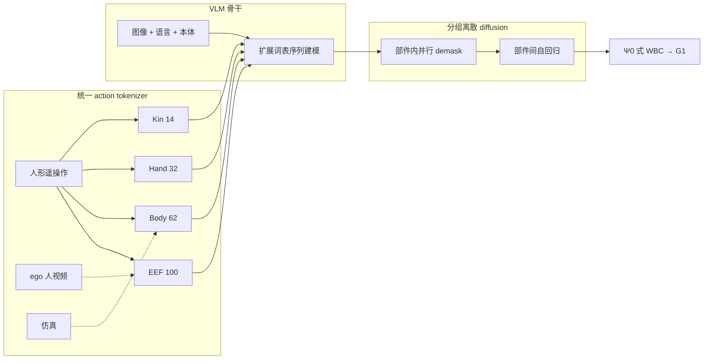

# Holo-M（arXiv:2609.35709）

**Holo-M**（*Humanoid Loco-Manipulation With Discrete VLA Model*，地平线机器人，[arXiv:2609.35709](https://arxiv.org/abs/2609.35709)，[项目页](https://horizonrobotics.github.io/gail/Holo-M/)）将 **离散 action token** 路线从机械臂扩展到 **人形全身 loco-manipulation**：**四部件 tokenizer**（EEF / body / hand / kinematics，合计 **208 token**）写入 **VLM 同一词表**，用 **分组离散 diffusion**（部件内并行 demask、部件间自回归）满足 **实时 1 s chunk** 控制，在 [SIMPLE](./paper-loco-manip-161-075-simple.md) 上 **specialist 163/180、generalist 143/180**，领先 [Ψ0](./paper-loco-manip-161-156-psi0.md) 等连续 action expert 基线。

## 一句话定义

**把人形 96-D 异构动作拆成四组离散 token 写进语言模型词表，用分组 diffusion 解码，避免连续 action expert 的 knowledge insulation。**

## 英文缩写速查

| 缩写 | 英文全称 | 简要说明 |
|------|----------|----------|
| VLA | Vision-Language-Action | 视觉-语言-动作策略 |
| VLM | Vision-Language Model | 骨干；action token 扩展词表 |
| EEF | End Effector | 腕与指尖位姿 tokenizer（48D→100 tok） |
| SIMPLE | Simulation-Based Policy Learning and Evaluation | 人形 loco-manip 六任务基准 |
| WBC | Whole-Body Control | Ψ0 同款 decoupled 低层，隔离策略对比 |

## 为什么重要

- **离散 VLA 首次全身 scale：** 臂级 [FAST](https://arxiv.org/abs/2410.24164) / 离散 diffusion 未覆盖 **腿+躯干+手** 异构 DoF。
- **相对 Ψ0 / π0.5：** 连续 flow expert 需 **gradient insulation**；Holo-M **action=language token**，语义与动作 **同一序列模型**。
- **相对 WholeBodyVLA 系：** 离散 VQ + 分离执行解码不同 — Holo-M **端到端词表 + grouped diffusion**。
- **数据混合：** 遥操作 / ego 人视频 / 仿真 **各监督子集部件** — mask 缺失组 loss，而非 padding 假标签。

## 核心信息

| 项 | 内容 |
|----|------|
| **机构** | 地平线机器人（Horizon Robotics） |
| **arXiv** | [2609.35709](https://arxiv.org/abs/2609.35709) |
| **项目页** | <https://horizonrobotics.github.io/gail/Holo-M/> |
| **平台** | Unitree G1-comp、Dex3-1 双手、head 640×360@30Hz |
| **开源状态** | **待发布** — 论文承诺 release **全部代码与权重**；截至 2026-09-30 项目页无 GitHub |

## 流程总览

## 核心原理

1. **Tokenizer 分解：** 全动作 96D → 208 discrete token；各部件独立码本，训练时 **仅对有标注部件算 loss**。
2. **词表扩展：** action token 与 text 共用 LM — 无单独 continuous head 的 insulation 问题。
3. **Grouped discrete diffusion：** 208 步 AR 过慢 → **32 demask 步**；部件内并行、部件间顺序（后部件条件于先解码部件）。
4. **训练：** 四阶段 progressive（跨具身预训练 → specialist）；generalist 单策略六任务。
5. **部署：** 500 ms 新观测；执行当前 1 s chunk 同时解码下一 chunk；RTX 5090 **4-step 276 ms/chunk**。

## 源码运行时序图

**不适用** — 论文与项目页承诺开源，截至 **2026-09-30** 无官方仓库入口。

## 工程实践

| 检查项 | 建议 |
|--------|------|
| 低层 | 与 Ψ0 相同 decoupled WBC — 对比 **仅高层 VLA** |
| 实时 | 4 diffusion steps 为延迟/质量折中；8-step 477 ms 逼近 500 ms 预算 |
| Generalist | **143/180** vs π0.5 generalist **28/180** — 全身离散 token 泛化是主卖点 |
| Holo-M AR | 纯 AR 157/163 specialist — grouped diffusion 为 **速度** 非唯一精度来源 |
| 待发布 | 权重+代码落地前，复现仅限 SIMPLE 公开协议与 baselines |

## 实验与评测读法

- **SIMPLE specialist：** **163/180**；次佳 Holo-M AR **157**，Ψ0 **154**。
- **SIMPLE generalist：** **143/180**；Ψ0 **114**；π0.5 **28** — 移动+操作联合任务 gap 大。
- **DreamZero / π0.5：** 项目表显示部分移动任务 **极低 SR** — 连续 WAM/VLA 在非 specialist 设定下落后。
- **真机：** 推咖啡车、碗入水槽、瓶入垃圾桶等 **长语言链** demo（页内实时播放）。

## 结论

**Holo-M 证明离散 token VLA 可扩展到人形全身，并在 SIMPLE 上同时拿下 generalist 与 specialist SOTA。**

1. **四部件 tokenizer** 是跨源训练的关键 — 避免单码本在 96-D 上爆炸或过粗。
2. **分组 discrete diffusion** 把 208 token 解码压到 **32 步** — 满足 ~500 ms 控制环。
3. **词表统一** 相对 continuous expert — 简化语义–动作边界，利于 language-heavy loco-manip。
4. **对 Ψ0 +9/+29 overall** — 在相同 WBC 下高层策略差距显著。
5. **代码待发布** — 工程复现与 tokenizer 细节需等官方仓库。

## 局限与风险

- **SIMPLE 仿真为主：** 真机 demo 丰富但定量以 SIMPLE 表为核心 — sim2real 边界待权重发布后跟进。
- **WBC 依赖：** 高层离散 token 仍经 **Ψ0 式低层** — 非端到端 torque。
- **与臂级 discrete VLA：** 208 token × 多部件 AR 顺序 — 新任务仍受 **解码调度** 约束。

## 关联页面

- [VLA](../methods/vla.md)
- [Loco-Manipulation](../tasks/loco-manipulation.md)
- [SIMPLE](./paper-loco-manip-161-075-simple.md)
- [Ψ0](./paper-loco-manip-161-156-psi0.md)
- [WholeBodyVLA](./paper-hrl-stack-30-wholebodyvla.md)
- [Unitree G1](./unitree-g1.md)

## 参考来源

- [holo_m_arxiv_2609_35709.md](../../sources/papers/holo_m_arxiv_2609_35709.md)
- [holo-m-horizon-github-io.md](../../sources/sites/holo-m-horizon-github-io.md)
- [arXiv:2609.35709](https://arxiv.org/abs/2609.35709)

## 推荐继续阅读

- [Holo-M 项目页](https://horizonrobotics.github.io/gail/Holo-M/)
- [SIMPLE 基准实体](./paper-loco-manip-161-075-simple.md)
