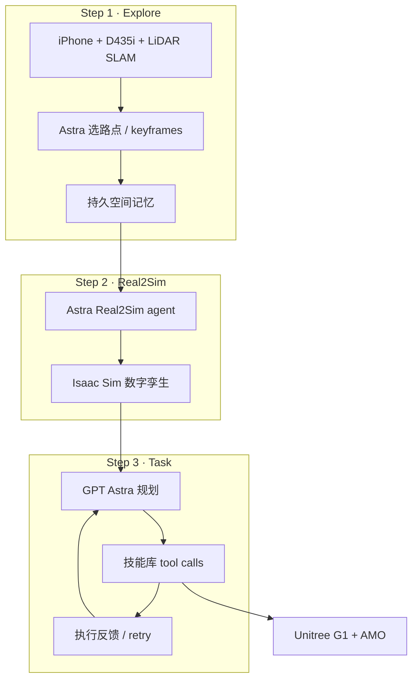

# HomeBody（探索、记忆与自主行动的人形系统）

**HomeBody**（*A Humanoid That Explores, Remembers, and Acts on Its Own*，[项目页](https://tml.stanford.edu/homebody/)，[GitHub](https://github.com/Stanford-TML/homebody)，2026）由 **Caltech** 与 **Stanford The Movement Lab（TML）** 发布：在 **未见过的厨房** 中，让 **Unitree G1** 在远程 **GPT Astra** 指挥下完成 **跨房间整理** 与 **基于记忆的模糊取物**，**无需该环境专属训练数据或额外策略学习**。

## 一句话定义

**用前沿 VLM 直接调用可组合人形技能库，并以探索期持久空间记忆 + 自采 Real2Sim 孪生，替代「VLM→学习式 VLA→WBC」中间链。**

## 英文缩写速查

| 缩写 | 英文全称 | 简要说明 |
|------|----------|----------|
| VLM | Vision-Language Model | System 2：GPT Astra 远程推理与 tool call |
| VLA | Vision-Language-Action | 传统 System 1 学习式策略；本文主张可省略 |
| Real2Sim | Real to Simulation | 自采数据 → Isaac Sim 数字孪生 |
| SLAM | Simultaneous Localization and Mapping | LiDAR 几何 + 与仿真 ICP 对齐 |
| ICP | Iterative Closest Point | G1 定位：SLAM 图与重建仿真配准 |
| AMO | Adaptive Motion Optimization | 预训练 upper-body-aware 低层全身控制 |
| IK | Inverse Kinematics | Pick/Place 样条参考 + 沿路径 IK |

## 为什么重要

- **架构问题具体化：** 当 Astra 类模型变强，是否仍需要 **专用 VLA** 夹在高层推理与 motor skills 之间？HomeBody 给出 **skill-library + tool call** 的替代闭环（与 [GPT-Policy](./paper-gpt-policy.md) 的 ICL 代理路线同族但强调 **长程空间记忆 + Real2Sim**）。
- **长程 loco-manipulation：** 任务超出 ego 视场时，需要 **内部空间模型** 连接可见物体与 **记住的位置**（取药 drawer 初始不可见）。
- **Real2Sim  grounding：** 对比「仅人类录像」，强调 **人形自探索** 的 SLAM、关节、路点 + ego 视频，作为 Astra Real2Sim agent 输入（与 [Agentic Real2Sim](./paper-agentic-real2sim.md) 的 episode 孪生粒度不同）。
- **工程可部署叙事：** 技能栈在 **单卡 RTX 4090 笔记本** 本地跑，Astra 远程——适合「野外」轻量 setup 讨论。

## 核心信息

| 字段 | 内容 |
|------|------|
| 机构 | 斯坦福大学 TML；加州理工学院（Caltech） |
| 硬件 | Unitree G1；Intel RealSense D435i；LiDAR；0.5× iPhone 视频 |
| 仿真 | NVIDIA Isaac Sim 数字孪生 |
| System 2 | GPT Astra（远程 API） |
| System 0 | [AMO](./paper-loco-manip-161-135-amo.md) 低层（50 Hz 策略 tick；臂/手 250 Hz） |
| 开源（截至 2026-09-28） | GitHub **待发布**（README：Code coming soon） |

## 流程总览

## 核心原理

### 三阶段管线

1. **Explore：** 角色设定 + 自然语言探索指令；采集多模态轨迹（含 **人形视角** 路点与观测），物体离开视场后仍可召回。
2. **Real2Sim：** Astra agent 用 **自采 SLAM 几何**（非仅外观估尺寸）+ ego 视图 + 关节 + 路点，在 Isaac Sim 建孪生；项目页提供 LiDAR vs 仿真 **可比对 3D**。
3. **Task：** 自然语言日常指令（如整理厨房）；VLM 用空间上下文选 **skill + target**，无 action-level 脚本。

### 技能库（可扩展）

| Skill | 作用 |
|-------|------|
| Navigate | Real2Sim 地图中 2D 目标 + 朝向（米） |
| Pick | ego 图像归一化点 (0–1000) + 手别；分割 + 深度 + IK 样条 |
| Place | 躯干系 3D 释放点 + 释放距离 + 手别 |
| Open drawer | 视觉对准把手 + hook + **后退拉** |
| Pick from drawer | 抽屉内抓取（含 retry demo） |

VLM 输入含：当前 ego、地图上下文、夹爪状态、**召回观测**、上一 skill 结果。

### 定位与纠错

- **定位：** Super Odometry + **ICP** 将 G1 SLAM 与重建仿真对齐；ego 观测存于 **共享坐标系**。
- **跟踪：** SAM 2.1 + SAMURAI 记忆；接近时 **visual servo** 修正，无需每帧新 VLM 决策。
- **Retry：** 抓取无接触 → 换候选或调整 stance；耗尽后 **reason 回传 VLM** replan。

## 评测与结果

项目页以 **定性真机长程 demo** 为主，**无** 公开 benchmark 表或 arXiv 号（截至 2026-09-28）。

| Demo | 指令要点 | 能力展示 |
|------|----------|----------|
| Tidy kitchen | 咖啡袋收拢到岛台；丢弃指定变质 carton | 多物体、跨房间往返、抓取+放置序列 |
| Retrieve medicine | 模糊「忘带药」+ 顺带扔 carton | **记忆 drawer**、双手分工、导航+操作 |

FAQ 强调：相对 **仅人类录像** Real2Sim，自采 SLAM 约束 **几何尺寸**，便于穿 room 定位与 reach。

## 与其他工作对比

| 维度 | HomeBody | VLM→VLA→WBC 三段链 | [GPT-Policy](./paper-gpt-policy.md) | [Agentic Real2Sim](./paper-agentic-real2sim.md) |
|------|----------|---------------------|-------------------------------------|--------------------------------------------------|
| 中间层 | **无学习式 VLA** | System 1 VLA | 固定 VLM + Cartesian tools | VLM 编排 MuJoCo episode |
| 记忆 | **探索 keyframes + SLAM 对齐** | 依具体 VLA/WM | ICL context | Episode twin |
| 动作单元 | **可组合 skills** | 连续 action chunk | EEF tool requests | 仿真回放轨迹 |
| 机器人 | G1 真机 loco-manip | 通用 | ARX/YAM 等 | DROID 等 |
| 开源 | **待发布** | 各异 | **已开源** | 曾 coming soon |

## 源码运行时序图

**不适用。** [Stanford-TML/homebody](https://github.com/Stanford-TML/homebody) 截至 **2026-09-28** 仅 README **Code coming soon**，无可对齐的 CLI/模块入口。开放后应按项目页 **Implementation + FAQ** 补 `sources/repos/` 并补本图（预期节点：远程 Astra ↔ 本地 RTX 4090 技能进程 ↔ AMO ↔ G1）。

## 工程实践

| 项 | 建议 |
|----|------|
| 复现 | 等待官方代码；先读项目页 FAQ（Pick/Nav/Place 目标格式、AMO 频率） |
| 低层 | 全身 loco-manip 需预训练 **AMO**；与 [Being-H0.7](../methods/being-h07.md) 等上层接口可对照阅读 |
| VLM | 依赖 **GPT Astra** 远程；latency 导致 skill 间停顿（项目页承认） |
| 算力 | 本地 **RTX 4090** 笔记本；加更重感知/技能可能不够 |
| Real2Sim | 需 API 成本与 setup 时间；几何以 **自采 SLAM** 为锚 |

## 局限与风险

- **代码未发布：** 无法验证 skill 接口与 Real2Sim agent 可复现性。
- **硬件 endurance：** 长任务受 **指伺服过热**、reach 与 endurance 限制。
- **Astra 延迟：** skill 间推理停顿影响长程流畅度。
- **Real2Sim 成本：** 重建时间与 API 开销；交错域/动态场景 FAQ 未全面展开。
- **无 arXiv：** 学术引用目前仅项目页与 GitHub 占位 citation 级信息。

## 结论

**HomeBody 的核心主张是：在 Astra 级 System 2 上，用持久空间记忆 + 自采 Real2Sim + 可组合技能库，可直接承担长程 G1 loco-manipulation，而未必需要再训一层 VLA。**

1. **Demo 读数** — 未见厨房内 **跨房间整理** 与 **记忆 drawer 取药** 真机闭环（无公开 SR 表）。
2. **Real2Sim 关键** — **自采 SLAM 几何** 约束房间尺度，优于纯人类录像估尺寸（项目页对比图）。
3. **技能接口** — structured tool call + 本地 retry/visual servo，减轻 VLM 低频控制负担。
4. **低层** — **AMO** 承担 walking+manipulation 协调（50 Hz / 250 Hz 分层）。
5. **算力分割** — Astra 远程 + **4090 笔记本** 本地技能，适合「轻量真机 + 云端大脑」叙事。
6. **开源边界** — GitHub **Code coming soon**；入库日 **不可复现**。
7. **选型** — 研究 **长程记忆 + VLM skill 编排** 时对照 [GPT-Policy](./paper-gpt-policy.md)/[GPT 6 Astra 评测](./paper-gpt-6-astra-embodied-policy.md)；要可跑 harness 优先后者生态。

## 关联页面

- [Loco-Manipulation](../tasks/loco-manipulation.md)
- [GPT 6 Astra 具身策略评测](./paper-gpt-6-astra-embodied-policy.md)
- [GPT-Policy](./paper-gpt-policy.md)
- [Agentic Real2Sim](./paper-agentic-real2sim.md)
- [AMO](./paper-loco-manip-161-135-amo.md)

## 推荐继续阅读

- 项目页交互 3D：<https://tml.stanford.edu/homebody/>
- Isaac Sim：<https://developer.nvidia.com/isaac-sim>
- Super Odometry（项目页引用 [1]）

## 参考来源

- [HomeBody 项目归档（TML 2026）](../../sources/papers/homebody_tml_stanford_2026.md)
- [HomeBody 项目页归档](../../sources/sites/tml-stanford-homebody.md)
- [Stanford-TML/homebody 仓库归档](../../sources/repos/stanford-tml-homebody.md)
