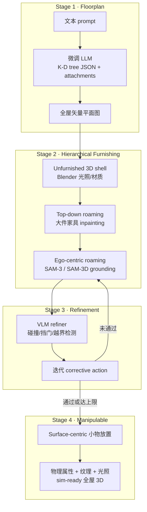

---

type: entity
tags:
  - paper
  - scene-generation
  - indoor-scene
  - floorplan
  - embodied-ai
  - simulation
  - dataset
  - vlm
  - llm
status: complete
updated: 2026-06-18
arxiv: "2606.06390"
code: https://github.com/Kairos-HomeWorld/HomeWorld
related:
  - ../concepts/video-as-simulation.md
  - ../concepts/sim2real.md
  - ../methods/generative-world-models.md
  - ../tasks/manipulation.md
  - ../tasks/vision-language-navigation.md
  - ../entities/physx-omni.md
  - ../entities/paper-physforge-physics-grounded-3d-assets.md
sources:
  - ../../sources/papers/homeworld_arxiv_2606_06390.md
  - ../../sources/sites/kairos-homeworld-github-io.md
  - ../../sources/repos/homeworld.md
summary: "HomeWorld（arXiv:2606.06390）：文本 prompt → 四阶段可控流水线产出 sim-ready 全屋 furnished 3D（K-D tree LLM 平面图 + 图像分层 roaming + VLM 递归修正 + 可操纵小物）；300K 中国住宅矢量平面图与 5K 全屋 3D 数据集待开源。"
tags: [paper, scene-generation, indoor-scene, floorplan, embodied-ai, simulation, dataset, vlm, llm, cuhk]

---

# HomeWorld（Kairos · Whole-Home Scene Generation）

**HomeWorld**（*Kairos · HomeWorld*，arXiv:2606.06390，[项目页](https://kairos-homeworld.github.io/)，[GitHub](https://github.com/Kairos-HomeWorld/HomeWorld)）提出 **从文本到 sim-ready 全屋室内场景** 的统一 **分层组合框架**：在 **3D 住宅数据稀缺** 条件下，先用 **大规模真实平面图 + LLM** 锚定 **全局多房间结构**，再借 **2D 生成先验 + 显式 3D shell** 渐进软装与放置 **可操纵小物体**，并用 **VLM 递归修正** 提升物理与结构可行性。同期策展 **300K 矢量住宅平面图**（强调 **Chinese Style**）与 **5K 全屋 furnished 3D**（平均 **>15 个可操作物体/场景**）。

## 一句话定义

**用 K-D tree 结构化 LLM 生成全屋平面图，再以 3D 空壳约束的分层图像 roaming 软装与 surface-centric 小物放置，经 VLM 迭代修正，输出全局连贯、仿真就绪的多房间家居。**

## 英文缩写速查

| 缩写 | 英文全称 | 简要说明 |
|------|----------|----------|
| Sim2Real | Simulation to Real | 把仿真中学到的策略迁移落地真机的工程主线 |
| LLM | Large Language Model | 大语言模型，常作高层任务/语言接口 |
| VLM | Vision-Language Model | 视觉-语言多模态理解模型，VLA 的上游 |
| RL | Reinforcement Learning | 通过与环境交互最大化长期回报来学习策略的范式 |
| VLA | Vision-Language-Action | 视觉-语言-动作多模态基础策略方向 |
| WM | World Model | 学习环境动态以供想象/规划的世界模型 |
| URDF | Unified Robot Description Format | 统一机器人描述格式 |
| MuJoCo | Multi-Joint dynamics with Contact | 接触丰富的刚体物理仿真引擎 |
| Manipulation | Robot Manipulation | 抓取、移动、操作物体的任务总称 |

## 为什么重要

- **从单房间到 whole-home：** 具身学习目标正从 **孤立房间** 转向 **跨房间导航与家务**；需要 **全局拓扑一致** 且 **功能分区合理** 的多房间环境，而非逐 room 拼接。
- **sim-ready 而不只是渲染图：** 输出带 **基础物理属性、纹理与光照**，并强调 **manipulable object 密度**——直接服务 **操作/导航 RL** 与 VLA 仿真，而非纯室内设计预览。
- **数据本地化缺口：** **30 万级中国住宅平面图** 针对 **封闭式厨房、生活阳台** 等 **欧美数据集少见户型**；缓解「在 ProcTHOR / Matterport 系环境训练 → 中国家庭部署」的布局分布偏移（叙事层；闭环迁移仍需单独验证）。
- **与 video WM 互补：** 相对 [Video-as-Simulation](../concepts/video-as-simulation.md) 的 **像素 rollout**，HomeWorld 提供 **可导入仿真引擎的静态 3D 场景资产**；与 [PhysX-Omni](./physx-omni.md) 等 **物体级 sim-ready 生成** 可组成「场景壳 + 资产库」分工。

## 核心结构

| 阶段 | 模块 | 作用 |
|------|------|------|
| **1. Floorplan** | 314K 矢量平面图 curation + **K-D tree JSON** + caption 监督 | **Prompt 条件化全屋布局**；结构化输出减少 polygon overlap |
| **2. Furnishing** | **Unfurnished 3D shell** + **top-down → ego-centric roaming** | 图像 inpainting 提案 + **SAM-3 / SAM-3D** grounding；显式 3D 约束保跨视角一致 |
| **3. Refinement** | **微调 VLM refiner** | 检测碰撞、挡门、越界等；**迭代 corrective action**（平移/旋转）直至可行 |
| **4. Manipulable objects** | **Surface-centric** 小物合成 | 桌面/台面/柜面等支撑面放置；面向 embodied 交互密度 |

### 流程总览

## 数据集（计划发布）

| 资源 | 规模 | 特点 |
|------|------|------|
| **Real-World Floorplan** | **300K**（论文 curation **314K** validated） | **Chinese Style**、rich caption、**fully vectorized**（墙/门/窗/房间拓扑） |
| **Furnished Whole-Home 3D** | **5K** | 复杂几何、**manipulable objects**、**Full 3D & Sim-ready**；**>15** 可操作物体/场景（论文 Table 1） |

> **ingest 注：** 项目页与 GitHub 标注 **Code / Dataset Coming Soon**；定量 user study 与基线细节以 arXiv PDF 为准。

## 重定向与部署就绪度

- **重定向就绪度：** 输出 **sim-ready** 全屋 3D（带物理属性 / 纹理 / 光照），可导入 MuJoCo / URDF 仿真，作操作 / 导航 RL 与 VLA 的训练场景（可部署到仿真环境）。

## 方法栈要点

1. **K-D tree 作为 LLM 输出空间：** 交替垂直/水平切分室内区域，叶节点赋 room type；比直接回归多边形 **更易约束、可确定性反解** 为常规平面图。
2. **3D shell 锚定 2D lifting：** 缓解 Text2Room 类 **无约束 roaming 的几何漂移**；对 **非矩形房间** 尤其重要。
3. **分层 roaming：** 全局 top-down 处理 **门/窗/邻室** 约束下的大件布局；ego 阶段用 **heatmap 贪心视点** 补 **遮挡细部与墙挂物**。
4. **VLM 闭环修正：** 训练含 **受控 corruption + oracle repair + model-in-the-loop**；把生成误差从「一次性后处理」升级为 **序列决策**。
5. **3D 生成替换单资产（论文）：** 灵活替换个体 object 以增多样性，而不破坏 scene coherence。

## 实验与评测

- **定量（论文摘要 / 项目页）：** 报告 **layout diversity**、**3D design appeal** 等 **定量与用户研究** 相对 prior methods 的优势（具体表格与基线命名以 PDF 为准；ingest 时未逐条转录数值）。
- **数据集规模：** **314K** validated floorplans；**5K** furnished whole-home 3D；**>15 manipulable objects/scene**（Table 1 相对 ProcTHOR / Holodeck 等）。
- **定性：** 项目页 **Whole-home / Functional Room** 样例与 **具身交互 demo 视频**；媒体报道提及 **跨房间导航、多房间整理** 等家务仿真应用（非论文主表指标）。
- **待开源后：** 代码/数据集发布（GitHub **Coming Soon**）后需补 **可复现 baseline 数字** 与 **仿真引擎导入评测**。

## 与其他工作对比（论文 Table 1 编译）

| 方向 | 代表 | 与 HomeWorld 的差异 |
|------|------|---------------------|
| 仅 2D 平面图 | RPLAN、ResPlan | 无 furnished 3D / sim-ready |
| 设计/合成家居 | 3D-FRONT、Structured3D | 规模或 **manipulable** 不足 |
| 程序化 synthetic | ProcTHOR、Infinigen | 规则/资产库受限，布局多样性有限 |
| LLM/VLM 布局 | Holodeck、LayoutVLM | 多 **room-level** 或 **manipulable 弱** |
| 2D lifting roaming | Text2Room | **缺强 3D 约束**，难 scale 到 whole-home |
| 物体级 sim-ready 生成 | [PhysX-Omni](./physx-omni.md)、[PhysForge](./paper-physforge-physics-grounded-3d-assets.md) | **单资产/部件**；HomeWorld 做 **全屋实例化** |

## 常见误区与局限

- **误区：** 把 **「sim-ready」** 等同于 **任意引擎零配置导入**；仍需核对 **URDF/碰撞网格/关节定义** 与目标仿真器（MuJoCo、Isaac、SAPIEN 等）的对接成本（见 [Manipulation](../tasks/manipulation.md) 对 sim-ready 资产的说明）。
- **误区：** 与 **Kairos 3.0**（[kairos-agi 原生视频/WAM 世界模型栈](./paper-kairos-native-world-model-stack.md)）混淆——**品牌名相近、任务不同**；HomeWorld 是 **静态室内场景合成**，不是流式视频 WM。
- **局限：** 代码/数据集 **尚未公开**（ingest 时）；闭环 **RL/VLA 增益** 在项目 demo 与媒体报道中为 **定性**；**动态可变形物体、流体、长程任务成功率** 未作为主指标。

## 关联页面

- [Video-as-Simulation](../concepts/video-as-simulation.md) — 像素级交互仿真 vs 静态 3D 场景资产
- [Generative World Models](../methods/generative-world-models.md) — 2D 先验 + 3D 约束的组合生成范式
- [Sim2Real](../concepts/sim2real.md) — 仿真场景规模化与分布匹配
- [Manipulation](../tasks/manipulation.md) — 可操作物体与操作仿真数据链
- [视觉–语言导航（VLN）](../tasks/vision-language-navigation.md) — 室内语言导航 benchmark 与户型数据
- [PhysX-Omni](./physx-omni.md) — 物体级 sim-ready 3D 生成对照
- [Kairos（原生世界模型栈）](./paper-kairos-native-world-model-stack.md) — **同名不同项目**：kairos-agi 视频/WAM 栈

## 参考来源

- [HomeWorld 论文归档（arXiv:2606.06390）](../../sources/papers/homeworld_arxiv_2606_06390.md)
- [Kairos · HomeWorld 项目页](../../sources/sites/kairos-homeworld-github-io.md)
- [Kairos-HomeWorld/HomeWorld 代码索引](../../sources/repos/homeworld.md)

## 推荐继续阅读

- [arXiv 摘要与 PDF](https://arxiv.org/abs/2606.06390)
- [项目页 Method 与 Generation Results](https://kairos-homeworld.github.io/) — 四阶段图与全屋/功能房间样例
- [具身交互 demo 视频](https://kairos-homeworld.github.io/assets/videos/homeworld_interaction_video.mp4) — 生成场景中的交互定性
