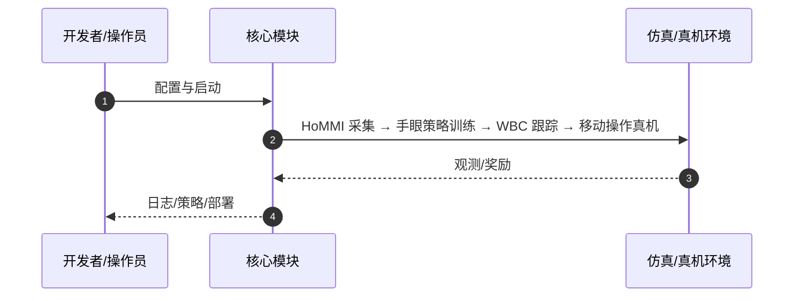

# HoMMI（arXiv:2603.03243）

**HoMMI**（Xiaomeng Xu, Jisang Park, Han Zhang, Eric Cousineau, Aditya Bhat, Jose Barreiros, Dian Wang, Jeannette Bohg, Shuran Song；Stanford University; Toyota Research Institute；[arXiv:2603.03243](https://arxiv.org/abs/2603.03243)，[项目页](https://hommi-robot.github.io/)）— 在 UMI 上加 egocentric 感知采集无机器人全身移动操作数据，用手眼跨具身策略+约束感知 WBC 弥合人机形态差。

## 一句话定义

在 UMI 上加 egocentric 感知采集无机器人全身移动操作数据，用手眼跨具身策略+约束感知 WBC 弥合人机形态差。

## 英文缩写速查

| 缩写 | 英文全称 | 简要说明 |
|------|----------|----------|
| HoMMI | Whole-Body Mobile Manipulation Interface | 本文系统 |
| UMI | Universal Manipulation Interface | 双臂手持示教前序 |
| WBC | Whole-Body Control | 全身控制器 |
| DiT | Diffusion Transformer | 策略骨干示例 |

## 为什么重要

移动操作需要全局上下文，但纯 UMI 缺主动感知；加 egocentric 后又放大人机形态差。

## 核心原理（方法）

具身无关 3D 视觉表征；放松 look-at-point 头动作；扩散 Transformer 全身控制满足机器人约束。

## 实验与评测

长时程双臂移动操作：导航、双手协调、主动凝视；无机器人 teleop 数据训练。

## 结论

HoMMI 证明「头手稀疏接口 + 显式 WBC」可规模化采集并迁移全身移动操作。

- 无机器人示范降低采集成本
- 头动作表征缓解运动学不匹配
- WBC 保证可执行全身轨迹
- 全栈开源（代码/数据/硬件）

## 源码运行时序图

官方入口见 frontmatter `code` / 项目页。运行时主干：

- **最短路径：** 克隆官方仓库 → 按 README 安装依赖 → 运行训练/采集/部署入口脚本。

## 局限与风险

WBC 与机体绑定；极端动力学仍依赖仿真或额外校准。

## 与其他工作对比

相对 [HALOMI](./paper-halomi-humanoid-loco-manipulation.md) 强调头手稀疏接口另一路线；相对 ModPack 需真机 teleop。

## 关联页面

- [paper-halomi-humanoid-loco-manipulation](./paper-halomi-humanoid-loco-manipulation.md)
- [paper-modpack](./paper-modpack.md)
- [loco-manipulation](../tasks/loco-manipulation.md)
- [REALab 14 篇技术地图](../overview/realab-14-papers-technology-map-2026.md)

## 参考来源

- [hommi_arxiv_2603_03243.md](../../sources/papers/hommi_arxiv_2603_03243.md)
- [wechat_shenlan_realab_14_papers_2026.md](../../sources/blogs/wechat_shenlan_realab_14_papers_2026.md)

## 推荐继续阅读

- 论文：<https://arxiv.org/abs/2603.03243>
- 项目页：<https://hommi-robot.github.io/>
