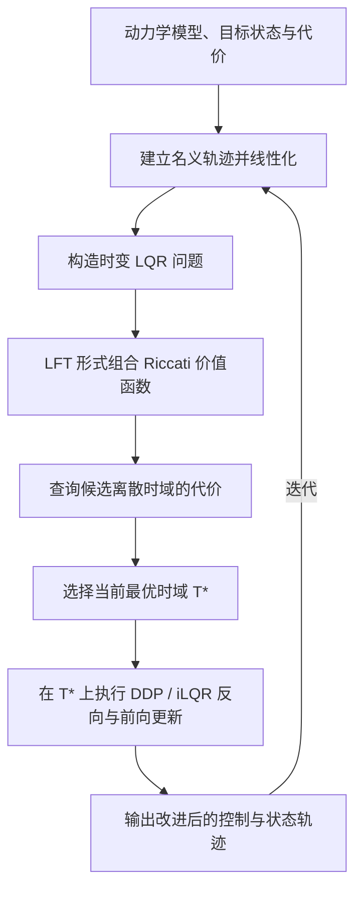
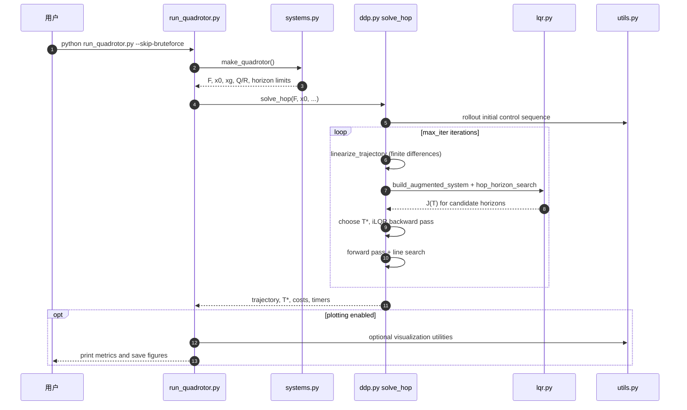

# HOP: Fast Differential Dynamic Programming for Horizon-Optimal Trajectory Planning（HOP：用于时域最优轨迹规划的快速微分动态规划）

## 一句话定义

HOP（Horizon-Optimal Planning）在求控制轨迹时也搜索规划时域：先用可复用的 Riccati/LFT 计算候选时域代价，再把这一思路扩展到非线性系统的 DDP/iLQR 迭代。

## 英文缩写速查

| 缩写 | 英文全称 | 简要说明 |
|---|---|---|
| HOP | Horizon-Optimal Planning | 将规划时域纳入最优控制搜索的方法 |
| OCP | Optimal Control Problem | 最优控制问题；动力学约束下优化状态、控制与代价 |
| LQR | Linear Quadratic Regulator | 线性系统与二次型代价下的最优反馈控制 |
| iLQR | iterative Linear Quadratic Regulator | 对非线性动力学反复线性化的轨迹优化算法 |
| DDP | Differential Dynamic Programming | 利用局部动力学和代价近似改进控制轨迹的方法 |
| LFT | Linear Fractional Transformation | 线性分式变换；用于表达并组合 Riccati 递推 |
| RSS | Robotics: Science and Systems | 机器人学会议 RSS；本文发表于 RSS XXII（2026） |

## 论文信息

| 项目 | 内容 |
|---|---|
| 会议 | Robotics: Science and Systems XXII（RSS 2026），悉尼，2026 年 7 月 |
| 作者 | Miaomiao Dai、Zhongqiang Ren |
| 机构 | 上海交通大学全球学院（Global College）；Robotics Autonomy and Planning Lab（RAP Lab） |
| DOI | [10.15607/RSS.2026.XXII.186](https://doi.org/10.15607/RSS.2026.XXII.186) |
| 论文 | [RSS 在线论文录](https://roboticsproceedings.org/rss22/p186.html) · [PDF](https://rap-lab.github.io/documents/publications/2026_RSS_HOP_MiaomiaoDai.pdf) |
| 项目页 | [HOP 项目页](https://rap-lab.github.io/research/hop) |
| 代码 | [HOP Python tutorial](https://github.com/rap-lab-org/public_HOP_horizon_optimal_tutorial)（公开可运行示例；仓库未见 LICENSE 文件） |

## 为什么重要

LQR、iLQR 和 DDP 通常以固定的离散时域 T 为输入：时域长短要先指定，再优化该时域里的动作。若任务需要尽快完成、时域又会显著影响成本，手工反复试 T 就既费计算又费调参。HOP 将“选择多少步”与“每一步怎么控制”放进同一个规划问题；在代码示例里，候选整数时域受 T_min 和 T_max 限定，阶段代价中也可包含每步 horizon penalty。

## 方法拆解

### 1. HOP-LQR：用一次递推复用候选时域计算

对线性时变动力学和二次代价，朴素方法对每个候选时域都从终点重新执行一遍 Riccati 递推，最坏时间复杂度随最大时域 N 呈 O(N²)。论文观察到，Riccati 递推可改写为线性分式变换（LFT）；反向递推时将新的价值函数表示组合起来，之后可高效查询不同候选时域的代价。官方项目页给出的 HOP-LQR 复杂度为 O(N)，与一次标准 Riccati 递推相同。

### 2. HOP-DDP：把时域选择扩展到非线性系统

对非线性动力学沿一条名义轨迹逐步线性化，会得到随时间变化的局部动力学。HOP-DDP 在此基础上引入增广状态空间，将仿射项、目标状态偏差和时域代价纳入局部问题，再交给 HOP-LQR 机制选择时域；选定的时域上继续执行 iLQR/DDP backward pass 和 forward line search，更新轨迹。官方 Python 示例用有限差分进行线性化，代码便于阅读，但不应据此推断所有论文实验都使用相同的导数实现。

## 方法流程图

## 评测与结果

| 对照/设定 | 论文或项目页报告 | 应如何理解 |
|---|---|---|
| HOP-LQR vs. brute-force horizon sweep | 测试中选择同一最优解；最高约 40× 加速 | 复杂度优化来自跨候选时域复用递推结果；40× 是测试中最高值，不是所有硬件/问题的保证 |
| HOP-DDP vs. 固定时域的 time-invariant LQR 近似 | 非线性动力学下 HOP 找到更好的解 | 固定时不变近似可能错过沿状态变化的动力学结构 |
| HOP vs. shift-horizon baseline | 运行时间相近；多数测试实例中 HOP / brute force 取得更好的局部极小值，成本最多低约 7% | 这比较的是非线性问题中的解质量；DDP 仍是局部迭代方法，不等价于一般非凸问题的全局最优保证 |

作者报告的“与暴力枚举相同”是对所测试系统与问题实例的结果；对于一般非凸非线性轨迹优化，不能把它解释成通用全局最优证明。

## 工程实践与边界

- 官方代码仓库公开了 Python tutorial：lqr.py 实现 HOP-LQR 与 brute-force sweep，ddp.py 实现有限差分线性化、iLQR backward/forward pass 和 HOP-DDP 搜索；例子是 double integrator 与 quadrotor toy systems。
- 快速运行：克隆仓库后可用 Conda 创建 hop 环境并运行 run_double_integrator.py；四旋翼例子运行 run_quadrotor.py --skip-bruteforce，跳过较慢的暴力枚举对照。
- 仓库列出 Python 3.13、NumPy、Matplotlib。顶层未发现 LICENSE 文件；代码可公开浏览/运行，但在将代码纳入商业或再分发项目之前应先核实作者的许可。
- 该 tutorial 没有真实机器人 IO、硬件接口或闭环部署入口；它适合读懂算法和复现实验玩具例，不等同于即插即用的机器人规划器。
- 时域搜索只在预设的最大整数时域范围内进行；时域上限、初始轨迹、模型误差、局部极小和运行时间都会影响实际结果。
- 40× 是作者测试中最高加速报告，不能直接视作所有机器人场景均能达到的在线速度收益。

## 源码运行时序图

四旋翼脚本运行的是 HOP-DDP 示例；run_double_integrator.py 另给出较直接的 HOP-LQR 与 brute-force 结果对照。代码只有 toy dynamics 与离线求解/绘图，没有真实机器人控制时序。

## 与相关方法对比

| 方法 | 时域 | 主要优势 | 主要区别 |
|---|---|---|---|
| 固定时域 LQR / iLQR / DDP | 由调用方预先指定 | 对固定时长任务直接优化控制 | 不解决“选多少步”的外层搜索 |
| Brute-force horizon sweep | 枚举每个候选 T 并重算 | 简单、可作基准 | 朴素计算最坏为 O(N²) |
| Shift-horizon baseline | 挪动时域并复用部分价值函数 | 计算便宜 | 既有方法适用范围受时不变 LQR 条件限制；非线性问题可能陷入较差局部解 |
| HOP-LQR / HOP-DDP | 联合选择候选时域和控制轨迹 | 复用递推结果，并扩展到时变/非线性局部模型 | 依赖模型、代价、候选时域范围和局部优化质量 |

## 结论

**总判：HOP 的核心价值不是“把 DDP 本身变快一点”，而是让“规划多少步”也成为优化变量，并用 Riccati/LFT 的结构复用降低 horizon sweep 的代价；结果扎实但仍主要是模型驱动的局部优化与 toy-system 代码验证。**

1. 若任务时长对代价敏感，可把 HOP 与固定时域 iLQR/DDP 对照，报告同一动力学、代价、初始化和候选时域范围。
2. 读“最高 40×”时同时看 brute-force 搜索的定义和例子规模；部署评估应重新测自己的维度、上限 N 与算力。
3. 对非线性问题保留多初始轨迹或其他全局搜索方案；DDP/iLQR 的局部更新不提供通用全局最优保证。
4. 使用公开 tutorial 时从 double integrator 跑起，再看 quadrotor；先核查 NumPy/Python 版本，并注意 Quadrotor brute-force 示例更慢。
5. 商用或再发布代码前先解决许可问题：公开 GitHub 仓库当前未见 LICENSE 文件。

## 关联页面

- [Trajectory Optimization（轨迹优化）](../methods/trajectory-optimization.md)
- [LQR / iLQR 算法详解](../methods/lqr-ilqr.md)
- [Optimal Control (OCP)](../concepts/optimal-control.md)
- [LQR 形式化](../formalizations/lqr.md)

## 参考来源

- [RSS 2026 论文归档](../../sources/papers/hop_2026_rss_186.md)
- [RAP Lab 官方项目页归档](../../sources/sites/hop.md)
- [官方 Python 仓库归档](../../sources/repos/hop_horizon_optimal_tutorial.md)

## 推荐继续阅读

- [RSS XXII 在线论文录：HOP](https://roboticsproceedings.org/rss22/p186.html)
- [RAP Lab 项目页](https://rap-lab.github.io/research/hop)
- [官方 HOP Python tutorial](https://github.com/rap-lab-org/public_HOP_horizon_optimal_tutorial)
