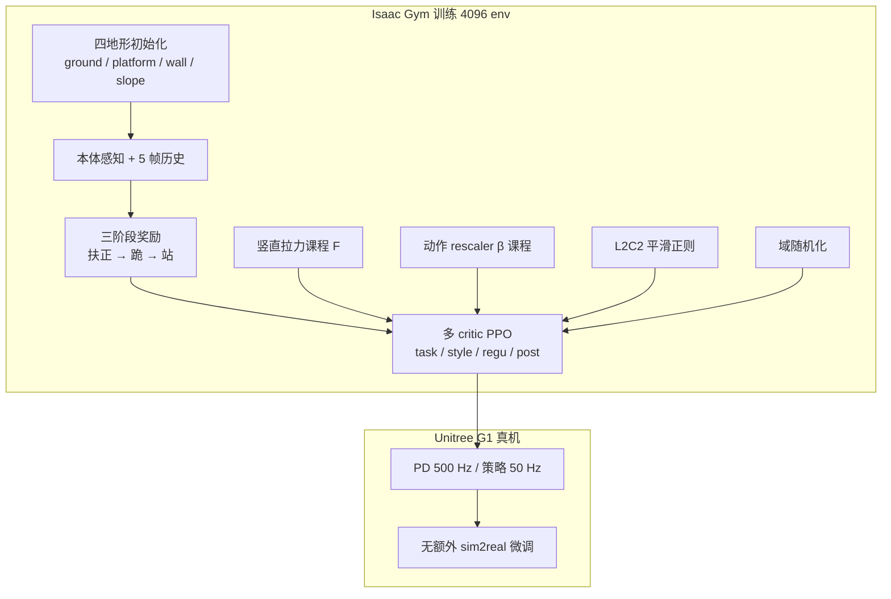

# HoST：跨多样姿态的人形起身控制

**HoST（Humanoid Standing-up Control）** 是上海 AI Lab 等团队提出的强化学习框架（arXiv:2502.08378，**RSS 2025 Best Systems Paper Finalist**）：在 **Unitree G1** 上**不依赖预定义起身轨迹或 MoCap 参考**，从 Isaac Gym 仿真**端到端学习**起身策略，并**直接部署**到实验室与户外真机（沙发、斜坡、俯仰卧等）。官方实现：[InternRobotics/HoST](https://github.com/InternRobotics/HoST)。

## 英文缩写速查

| 缩写 | 英文全称 | 简要说明 |
|------|----------|----------|
| Sim2Real | Simulation to Real | 把仿真中学到的策略迁移落地真机的工程主线 |
| PPO | Proximal Policy Optimization | 人形/足式 locomotion 中最常用的 on-policy 策略梯度算法 |
| G1 | Unitree G1 Humanoid | 宇树入门级教育科研人形平台 |
| AI | Artificial Intelligence | 人工智能 |
| MoCap | Motion Capture | 动作捕捉，参考动作与演示数据的主要来源 |
| Isaac Gym | NVIDIA Isaac Gym | GPU 并行刚体仿真训练环境 |
| RL | Reinforcement Learning | 通过与环境交互最大化长期回报来学习策略的范式 |
| DoF | Degrees of Freedom | 自由度，人形通常 20–50+ 关节 |
| AMP | Adversarial Motion Prior | 用对抗判别约束状态转移接近专家运动分布的先验 |
| IMU | Inertial Measurement Unit | 惯性测量单元，提供加速度与角速度 |
| PD | Proportional–Derivative | 关节位置/阻抗底层控制，策略输出常为其 setpoint |
| CoM | Center of Mass | 质心，平衡与 locomotion 规划的核心状态量 |
| DR | Domain Randomization | 训练时随机化仿真参数以提升跨域鲁棒迁移 |
| Locomotion | Robot Locomotion | 足式/人形等无轮移动能力的总称 |

## 为什么重要

- **补齐 loco-manip 前置能力：** 多数行走/操作栈默认机器人已站立；HoST 把「躺/坐/跪 → 站」做成可学习的**全身协同技能**，与跌倒恢复、人机交互场景（从沙发起身）直接相关。
- **超「地面俯卧起身」：** 仿真用 **ground / platform / wall / slope** 四地形构造非平凡初始姿态，真机覆盖室内外与侧躺/俯卧，区别于仅地面参考轨迹的 RL 起身工作（论文 Table I）。
- **系统向真机约束：** 除域随机化外，用 **动作 rescaler 课程** 与 **L2C2 平滑正则** 抑制高 DoF 人形常见的暴力冲撞与振荡——与「仿真能站、真机发抖」的痛点对齐。
- **与 SD-AMP 互补：** [SD-AMP](./paper-unified-walk-run-recovery-sdamp.md) 用 **AMP 先验 + 重力门控** 统一走/跑/起身；HoST **无对抗运动先验**，专注**纯起身**与**多地形初始姿态**，可作 recovery 子技能或未来与 locomotion 策略拼接的参考。

## 流程总览

## 核心机制（归纳）

### 1）多阶段任务 + 多 critic 奖励

- 起身拆为 **扶正 → 跪姿（基座高度阈值）→ 站起**；各阶段激活不同奖励项。
- 奖励分 **task / style / regu / post（站稳后保持）** 四组；**每组独立 critic** 估计 return，advantage 加权聚合后进 PPO。消融显示 **去掉多 critic 四地形成功率均为 0%**。

### 2）竖直拉力探索课程

- 训练早期对基座施加向上辅助力（躯干近竖直后生效），幅度随「episode 末达到目标高度」能力**逐步减小**，降低「高 DoF + 宽关节限位」下纯随机探索的失败率。

### 3）动作界与平滑（真机向）

- **Rescaler $\beta$：** 缩放策略输出，隐式限制力矩与运动速度；$\beta$ 随训练收紧，避免过早锁死探索。
- **L2C2：** 对 actor/critic 在相邻状态间加平滑正则，减轻振荡。

### 4）观测、动作与 sim2real

- **观测：** IMU 角速度、roll/pitch、关节位/速、上步动作、当前 $\beta$；叠加 **5 帧历史** 以增强接触丰富阶段的隐式接触感知。
- **动作：** 关节位置增量 → PD 力矩（仿真 200 Hz，真机 500 Hz）；策略 **50 Hz**。
- **域随机化：** 躯干/连杆质量、CoM 偏移、摩擦与恢复系数、PD 增益、力矩 RFI、控制延迟、初始关节扰动等（详见论文 Table II）。

## 常见误区

1. **HoST = SD-AMP 的重复：** SD-AMP 解决 **locomotion + recovery 的统一 AMP 先验**；HoST **不用 MoCap 判别器**，主攻**多样初始姿态的起身**与**系统级运动约束**，二者问题设定与先验假设不同。
2. **「直接部署」= 无 sim2real 技术：** 论文指**无额外真机 RL 微调**；仍依赖 **地形多样化 + 域随机化 + 运动约束**，不是裸策略迁移。
3. **四地形 = 四独立策略：** 默认按地形分别训练任务（`g1_ground` 等）；README TODO 仍列 **全地形联合训练** 为未完成项——复现时注意 checkpoint 与地形匹配。

## 实验与工程入口

| 维度 | 要点 |
|------|------|
| 仿真指标 | 成功率 $E_{\mathrm{succ}}$、脚移动 $E_{\mathrm{feet}}$、平滑 $E_{\mathrm{smth}}$、能耗 $E_{\mathrm{engy}}$ |
| 真机 | 室内外多场景；抗推、绊脚、重载荷；项目页与论文 Fig.1 |
| 代码 | `legged_gym/scripts/train.py|play.py|eval/`；[仓库 README](https://github.com/InternRobotics/HoST) |
| 扩展平台 | H1、Mini Pi、DroidUp（部分代码陆续发布） |

## 与其他工作对比

| 维度 | HoST | [SD-AMP](./paper-unified-walk-run-recovery-sdamp.md) | 轨迹跟踪 + RL（如 DeepMimic 系） |
|------|------|------------------------------------------------------|----------------------------------|
| 运动先验 | 无（纯奖励 + 多 critic） | 双 AMP 判别器 + 重力门控 | 预定义参考轨迹 |
| 任务范围 | **起身**（多初始姿态） | 走 / 跑 / 起身 **统一** | 多为地面特定姿态 |
| 真机约束 | rescaler + L2C2 显式建模 | 标准 DR + 任务奖励 | 常需额外 sim2real 技巧 |
| 典型硬件 | G1（23-DoF） | G1（29-DoF 动作维） | 视论文而定 |

论文 Table I 强调 HoST 在 **真机、无先验轨迹、超地面姿态、高 DoF、单阶段训练** 五维同时满足；与「仅仿真」或「仅地面参考」路线的差异见 [arXiv 正文](https://arxiv.org/abs/2502.08378)。

## 参考来源

- [Learning Humanoid Standing-up Control across Diverse Postures（arXiv:2502.08378）](../../sources/papers/host_humanoid_standingup_arxiv_2502_08378.md)
- [HoST 项目页](../../sources/sites/host-humanoid-standingup-project.md)
- [InternRobotics/HoST 代码仓库](../../sources/repos/host_internrobotics.md)

## 关联页面

- [Balance Recovery](../tasks/balance-recovery.md)、[Locomotion](../tasks/locomotion.md)、[Sim2Real](../concepts/sim2real.md)
- [Unitree G1](./unitree-g1.md)、[SD-AMP 统一走跑起身](./paper-unified-walk-run-recovery-sdamp.md)
- [Reinforcement Learning](../methods/reinforcement-learning.md)

## 推荐继续阅读

- [arXiv:2502.08378](https://arxiv.org/abs/2502.08378) — 完整方法与评测协议
- [项目页演示](https://taohuang13.github.io/humanoid-standingup.github.io/) — 真机场景视频
- [SD-AMP（arXiv:2605.18611）](https://arxiv.org/abs/2605.18611) — 统一走/跑/起身的 AMP 路线对照
