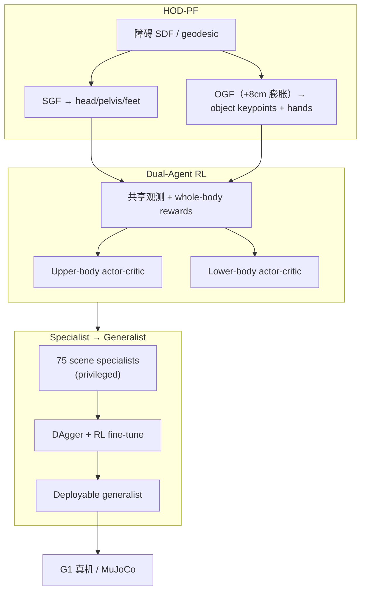

# HOTICE（arXiv:2609.25363）

**HOTICE**（*Whole-Body Humanoid Object Transportation in Cluttered Environments*，[arXiv:2609.25363](https://arxiv.org/abs/2609.25363)，[项目页](https://hotice2027.github.io)）由 **南加州大学（USC）** Physical Superintelligence Lab 提出：在 **侧向 /  overhead / 地面** 三类 clutter 同时约束 **人形与载荷** 时，用 **Humanoid-Object Decoupled Potential Fields（HOD-PF）**、**dual-agent RL** 与 **specialist→generalist 蒸馏**，在 **Unitree G1** 上实现 collision-aware **物体搬运**。

## 一句话定义

用解耦的标准势场（SGF）与物体中心势场（OGF） jointly 塑形全身 RL，把 cluttered 场景下的 box transport 从「空载穿越」扩展到「载荷扩展碰撞体 + 负载扰动」。

## 英文缩写速查

| 缩写 | 英文全称 | 简要说明 |
|------|----------|----------|
| HOD-PF | Humanoid-Object Decoupled Potential Fields | 人形 SGF + 物体 OGF 双势场 |
| SGF | Standard Guidance Field | 头/骨盆/脚的标准 APF 引导 |
| OGF | Object-Centric Guidance Field | 物体 keypoints + 双手的膨胀障碍引导 |
| RL | Reinforcement Learning | PPO 训练 dual-agent 策略 |
| mDist | Mean Distance to Goal | 失败 trial 到目标的平均距离 |
| SLAM | Simultaneous Localization and Mapping | 真机场景重建（FAST-LIO2） |

## 为什么重要

- **填补 payload gap：** HumanoidPF（Xue et al., RA-L 2026，空载 cluttered 穿越）/ [TANGO](./paper-tango-vla.md) 等多假设 **空载** 或轻约束；HOTICE 显式建模 **物体几何 + 质量** 对穿越的影响。
- **全身 + clutter：** 需同时 duck under、侧向 squeeze、step over，且 **双手持箱** — 动作空间与稳定性难度高于纯 locomotion。
- **可部署 generalist：** 75 teacher → 单 student，未见 50 场景 avg SR **80.1%**，真机三类障碍 **6/6、5/6、5/6**。

## 核心信息

| 字段 | 内容 |
|------|------|
| 机构 | 南加州大学（USC） |
| 平台 | MuJoCo 仿真 + **Unitree G1** 真机 |
| 物体 | 默认 cuboid box；泛化 cylinder / sphere（8 keypoints 布局不变） |
| 感知（真机） | SLAM 重建静态场景 + AprilTag 估计 box pose（50 Hz） |
| 开源 | **待发布** — 项目页 Anonymous，无官方代码链（2026-09-24） |

## 流程总览

## 核心原理

- **SGF：** 沿 HumanoidPF 路线，在 head/pelvis/feet 查询 attractive + repulsive 梯度，奖励速度对齐引导向量。
- **OGF：** 对 **膨胀障碍** 查询物体角点/ rim keypoints 与 **双手**；奖励扣除 locomotion 分量后的 **残差对齐**，避免与行走命令抢 credit。
- **Dual-agent：** 上下身分 actor-critic，各自 body-specific reward，共享状态与 whole-body 项 — ablation 显示 dual + HOD-PF 缺一不可（仿真 88.5% vs single+SGF 58.7%）。
- **Distillation：** procedural + 3D-FRONT  realistic 场景训练 teacher；student 在未见 clutter 上仍保持 ~80% SR 量级。

## 源码运行时序图

**不适用（待发布）** — 截至 2026-09-24 无官方仓库；公开后应对齐 MuJoCo 训练链与 G1 部署（SLAM → HOD-PF 查询 → 50 Hz policy → pickup+transport pipeline）。

## 工程实践

| 检查项 | 建议 |
|--------|------|
| 任务假设 | 运输段默认 **已持物**；完整 pipeline 需另训 **pickup policy**（论文已做） |
| 真机感知 | 当前依赖 **预重建 SLAM + AprilTag**；G1 单 LiDAR 被箱体遮挡 — 论文归因硬件而非方法上限 |
| 形状迁移 | cylinder/sphere 仅改 keypoint 采样与少量 hand/upright reward — 架构/action 空间不变 |
| 失败模式 | 大扰动碰撞后 **无 recovery 建模**；动态障碍、肩扛/贴髋等复杂 manipulation 未覆盖 |
| 开源跟进 | 盯 [hotice2027.github.io](https://hotice2027.github.io) 与 USC 实验室发布 |

## 实验与评测

**仿真（20 场景，20k trials）：**

| 配置 | SR | mDist |
|------|-----|-------|
| Dual-Agent & HOD-PF | **88.5%** | **0.130 m** |
| Dual-Agent & SGF only | 77.1% | 0.195 m |
| Single-Agent & HOD-PF | 65.7% | 0.267 m |

**真机（每类 6 trials）：** Dual-Agent & HOD-PF — Side **6/6**，Overhead **5/6**，Ground **5/6**。

## 与其他工作对比

| 对照 | 差异读法 |
|------|----------|
| HumanoidPF [21] | 空载 cluttered **穿越**；HOTICE 扩展 **HOD-PF** 与 **whole-body 持物** |
| [TANGO](./paper-tango-vla.md) | 语言驱动 **空载** 全身 VLA 导航；HOTICE 是 **RL + 势场**，任务为 **持物运输** |
| Box loco-manip sim2real [25,26] | 多 **开阔/轻障碍** 场景；HOTICE 强调 **三向 clutter 同时约束** |
| 固定基座 / 轮式搬运 | 工作空间或地形受限；人形可 step/duck/squeeze，但 **动作空间更大** |

## 结论

**HOTICE 把 cluttered 物体搬运拆成「双势场引导 + 双智能体 RL + 多场景蒸馏」，在 G1 上给出强 sim2real 证据；复现需等代码，选型可先按 HOD-PF / dual-agent 读 ablation。**

1. **HOD-PF 是主增益** — OGF 相对 SGF-only 在真机 ground 障碍上差距最大（5/6 vs 1/6 single+SGF）。
2. **Dual-agent 解大动作空间** — 仿真 +17.7 pp（vs single + HOD-PF）说明上下身分训必要。
3. **Generalist 可部署** — 75→1 蒸馏在未见场景仍 ~80% SR，不是 per-scene 特权策略。
4. **感知工程边界** — SLAM+Tag 可行但非 end-to-end；LiDAR 遮挡是 G1 硬件 caveat。
5. **开源待发布** — 项目页 anonymous，勿当已可复现。

## 关联页面

- [Loco-Manipulation](../tasks/loco-manipulation.md)
- [Whole-Body Control](../concepts/whole-body-control.md)
- [Sim2Real](../concepts/sim2real.md)
- [TANGO](./paper-tango-vla.md)

## 推荐继续阅读

- [HOTICE 项目页](https://hotice2027.github.io)
- [arXiv:2609.25363](https://arxiv.org/abs/2609.25363)

## 参考来源

- [HOTICE 论文归档](../../sources/papers/hotice_arxiv_2609_25363.md)
- [HOTICE 项目页归档](../../sources/sites/hotice2027-github-io.md)
