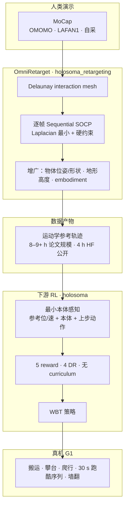

# OmniRetarget

**OmniRetarget**（*OmniRetarget: Interaction-Preserving Data Generation for Humanoid Whole-Body Loco-Manipulation and Scene Interaction*，ICRA 2026，arXiv:[2509.26633](https://arxiv.org/abs/2509.26633)，[项目页](https://omniretarget.github.io/)）是 Amazon FAR 团队的**交互保留人形运动重定向与数据生成**引擎：用 **interaction mesh** 显式建模人/机器人与物体、地形之间的空间关系，在**硬运动学约束**下最小化 Laplacian 形变能，生成可下游 RL 跟踪的高质量参考，并能把**单条人类演示**增广到多种 embodiment、地形与物体配置。代码与训练管线以 **[holosoma](./holosoma.md)** 开源；公开重定向轨迹见 **[OmniRetarget 数据集](./omniretarget-dataset.md)**。

本页在 [42 篇 humanoid RL 身体系统栈](../overview/humanoid-rl-motion-control-body-system-stack.md) 中编号 **03/42**（**01 数据 · 重定向 · 遥操作**）。下游应用示例：[Perceptive Humanoid Parkour（PHP）](./paper-hrl-stack-22-perceptive_humanoid_parkour.md) 用其构建跑酷**原子技能库**。

## 英文缩写速查

| 缩写 | 英文全称 | 简要说明 |
|------|----------|----------|
| SOCP | Second-Order Cone Program | 二阶锥规划；OmniRetarget 逐帧序列求解器 |
| SDF | Signed Distance Function | 有符号距离场；用于硬非穿透约束 |
| WBT | Whole-Body Tracking | 全身参考轨迹跟踪类 RL 任务 |
| RL | Reinforcement Learning | 通过与环境交互最大化长期回报来学习策略的范式 |
| GMR | General Motion Retargeting | 把人体/视频动作重定向为机器人可执行参考 |
| DR | Domain Randomization | 训练时随机化仿真参数以提升跨域鲁棒迁移 |
| G1 | Unitree G1 Humanoid | 宇树入门级教育科研人形平台 |
| MoCap | Motion Capture | 动作捕捉，参考动作与演示数据的主要来源 |

## 为什么重要

- 在 [运动小脑 64 篇技术地图](../overview/humanoid-motion-cerebellum-technology-map.md) 中归类为 **C 数据入口**（20/64）：重定向：交互关系保持的数据生成。
- **关键词是 interaction-preserving：** 不仅匹配关键点，而是保留 agent–object–terrain 的相对几何与接触关系，缓解传统 PHC/GMR 的穿透、脚滑与「场景盲」。
- **硬约束 + 可增广：** Sequential SOCP 每帧求解；固定源 mesh、变化目标场景即可批量生成新轨迹——论文报告 **8+ 小时**、项目页 **9+ 小时** 重定向，kinematic 指标优于 PHC/GMR/VideoMimic。
- **极简下游 RL：** 与 BeyondMimic 叙事一致，**5 项 reward + 4 项 DR**、**无 curriculum** 即可在 G1 上零样本实机长时程 parkour / loco-manipulation（最长约 **30 s**）。
- **工程闭环：** [holosoma](./holosoma.md) 统一重定向、WBT 训练与 sim-to-real；HF 数据集提供 **4.0 h** 可直接加载的 G1 轨迹。

## 方法

| 模块 | 作用 |
|------|------|
| Interaction mesh | 关键关节 + 物体/环境采样点 **Delaunay 四面体**；最小化源/目标 **Laplacian 坐标差** |
| 硬约束 | SDF **非穿透**、关节/速度界、stance 脚 **位置固定**（源 xy 速度 <1 cm/s） |
| 求解 | **Sequential SOCP**；Drake 处理四元数浮动基在 $\mathbb{S}^3$ 上的导数 |
| 增广 | 物体位姿/形状、地形高度；物体**局部系**建 mesh；下身锚定 nominal 防刚体漂移 |
| Embodiment | G1 / H1 / Booster T1 — 仅改关键点对应与碰撞模型 |
| 下游 RL | DeepMimic 式 body/object tracking + action rate + 软限位 + 自碰；BeyondMimic 超参开箱即用 |

### 流程总览

## 下游 RL 配方（论文 §IV）

**观测：** 参考关节位/速、骨盆位姿误差；本体骨盆线/角速度、关节位/速；上一步动作（敏捷动作可 mask 骨盆线位置/速度）。

**5 项 reward：** body tracking（DeepMimic 位姿/速度）、object tracking（适用时）、action rate、soft joint limit、self-collision（接触力 >1 N 二值惩罚）。

**4 项机器人 DR：** 躯干 COM 扰动、关节默认位、随机推、观测噪声；物体侧随机化质量/COM/惯量/形状。

## 实验与评测

- **数据规模：** OMOMO、LAFAN1、自采 MoCap → 论文 **8+ h**；HF 公开 **4.0 h**（OMOMO + 自采；LAFAN1 需自行重定向）。
- **Kinematic（Table II · OMOMO 物体）：** 相对 PHC/GMR，**穿透时长/深度、脚滑、接触保留**与下游 **RL 成功率**更优（PHC 成功率约 71%，GMR 约 51%）。
- **增广：** 全增广集评估成功率 **79.1%** vs nominal **82.2%**；纯 DR 扰动物体效果差于 kinematic 增广。
- **旗舰真机：** 4.6 kg 椅子搬运 → 0.9 m 攀台 → 跳下翻滚（**30 s**）；墙翻峰值角速度 **15 rad/s**。

## 与其他工作对比

| 方法 | 硬约束 | 物体/地形交互 | 数据增广 | 开源 |
|------|--------|---------------|----------|------|
| PHC / GMR | 弱/无 | 通常无 | 无 | 部分 |
| VideoMimic | 软惩罚 | 地形为主 | 无 | 部分 |
| IMMA | 有 | 无环境/物体 | 无 | 否 |
| **OmniRetarget** | 有 | 有 | 有 | **holosoma + HF 数据** |

## 核心信息

| 字段 | 内容 |
|------|------|
| 编号 | 03/42 |
| 系统栈层 | 01 数据 · 重定向 · 遥操作 |
| 会议 | ICRA 2026 |
| 机构 | Amazon FAR；MIT；UC Berkeley；Stanford；CMU |
| 链接 | [项目页](https://omniretarget.github.io/) · [arXiv](https://arxiv.org/abs/2509.26633) · [代码](https://github.com/amazon-far/holosoma) · [数据集](https://huggingface.co/datasets/omniretarget/OmniRetarget_Dataset) |

## 与其他页面的关系

- 代码/部署：[holosoma](./holosoma.md)
- 公开轨迹：[OmniRetarget 数据集](./omniretarget-dataset.md)
- 下游跑酷：[PHP（2602.15827）](./paper-hrl-stack-22-perceptive_humanoid_parkour.md)
- Dynamic refinement：[DynaRetarget / SBTO](../methods/dynaretarget-sbto-motion-retargeting.md) 以本库 kinematic 参考为 SBTO 输入（285 motions · refinement **76.8%**）
- 问题域：[Motion Retargeting](../concepts/motion-retargeting.md)、[GMR](../methods/motion-retargeting-gmr.md)、[Loco-Manipulation](../tasks/loco-manipulation.md)
- 总框架：[humanoid-rl-motion-control-body-system-stack.md](../overview/humanoid-rl-motion-control-body-system-stack.md)

## 参考来源

- [omniretarget_arxiv_2509_26633.md](../../sources/papers/omniretarget_arxiv_2509_26633.md) — 论文全文消化（主归档）
- [omniretarget-github-io.md](../../sources/sites/omniretarget-github-io.md) — 项目页与交互演示
- [holosoma.md](../../sources/repos/holosoma.md) — 开源代码框架
- [omniretarget-dataset-huggingface.md](../../sources/sites/omniretarget-dataset-huggingface.md) — HuggingFace 数据集
- [humanoid_rl_stack_03_omniretarget_interaction_preserving_data_generat.md](../../sources/papers/humanoid_rl_stack_03_omniretarget_interaction_preserving_data_generat.md) — 42 篇栈策展摘录

## 推荐继续阅读

- arXiv：<https://arxiv.org/abs/2509.26633>
- 项目页：<https://omniretarget.github.io/>
- 代码：<https://github.com/amazon-far/holosoma>
- 数据集：<https://huggingface.co/datasets/omniretarget/OmniRetarget_Dataset>
