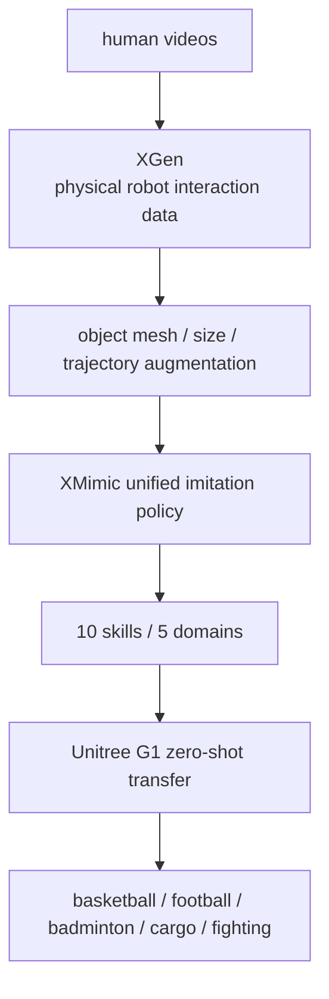

# HumanX

**HumanX**（*Toward Agile and Generalizable Humanoid Interaction Skills from Human Videos*）是一条从人类视频到人形交互技能的全栈管线：XGen 负责把视频转换成物理合理、可增强的机器人交互数据；XMimic 负责学习可泛化交互策略。

## 一句话定义

HumanX 用 XGen + XMimic 将人类运动视频编译成 Unitree G1 可执行的敏捷交互技能，覆盖球类、搬货和反应格斗等接触任务。

## 英文缩写速查

| 缩写 | 英文全称 | 简要说明 |
|------|----------|----------|
| XGen | HumanX Data Generation | 从视频合成机器人交互数据并增强对象 mesh/尺寸/轨迹 |
| XMimic | HumanX Imitation Framework | 学习泛化交互技能的统一 imitation 框架 |
| HOI | Human-Object Interaction | 视频中的人-物交互 |
| G1 | Unitree G1 Humanoid | 论文真机迁移平台 |
| MoCap | Motion Capture | 部分 autonomous interaction 演示使用外部 sensing |
| IL | Imitation Learning | XMimic 的主要学习范式 |

## 为什么重要

- **把人类视频当接触数据入口**：真实机器人交互数据贵，人类视频多；HumanX 试图把视频中的敏捷交互转换为机器人训练数据。
- **关注 agile interaction**：篮球、足球、羽毛球、搬货、反应格斗比普通 pick-and-place 更考验全身动态和物体时序。
- **少示范强泛化**：项目页摘要称 sustained human-robot passing 超 **10 consecutive cycles** 可由单个视频示范学习。
- **迁移到真机**：10 个技能 zero-shot transfer 到 physical Unitree G1。

## 流程总览

## 核心原理（详细）

HumanX 的重点不是“机器人会打球”本身，而是数据生产：视频中的人体动作和机器人形态不一致，物体状态也不完整。XGen 需要恢复/合成物理合理的机器人-物体交互数据，并通过物体 mesh、尺寸、轨迹增强扩大分布；XMimic 则学习统一策略，使同一技能能在对象状态变化下泛化。

与 OmniRetarget 相比，OmniRetarget 更像 interaction-preserving retargeting engine；HumanX 更像从视频到技能的完整数据+策略闭环。与 SUGAR 相比，HumanX 更强调敏捷交互和球类/反应任务。

## 关键实验数字

| 项 | 数字/结论 |
|----|-----------|
| 任务域 | basketball、football、badminton、cargo pickup、reactive fighting，共 **5** 类 |
| 技能数 | **10** different skills |
| 真机 | zero-shot transfer to physical Unitree G1 |
| Passing | human-robot passing over **10 consecutive cycles** |
| 泛化 | over **8×** higher generalization success than prior methods |

## 源码运行时序图

**不适用**：项目页 HTML 的 Code 按钮指向 `https://github.com/wyhuai/humanx`，本次核查返回 404；另有 `wyhuai/human-x` 仓库但根目录仅 `index.html/resources/static`，是项目页资源仓，不是可运行代码。故截至 2026-07-22 不视为官方 runnable code。

## 工程实践（含开源状态）

| 项 | 结论 |
|----|------|
| 项目页 | <https://wyhuai.github.io/human-x/> |
| 代码 | 项目页 Code 链接不可用；未确认可运行实现 |
| 数据 | 项目页列出 Datasets 按钮，需后续核查开放范围 |
| 平台 | Unitree G1 |
| 任务 | 球类敏捷技能、搬货、反应格斗 |

## 与其他工作对比

HumanX 在项目页和核心原理里主要与两条同样「从人类视频出发」的路线对照：把重定向做成数据引擎的 OmniRetarget，以及走视频→真机 loco-manip 数据闭环的 SUGAR。下表为定性对照，不含跨论文可比的统一指标。

| 维度 | HumanX | OmniRetarget | SUGAR |
|------|--------|--------------|-------|
| 定位 | 视频→交互技能的数据 + 策略闭环（XGen 生数据、XMimic 学策略） | interaction-preserving 重定向 / 数据生成引擎 | 人类视频→真机 loco-manip 的数据闭环框架 |
| 核心机制 | 物体 mesh/尺寸/轨迹增强 + 统一 imitation 策略 | interaction mesh + 硬运动学约束下的形变能最小化 | 视频抽取先验 → 特权 RL 精修 → 策略蒸馏 |
| 任务侧重 | agile 交互：篮球、足球、羽毛球、搬货、反应格斗 | 生成可下游跟踪的高质量参考轨迹 | 通用移动操作技能 |
| 是否含策略 | 是，直接产出可执行交互策略 | 否，重定向数据供下游 RL 使用 | 是，蒸馏出无需参考输入的自主策略 |
| 真机 | 10 技能 zero-shot 迁移 Unitree G1 | 取决于下游训练 | 面向真机部署 |
| 相对定位 | 论文报告泛化成功率超 prior methods **8×** | 更偏上游数据/重定向 | 更偏规模化先验与不完美视频修正 |

## 局限与风险

- **视频到物理状态仍难**：球类/格斗中物体速度、接触力和遮挡比静态物体更难恢复。
- **部分演示依赖 MoCap sensing**：无外部感知版本需单独看成功范围。
- **代码链接失效**：当前不能验证 XGen/XMimic 实现。
- **安全风险高**：格斗/高速球类任务在真机上需要严格安全控制。

## 关联页面

- [Loco-Manip 接触分类 01：接触数据](../overview/loco-manip-contact-category-01-contact-data.md)
- [人形 RL 身体系统栈](../overview/humanoid-rl-motion-control-body-system-stack.md)
- [运动小脑 · 数据管线](../overview/motion-cerebellum-category-03-data-pipeline.md)
- [SUGAR](./paper-loco-manip-161-076-sugar.md)
- [OmniRetarget](./paper-hrl-stack-03-omniretarget.md)
- [Imitation Learning](../methods/imitation-learning.md)

## 参考来源

- [humanoid_rl_stack_05_humanx_toward_agile_and_generalizable_humanoid_i.md](../../sources/papers/humanoid_rl_stack_05_humanx_toward_agile_and_generalizable_humanoid_i.md)
- [humanoid_rl_stack_42_catalog.md](../../sources/papers/humanoid_rl_stack_42_catalog.md)
- [wechat_embodied_ai_lab_humanoid_rl_motion_survey.md](../../sources/blogs/wechat_embodied_ai_lab_humanoid_rl_motion_survey.md)
- [loco-manip-contact-category-01-contact-data](../overview/loco-manip-contact-category-01-contact-data.md)
- [wechat_embodied_ai_lab_loco_manip_contact_survey.md](../../sources/blogs/wechat_embodied_ai_lab_loco_manip_contact_survey.md)
- Chen/Wang et al., *HumanX: Toward Agile and Generalizable Humanoid Interaction Skills from Human Videos*, arXiv:2602.02473, 2026. <https://arxiv.org/abs/2602.02473>

## 推荐继续阅读

- [HumanX 项目页](https://wyhuai.github.io/human-x/)
- [机器人论文阅读笔记：HumanX](https://imchong.github.io/Humanoid_Robot_Learning_Paper_Notebooks/papers/04_Loco-Manipulation_and_WBC/HumanX__Toward_Agile_and_Generalizable_Humanoid_Interaction_Skills_from_Human_Vi/HumanX__Toward_Agile_and_Generalizable_Humanoid_Interaction_Skills_from_Human_Vi.html)
- [OmniRetarget](./paper-hrl-stack-03-omniretarget.md)
