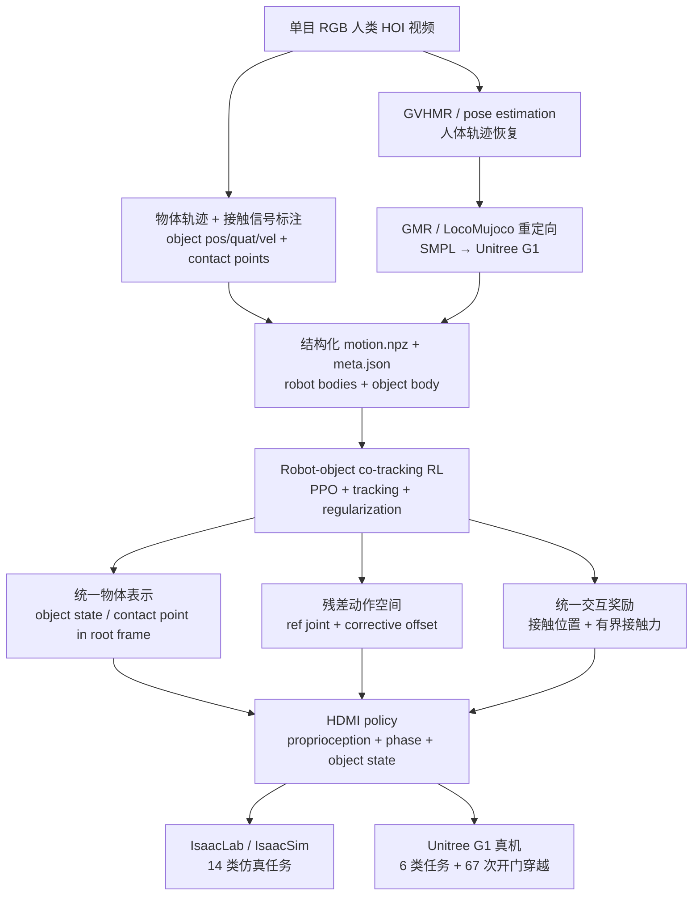
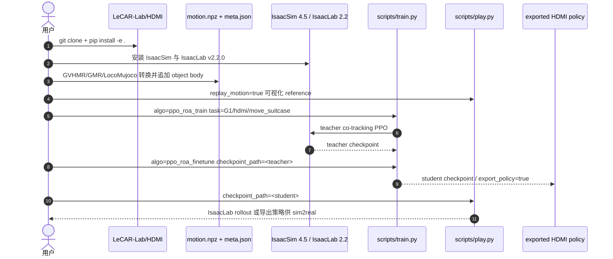

# HDMI

**HDMI**（*HDMI: Learning Interactive Humanoid Whole-Body Control from Human Videos*，arXiv:[2509.16757](https://arxiv.org/abs/2509.16757)，[项目页](https://hdmi-humanoid.github.io)，[代码](https://github.com/LeCAR-Lab/HDMI)）是 CMU / LeCAR 团队提出的 **单目人类视频到人形 HOI 控制** 框架：把 unconstrained RGB 视频恢复为 **机器人 + 物体 + 接触点** 的结构化参考，再用 **robot-object co-tracking** 强化学习训练 Unitree G1 全身交互策略。

## 一句话定义

HDMI 把单目人类 HOI 视频转成带物体状态和接触点的 G1 参考轨迹，并用统一 co-tracking RL 策略同时追踪机器人身体与物体运动，从而零样本部署到真实人形机器人。

## 英文缩写速查

| 缩写 | 英文全称 | 简要说明 |
|------|----------|----------|
| HDMI | HumanoiD iMitation for Interaction | 从人类视频学习人形全身交互技能的框架 |
| HOI | Human-Object Interaction | 人-物交互；本文关注门、箱子、球、泡沫垫等接触任务 |
| RGB | Red-Green-Blue | 单目视频输入模态，区别于多相机 MoCap 或深度传感 |
| GVHMR | Global Video Human Mesh Recovery | 从视频估计 SMPL/人体运动的上游工具 |
| GMR | General Motion Retargeting | HDMI README 中人到 G1 重定向链路的一环 |
| RL | Reinforcement Learning | 训练 robot-object co-tracking policy 的范式 |
| PPO | Proximal Policy Optimization | 官方仓 `ppo_roa_train` / `ppo_roa_finetune` 使用的训练接口 |
| ROA | Residual Action | HDMI 代码中 residual action distillation 对应的策略实现 |
| G1 | Unitree G1 Humanoid | 论文与官方代码默认部署平台 |

## 为什么重要

- **把人类视频从「只看人体」推进到「人体 + 物体 + 接触」。** HumanX 等路线证明人体动作可从视频到机器人，HDMI 进一步把 object state 与 contact point 纳入训练观测和奖励，直接服务 contact-rich loco-manipulation。
- **不依赖任务特定奖励工程。** 论文把开门、搬箱、推箱、滚球等任务都表述为 robot-object co-tracking，用统一物体表示、残差动作空间和接触奖励替代每个任务手写 reward。
- **实机证据强。** 项目页和论文报告 Unitree G1 上 **67 次连续双向开门穿越**，并覆盖 **6 类真实任务**、**14 类仿真任务**。
- **官方代码已开放。** [LeCAR-Lab/HDMI](https://github.com/LeCAR-Lab/HDMI) 提供 IsaacSim 4.5 / IsaacLab 2.2 训练框架、`scripts/train.py`、`scripts/play.py`、`active_adaptation/envs/mdp/commands/hdmi/`、`ppo_roa.py` 与 motion data 格式说明。
- **在三张地图中都有坐标。** 它同时属于 [42 篇 humanoid RL 身体系统栈](../overview/humanoid-rl-motion-control-body-system-stack.md)、[161 篇 Loco-Manip #110](../overview/loco-manip-161-category-05-mocap-human-video.md) 与 [接触数据](../overview/loco-manip-contact-category-01-contact-data.md) 横切面。

## 流程总览

## 核心原理（详细）

### 1. 视频到结构化参考：让 object 进入 motion dataset

HDMI 的输入不是人工 MoCap，也不是高层 VLM 规划，而是第三人称 **monocular RGB** 人类示范视频。管线先用 GVHMR 恢复人体姿态，再通过 GMR / LocoMujoco 之类的重定向链路得到 G1 body / joint 轨迹；同时后处理物体位姿、速度与接触信号，形成每帧参考状态 $\{s_t^{ref}, p_t^{contact}\}$。

官方 README 对训练数据格式给出工程定义：`motion.npz` 中 `pos/quat/lin_vel/ang_vel` 为 `[T, B, 3/4]`，`pos/vel` joint state 为 `[T, J]`；物体作为额外 body 追加到 robot body state 后，`meta.json` 记录 body / joint 排列。这一设计让策略在训练时看到 **机器人参考 + 物体参考 + 接触位置**，而不是只追踪人形骨架。

### 2. Robot-object co-tracking：身体和物体同时是目标

论文把交互技能学习定义为 co-tracking：策略输入本体状态、phase variable、机器人 root frame 下的 object state / contact points，输出 G1 低层关节目标。episode 会在机器人或物体偏离参考过大时终止；PPO 奖励同时包含身体跟踪、物体跟踪、正则与接触项。

这和纯 motion tracking 的区别在于：机器人「像不像人」不是唯一目标，物体是否被按预期移动同样进入训练闭环。因此 HDMI 更适合 door traversal、box carry、push、roll 等 object-centric 技能。

### 3. 统一物体表示：用 root-frame object/contact 兼容不同物体

不同任务的物体几何和交互点不同，HDMI 不为每个物体重写策略接口，而是把物体状态和参考接触点统一变换到机器人 root frame。策略看到的是相对位姿、速度、目标 contact point 与 phase，而不是任务 ID 专用控制器。

这个表示的价值在于：同一个 PPO 框架可覆盖门、箱子、球、泡沫垫、木板等任务；接触点还给策略提供「哪里应该发生交互」的稀疏提示，缓解视频重建接触不准的问题。

### 4. 残差动作空间：围绕参考姿态探索

视频重定向得到的 kinematic trajectory 通常能提供粗姿态，但不能保证动态平衡。HDMI 不让策略从零输出绝对关节目标，而是输出加在 $\theta_t^{ref}$ 上的 residual offset。这样 exploration 以当前参考姿态为中心：例如跪地、推门、搬箱等大姿态变化不用从默认站姿慢慢学，策略主要学习如何补偿动力学、接触与平衡误差。

### 5. 统一交互奖励：接触位置 + 有界接触力

视频参考常有穿模、接触漂移或缺失力信息。HDMI 用 interaction reward 在 contact signal 激活时约束端效器靠近接触点，并鼓励足够但不过量的接触力；力项带阈值上限，避免为了追踪物体而输出危险大力。该奖励按 active end-effector 平均，使手、脚或其他接触体都能被统一处理。

### 6. 实验与评测

| 维度 | 论文 / 项目页报告 |
|------|------------------|
| 真机平台 | Unitree G1 |
| 真机长期任务 | **67** 次连续双向 door opening / traversal |
| 真机任务覆盖 | **6** 类 loco-manipulation 任务 |
| 仿真任务覆盖 | **14** 类任务：push door、carry/place bread box、push box、move foam mats、roll ball、topple 等 |
| 训练后部署 | RL policy 零样本 sim-to-real；项目页附 35 min door traversal 视频 |
| 官方代码 | IsaacSim / IsaacLab 训练、play、motion visualization、policy export；sim2real 细节指向 `EGalahad/sim2real` |

## 评测与结果

HDMI 的评测以「真机长期任务 + 任务覆盖广度」为主，量化上更偏 demonstration / index-level：论文与项目页给出任务规模与连续运行次数，但未公布逐任务成功率表，因此下列条目按项目页口径归纳，成功率类指标视为演示级证据。

- **真机长期运行**：Unitree G1 上 **67** 次连续双向 door opening / traversal，项目页附约 35 min door traversal 视频，直接展示 sim-to-real 策略的稳定性与持久性。
- **真机任务覆盖**：**6** 类真实 loco-manipulation 任务，涵盖开门、搬箱、推箱、滚球等 object-centric 接触技能。
- **仿真任务覆盖**：**14** 类任务，项目页列举 Push Door with Hand、Carry and Place Bread Box、Push Box、Move Foam Mats、Roll Ball with Hand、Topple 等，验证统一 co-tracking 框架跨物体几何的适用面。
- **部署方式**：RL policy 零样本 sim-to-real，训练后端为 IsaacSim 4.5 / IsaacLab 2.2；未见跨 baseline 的统一量化对照，评测证据主要来自真机与仿真的任务完成演示。

（更细的按维度归纳见上文「核心原理」第 6 小节表格。）

## 源码运行时序图

官方仓库 [LeCAR-Lab/HDMI](https://github.com/LeCAR-Lab/HDMI) 已开放训练代码，README 给出 IsaacSim 4.5、IsaacLab 2.2、数据准备、teacher/student 训练与评估入口。

## 工程实践（含开源状态）

| 项 | 结论 |
|----|------|
| 项目页 | <https://hdmi-humanoid.github.io> |
| arXiv | <https://arxiv.org/abs/2509.16757> |
| 官方代码 | <https://github.com/LeCAR-Lab/HDMI>，公开仓库；GitHub API 显示默认分支 `main`，2026-01-17 有更新 |
| 训练后端 | IsaacSim 4.5.0、IsaacLab v2.2.0、Python 3.10 |
| 关键目录 | `active_adaptation/envs/mdp/commands/hdmi/`、`active_adaptation/learning/ppo_roa.py`、`scripts/`、`cfg/`、`data/` |
| 数据入口 | `motion.npz` + `meta.json`；人体重定向与物体轨迹需按 README 格式准备 |
| 可运行入口 | `python scripts/train.py algo=ppo_roa_train task=G1/hdmi/move_suitcase`；`python scripts/play.py ... checkpoint_path=...` |
| Sim2Real | README 指向 <https://github.com/EGalahad/sim2real>，部署细节不在主仓完整展开 |
| 许可证 | GitHub API 未返回标准 `licenseInfo`；复用前需阅读仓库 `LICENSE` / README |

## 结论

**把单目人类 HOI 视频恢复成「机器人 + 物体 + 接触」参考，再用统一 robot-object co-tracking RL，是接触丰富 loco-manip 从「只模仿人体」迈向可真机交互的关键一步。**

1. **物体必须进闭环** — object state 与 contact point 进入观测与奖励，开门/搬箱/推滚等 object-centric 技能才站得住。
2. **统一接口替代任务手写 reward** — root-frame 物体表示 + 残差动作 + 有界接触力，同一 PPO 框架覆盖多物体几何。
3. **残差动作围绕参考探索** — 在重定向粗姿态上加 corrective offset，大姿态变化不必从默认站姿重学。
4. **真机证据偏长期演示** — G1 上 67 次连续双向开门穿越、6 类真机与 14 类仿真任务；量化对照表弱，以完成度与持久性为主。
5. **官方 IsaacLab 训练可复现** — `ppo_roa_train` / `ppo_roa_finetune` + `motion.npz`；真机部署细节在独立 sim2real 仓。
6. **仍是 reference-conditioned 单技能** — 不等于开放语言规划或在线 skill 组合；上游视频/接触标注质量决定上限。

## 与其他工作对比

HDMI 在关联页面里主要与三条 HOI 路线对照：同样从人类视频取先验但更偏人体的 HumanX，把 HDMI dense tracking 抽象为可组合接口的后续 OmniContact，以及用生成视频做零样本规划的 GenHOI。下表为定性对照，不含跨论文可比的统一指标。

| 维度 | HDMI | HumanX | OmniContact | GenHOI |
|------|------|--------|-------------|--------|
| 参考来源 | 单目 RGB 视频恢复人体 + 物体 + 接触点 | 人类视频（更偏人体动作） | 规则/几何合成 Contact Flow | 生成模型即时生成任务视频 |
| 训练粒度 | 每技能 robot-object co-tracking RL | 每技能统一 imitation 策略 | 统一 CF-Track 跟踪多 meta-skill | 免训练，视频→接触约束→轨迹优化 |
| 物体是否入闭环 | 是，object state / contact point 进观测与奖励 | 部分（物体交互增强为主） | 是，Contact Flow 显式建模四端接触时序 | 是，从视频抽接触几何 |
| 长程 / 组合 | 单技能参考执行，不做在线组合 | 单技能为主 | 支持 skill chaining + 50 Hz 自主恢复 | 单次任务生成为主 |
| 开源状态 | 官方 IsaacLab 训练代码已开放 | 项目页 Code 链接当前不可用 | 配套 MoCap 数据集 + MuJoCo sim2sim | 见其页面 |
| 相对定位 | 把视频 HOI 从「只看人体」推进到「人体+物体+接触」 | 敏捷交互与球类/反应任务 | 把 dense tracking 抽象为可组合规划接口 | 极轻量零样本接触规划 |

## 局限与风险

- **视频到数据的上游仍需工程处理。** README 描述 GVHMR、GMR/LocoMujoco、object trajectory 与 contact signals 的处理步骤，但完整自动化质量依赖外部估计器、物体标注和接触清洗。
- **仍是 reference-conditioned skill learning。** 策略学会执行给定视频生成的技能参考，不等价于开放语言任务规划或在线组合长程 skill。
- **接触奖励依赖 contact signal。** 如果视频/标注给出的接触点或接触时刻错误，policy 会被引向错误交互；HDMI 通过力阈值和 residual action 缓解，但不能完全消除。
- **真机任务覆盖仍偏粗操作。** 开门、搬箱、滚球等验证强，但灵巧手、柔性物体、工具使用和多物体长程任务还需要额外数据与高层控制。
- **Sim2Real 主仓边界需注意。** 训练代码已开放；真实机器人部署链路部分转到独立 sim2real 仓库，复现者需要核对硬件接口和安全限制。

## 关联页面

- [人形 RL 身体系统栈](../overview/humanoid-rl-motion-control-body-system-stack.md) — HDMI 是 #06/42，位于数据、重定向、遥操作入口层。
- [人形 Loco-Manip 161 篇技术地图](../overview/humanoid-loco-manip-161-papers-technology-map.md) 与 [05 动捕/人类视频](../overview/loco-manip-161-category-05-mocap-human-video.md) — HDMI 是 #110/161。
- [Loco-Manip 接触分类 01：接触数据](../overview/loco-manip-contact-category-01-contact-data.md) — 接触横切面中 HDMI 属于「视频数据转接触轨迹」。
- [Loco-Manipulation](../tasks/loco-manipulation.md) — 全身移动操作任务背景。
- [Contact-Rich Manipulation](../concepts/contact-rich-manipulation.md) — 接触点与有界力奖励的概念背景。
- [Motion Retargeting Pipeline](../concepts/motion-retargeting-pipeline.md) — GVHMR / GMR / LocoMujoco 数据入口。
- [HumanX](./paper-hrl-stack-05-humanx.md) — 同样从人类视频获取 HOI 先验的相邻路线。
- [OmniContact](./paper-omnicontact-humanoid-loco-manipulation.md) — 将 HDMI dense HOI tracking 抽象为可组合 Contact Flow 的后续对照。
- [GenHOI](./paper-loco-manip-03-genhoi.md) — 用生成视频做零样本接触规划，对比 HDMI 的每技能训练路线。

## 参考来源

- [humanoid_rl_stack_06_hdmi_learning_interactive_humanoid_whole_body_co.md](../../sources/papers/humanoid_rl_stack_06_hdmi_learning_interactive_humanoid_whole_body_co.md)
- [loco_manip_161_survey_110_hdmi.md](../../sources/papers/loco_manip_161_survey_110_hdmi.md)
- [hdmi-project.md](../../sources/sites/hdmi-project.md)
- [hdmi.md](../../sources/repos/hdmi.md)
- [wechat_embodied_ai_lab_humanoid_rl_motion_survey.md](../../sources/blogs/wechat_embodied_ai_lab_humanoid_rl_motion_survey.md)
- [wechat_embodied_ai_lab_humanoid_loco_manip_161_survey.md](../../sources/blogs/wechat_embodied_ai_lab_humanoid_loco_manip_161_survey.md)
- [wechat_embodied_ai_lab_loco_manip_contact_survey.md](../../sources/blogs/wechat_embodied_ai_lab_loco_manip_contact_survey.md)
- Weng et al., *HDMI: Learning Interactive Humanoid Whole-Body Control from Human Videos*, arXiv:2509.16757, 2025. <https://arxiv.org/abs/2509.16757>
- 官方代码：<https://github.com/LeCAR-Lab/HDMI>

## 推荐继续阅读

- [HDMI 项目页](https://hdmi-humanoid.github.io)
- [HDMI 官方 GitHub](https://github.com/LeCAR-Lab/HDMI)
- [arXiv HTML](https://arxiv.org/html/2509.16757v3)
- [35 Min Door Traversal 视频](https://www.youtube.com/watch?v=-BDmzuvm778)
- [Loco-Manip 接触技术地图](../overview/loco-manip-contact-technology-map.md)
