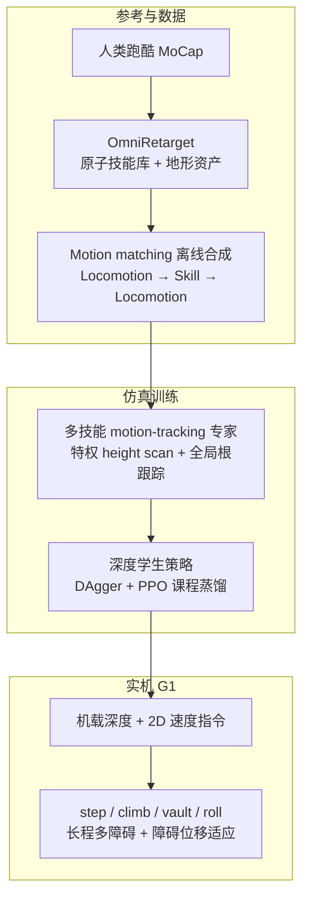

# Perceptive Humanoid Parkour（PHP）

**PHP**（Perceptive Humanoid Parkour: Chaining Dynamic Human Skills via Motion Matching，arXiv:[2602.15827](https://arxiv.org/abs/2602.15827)，[项目页](https://php-parkour.github.io/)）是 Amazon FAR 与伯克利 / CMU / Stanford 合作的人形**感知跑酷**工作（RSS 2026）：在动态人类跑酷数据稀缺的前提下，用 **motion matching** 离线合成大量「locomotion ↔ 原子技能」长程运动学轨迹，再训练多技能 **motion-tracking 专家** 并 **DAgger + PPO** 蒸馏为**单一深度策略**，使 **Unitree G1** 仅凭**机载深度**与**离散 2D 速度命令**自主选择 step / climb / vault / roll 等技能并完成长程障碍课。

> **arXiv 说明：** 论文正式编号为 **2602.15827**。用户常一并提供的 [2509.26633](https://arxiv.org/abs/2509.26633) 是上游 **[OmniRetarget](./paper-hrl-stack-03-omniretarget.md)**（交互保留重定向），PHP 正文以其构建原子技能库。

## 英文缩写速查

| 缩写 | 英文全称 | 简要说明 |
|------|----------|----------|
| Sim2Real | Simulation to Real | 把仿真中学到的策略迁移落地真机的工程主线 |
| DAgger | Dataset Aggregation | 迭代收集策略诱导状态下的专家标注以纠偏的模仿学习方法 |
| PPO | Proximal Policy Optimization | 人形/足式 locomotion 中最常用的 on-policy 策略梯度算法 |
| G1 | Unitree G1 Humanoid | 宇树入门级教育科研人形平台 |
| AMP | Adversarial Motion Prior | 用对抗判别约束状态转移接近专家运动分布的先验 |
| MoCap | Motion Capture | 动作捕捉，参考动作与演示数据的主要来源 |
| DR | Domain Randomization | 训练时随机化仿真参数以提升跨域鲁棒迁移 |
| PD | Proportional–Derivative | 关节位置/阻抗底层控制，策略输出常为其 setpoint |
| DoF | Degrees of Freedom | 自由度，人形通常 20–50+ 关节 |
| CNN | Convolutional Neural Network | 卷积神经网络，处理图像/深度感知 |
| MLP | Multi-Layer Perceptron | 多层感知机，处理本体向量等低维输入 |
| MuJoCo | Multi-Joint dynamics with Contact | 接触丰富的刚体物理仿真引擎 |
| IL | Imitation Learning | 从专家演示学习策略，奖励难定义时的主路线 |
| RL | Reinforcement Learning | 通过与环境交互最大化长期回报来学习策略的范式 |
| Locomotion | Robot Locomotion | 足式/人形等无轮移动能力的总称 |
| Manipulation | Robot Manipulation | 抓取、移动、操作物体的任务总称 |

## 为什么重要

- **跑酷 = 长程组合 + 感知决策的自洽测试床：** 单技能攀爬/翻越已有先例，但障碍课需要**异质技能在_disjoint 状态空间**间平滑切换，并随障碍几何**在线选技能**——比「单参考 tracking」或纯 AMP 隐式过渡更难。
- **Motion matching 回到机器人长程合成：** 游戏/动画领域成熟的 **最近邻特征检索** 被用作**离线**参考生成器，在稀疏 MoCap 上密化「入技能前步态相位 / 接近距离」分布；相对 MDM 等生成模型，论文强调在**低数据跑酷** regime 下更稳、更可扩展。
- **DAgger 不够 → DAgger + PPO：** 对攀爬/翻越等依赖短时大扭矩的技能，逐步模仿损失对「能否过障」不敏感；混合 **success-driven PPO** 与蒸馏课程是本文对 teacher-student 人形高动态路线的明确工程结论。
- **与 OmniRetarget 的分工：** 数据层保留人–物–地形交互（[OmniRetarget](./paper-hrl-stack-03-omniretarget.md)）→ 参考层 motion matching 组合 → 策略层深度 visuomotor；与 [42 篇身体系统栈](../overview/humanoid-rl-motion-control-body-system-stack.md) 中 **03 感知高动态** 叙事一致。

## 流程总览

## 核心机制（归纳）

### 1）Motion matching 长程合成

- **特征**（局部系）：短视界未来轨迹位姿、足部关节位速、根速度；给定 **2D 速度命令** 构造查询 $\hat{x}_t$，在库中 $\arg\min_i \|\hat{x}_t - x_i\|^2$。
- **模板：** `Locomotion → Parkour Skill → Locomotion`；locomotion 作共享流形连接异质技能，避免为每对技能手工采集过渡。
- **技能段：** 标注 **(s_k, e_k)** 与入技能窗口 **E_k**；执行技能时**顺序播放**、禁用进一步 matching，并把配对地形对齐到当前根位姿。
- **多样性：** 速度档（1 / 2 m/s）× 五档转向；入技能前 locomotion 时长随机；障碍尺寸/位姿 ± 扰动；近场 **distractor** box。

### 2）专家与学生

| 阶段 | 观测 | 训练要点 |
|------|------|----------|
| **专家** | 参考关节/骨盆误差 + 本体 + **0.7 m height scan** + **全局根**（纠 reference–terrain 耦合 drift） | BeyondMimic 式 tracking reward；**adaptive sampling** 对难技能必需；action scale 统一为 1 |
| **学生** | 本体 + **深度图**（WARP 渲染）+ 速度命令 | $L = \lambda_{\mathrm{PPO}} L_{\mathrm{PPO}} + \lambda_D L_D$；$\lambda$ 线性课程；终止阈值 0.5 m→1 m 缓解左右对称；**均匀技能采样**（不用专家 adaptive sampling） |

- **Sim2Real：** 相机外参/延迟/深度噪声随机化；与专家共享动作空间与 DR。

### 3）接口与实机能力

- **输入：** 机载深度 + 离散 **2D 速度**（无显式障碍类别标签）。
- **输出：** 关节 PD 目标；策略根据感知**自主选择**技能与过渡。
- **代表性结果：** **1.25 m** 墙攀（**96%** 机器人身高，3.63 s）；cat vault + dash vault（~**3 m/s**）；48–60 s 多障碍课；**实时障碍位移**仍闭环适应（训练数据为单障碍合成）。

## 核心信息

| 字段 | 内容 |
|------|------|
| 编号（42 篇栈） | 22/42 |
| 系统栈层 | 03 感知式高动态运动 |
| 机构 | Amazon FAR；UC Berkeley；CMU；Stanford |
| 平台 | Unitree G1（1.3 m，29 DoF） |
| 并行规模 | 16 384 env；CNN+MLP；20K iter（专家/学生各） |
| 演示 | [主页](https://php-parkour.github.io/) · [浏览器 MuJoCo demo](https://php-parkour.github.io/index-mobile.html) |

## 实验与评测

- **仿真：** Unitree G1，16 384 并行 env；专家/学生各 20K iterations；多技能均匀采样（学生阶段关闭 adaptive sampling）。
- **实机（摘要）：** 1.25 m 墙攀 3.63 s；0.4 m 障碍 cat vault 峰值前向 **3.41 m/s**；48–60 s 多障碍课；**障碍实时位移**下仍闭环适应；与人体同动作高墙攀 timing 对照。
- **消融要点（论文）：** 纯 DAgger 对高动态技能不足；motion matching 相对 MDM 类生成参考在稀疏跑酷数据上更稳；训练仅单障碍、部署可泛化多障碍课。

## 与其他工作对比

| 维度 | PHP | 典型 reward-shaped 单策略跑酷 | AMP 隐式过渡 |
|------|-----|------------------------------|--------------|
| 长程参考 | motion matching 离线合成 | 手工过渡或单段参考 | 分布内隐式切换 |
| 感知 | 机载深度 + 速度命令 | 各异 | 多不强调跑酷感知链 |
| 蒸馏 | DAgger + PPO 课程 | 常为纯 IL 或纯 RL | 风格 reward + RL |

## 常见误区

- **把 PHP 与 OmniRetarget 混为同一篇：** 2509.26633 是**重定向与数据增广引擎**；2602.15827 是**感知策略与技能链**。
- **以为 motion matching 在线运行：** 本文用于**离线**参考合成；实机闭环由**深度策略**完成，matching 不在部署时计算。
- **以为纯 DAgger 即可：** 论文明确指出高动态技能需要 **PPO 辅助**，否则对称但「过高/过低」的根轨迹在模仿损失下等价。

## 与其他页面的关系

- 数据上游：[OmniRetarget（arXiv:2509.26633）](./paper-hrl-stack-03-omniretarget.md)、[holosoma](./holosoma.md)（开源重定向与 WBT 管线）
- 蒸馏算法：[DAgger](../methods/dagger.md)、[Imitation Learning](../methods/imitation-learning.md)
- 任务语境：[Locomotion](../tasks/locomotion.md)、[Loco-Manipulation](../tasks/loco-manipulation.md)
- 硬件：[Unitree G1](./unitree-g1.md)
- 总索引：[人形 RL 身体系统栈](../overview/humanoid-rl-motion-control-body-system-stack.md)

## 参考来源

- [php_parkour_arxiv_2602_15827.md](../../sources/papers/php_parkour_arxiv_2602_15827.md) — 论文摘要与方法摘录（主归档）
- [php-parkour-github-io.md](../../sources/sites/php-parkour-github-io.md) — 项目页与浏览器 demo
- [humanoid_rl_stack_22_perceptive_humanoid_parkour_chaining_dynamic_hum.md](../../sources/papers/humanoid_rl_stack_22_perceptive_humanoid_parkour_chaining_dynamic_hum.md) — 42 篇栈策展摘录
- [humanoid_rl_stack_42_catalog.md](../../sources/papers/humanoid_rl_stack_42_catalog.md) — 总表

## 推荐继续阅读

- [RL Sim2Sim 在线演示：G1 Perceptive Parkour](https://imchong.github.io/RL_Sim2Sim_Demo_Website/index.html)
- [机器人论文阅读笔记：Perceptive Humanoid Parkour](https://imchong.github.io/Humanoid_Robot_Learning_Paper_Notebooks/papers/04_Loco-Manipulation_and_WBC/Perceptive_Humanoid_Parkour__Chaining_Dynamic_Human_Skills_via_Motion_Matching/Perceptive_Humanoid_Parkour__Chaining_Dynamic_Human_Skills_via_Motion_Matching.html)
- 论文 PDF：<https://php-parkour.github.io/static/images/paper.pdf>
- arXiv：<https://arxiv.org/abs/2602.15827>
- 上游重定向：<https://arxiv.org/abs/2509.26633>（OmniRetarget）
- [42 篇 RL 运动控制（微信公众号）](https://mp.weixin.qq.com/s/hz9JXtJeUPRfUGzfD-pZuA)
