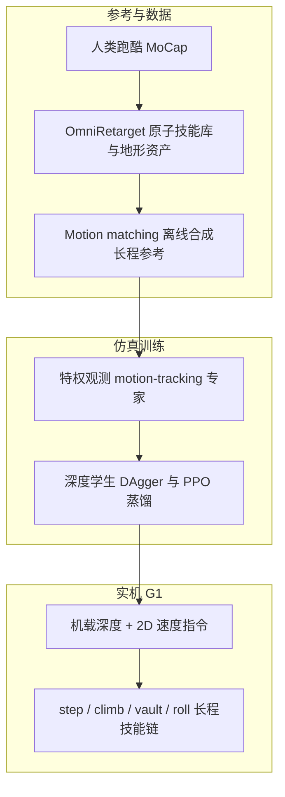
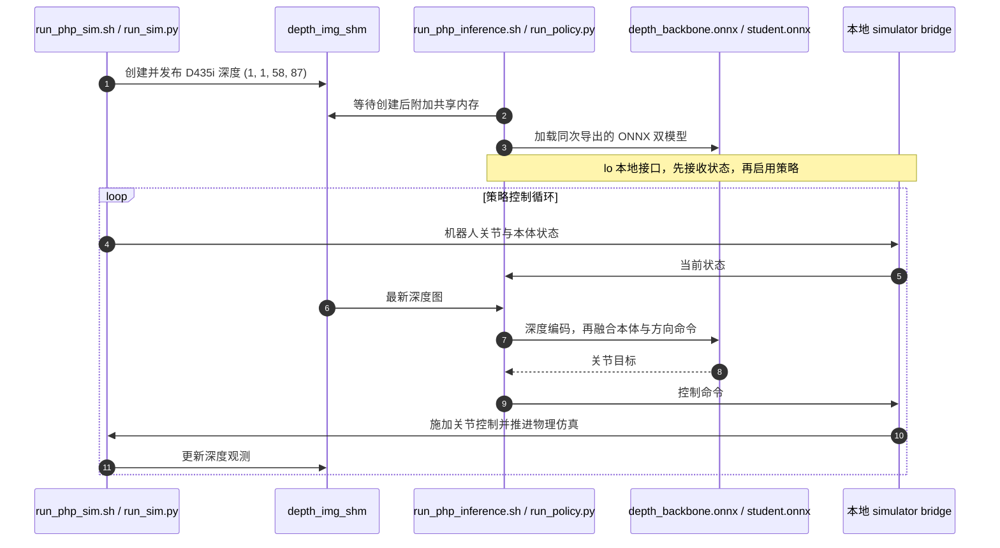

# Perceptive Humanoid Parkour（PHP）

**PHP**（Perceptive Humanoid Parkour: Chaining Dynamic Human Skills via Motion Matching，arXiv:[2602.15827](https://arxiv.org/abs/2602.15827)，[项目页](https://php-parkour.github.io/)）是 Amazon FAR 与伯克利 / CMU / Stanford 合作的人形**感知跑酷**工作（RSS 2026）：在动态人类跑酷数据稀缺的前提下，用 **motion matching** 离线合成大量「locomotion ↔ 原子技能」长程运动学轨迹，再训练多技能 **motion-tracking 专家** 并 **DAgger + PPO** 蒸馏为**单一深度策略**，使 **Unitree G1** 仅凭**机载深度**与**离散 2D 速度命令**自主选择 step / climb / vault / roll 等技能并完成长程障碍课。

> **arXiv 说明：** 论文正式编号为 **2602.15827**。用户常一并提供的 [2509.26633](https://arxiv.org/abs/2509.26633) 是上游 **[OmniRetarget](./paper-hrl-stack-03-omniretarget.md)**（交互保留重定向），PHP 正文以其构建原子技能库。

## 英文缩写速查

| 缩写 | 英文全称 | 简要说明 |
|------|----------|----------|
| Sim2Real | Simulation to Real | 把仿真中学到的策略迁移落地真机的工程主线 |
| DAgger | Dataset Aggregation | 迭代收集策略诱导状态下的专家标注以纠偏的模仿学习方法 |
| PPO | Proximal Policy Optimization | 人形/足式 locomotion 中最常用的 on-policy 策略梯度算法 |
| G1 | Unitree G1 Humanoid | 宇树入门级教育科研人形平台 |
| AMP | Adversarial Motion Prior | 用对抗判别约束状态转移接近专家运动分布的先验 |
| MoCap | Motion Capture | 动作捕捉，参考动作与演示数据的主要来源 |
| DR | Domain Randomization | 训练时随机化仿真参数以提升跨域鲁棒迁移 |
| PD | Proportional–Derivative | 关节位置/阻抗底层控制，策略输出常为其 setpoint |
| DoF | Degrees of Freedom | 自由度，人形通常 20–50+ 关节 |
| CNN | Convolutional Neural Network | 卷积神经网络，处理图像/深度感知 |
| MLP | Multi-Layer Perceptron | 多层感知机，处理本体向量等低维输入 |
| MuJoCo | Multi-Joint dynamics with Contact | 接触丰富的刚体物理仿真引擎 |
| IL | Imitation Learning | 从专家演示学习策略，奖励难定义时的主路线 |
| RL | Reinforcement Learning | 通过与环境交互最大化长期回报来学习策略的范式 |
| ONNX | Open Neural Network Exchange | 发布学生由深度编码器与策略两份配套模型组成 |
| WBT | Whole-Body Tracking | 全身运动参考跟踪，公开教师训练的基础 |
| Locomotion | Robot Locomotion | 足式/人形等无轮移动能力的总称 |
| Manipulation | Robot Manipulation | 抓取、移动、操作物体的任务总称 |

## 为什么重要

- 在 [运动小脑 64 篇技术地图](../overview/humanoid-motion-cerebellum-technology-map.md) 中归类为 **A 走路底座**（7/64）：底座：跑酷技能链和运动匹配。
- **跑酷 = 长程组合 + 感知决策的自洽测试床：** 单技能攀爬/翻越已有先例，但障碍课需要**异质技能在_disjoint 状态空间**间平滑切换，并随障碍几何**在线选技能**——比「单参考 tracking」或纯 AMP 隐式过渡更难。
- **Motion matching 回到机器人长程合成：** 游戏/动画领域成熟的 **最近邻特征检索** 被用作**离线**参考生成器，在稀疏 MoCap 上密化「入技能前步态相位 / 接近距离」分布；相对 MDM 等生成模型，论文强调在**低数据跑酷** regime 下更稳、更可扩展。
- **DAgger 不够 → DAgger + PPO：** 对攀爬/翻越等依赖短时大扭矩的技能，逐步模仿损失对「能否过障」不敏感；混合 **success-driven PPO** 与蒸馏课程是本文对 teacher-student 人形高动态路线的明确工程结论。
- **与 OmniRetarget 的分工：** 数据层保留人–物–地形交互（[OmniRetarget](./paper-hrl-stack-03-omniretarget.md)）→ 参考层 motion matching 组合 → 策略层深度 visuomotor；与 [42 篇身体系统栈](../overview/humanoid-rl-motion-control-body-system-stack.md) 中 **03 感知高动态** 叙事一致。

## 流程总览


```mermaid
flowchart TB
  subgraph data [参考与数据]
    mocap["人类跑酷 MoCap"]
    omni["OmniRetarget 原子技能库与地形资产"]
    mm["Motion matching 离线合成长程参考"]
    mocap --> omni --> mm
  end
  subgraph train [仿真训练]
  experts["特权观测 motion-tracking 专家"]
  student["深度学生 DAgger 与 PPO 蒸馏"]
  mm --> experts --> student
  end
  subgraph deploy [实机 G1]
  depth["机载深度 + 2D 速度指令"]
  skills["step / climb / vault / roll 长程技能链"]
  student --> depth --> skills
  end
```

## 核心机制（归纳）

### 1）Motion matching 长程合成

- **特征**（局部系）：短视界未来轨迹位姿、足部关节位速、根速度；给定 **2D 速度命令** 构造查询 $\hat{x}_t$，在库中 $\arg\min_i \|\hat{x}_t - x_i\|^2$。
- **模板：** `Locomotion → Parkour Skill → Locomotion`；locomotion 作共享流形连接异质技能，避免为每对技能手工采集过渡。
- **技能段：** 标注 **(s_k, e_k)** 与入技能窗口 **E_k**；执行技能时**顺序播放**、禁用进一步 matching，并把配对地形对齐到当前根位姿。
- **多样性：** 速度档（1 / 2 m/s）× 五档转向；入技能前 locomotion 时长随机；障碍尺寸/位姿 ± 扰动；近场 **distractor** box。

### 2）专家与学生

| 阶段 | 观测 | 训练要点 |
|------|------|----------|
| **专家** | 参考关节/骨盆误差 + 本体 + **0.7 m height scan** + **全局根**（纠 reference–terrain 耦合 drift） | BeyondMimic 式 tracking reward；**adaptive sampling** 对难技能必需；action scale 统一为 1 |
| **学生** | 本体 + **深度图**（WARP 渲染）+ 速度命令 | $L = \lambda_{\mathrm{PPO}} L_{\mathrm{PPO}} + \lambda_D L_D$；$\lambda$ 线性课程；终止阈值 0.5 m→1 m 缓解左右对称；**均匀技能采样**（不用专家 adaptive sampling） |

- **Sim2Real：** 相机外参/延迟/深度噪声随机化；与专家共享动作空间与 DR。

### 3）接口与实机能力

- **输入：** 机载深度 + 离散 **2D 速度**（无显式障碍类别标签）。
- **输出：** 关节 PD 目标；策略根据感知**自主选择**技能与过渡。
- **代表性结果：** **1.25 m** 墙攀（**96%** 机器人身高，3.63 s）；cat vault + dash vault（~**3 m/s**）；48–60 s 多障碍课；**实时障碍位移**仍闭环适应（训练数据为单障碍合成）。

## 核心信息

| 字段 | 内容 |
|------|------|
| 编号（42 篇栈） | 22/42 |
| 系统栈层 | 03 感知式高动态运动 |
| 机构 | 亚马逊前沿人工智能与机器人（Amazon FAR）；加州大学伯克利分校（UC Berkeley）；卡内基梅隆大学（CMU）；斯坦福大学（Stanford） |
| 平台 | Unitree G1（1.3 m，29 DoF） |
| 论文并行规模 | 16 384 env；CNN+MLP；20K iter（专家/学生各）；不是公开 launcher 的默认复现承诺 |
| 演示 / 代码 | [主页](https://php-parkour.github.io/) · [浏览器 MuJoCo demo](https://php-parkour.github.io/demo.html) · [官方源码](https://github.com/amazon-far/php_parkour) |

## 实验与评测

- **仿真：** Unitree G1，16 384 并行 env；专家/学生各 20K iterations；多技能均匀采样（学生阶段关闭 adaptive sampling）。
- **实机（摘要）：** 1.25 m 墙攀 3.63 s；0.4 m 障碍 cat vault 峰值前向 **3.41 m/s**；48–60 s 多障碍课；**障碍实时位移**下仍闭环适应；与人体同动作高墙攀 timing 对照。
- **消融要点（论文）：** 纯 DAgger 对高动态技能不足；motion matching 相对 MDM 类生成参考在稀疏跑酷数据上更稳；训练仅单障碍、部署可泛化多障碍课。

## 结论

**感知跑酷真正拉开差距的是「motion matching 离线合成长程参考 + DAgger 与 success-driven PPO 课程蒸馏」；纯模仿损失对短时大扭矩过障不敏感。**

1. **实机能力锚点** — Unitree G1 仅凭机载深度 + 离散 2D 速度命令：**1.25 m** 墙攀（约 **96%** 机器人身高，**3.63 s**）；cat vault 峰值前向约 **3.41 m/s**；**48–60 s** 多障碍课；障碍实时位移仍闭环适应。
2. **Motion matching 只做离线参考** — 模板 `Locomotion → Skill → Locomotion` 密化入技能前步态/接近分布；部署时 matching **不在线计算**，闭环由深度学生完成。
3. **纯 DAgger 不够** — 攀爬/翻越依赖短时大扭矩；对称但「过高/过低」的根轨迹在模仿损失下等价，故需混合 \(\lambda_{\mathrm{PPO}} L_{\mathrm{PPO}}+\lambda_D L_D\) 线性课程。
4. **专家 vs 学生观测差** — 专家用特权 height scan + 全局根纠 drift；学生用 WARP 深度；学生阶段关闭专家 adaptive sampling、改均匀技能采样，终止阈值 **0.5 m→1 m** 缓解左右对称。
5. **与 OmniRetarget 分工** — [2509.26633](./paper-hrl-stack-03-omniretarget.md) 是交互保留重定向数据层；PHP（2602.15827）是感知策略与技能链；2026-10-10 已核实官方代码与学生 ONNX 公开。
6. **先分清复现层级** — 浏览器体验、预训练学生 Sim2Sim、五组示例重训练、论文完整实机复现是不同任务；公开训练子集不等于完整论文实验包，教师 checkpoint 仍需自行训练。

## 与其他工作对比

| 维度 | PHP | 典型 reward-shaped 单策略跑酷 | AMP 隐式过渡 |
|------|-----|------------------------------|--------------|
| 长程参考 | motion matching 离线合成 | 手工过渡或单段参考 | 分布内隐式切换 |
| 感知 | 机载深度 + 速度命令 | 各异 | 多不强调跑酷感知链 |
| 蒸馏 | DAgger + PPO 课程 | 常为纯 IL 或纯 RL | 风格 reward + RL |

## 常见误区

- **把 PHP 与 OmniRetarget 混为同一篇：** 2509.26633 是**重定向与数据增广引擎**；2602.15827 是**感知策略与技能链**。
- **以为 motion matching 在线运行：** 本文用于**离线**参考合成；实机闭环由**深度策略**完成，matching 不在部署时计算。
- **以为纯 DAgger 即可：** 论文明确指出高动态技能需要 **PPO 辅助**，否则对称但「过高/过低」的根轨迹在模仿损失下等价。

## 开源状态（项目页与源码核查，2026-10-10）

| 资源 | 状态 |
|------|------|
| 项目页 | <https://php-parkour.github.io/> |
| 浏览器 demo | <https://php-parkour.github.io/demo.html>；无需本地安装，但不是训练验证 |
| 代码 | **已开源**：[amazon-far/php_parkour](https://github.com/amazon-far/php_parkour)，Apache-2.0；离线合成、教师训练、学生蒸馏、ONNX 导出与 Sim2Sim |
| 数据 | motion matching 数据库与地形元数据；五组预制训练示例共 296 对 motion NPZ / terrain NPY |
| 权重 | 配套 `depth_backbone.onnx` + `student.onnx`；不是原始学生 `.pt` 或现成教师 checkpoint |
| 依赖 | 锁定 `thirdparty/holosoma`，训练使用 IsaacSim 5.1；部署使用 Holosoma 的 MuJoCo / inference 环境 |

历史核查 2026-07-20 的 *Coming Soon* 已被当前发布替代。源码依据为 PHP `554edcc`、Holosoma gitlink `4a0bf04`，完整快照与文档入口见[仓库归档](../../sources/repos/php_parkour.md)。

## 源码运行时序图

以下描述 **公开原生 Sim2Sim** 路径，不是浏览器实现或已验证真机部署。两份 ONNX 合并为一个参与者，部署时仍需分别提供。


```mermaid
sequenceDiagram
  autonumber
  participant Sim as run_php_sim.sh / run_sim.py
  participant Depth as depth_img_shm
  participant Policy as run_php_inference.sh / run_policy.py
  participant Models as depth_backbone.onnx / student.onnx
  participant Bridge as 本地 simulator bridge
  Sim->>Depth: 创建并发布 D435i 深度 (1, 1, 58, 87)
  Policy->>Depth: 等待创建后附加共享内存
  Policy->>Models: 加载同次导出的 ONNX 双模型
  Note over Policy,Bridge: lo 本地接口，先接收状态，再启用策略
  loop 策略控制循环
    Sim->>Bridge: 机器人关节与本体状态
    Bridge->>Policy: 当前状态
    Depth->>Policy: 最新深度图
    Policy->>Models: 深度编码，再融合本体与方向命令
    Models-->>Policy: 关节目标
    Policy->>Bridge: 控制命令
    Bridge->>Sim: 施加关节控制并推进物理仿真
    Sim->>Depth: 更新深度观测
  end
```

入口对齐官方 `wbt_training/DEPLOY.md`：先 `run_php_sim.sh`，等共享内存创建，再以 `BACKBONE` / `STUDENT` 启动 `run_php_inference.sh`。Motion matching 与教师策略**不在此部署循环中运行**；仿真脚本的 500 FPS 不能读作策略推理频率。

## 工程实践与复现边界

### 1）最短体验：浏览器或已发布学生

- 浏览器：[demo.html](https://php-parkour.github.io/demo.html)，W 前进、A/D 转向、Y 切换速度、SPACE 暂停、BACKSPACE 重置；攀爬到落地期间持续按 W。
- 原生 Sim2Sim：递归克隆仓库并按 `wbt_training/DEPLOY.md` 安装 pinned Holosoma 的 MuJoCo / inference 两个环境；不需要先训练，也不依赖 FAR-pi 或 W&B 账号。

在官方 checkout 根目录下载并核对学生模型；两条启动命令分别在两个终端执行，环境安装步骤不能省略：

```bash
python scripts/download_assets.py student --destination /tmp/php-student
python scripts/download_assets.py student --destination /tmp/php-student --verify
# 终端 1：先等 depth_img_shm 创建
bash ./run_php_sim.sh
# 终端 2：再传入配套模型
BACKBONE=/tmp/php-student/depth_backbone.onnx STUDENT=/tmp/php-student/student.onnx bash ./run_php_inference.sh
```

共享内存预期形状 `(1, 1, 58, 87)`、20184 bytes。MuJoCo 窗口按 `8` 降吊架、`9` 移除吊架，再在策略终端按 `]` 启用；`o` 阻尼、`i` 回启动姿态。**原生**速度切换是 `=`，不要照搬网页的 `Y`。需要图形桌面，否则吊架操作与按键释放识别受限。

### 2）重训练：数据与教师严格配对

| 环节 | 发布入口 | 必须记录 / 检查 |
|---|---|---|
| 参考生成 | `motion_matching.run --mode generate --scenario high_speed_climb_76` | 独立环境；下载 `databases`；输出 50 FPS motion NPZ、terrain NPY / OBJ |
| 专家训练 | `run_terrain_teacher.sh` → `wbt_training.train_agent` | 五组数据各自训练教师；Linux / NVIDIA / IsaacSim 5.1；本地 registry 用 `file://` |
| 学生蒸馏 | `run_terrain_warp_distill.sh` | `TEACHER_CHECKPOINT` 与 `REGISTRY` 列表逐项对应；本地教师不能依赖 `REGISTRY=auto` |
| 蒸馏消融 | 同一 launcher 的 `FINETUNE` | 默认 `1` 为 DAgger+PPO，`0` 为纯 DAgger；默认 `WARMUP_STEPS=0`，不能推定等于论文课程 |
| 评估 / 导出 | `eval_teacher.sh`、`eval_student.sh`、`export_distill_onnx` | 导出双 ONNX；推理入口不会自动转换 `.pt`，也不支持 `STEP=latest` 解析 |

预制训练数据分别为 locomotion **100** 对、low-step **56** 对、high-step **60** 对、low-climb-76 **40** 对、high-climb-76 **40** 对；它们是降低复现门槛的示例，不是完整论文所有技能的实验数据证明。`LOGGER=disabled` 可走本地路径；多 GPU 的 `--training.num-envs` 是**总数**，不是每 GPU 数量。

### 3）源码对论文的校正与局限

- `depth_distillation.py` 的学生 actor 不读取参考运动、height scan 或根线速度；特权教师 / critic 的输入不可混入部署规格。学生关闭教师式 adaptive timestep sampling，与论文方法方向一致。
- 论文 16384 环境、20K iterations、1.25 m 攀墙与长程真机结果仍是**论文报告**；公开示例命令、预制数据与训练默认值应单独记录，不能据此保证重现同样指标。
- 代码开源不等于所有中间产物开放：需自行训练教师，发布 ONNX 不是可直接续训的 `.pt`。动作数据库覆盖的技能范围也不能等同于五组预制训练示例。
- 环境风险包括 IsaacSim / Holosoma 的依赖约束，以及旧 editable 安装导入错误版本；使用 pinned 子模块与官方 setup，不随意升级替换。
- 本次完成文档与源码核查、知识库导出及 Mermaid 检查，**未运行上游模型、IsaacSim 训练或真机控制**；实机需要额外相机标定、时延 / 控制接口核对和安全验证。

## 与其他页面的关系

- 数据上游：[OmniRetarget（arXiv:2509.26633）](./paper-hrl-stack-03-omniretarget.md)、[holosoma](./holosoma.md)（开源重定向与 WBT 管线）
- 蒸馏算法：[DAgger](../methods/dagger.md)、[Imitation Learning](../methods/imitation-learning.md)
- 任务语境：[Locomotion](../tasks/locomotion.md)、[Loco-Manipulation](../tasks/loco-manipulation.md)
- 硬件：[Unitree G1](./unitree-g1.md)
- 对照（无技能标签 / 无运行时 motion graph）：[Light-Loco-Parkour（LightLP）](./paper-light-loco-parkour.md) — Lightbot 0；稀疏种子 Real2Sim2Real 扩张 + 转移组 RL
- 对照（厘米级悬空细杆，原始固态 LiDAR）：[Agile Perceptive Traversal](./paper-agile-perceptive-traversal-sparse-3d.md) — ETH PM-01 猴架 jump-up→荡杆→跳下，与 PHP 稠密障碍跑酷对照
- 对照（单策略未来监督，无 matching）：[ParkourFormer](./paper-parkourformer.md) — G1；query 历史 + 未来两步 AMP；九类地形 93.85%
- 对照（门控深度记忆 + 交替对称，无 motion matching）：[Echo in the Steps（2609.28960）](./paper-echo-in-the-steps.md) — 清华 CoRL 2026；稀疏踏点 RL；相对 Hiking **+16.7 pt** SR；代码待发布
- 总索引：[人形 RL 身体系统栈](../overview/humanoid-rl-motion-control-body-system-stack.md)

## 参考来源

- [php_parkour.md](../../sources/repos/php_parkour.md) — 2026-10-10 官方源码、Release 资产与训练 / Sim2Sim 入口核查
- [php_parkour_arxiv_2602_15827.md](../../sources/papers/php_parkour_arxiv_2602_15827.md) — 论文摘要与方法摘录（主归档）
- [php-parkour-github-io.md](../../sources/sites/php-parkour-github-io.md) — 项目页与浏览器 demo
- [humanoid_rl_stack_22_perceptive_humanoid_parkour_chaining_dynamic_hum.md](../../sources/papers/humanoid_rl_stack_22_perceptive_humanoid_parkour_chaining_dynamic_hum.md) — 42 篇栈策展摘录
- [humanoid_rl_stack_42_catalog.md](../../sources/papers/humanoid_rl_stack_42_catalog.md) — 总表

## 推荐继续阅读

- [PHP 官方代码与安装入口](https://github.com/amazon-far/php_parkour) · [训练指南](https://github.com/amazon-far/php_parkour/blob/main/wbt_training/README.md) · [部署指南](https://github.com/amazon-far/php_parkour/blob/main/wbt_training/DEPLOY.md)
- [RL Sim2Sim 在线演示：G1 Perceptive Parkour](https://imchong.github.io/RL_Sim2Sim_Demo_Website/index.html)
- [机器人论文阅读笔记：Perceptive Humanoid Parkour](https://imchong.github.io/Robot_Learning_Paper_Notebooks/papers/04_Loco-Manipulation_and_WBC/Perceptive_Humanoid_Parkour__Chaining_Dynamic_Human_Skills_via_Motion_Matching/Perceptive_Humanoid_Parkour__Chaining_Dynamic_Human_Skills_via_Motion_Matching.html)
- 论文 PDF：<https://php-parkour.github.io/static/images/paper.pdf>
- arXiv：<https://arxiv.org/abs/2602.15827>
- 上游重定向：<https://arxiv.org/abs/2509.26633>（OmniRetarget）
- [42 篇 RL 运动控制（微信公众号）](https://mp.weixin.qq.com/s/hz9JXtJeUPRfUGzfD-pZuA)
