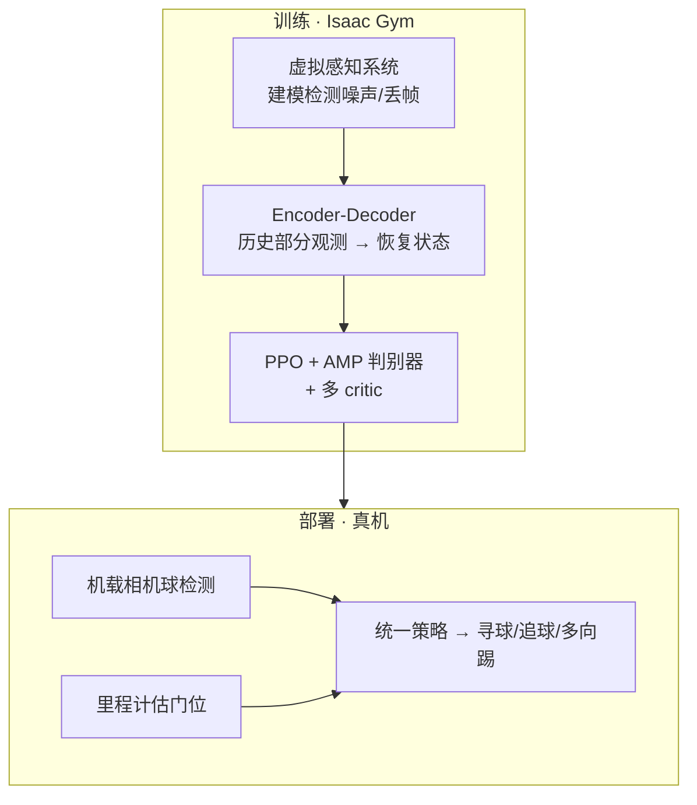
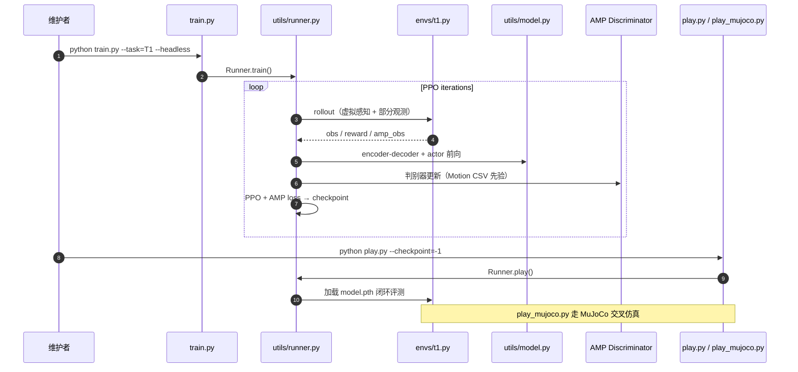

# Learning Vision-Driven Reactive Soccer Skills for Humanoid Robots

**Learning Vision-Driven Reactive Soccer Skills for Humanoid Robots**（[Science Robotics 11, eaed1152 (2026)](https://doi.org/10.1126/scirobotics.aed1152)，[arXiv:2511.03996](https://arxiv.org/abs/2511.03996)，[项目页](https://humanoid-kick.github.io)）由 **清华大学 · 字节跳动 Seed · 中国农业大学** 提出：用统一 RL 控制器把 **视觉感知与运动控制** 直接耦合，将 [AMP](../methods/amp-reward.md) 扩展到真实动态环境，并通过 **虚拟感知系统 + encoder-decoder** 从不完美观测恢复球位等特权态，使「看球」成为策略一部分。收录于具身智能研究室 **42 篇 humanoid RL 运动控制** 长文 **第 26/42**（03 感知式高动态运动），并作为本库 [人形足球纵深 Stage 2](../../roadmap/depth-humanoid-soccer.md) 推荐读物。

## 一句话定义

**别把检测和踢球拆成慢半拍的模块流水线——用虚拟感知对齐真机视觉误差，让策略在 AMP 运动先验下直接从部分观测做出反应式踢球，并主动把球留在视野里。**

## 英文缩写速查

| 缩写 | 英文全称 | 简要说明 |
|------|----------|----------|
| RL | Reinforcement Learning | PPO 训练视觉–运动统一策略 |
| PPO | Proximal Policy Optimization | 策略优化；多 critic 估值 |
| AMP | Adversarial Motion Prior | 判别器约束状态转移接近专家运动 |
| Sim2Real | Simulation to Real | 虚拟感知建模真实视觉特性后迁移 |
| SciRob | Science Robotics | 正式发表期刊（2026, eaed1152） |

## 为什么重要

- **针对解耦栈的延迟与行为不连贯：** 足球是紧耦合感知–动作环；模块化易「看见了但踢晚了」。
- **AMP 进真实动态感知：** 把运动模仿先验接到含视觉误差的闭环，而不是只在特权本体上玩风格。
- **主动感知：** 躯干/头部/身体调整成为动作的一部分，服务「把球留在更好视野」。
- **Science Robotics 级实证：** 摘要报告相对规则基线 **−46%** 球位误差、**−64%** time-to-kick，前场约 **90%** 踢球成功率，并在室外与真实 RoboCup 比赛验证。
- **纵深 Stage 2 入口：** 帮助理解机载视觉如何进入反应式技能，再衔接到 Stage 3 的 PAiD / RoboNaldo / Agile Striker。

## 核心信息

| 项 | 内容 |
|----|------|
| **机构** | 清华大学；字节跳动 Seed；中国农业大学 |
| **作者** | Yushi Wang、Changsheng Luo、Penghui Chen 等 |
| **平台** | 致谢 Booster Robotics 提供机器人与场地 |
| **编号** | 42 篇栈 **26/42** · 03 感知式高动态运动 |
| **开源** | **部分开源**（截至 **2026-08-22**）：Zenodo [21620490](https://zenodo.org/records/21620490) 含 Isaac Gym 训练/推理与 `model.pth`；**无 GitHub**；真机部署未发布 |

## 流程总览

## 核心机制（方法栈）

### 1）虚拟感知 + 状态恢复

- 训练时用虚拟感知模拟真实视觉特性（噪声、检测失败）；actor 拿部分观测，经 encoder-decoder 从历史重建更完整状态（含球位等）。
- 目的：缩小「干净仿真观测」与「抖动检测」之间的错位，让策略 **内化感知不确定性**。

### 2）AMP 风格的感知–运动联合

- 回报来自环境任务项 + 运动先验判别器；多 critic 提供价值估计。
- 相对纯手工奖励踢球，先验帮助保持连贯全身运动。

### 3）主动感知

- 策略显式协调躯干/头部等，使球处于更有利视野——「看」与「踢」同一优化。

### 4）部署接口（项目页）

- 机载相机检测球位直接进策略；门位由里程计模块从长期信息估计。

## 源码运行时序图

Zenodo `code.zip` 提供可运行的 Isaac Gym 训练与仿真推理入口（**不含真机部署**）：

关键复现路径：`train.py` → `utils/runner.py`（PPO+AMP）→ `envs/t1.py`；推理用 `play.py` 或 `play_mujoco.py` 加载 `logs/model.pth`。

## 工程实践

| 项 | 说明 |
|----|------|
| **获取代码** | 下载 [Zenodo 21620490](https://zenodo.org/records/21620490) 的 `code.zip`（BSD-3-Clause） |
| **依赖** | Python 3.8 · PyTorch · **Isaac Gym Preview 4** · Pinocchio |
| **训练** | `python train.py --task=T1 --headless`；配置 `envs/T1.yaml` |
| **评测** | `python play.py`（Isaac）/ `python play_mujoco.py`（MuJoCo） |
| **真机** | 项目页描述 onboard camera + odometer，**代码包未含** |
| **归档** | [humanoid-kick-vision-driven-soccer.md](../../sources/repos/humanoid-kick-vision-driven-soccer.md) |

## 与其他工作对比

| 维度 | 本文 | PAiD | Agile Striker |
|------|------|------|---------------|
| **感知切口** | 虚拟感知 + 主动看球 | 骨盆系球/门 + LSTM | 显式噪声/延迟/丢帧模型 |
| **运动先验** | **AMP** | MoCap tracking | 行走改造奖励 |
| **开源** | Zenodo 部分（仿真） | TeleHuman 已开源 | Daffan 已开源 |
| **纵深位置** | Stage 2 感知进技能 | Stage 3 主线 | Stage 3 主线 |

## 实验与评测

| 指标 | 结果（摘要 / 项目页） |
|------|----------------------|
| 球位估计误差 | 相对规则基线 **−46%** |
| Time-to-kick | 相对规则基线 **−64%** |
| 前场踢球成功率 | 约 **90%** |
| 场景 | 室外、动态场景、真实 RoboCup 比赛 |

## 结论

**反应式人形足球的关键是把视觉误差与主动看球写进同一 RL 环，而不是在检测模块后再挂一个开环踢球器。**

1. **虚拟感知是 Sim2Real 对齐器** — 先模拟真实检测特性，再谈策略鲁棒。
2. **AMP 管风格与连贯** — 在动态球场景保持全身运动不「散架」。
3. **主动感知是一等公民** — 头/躯干动作服务视野，而不只是副作用。
4. **复现预期** — Zenodo 可跑通仿真训练/推理；真机仍须自研感知与里程计栈。
5. **选型** — 读感知进环与 AMP 结合 → 本文；要可复现 G1/T1 踢球课程 → PAiD / Agile Striker / RoboNaldo。

## 局限与风险

- **仅 Zenodo 归档、无 GitHub**：更新与 issue 跟进弱于常规开源仓。
- **真机部署未发布**：室外/RoboCup 演示无法一键复现。
- 策展来源含公众号摘要，细节以 Science Robotics / arXiv PDF 为准。
- 与联赛战术栈正交：本文聚焦单机反应式技能。

## 与其他页面的关系

- 总框架：[人形 RL 身体系统栈](../overview/humanoid-rl-motion-control-body-system-stack.md)
- AMP：[amp-reward](../methods/amp-reward.md) · [AMP survey](../overview/humanoid-amp-motion-prior-survey.md)
- 任务 / 纵深：[Humanoid Soccer](../tasks/humanoid-soccer.md) · [depth-humanoid-soccer](../../roadmap/depth-humanoid-soccer.md)
- Stage 3 对照：[PAiD](./paper-notebook-learning-soccer-skills-for-humanoid-robots.md) · [Agile Striker](./paper-notebook-learning-agile-striker-skills-for-humanoid-socce.md) · [RoboNaldo](./paper-robonaldo-humanoid-soccer-shooting.md)

## 参考来源

- [humanoid_rl_stack_26_learning_vision_driven_reactive_soccer_skills_fo.md](../../sources/papers/humanoid_rl_stack_26_learning_vision_driven_reactive_soccer_skills_fo.md)
- [humanoid-kick-vision-driven-soccer.md](../../sources/sites/humanoid-kick-vision-driven-soccer.md)
- [humanoid-kick-vision-driven-soccer.md](../../sources/repos/humanoid-kick-vision-driven-soccer.md)
- [humanoid_rl_stack_42_catalog.md](../../sources/papers/humanoid_rl_stack_42_catalog.md)
- [wechat_embodied_ai_lab_humanoid_rl_motion_survey.md](../../sources/blogs/wechat_embodied_ai_lab_humanoid_rl_motion_survey.md)
- 论文：<https://arxiv.org/abs/2511.03996> · <https://doi.org/10.1126/scirobotics.aed1152>
- 项目页：<https://humanoid-kick.github.io>

## 推荐继续阅读

- [Zenodo 代码包](https://zenodo.org/records/21620490)
- [人形足球纵深路线](../../roadmap/depth-humanoid-soccer.md)
- [42 篇 RL 运动控制（微信公众号）](https://mp.weixin.qq.com/s/hz9JXtJeUPRfUGzfD-pZuA)
