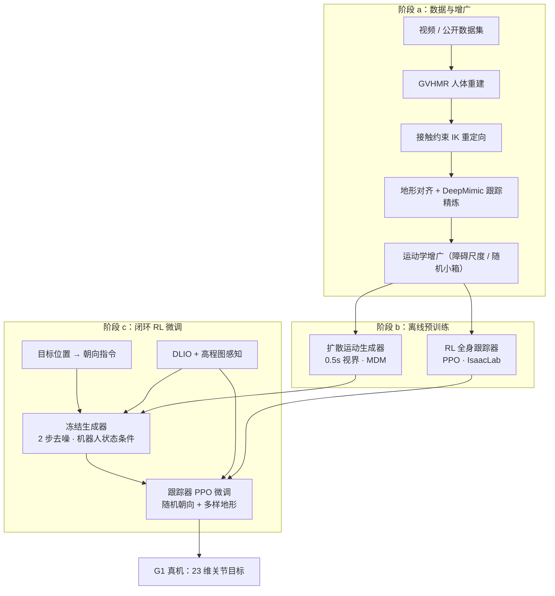

# Learning Whole-Body Humanoid Locomotion via Motion Generation and Motion Tracking

**Learning Whole-Body Humanoid Locomotion via Motion Generation and Motion Tracking**（arXiv:[2604.17335](https://arxiv.org/abs/2604.17335)，[项目页](https://wholebodylocomotion.github.io/)）由 **ETH Zurich RSL**、**Simon Fraser University**（Xue Bin Peng 组）、**ETH AI Center** 与 **EPFL** 合作提出：在 [人形 RL 身体系统栈](../overview/humanoid-rl-motion-control-body-system-stack.md) **03 感知式高动态运动** 簇中，把 **扩散运动生成** 用作按感知在线组合全身技能的规划层，**RL 运动跟踪** 作物理执行与误差吸收层，并在 **Unitree G1** 上完成全 onboard 部署。

> 本页同时服务 **42 篇栈 #27/42** 策展索引与 **arXiv 全文消化**；编号与微信导读见 [humanoid_rl_stack_27 source](../../sources/papers/humanoid_rl_stack_27_learning_whole_body_humanoid_locomotion_via_moti.md)。

## 英文缩写速查

| 缩写 | 英文全称 | 简要说明 |
|------|----------|----------|
| RL | Reinforcement Learning | 通过与环境交互最大化长期回报来学习策略的范式 |
| MDM | Motion Diffusion Model | 以扩散去噪预测运动序列的生成架构（本文生成器骨干） |
| PPO | Proximal Policy Optimization | 预训练与微调阶段采用的 on-policy 策略梯度算法 |
| IK | Inverse Kinematics | 逆运动学，人体运动重定向到 G1 骨架 |
| WBC | Whole-Body Control | 协调全身关节（含手、膝接触）的移动能力 |
| G1 | Unitree G1 Humanoid | 本文真机验证平台 |
| LiDAR | Light Detection and Ranging | Livox MID360，支撑 DLIO 位姿与地形重建 |
| AMP | Adversarial Motion Prior | 对抗运动先验；本文主线为模仿跟踪而非 AMP |

## 为什么重要

- **弥合两条失败模式：** 纯 reward shaping RL 易「只会腿」；纯 motion tracking 只能回放固定 choreography，难以按 **目标朝向 + 地形** 在线改写全身动作。
- **可扩展的技能组合：** 相对多专家蒸馏（需手工设计专家分配与切换数据），单一扩散生成器在 retargeted 人体运动上训练后，可按感知 **连续产出** 参考，扩展技能库时工程增量更小。
- **真机全身感知闭环：** 相对 Xu et al. 等仿真跑酷扩散工作，本文强调 **G1 真机**、**机载 LiDAR 地形** 与 **TensorRT 实时推理**（约 20 ms），是「生成参考 + 物理跟踪」路线在复杂全身 locomotion 上的完整系统示范。
- **与 Heracles 互补：** [Heracles](./paper-heracles-humanoid-diffusion.md) 用 flow matching **中间件** 桥接 tracking 与 recovery；本文用扩散 **规划层** 做 terrain-aware 技能选择与参考生成，底层仍是 RL tracker。

## 流程总览

## 核心机制（归纳）

### 1）数据：小样本 → 一小时可训练集

- 初始约 **5 分钟** 技能片段：50 cm 攀箱、35 cm 跨栏、50 cm 跳下、20 cm 楼梯、全向行走。
- **GVHMR** 从自采视频重建人体运动；公开数据集与视频经 **接触约束 IK** 重定向到 G1。
- 关键：**不直接使用** 原始重定向或运动学优化轨迹，而是用 **DeepMimic 式跟踪策略** 在仿真中精炼后录制，保证生成器与跟踪器训练数据物理可行。
- **运动学增广：** 改变障碍高度、沿路径插入随机小箱并优化穿透/平滑损失后，再经跟踪策略二次精炼；覆盖箱 35–75 cm、栏 25–45 cm、楼梯 15–20 cm 等变体。

### 2）预训练：生成器 + 跟踪器并行

| 模块 | 输入 | 输出 | 训练 |
|------|------|------|------|
| **扩散生成器** | 朝向向量、地形高程扫描、过去 2 帧运动特征 | 未来 0.5 s（25 帧）根位姿/关节/连杆 | 重建 + 速度/关节一致/地形穿透损失；训练时扰动扫描与历史状态 |
| **全身跟踪器** | 参考状态、5 帧本体感受、地形扫描 | 23 维目标关节位置 | PPO；$R_{\mathrm{pre}} = r_{\mathrm{mimic}} + r_{\mathrm{reg}}$ |

### 3）闭环微调：生成器冻结、跟踪器吸收误差

- 生成器以 **机器人过去 2 帧真实状态** 为条件（非自回归反馈自身预测），形成 closed-loop motion prediction。
- 跟踪器在 **更随机朝向** 与 **更丰富地形**（楼梯 15–25 cm、连续栏 25–55 cm、箱/金字塔 30–85 cm）上继续 PPO；奖励加 **heading tracking**：$R_{\mathrm{post}} = r_{\mathrm{mimic}} + r_{\mathrm{reg}} + r_{\mathrm{task}}$。
- 部署仅 **2 步去噪**；对生成推理与跟踪观测注入噪声；跟踪器充当 **运动滤波器**——跟踪生成模式，同时用外感受抑制不安全执行。

### 4）真机部署栈

- **位姿：** DLIO（Livox MID360 + IMU）。
- **地形：** Elevation Mapping CuPy + DLIO 位姿。
- **颈部补偿：** 被动颈关节在剧烈运动下干扰估计；融合 LiDAR IMU 与躯干 IMU 估计头俯仰并补偿。
- **算力：** 生成器 TensorRT 于 **Jetson Thor**（~20 ms）；跟踪与其余模块于 G1 自带 **Jetson Orin**。
- **时序：** 训练 0.5 s 预测视界；部署每 **0.25 s** receding-horizon 更新参考。

## 实验与评测

### 真机

- **箱攀：** 最高 **75 cm**；直线上下、箱顶 90° 转向侧跳、从箱角攀降等多种方式；攀升用膝与手、跳下用手缓冲。
- **跨栏 / 楼梯：** 多高度连续跨栏；楼梯上下；混合序列（栏 → 楼梯 → 箱）动态切换风格。
- **局部导航：** 参考不适合当前朝向时，跟踪器可 **部分 override** 参考并侧向绕行仍达目标（微调后涌现）。

### 仿真量化（论文 Table I & Fig. 4）

| 对比 | 结论 |
|------|------|
| **Tracker Only**（固定参考）vs **Tracker + Gen**（在线生成） | 箱攀、跨栏、上楼梯三类任务平均成功率显著提升；障碍高度/偏航 OOD 时差距最大（如 70–80 cm 箱攀 0.23 → 0.96） |
| **耦合后是否微调跟踪器** | 五类穿越任务上，微调版 consistently 高于未微调版 |

## 常见误区

1. **生成器直接输出扭矩：** 扩散层只产 **运动学参考**；物理可行性由 RL tracker 保证。
2. **等于多专家蒸馏：** 无需为每种地形单独训练 expert 再蒸馏；生成器在统一人体运动先验上按条件采样参考。
3. **等于 Heracles：** Heracles 是 tracking↔recovery **中间件**；本文是 **locomotion 技能在线组合**，问题设定与训练目标不同。
4. **2 步去噪够用是因为跟踪器弱：** 论文强调微调后跟踪器可 **补偿** 低步数带来的生成质量下降。

## 与其他页面的关系

- 总框架：[humanoid-rl-motion-control-body-system-stack.md](../overview/humanoid-rl-motion-control-body-system-stack.md)（#27/42）
- 方法族：[扩散运动生成](../methods/diffusion-motion-generation.md)、[PPO](../methods/policy-optimization.md)
- 对照：[PHP 感知跑酷](./paper-hrl-stack-22-perceptive_humanoid_parkour.md)（DAgger 蒸馏 + motion matching）、[Heracles](./paper-heracles-humanoid-diffusion.md)（flow 中间件 + recovery）
- 任务：[Humanoid Locomotion](../tasks/humanoid-locomotion.md)、[楼梯与障碍感知移动](../tasks/stair-obstacle-perceptive-locomotion.md)
- 平台：[Unitree G1](./unitree-g1.md)

## 参考来源

- [eth-g1-diffusion.md](../../sources/papers/eth-g1-diffusion.md) — arXiv:2604.17335 全文编译归档
- [wholebody-locomotion.md](../../sources/sites/wholebody-locomotion.md) — 官方项目页快照
- [humanoid_rl_stack_27_learning_whole_body_humanoid_locomotion_via_moti.md](../../sources/papers/humanoid_rl_stack_27_learning_whole_body_humanoid_locomotion_via_moti.md) — 42 篇栈策展摘录
- [humanoid_rl_stack_42_catalog.md](../../sources/papers/humanoid_rl_stack_42_catalog.md) — 总表
- [wechat_embodied_ai_lab_humanoid_rl_motion_survey.md](../../sources/blogs/wechat_embodied_ai_lab_humanoid_rl_motion_survey.md) — 微信公众号编译导读

## 推荐继续阅读

- [项目页](https://wholebodylocomotion.github.io/) — 演示视频与 BibTeX
- [arXiv:2604.17335](https://arxiv.org/abs/2604.17335) — 完整方法、奖励表与消融
- [42 篇 RL 运动控制（微信公众号）](https://mp.weixin.qq.com/s/hz9JXtJeUPRfUGzfD-pZuA) — 身体系统栈上下文
