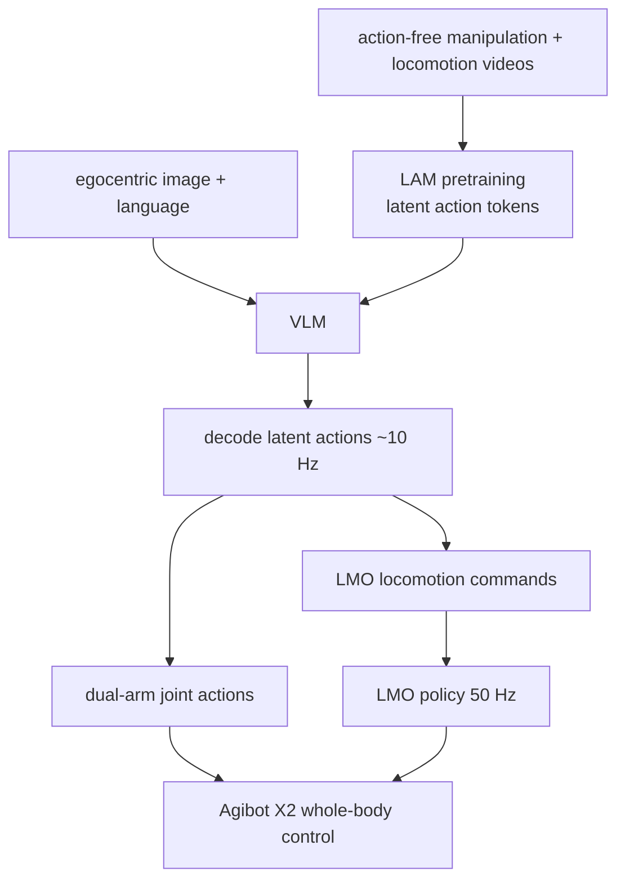

# WholeBodyVLA

**WholeBodyVLA**（*Towards Unified Latent VLA for Whole-body Loco-manipulation Control*）把全身移动操作拆成「高层 VLM 预测 latent action token」与「底层 LMO RL locomotion policy 执行」：行走不只是速度跟踪，而是为抓取、搬运、推车提供合适身体姿态和位置。

## 一句话定义

WholeBodyVLA 用 action-free 视频预训练 latent action，再让 VLM 将图像和语言解码为双臂动作与面向操作的 locomotion commands，实现大空间全身 VLA 控制。

## 英文缩写速查

| 缩写 | 英文全称 | 简要说明 |
|------|----------|----------|
| VLA | Vision-Language-Action | 视觉语言动作策略 |
| LAM | Latent Action Model | 从无动作标注视频学习 latent action supervision |
| LMO | Loco-Manipulation-Oriented policy | 50 Hz 执行 locomotion commands 的底层 RL 策略 |
| VLM | Vision-Language Model | 编码第一视角图像与语言指令 |
| DoF | Degree of Freedom | 人形全身控制自由度 |
| Hz | Hertz | 页面给出 latent 解码约 10 Hz、LMO 执行 50 Hz |

## 为什么重要

- **统一移动与操作**：传统 VLA 常假设固定臂/移动底座，WholeBodyVLA 明确面向 bimanual grasp、sidestep、squat、cart pushing 等全身协同。
- **latent action 学自无动作视频**：LAM 从 manipulation 和 manipulation-aware locomotion videos 学监督信号，减少对机器人动作标签的依赖。
- **底层 locomotion 为操作服务**：LMO RL policy 不是通用速度跟踪器，而是支持精确、稳定、受扰下的全身位置调整。
- **真实重载演示突出**：项目页展示 Agibot X2 推 cart，负载超过 **50 kg**。

## 流程总览

## 核心原理（详细）

LAM 提供统一 latent supervision，解决无动作标注视频如何成为 VLA 动作训练信号的问题。运行时，VLM 只看 egocentric images 与 language instructions，输出 latent action tokens；这些 token 再解码成两类命令：双臂 joint actions 和 locomotion commands。LMO policy 以 **50 Hz** 跟踪 locomotion commands，使机器人能侧移、转身、蹲下、推车、越过不平地形。

项目展示任务包括 Bag Packing、Box Loading、Cart Pushing、object/start-pose/terrain generalization、visual navigation、long-horizon bimanual manipulation、wiping/vacuum cleaning 等。它强调「大空间」和「全身」，不是桌面短程抓取。

## 评测与结果

WholeBodyVLA 的公开证据以项目页演示为主，量化指标较少，因此下列成功率/负载类条目按项目页口径归纳，视为 demonstration / index-level 证据而非跨 baseline 的统一 benchmark。

- **重载移动操作**：项目页展示 Agibot X2 推 cart，负载超过 **50 kg**，用于说明面向操作的 locomotion 能在大外力下维持稳定全身姿态。
- **任务广度**：演示覆盖 Bag Packing、Box Loading、Cart Pushing、object / start-pose / terrain generalization、visual navigation、long-horizon bimanual manipulation、wiping / vacuum cleaning 等，强调「大空间 + 全身」而非桌面短程抓取。
- **运行频率**：VLM 解码 latent action 约 **10 Hz**，LMO locomotion policy 以 **50 Hz** 执行，两级频率解耦是系统能实时跟踪操作导向 locomotion commands 的工程前提。
- **量化局限**：项目页视频丰富但未给出逐任务成功率、泛化率等量化表，也未公布与其他全身 VLA 的统一对照，故上述指标不作为可比 benchmark。

## 源码运行时序图

**不适用**：官方 GitHub [OpenDriveLab/WholebodyVLA](https://github.com/OpenDriveLab/WholebodyVLA) 存在，但 README 明确写明 **currently have no concrete timeline for open-sourcing the codebase**，当前仓库是资源/参考集合而非可运行训练或部署实现。

## 工程实践（含开源状态）

| 项 | 结论 |
|----|------|
| 项目页 | <https://opendrivelab.com/WholeBodyVLA> |
| 论文 | arXiv:2512.11047，ICLR 2026 |
| GitHub | <https://github.com/OpenDriveLab/WholebodyVLA>，MIT，但当前无代码开放时间表 |
| 机器人 | Agibot X2 |
| 运行频率 | latent 解码约 10 Hz；LMO 低层 50 Hz |
| 典型能力 | Bag packing、box loading、cart pushing >50 kg、terrain generalization |

## 与其他工作对比

WholeBodyVLA 在「为什么重要」里主要针对传统解耦 VLA（固定臂 / 移动底座假设），关联页面则把它与全身原生 VLA 配方 OpenHLM、以及面向欠驱动对象的 HAIC 并列。下表为定性对照，不含跨论文可比的统一指标。

| 维度 | WholeBodyVLA | 传统解耦 VLA | OpenHLM | HAIC |
|------|--------------|--------------|---------|------|
| 全身协同 | locomotion 面向操作，支持侧移/蹲下/推车全身协同 | 常假设固定臂 + 移动底座，移动与操作分离 | 全身原生，映射语言/像素到全部自由度 | 面向对象动力学的全身接触控制 |
| 动作监督 | LAM 从 action-free 视频学 latent action | 依赖机器人动作标签 | 关节级全身遥操作采集 + 异构共训 | 动力学感知世界模型推断对象状态 |
| 底层执行 | LMO RL policy 以 50 Hz 跟踪 locomotion commands | 通用速度跟踪器为主 | VLA 直接输出全身动作 | 策略结合世界模型预测做接触决策 |
| 目标问题 | 大空间重载全身 loco-manipulation | 桌面 / 固定基座操作 | 可复现的全身 VLA 经验配方 | 滑板/推车/拉车等欠驱动、遮挡对象 |
| 相对定位 | 统一 latent VLA + 面向操作 locomotion | 作为被超越的解耦基线 | 更偏「配方与消融」方法论 | 更偏对象动力学建模 |

## 局限与风险

- **代码未开放**：虽然有 GitHub，但不能复现模型训练。
- **数据依赖未完全透明**：LAM 训练视频、LMO 训练细节和 low-level controller 未完全给出。
- **重载演示强但指标少**：项目页视频丰富，量化表较少。
- **系统耦合复杂**：VLA、latent decoder、LMO、机器人硬件都需对齐，替换平台成本高。

## 关联页面

- [Loco-Manip 接触分类 05：VLA 与世界模型调用](../overview/loco-manip-contact-category-05-vla-world-models.md)
- [人形 RL 身体系统栈](../overview/humanoid-rl-motion-control-body-system-stack.md)
- [VLA](../methods/vla.md)
- [OpenHLM](./paper-loco-manip-161-154-openhlm.md)
- [HAIC](./paper-haic.md)

## 参考来源

- [humanoid_rl_stack_30_wholebodyvla_towards_unified_latent_vla_for_whol.md](../../sources/papers/humanoid_rl_stack_30_wholebodyvla_towards_unified_latent_vla_for_whol.md)
- [humanoid_rl_stack_42_catalog.md](../../sources/papers/humanoid_rl_stack_42_catalog.md)
- [wechat_embodied_ai_lab_humanoid_rl_motion_survey.md](../../sources/blogs/wechat_embodied_ai_lab_humanoid_rl_motion_survey.md)
- [loco-manip-contact-category-05-vla-world-models](../overview/loco-manip-contact-category-05-vla-world-models.md)
- [wechat_embodied_ai_lab_loco_manip_contact_survey.md](../../sources/blogs/wechat_embodied_ai_lab_loco_manip_contact_survey.md)
- Jiang et al., *WholeBodyVLA: Towards Unified Latent VLA for Whole-body Loco-manipulation Control*, arXiv:2512.11047, ICLR 2026. <https://arxiv.org/abs/2512.11047>
- GitHub resources: <https://github.com/OpenDriveLab/WholebodyVLA>

## 推荐继续阅读

- [WholeBodyVLA 项目页](https://opendrivelab.com/WholeBodyVLA)
- [OpenDriveLab/WholebodyVLA](https://github.com/OpenDriveLab/WholebodyVLA)
- [OpenHLM](./paper-loco-manip-161-154-openhlm.md)
