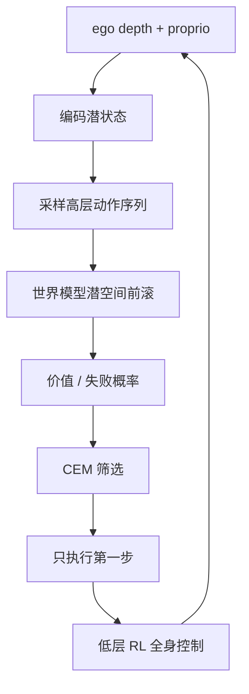
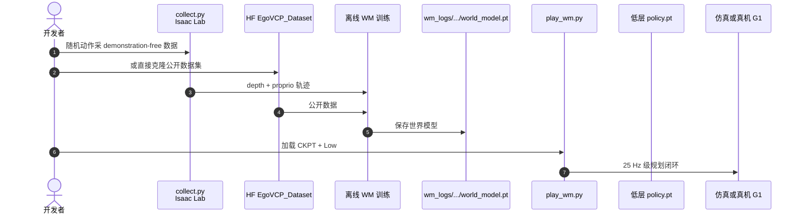

# Ego-VCP（Ego-Vision World Model for Humanoid Contact Planning）

**Ego-VCP**（论文全称 *Ego-Vision World Model for Humanoid Contact Planning*，ICRA 2026，[arXiv:2510.11682](https://arxiv.org/abs/2510.11682)）由 UC Berkeley、UMich、CUHK 提出：用 demonstration-free 离线数据学习压缩潜空间世界模型，再以采样式 MPC 在潜空间展开候选高层动作，完成扶墙、挡飞来物、钻矮拱等接触感知任务。

> 本页同时是 [42 篇 RL 栈 #33](../overview/humanoid-rl-motion-control-body-system-stack.md) 与 [Ego 9 篇 #06](../overview/ego-category-03-world-models.md) 的实体锚点；**不另建重复节点**。

## 一句话定义

**在潜空间里「想几步」：世界模型前滚候选身体命令，价值与失败概率筛选后只执行第一步，并靠高频重规划把模型误差摁住。**

## 英文缩写速查

| 缩写 | 英文全称 | 简要说明 |
|------|----------|----------|
| Ego-VCP | Ego-Vision Contact Planning | 项目简称；论文名含 World Model |
| MPC | Model Predictive Control | 采样式短时域规划 |
| CEM | Cross-Entropy Method | 多轮筛选候选轨迹 |
| WM | World Model | 潜空间动力学与价值/失败估计 |
| G1 | Unitree G1 Humanoid | 真机与仿真平台 |
| RL | Reinforcement Learning | 低层全身控制器训练范式 |

## 为什么重要

- **接触是利用，不是只避碰：** 非结构化环境里扶墙恢复、挡物体、钻受限空间都依赖主动接触后果预测。
- **介于优化规划与在线 RL：** 优化难扩展接触模式；on-policy RL 样本贵、多任务弱；离线 WM + 采样 MPC 兼顾数据效率与多任务。
- **五路径中的 ① 在线规划：** 世界模型有实际决策权，但仍接低层 RL 控制器执行（见[五路径](../overview/wam-motion-control-five-paths.md)）。

## 核心信息

| 项 | 内容 |
|----|------|
| **机构** | 加州大学伯克利分校（UC Berkeley）；密歇根大学（UMich）；香港中文大学（CUHK） |
| **传感** | 本体 + egocentric depth（无外加第三人称） |
| **部署口径** | 高层视觉 MPC 约 **25 Hz**（RTX 2060 笔记本答复）；策展亦记每轮约 **1024** 候选、时域约 **4** 步 |
| **开源** | **已开源**（MIT）：[HybridRobotics/Ego-VCP](https://github.com/HybridRobotics/Ego-VCP) + HF `Hang917/EgoVCP_Dataset` |

## 核心原理

### 分工

| 模块 | 作用 |
|------|------|
| 编码器 | 深度图 + 本体 → 紧凑潜状态 |
| 世界模型 | 沿候选高层动作序列前滚，估计价值/失败 |
| 采样 MPC / CEM | 多轮筛选候选，只执行最优序列第一步 |
| 低层 RL 控制器 | 末端位置、身体高度等高层命令 → 全身关节动作 |

### 流程总览

## 源码运行时序图

## 工程实践

| 步骤 | 命令/入口（README） |
|------|---------------------|
| 安装 | Isaac Lab 环境 + `pip install -e ./rsl_rl -e .` |
| 采集 | `python ego_vcp/scripts/collect.py --task=g1_wall\|g1_ball\|g1_tunnel ...` |
| 数据 | 推荐 clone HF `Hang917/EgoVCP_Dataset` |
| 播放 | `python ego_vcp/scripts/play_wm.py --task=... --model_path=wm_logs/all/world_model.pt` |
| 调试 | 关注世界模型推理耗时；horizon 并非越长越好 |

## 实验与评测

- 任务：扰动后撑墙、拦截来物、穿越限高拱等接触场景。  
- 相对 on-policy RL：更好的样本效率与多任务能力（单模型联合训可接近单任务）。  
- 潜空间可视化：任务可分；模型可捕捉球抛物等任务相关动态。  
- 真机：仅 onboard 噪声相机 + 本体即可稳定接触规划（域随机化见仓库 `g1_wall_env.py`）。

## 结论

**Ego-VCP 说明：人形接触规划需要的世界模型，可以是「低维任务后果预测器 + 高频重规划」，不必先生成高清未来视频。**

- 决策权在潜空间 MPC；执行权在低层控制器。  
- 短时域 + 重规划是对抗模型误差的主手段。  
- 离线随机数据足够支撑多任务接触，关键在表示与价值代理。  
- 开源全流程可复现，适合作为「① 在线规划」参考实现。  
- 与 [HAIC](./paper-haic.md) 对照：HAIC 估隐藏状态补观测，Ego-VCP 在动作空间搜索。

## 局限与风险

- Horizon 过长会放大模型误差并加重 CEM 优化负担。  
- 低层控制器质量封顶上层命令的可执行性。  
- 策展「1024 / 4 步」以项目页/导读为准，精确超参见论文与配置。

## 与其他工作对比

| 工作 | 相对 Ego-VCP |
|------|--------------|
| [RWM-U](./robotic-world-model-eth-rsl.md) / [LIFT](./lift-humanoid.md) | 训练期想象；Ego-VCP 是测试时规划 |
| [HAIC](./paper-haic.md) | 补观测 vs 搜动作 |
| [MotionWAM](./paper-motionwam-humanoid-loco-manipulation-wam.md) | 未来进策略网络；Ego-VCP 显式采样 MPC |

## 关联页面

- [WAM×运动控制五路径](../overview/wam-motion-control-five-paths.md)
- [人形 RL 身体系统栈](../overview/humanoid-rl-motion-control-body-system-stack.md)
- [Ego 世界模型分类](../overview/ego-category-03-world-models.md)
- [Model-Based RL](../methods/model-based-rl.md)

## 参考来源

- [ego_vcp_arxiv_2510_11682.md](../../sources/papers/ego_vcp_arxiv_2510_11682.md)
- [ego-vcp-github-io.md](../../sources/sites/ego-vcp-github-io.md)
- [hybridrobotics_ego_vcp.md](../../sources/repos/hybridrobotics_ego_vcp.md)
- [humanoid_rl_stack_33_ego_vision_world_model_for_humanoid_contact_plan.md](../../sources/papers/humanoid_rl_stack_33_ego_vision_world_model_for_humanoid_contact_plan.md)
- [wechat_embodied_ai_lab_wam_motion_control_five_paths.md](../../sources/blogs/wechat_embodied_ai_lab_wam_motion_control_five_paths.md)

## 推荐继续阅读

- [项目页](https://ego-vcp.github.io/)
- [arXiv:2510.11682](https://arxiv.org/abs/2510.11682)
- [GitHub HybridRobotics/Ego-VCP](https://github.com/HybridRobotics/Ego-VCP)
