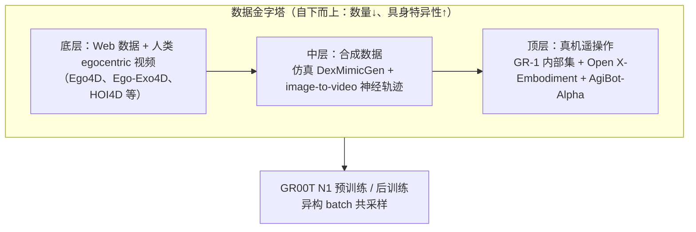
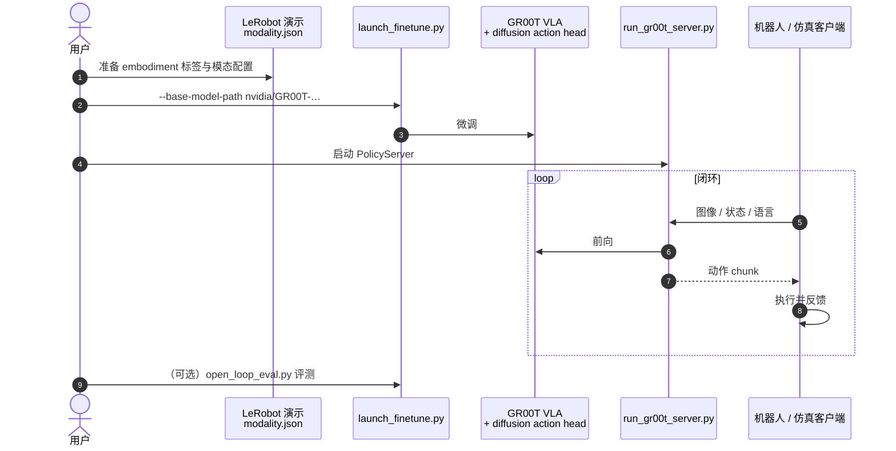

---

type: entity
tags: [paper, humanoid, rl, motion-control, body-system-stack, loco-manipulation, loco-manip-161-survey, nvidia, vla]
status: complete
updated: 2026-07-24
arxiv: "2503.14734"
venue: "2025 · arXiv"
code: https://github.com/NVIDIA/Isaac-GR00T
summary: "GR00T N1（arXiv:2503.14734）是 NVIDIA 开源的人形通才 VLA：Eagle-2 VLM（System 2）+ DiT flow-matching 动作头（System 1），以数据金字塔联合真机/仿真/人类视频预训练；GR00T-N1-2B 在 GR-1 真机双臂操作达 76.8% 平均成功率且 10% 数据仍 42.6%。"
related:
  - ../overview/humanoid-rl-motion-control-body-system-stack.md
  - ../overview/humanoid-amp-motion-prior-survey.md
  - ../overview/humanoid-loco-manip-161-papers-technology-map.md
  - ../overview/loco-manip-161-category-09-vla-world-models.md
  - ../concepts/foundation-policy.md
  - ../methods/vla.md
  - ../methods/diffusion-policy.md
  - ../entities/gr00t-wholebodycontrol.md
  - ../entities/isaac-gr00t.md
  - ./paper-deed.md
sources:
  - ../../sources/papers/gr00t_n1_arxiv_2503_14734.md
  - ../../sources/repos/isaac_gr00t.md
  - ../../sources/papers/humanoid_rl_stack_34_gr00t_n1_an_open_foundation_model_for_generalist.md
  - ../../sources/papers/humanoid_rl_stack_42_catalog.md
  - ../../sources/papers/loco_manip_161_survey_148_gr00t-n1.md
  - ../../sources/papers/humanoid_loco_manip_161_catalog.md
  - ../../sources/blogs/wechat_embodied_ai_lab_humanoid_rl_motion_survey.md
  - ../../sources/blogs/wechat_embodied_ai_lab_humanoid_loco_manip_161_survey.md
---

# GR00T N1

**GR00T N1**（*An Open Foundation Model for Generalist Humanoid Robots*，[arXiv:2503.14734](https://arxiv.org/abs/2503.14734)，[NVIDIA 白皮书](https://d1qx31qr3h6wln.cloudfront.net/publications/GR00T_1_Whitepaper.pdf)，[Isaac-GR00T](https://github.com/NVIDIA/Isaac-GR00T)）是 NVIDIA GEAR 提出的 **开源人形通才基础模型**，面向语言条件的跨具身操作（单臂、双臂、人形）。

> **工程平台：** [Isaac GR00T](../entities/isaac-gr00t.md) — N1.7 GA 代码、LeRobot 数据管线、后训练与部署入口（[Isaac-GR00T](https://github.com/NVIDIA/Isaac-GR00T)）。  
> **深读页：** [gr00t-wholebodycontrol](../entities/gr00t-wholebodycontrol.md) — N1.5/N1.6/N1.7 工程栈、WBC 与部署细节见链接页；本页以 N1 论文机制与评测为主。

## 一句话定义

GR00T N1 是双系统 **Vision-Language-Action（VLA）** 模型：**System 2** 用 Eagle-2 VLM 理解图像与语言指令，**System 1** 用 DiT flow-matching 以 120Hz 生成 action chunk；在 **数据金字塔**（人类视频 → 仿真/神经合成 → 真机遥操作）上端到端联合预训练，公开 **GR00T-N1-2B** checkpoint 并在 Fourier GR-1 真机验证高数据效率。

## 英文缩写速查

| 缩写 | 英文全称 | 简要说明 |
|------|----------|----------|
| VLA | Vision-Language-Action | 视觉-语言-动作多模态策略 |
| VLM | Vision-Language Model | 视觉-语言多模态大模型骨干 |
| DiT | Diffusion Transformer | 以 Transformer 实现的扩散/流匹配生成模块 |
| IDM | Inverse Dynamics Model | 由观测序列反推动作标签的逆动力学模型 |
| LAPA | Latent Action Pretraining from Videos | 从视频学 latent action 的预训练范式（论文中作独立 embodiment） |
| WBC | Whole-Body Control | 协调全身关节满足多任务/约束的控制层 |
| Loco-Manip | Loco-Manipulation | 行走与操作动力学耦合的全身任务 |

## 为什么重要

- 在 [人形 RL 身体系统栈](../overview/humanoid-rl-motion-control-body-system-stack.md) 中属于 **04 视觉闭环 · 任务接口 · 世界模型**（#34/42）。
- 在 [人形 Loco-Manip 161 篇技术地图](../overview/humanoid-loco-manip-161-papers-technology-map.md) 中属于 **09 人形 VLA、世界模型与通用操作**（#148/161）；本页为合并后的 **单一 canonical 实体**。
- 论文把「人形 foundation model」落到可复现开源栈：**GR00T-N1-2B**（总参数 2.2B，其中 VLM 1.34B）、训练数据与 RoboCasa / DexMG / GR-1 仿真 benchmark 一并公开。
- 核心工程贡献不仅是 VLA 口号，而是 **跨具身动作接口**（per-embodiment 状态/动作 MLP、action chunk、latent/IDM 伪动作）与 **数据金字塔共训练**，缓解单一人形硬件数据孤岛问题。

## 核心信息（索引级）

| 字段 | 内容 |
|------|------|
| 原文题目 | GR00T N1: An Open Foundation Model for Generalist Humanoid Robots |
| arXiv | [2503.14734](https://arxiv.org/abs/2503.14734)（[HTML v2](https://arxiv.org/html/2503.14734v2) · [PDF](https://arxiv.org/pdf/2503.14734)） |
| 官方白皮书 | [GR00T_1_Whitepaper.pdf](https://d1qx31qr3h6wln.cloudfront.net/publications/GR00T_1_Whitepaper.pdf)（2025-03-18） |
| 机构 | NVIDIA（GEAR；Linxi Fan、Yuke Zhu 等） |
| 公开模型 | GR00T-N1-2B |
| 代码 | <https://github.com/NVIDIA/Isaac-GR00T> |
| 数据集 | <https://huggingface.co/datasets/nvidia/PhysicalAI-Robotics-GR00T-X-Embodiment-Sim> |
| 真机平台 | Fourier GR-1（语言条件双臂桌面操作） |

### 在 42 篇 RL 运动控制身体系统栈中

| 字段 | 内容 |
|------|------|
| 编号 | 34/42 |
| 系统栈层 | 04 视觉闭环 · 任务接口 · 世界模型 |
| 索引来源 | [具身智能研究室 · 42 篇 humanoid RL 运动控制长文](https://mp.weixin.qq.com/s/hz9JXtJeUPRfUGzfD-pZuA) |

### 在人形 Loco-Manip 161 篇中

| 字段 | 内容 |
|------|------|
| 编号 | 148/161 |
| 分组 | 09 人形 VLA、世界模型与通用操作 |
| 分类 hub | [loco-manip-161-category-09-vla-world-models](../overview/loco-manip-161-category-09-vla-world-models.md) |
| 索引来源 | [具身智能研究室 · 161 篇人形 Loco-Manip 长文](https://mp.weixin.qq.com/s/pACh9EhsISiyPGdiiR0C3A) |

## 核心机制（归纳）

### 1）双系统 VLA 架构

受 Kahneman 双过程理论启发，GR00T N1 将 **推理** 与 **运动生成** 拆为两个 Transformer 模块并端到端联合训练：

| 模块 | 角色 | 关键规格（论文） |
|------|------|------------------|
| **System 2** | Eagle-2 VLM：理解任务语言与视觉场景 | SmolLM2 + SigLIP-2；224×224 图像 → 每帧 64 token；取 **第 12 层** LLM 隐状态（较末层更快且下游成功率更高）；L40 上约 **10Hz** |
| **System 1** | DiT flow-matching：生成闭环电机命令 | cross-attend VLM token；**action chunk** $H=16$；推理 **$K=4$** 步去噪；L40 bf16 采样 16 步动作约 **63.9ms**（≈**120Hz** 闭环） |

每个 robot embodiment 有独立的 **State Encoder / Action Encoder / Action Decoder** MLP，把不同维度的本体状态与动作投影到共享 DiT 隐空间。

### 2）数据金字塔与共训练

- **无动作标签视频：** 训练 VQ-VAE **latent action**（LAPA embodiment）与 **IDM 伪动作**，把人类/神经视频当作额外 embodiment 纳入 flow-matching。
- **神经轨迹：** 在 88 小时 GR-1 遥操作上微调 image-to-video 模型，生成约 **827 小时**（≈10×）反事实语言条件轨迹；后训练可与真机轨迹 **1:1** 共采样。
- **仿真轨迹：** DexMimicGen 在 RoboCasa 框架下将少量人类 demo 扩为大规模人形操作数据；预训练阶段约 **54 万条 / 6500 小时**（11 小时生成）。

### 3）预训练与后训练

- **预训练：** 跨真机、仿真、人类视频与神经轨迹混合采样；人类/神经数据用 latent 或 IDM 标签，真机数据用 ground-truth 动作；最多 **1024×H100**，GR00T-N1-2B 预训练约 **5 万 H100 GPU 小时**。
- **后训练：** 按单一具身微调；默认冻结 VLM **语言** 部分；低数据场景可仅调 adapter（state/action 编解码 + DiT）或连同视觉编码器（A6000 上 batch 最高 200 vs 16）。

## 实验与评测

### 预训练泛化（GR-1 真机，预训练 checkpoint）

| 任务 | 成功率 |
|------|--------|
| 双手递送后放置（物体故意偏左，需左手抓取再交右手） | **76.6%**（11.5/15） |
| 未见物体放入未见容器 | **73.3%**（11/15） |

### 仿真后训练（每任务 100 条 demo，平均成功率）

| 方法 | RoboCasa | DexMG | GR-1 Tabletop | **平均** |
|------|----------|-------|---------------|----------|
| BC-Transformer | 26.3% | 53.9% | 16.1% | 26.4% |
| Diffusion Policy | 25.6% | 56.1% | 32.7% | 33.4% |
| **GR00T-N1-2B** | **32.1%** | **66.5%** | **50.0%** | **45.0%** |

### 真机后训练（GR-1，四类桌面任务平均）

| 方法 | 数据量 | 平均成功率 |
|------|--------|------------|
| Diffusion Policy | 10% | 10.2% |
| Diffusion Policy | 全量 | 46.4% |
| **GR00T-N1-2B** | **10%** | **42.6%** |
| **GR00T-N1-2B** | **全量** | **76.8%** |

10% 数据 GR00T N1 仅比 DP 全量低 3.8 个百分点；神经轨迹共训练在 RoboCasa 低数据区额外带来约 **+4%～+9%** 平均增益。

### 局限（论文 §4.6）

当前 N1 主要覆盖 **短视界桌面操作**；长视界 loco-manipulation、更强空间推理 VLM、物理一致合成数据与架构仍属后续方向（与 [Foundation Policy](../concepts/foundation-policy.md) 中 GR00T N1.5+ 演进线对照阅读）。

## 源码运行时序图

官方参考实现 [NVIDIA/Isaac-GR00T](https://github.com/NVIDIA/Isaac-GR00T)：微调 `gr00t/experiment/launch_finetune.py`；推理 `scripts/deployment/standalone_inference_script.py` 或 `gr00t/eval/run_gr00t_server.py`；开环评估 `gr00t/eval/open_loop_eval.py`。数据为 GR00T LeRobot 格式 + `modality.json`。一次完整运行如下：

- **N1 论文机制 vs N1.5+ 工程**：本时序对应当前 Isaac-GR00T 发布栈；版本号以模型卡为准。
- **全身低层**常再接 [SONIC / GR00T-WholeBodyControl](../methods/sonic-motion-tracking.md)。

## 常见误区

1. **VLA 条目解决接口与预测，不自动替代底层 WBC** — 真机执行仍依赖 Fourier GR-1 全身 IK / 控制栈；高层策略与低层运控需分层验证（见 [gr00t-wholebodycontrol](../entities/gr00t-wholebodycontrol.md)）。
2. **后训练会洗掉部分预训练行为** — 论文指出仅右手数据的 post-training 可能丢失预训练学到的双手递送等能力。
3. **161 篇策展坐标 ≠ 论文全部指标** — 仿真/真机数字以 arXiv / 白皮书为准；策展公众号提供地图定位，不替代原文 benchmark。

## 与其他页面的关系

- 概念层：[foundation-policy.md](../concepts/foundation-policy.md)、[vla.md](../methods/vla.md)
- 方法对照：[diffusion-policy.md](../methods/diffusion-policy.md)
- **长程上下文 / 部署后学习：** [RoboTTT](./paper-robottt-test-time-training-vla-context.md) — 在 **GR00T N1.7** 上内嵌 TTT fast-weight 层，把 visuomotor 上下文扩到 8K 步（项目页，2026）
- **零售真机后训练配方（未开源）：** [DEED](./paper-deed.md) — G1-Edu + GR00T N1.6 薯片补货；Data-Efficient SFT + 文本 advantage 前缀 RECAP
- 工程平台：[isaac-gr00t.md](../entities/isaac-gr00t.md)
- 工程深读：[gr00t-wholebodycontrol.md](../entities/gr00t-wholebodycontrol.md)
- RL 身体系统栈：[humanoid-rl-motion-control-body-system-stack.md](../overview/humanoid-rl-motion-control-body-system-stack.md)
- Loco-Manip 161 篇：[humanoid-loco-manip-161-papers-technology-map.md](../overview/humanoid-loco-manip-161-papers-technology-map.md)

## 参考来源

- [isaac_gr00t.md](../../sources/repos/isaac_gr00t.md) — Isaac-GR00T 仓库与 N1.7 GA 工程摘录
- [gr00t_n1_arxiv_2503_14734.md](../../sources/papers/gr00t_n1_arxiv_2503_14734.md) — arXiv:2503.14734 + NVIDIA 白皮书策展摘录
- [humanoid_rl_stack_34_gr00t_n1_an_open_foundation_model_for_generalist.md](../../sources/papers/humanoid_rl_stack_34_gr00t_n1_an_open_foundation_model_for_generalist.md) — 42 篇栈策展摘录
- [loco_manip_161_survey_148_gr00t-n1.md](../../sources/papers/loco_manip_161_survey_148_gr00t-n1.md) — Loco-Manip 161 #148 策展摘录
- arXiv：<https://arxiv.org/abs/2503.14734>
- 白皮书：<https://d1qx31qr3h6wln.cloudfront.net/publications/GR00T_1_Whitepaper.pdf>
- 代码：<https://github.com/NVIDIA/Isaac-GR00T>
- 数据集：<https://huggingface.co/datasets/nvidia/PhysicalAI-Robotics-GR00T-X-Embodiment-Sim>

## 推荐继续阅读

- [机器人论文阅读笔记：GR00T N1 Humanoid Foundation Model](https://imchong.github.io/Humanoid_Robot_Learning_Paper_Notebooks/papers/03_High_Impact_Selection/GR00T_N1_Humanoid_Foundation_Model/GR00T_N1_Humanoid_Foundation_Model.html)
- [42 篇 RL 运动控制（微信公众号）](https://mp.weixin.qq.com/s/hz9JXtJeUPRfUGzfD-pZuA)
- [161 篇 Loco-Manip（微信公众号）](https://mp.weixin.qq.com/s/pACh9EhsISiyPGdiiR0C3A)
- [GR00T-WholeBodyControl 仓库实体](./gr00t-wholebodycontrol.md)
