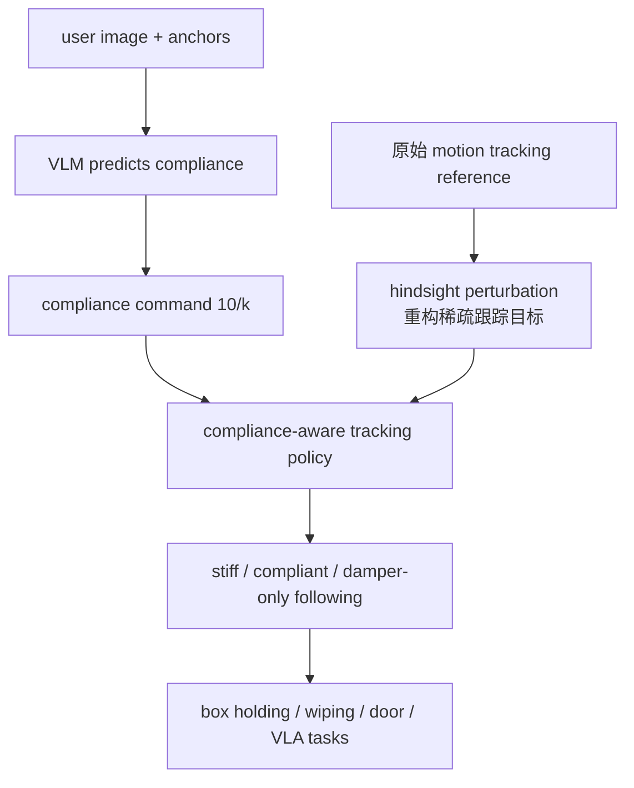

# CHIP

**CHIP**（*Learning Adaptive Compliance for Humanoid Control through Hindsight Perturbation*）把末端刚度变成 motion tracking controller 的可调输入：策略仍能跟踪任意参考运动，但在接触任务中可按需要变软、变硬或连续调节柔顺。

## 一句话定义

CHIP 用 hindsight perturbation 让人形跟踪策略学会可调 compliance，从而在搬箱、擦白板、开门、协作抓取等任务中按接触需求切换软硬。

## 英文缩写速查

| 缩写 | 英文全称 | 简要说明 |
|------|----------|----------|
| CHIP | Compliant control through Hindsight Perturbation | 本文方法名 |
| VLA | Vision-Language-Action | 项目页用 GR00T N1.5 微调自主任务 |
| GR00T | Generalist Robot 00 Technology | 自主 VLA baseline/finetune 模型 |
| RL | Reinforcement Learning | CHIP 插入 humanoid motion tracking 训练 |
| EE | End-Effector | 柔顺控制主要作用于末端执行器 |
| VLM | Vision-Language Model | Gemini 可从图像预测合适 compliance |

## 为什么重要

- **柔顺不是离散开关**：空箱、装湿巾、装哑铃需要不同 `10/k`；项目页示例从 0.5、0.3 到 0.2 连续调节。
- **训练代价低**：CHIP 不做 SoftMimic 式 IK 数据增广，也不额外调 reward，而是把原参考动作事后解释为扰动后的目标。
- **可接入上层 VLA**：Gemini 可根据少量 anchor examples 从图像预测 compliance；GR00T N1.5 用 CHIP 数据做自主擦白板/搬箱。
- **多人/多机协作相关**：在 SpringGrasp 规划下，CHIP 支持多机器人协同抓球/箱并移动。

## 流程总览

## 核心原理（详细）

CHIP 的关键是 hindsight perturbation：训练时不用真的修改参考动作，而是在目标观测中扣除扰动偏移，让策略把受力后的偏移视为合理状态。这使策略不会一受外力就强行拉回原位置，也不会完全放弃全局轨迹。compliance command 基于 Hooke's law，有物理含义，因此可以被人手调节或由 VLM 预测。

项目页展示三种 HRI 模式：低 compliance + global tracking（刚性抵抗扰动）、高 compliance + global tracking（受扰后回到轨迹）、damper-only local following（近似无限柔顺，跟随人引导）。

## 关键实验数字

| 任务 | 项目页报告 |
|------|------------|
| Small whiteboard wiping | GR00T N1.5 + CHIP 数据，task success **80%** |
| Large whiteboard wiping | task success **60%** |
| Box lifting | task success **90%**，20 次连续评估中前 10 次展示成功 rollout |
| Box with dumbbell | compliance `10/k=0.25` 合适；0.15 太硬、0.425 太软 |

## 源码运行时序图

**不适用**：项目页多处标注 **Code (Coming Soon)**，并写明 “Stay tuned for more videos and code release in 1 month.” 截至 2026-07-22 未确认官方可运行仓库。

## 工程实践（含开源状态）

| 项 | 结论 |
|----|------|
| 项目页 | <https://nvlabs.github.io/CHIP/> |
| 代码 | Coming Soon，未确认可运行实现 |
| 上层集成 | Gemini compliance prediction；GR00T N1.5 VLA finetune |
| 典型任务 | Christmas gift delivery、wipe/write、phone room delivery、waste box disposal、multi-robot grasping |

## 与其他工作对比

CHIP 在「为什么重要」和核心原理里明确对照 SoftMimic 式的 compliance 数据增广，关联页面又把它与上半身阻抗柔顺的 GentleHumanoid、强发力方向的 Thor 并列。三者同属接触/柔顺一线，但落点不同。下表为定性对照，不含跨论文可比的统一指标。

| 维度 | CHIP | SoftMimic（增广式柔顺） | GentleHumanoid | Thor |
|------|------|-------------------------|----------------|------|
| 目标 | 给已有跟踪策略加连续可调末端柔顺 | 让跟踪策略获得柔顺行为 | 上半身接触柔顺、限制接触力 | 强接触下的全身大力反应 |
| 核心机制 | hindsight perturbation 事后重构跟踪目标 | IK 数据增广生成柔顺示范 | 肩-肘-腕虚拟阻抗参考动力学 | FAT2 力自适应躯干倾斜 + 分体共享观测 |
| 训练代价 | 不改参考、不加 reward，代价低 | 需要额外 IK 增广数据 | 阻抗参考动力学建模 | RL 分体架构训练 |
| 柔顺可调性 | 连续 `10/k`，可人手调或 VLM 预测 | 取决于增广覆盖 | 由阻抗参数与力阈值约束 | 偏强发力，非可调软硬 |
| 上层接入 | Gemini 从图像预测 compliance；GR00T N1.5 VLA | 未强调 | 面向拥抱/搀扶/软物体 | 面向拉车/开门/拖架强交互 |
| 谱系定位 | 柔顺侧，安全可调 | 柔顺侧，数据驱动 | 柔顺侧，安全优先 | 强发力侧，与柔顺相对 |

## 局限与风险

- **代码未开放**：无法验证 hindsight target reconstruction 的具体实现。
- **柔顺值仍需任务语义**：VLM 可预测但需要 anchor examples，错误 compliance 会导致太软/太硬失败。
- **不等于力控传感闭环**：CHIP 是 compliance-aware tracking，不一定显式测量/闭环控制接触力。

## 关联页面

- [Loco-Manip 接触分类 04：接触后如何稳住](../overview/loco-manip-contact-category-04-post-contact-stability.md)
- [运动小脑 · I 柔顺接触](../overview/motion-cerebellum-category-09-compliance-contact.md)
- [阻抗控制](../concepts/impedance-control.md)
- [GentleHumanoid](./paper-gentlehumanoid.md)
- [Thor](./paper-hrl-stack-42-thor.md)
- [HMC](./paper-loco-manip-161-039-hmc.md)

## 参考来源

- [humanoid_rl_stack_36_chip_adaptive_compliance_for_humanoid_control_th.md](../../sources/papers/humanoid_rl_stack_36_chip_adaptive_compliance_for_humanoid_control_th.md)
- [humanoid_rl_stack_42_catalog.md](../../sources/papers/humanoid_rl_stack_42_catalog.md)
- [wechat_embodied_ai_lab_humanoid_rl_motion_survey.md](../../sources/blogs/wechat_embodied_ai_lab_humanoid_rl_motion_survey.md)
- [loco-manip-contact-category-04-post-contact-stability](../overview/loco-manip-contact-category-04-post-contact-stability.md)
- [wechat_embodied_ai_lab_loco_manip_contact_survey.md](../../sources/blogs/wechat_embodied_ai_lab_loco_manip_contact_survey.md)
- Chen et al., *CHIP: Learning Adaptive Compliance for Humanoid Control through Hindsight Perturbation*, arXiv:2512.14689, 2025. <https://arxiv.org/abs/2512.14689>

## 推荐继续阅读

- [CHIP 项目页](https://nvlabs.github.io/CHIP/)
- [SpringGrasp](https://stanford-tml.github.io/SpringGrasp/)
- [GentleHumanoid](./paper-gentlehumanoid.md)
