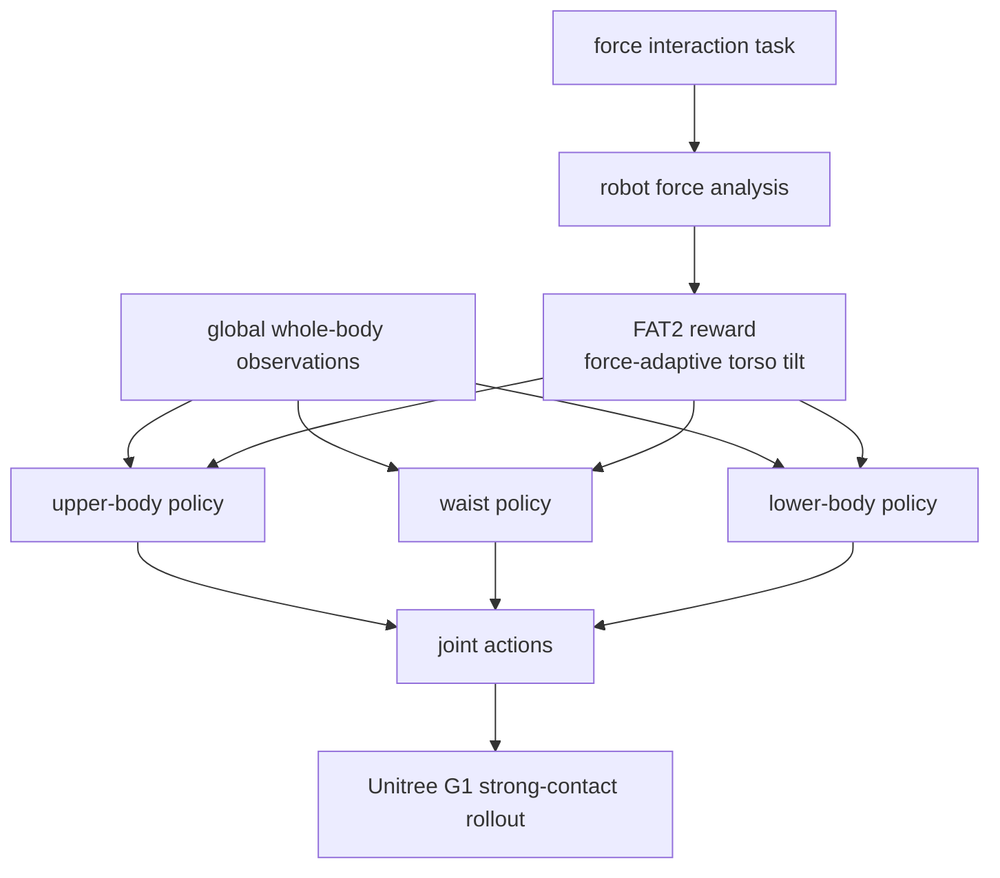

# Thor

**Thor**（*Towards Human-Level Whole-Body Reactions under Intense Contact-Rich Environments*）研究人形机器人在强接触下如何像人一样用躯干、腰、上肢和下肢协同发力，而不是只靠手臂或脚步局部补偿。

## 一句话定义

Thor 用 force-adaptive torso-tilt reward 和分体共享观测 RL 架构，让 Unitree G1 在拉、推、开门、拖架等强接触任务中产生全身反应。

## 英文缩写速查

| 缩写 | 英文全称 | 简要说明 |
|------|----------|----------|
| FAT2 | Force-Adaptive Torso-Tilt | 鼓励受力时产生人类式躯干倾斜的奖励 |
| RL | Reinforcement Learning | Thor 控制架构训练范式 |
| WBC | Whole-Body Control | 强接触下需要全身协调 |
| G1 | Unitree G1 | 实验部署平台，约 35 kg |
| N | Newton | 项目页报告的拉力/门力单位 |
| VLA | Vision-Language-Action | 项目页招募方向提到的相关研究线，但非本文核心 |

## 为什么重要

- **从柔顺转向强发力**：GentleHumanoid/CHIP 偏安全和可调柔顺，Thor 关注强接触下如何输出更大、更稳定作用力。
- **躯干是关键**：强拉/推时人会前倾/后倾，Thor 用 FAT2 reward 明确奖励这种力-躯干关系。
- **架构分解高维控制**：上身、腰、下身解耦，但共享全身观测并联合更新，降低高维人形控制难度。
- **量化力指标明确**：后拉 **167.7 ± 2.4 N**、前拉 **145.5 ± 2.0 N**，分别较最佳 baseline 提升 **68.9%**、**74.7%**。

## 流程总览

## 核心原理（详细）

Thor 的主要技术路线有两点。第一，基于受力分析设计 FAT2 reward，让机器人在不同交互方向下学会合适的 torso tilt，从而把地面支撑、重心、手部作用力联动起来。第二，RL 架构把上身、腰和下身拆成组件，各组件共享全身观测并联合更新，既降低控制维度，又避免局部策略互相冲突。

项目页强调即使缺少外部力传感和精细力控制，Thor 也能完成白板清洁、拖动重物、开防火门等强接触动作；这说明其主要贡献在身体姿态和全身反作用力协调，而不是高带宽力传感器闭环。

## 关键实验数字

| 任务/指标 | 数值 |
|-----------|------|
| G1 平台质量 | 约 **35 kg** |
| 后退峰值拉力 | **167.7 ± 2.4 N**，约 G1 体重 **48%** |
| 前进峰值拉力 | **145.5 ± 2.0 N** |
| 相对最佳 baseline 提升 | 后拉 **68.9%**，前拉 **74.7%** |
| loaded rack | **130 N** |
| fire door | 单手约 **60 N** |
| car-pulling demo | 车辆+负载约 **1,400 kg** |
| wheelchair | 约 **75 kg** |
| rack | 约 **85 kg** |

## 源码运行时序图

**不适用**：项目页代码按钮标注 **Code (Coming Soon)**，未确认可运行仓库。

## 工程实践（含开源状态）

| 项 | 结论 |
|----|------|
| 项目页 | <https://baai-aether.github.io/baai-thor/> |
| 代码 | Coming Soon，未确认可运行实现 |
| 平台 | Unitree G1 |
| 任务 | 拉车、开防火门、拖货架、操作轮椅、擦白板 |
| 适用场景 | 工业/救援/服务中需要大力持续交互的场景 |

## 局限与风险

- **强力任务需安全边界**：167 N 级拉力用于服务场景时需严格人机隔离和急停。
- **缺少细力控**：项目页说明白板任务无外部力 sensing 和 fine force control，可能带来冲击。
- **代码未开放**：不能复现 FAT2 reward 与三分体策略细节。
- **不是精细 manipulation**：关注全身强反应，不解决灵巧手/高精度接触。

## 关联页面

- [Loco-Manip 接触分类 04：接触后如何稳住](../overview/loco-manip-contact-category-04-post-contact-stability.md)
- [运动小脑 · I 柔顺接触](../overview/motion-cerebellum-category-09-compliance-contact.md)
- [Whole-Body Control](../concepts/whole-body-control.md)
- [FALCON](./paper-loco-manip-161-109-falcon.md)
- [CHIP](./paper-hrl-stack-36-chip.md)
- [GentleHumanoid](./paper-gentlehumanoid.md)

## 参考来源

- [humanoid_rl_stack_42_thor_towards_human_level_whole_body_reactions_fo.md](../../sources/papers/humanoid_rl_stack_42_thor_towards_human_level_whole_body_reactions_fo.md)
- [humanoid_rl_stack_42_catalog.md](../../sources/papers/humanoid_rl_stack_42_catalog.md)
- [wechat_embodied_ai_lab_humanoid_rl_motion_survey.md](../../sources/blogs/wechat_embodied_ai_lab_humanoid_rl_motion_survey.md)
- [loco-manip-contact-category-04-post-contact-stability](../overview/loco-manip-contact-category-04-post-contact-stability.md)
- [wechat_embodied_ai_lab_loco_manip_contact_survey.md](../../sources/blogs/wechat_embodied_ai_lab_loco_manip_contact_survey.md)
- Li et al., *Thor: Towards Human-Level Whole-Body Reactions under Intense Contact-Rich Environments*, arXiv:2510.26280, 2025. <https://arxiv.org/abs/2510.26280>

## 推荐继续阅读

- [Thor 项目页](https://baai-aether.github.io/baai-thor/)
- [FALCON](./paper-loco-manip-161-109-falcon.md)
- [CHIP](./paper-hrl-stack-36-chip.md)
