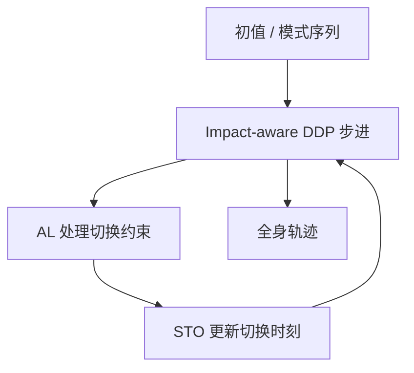
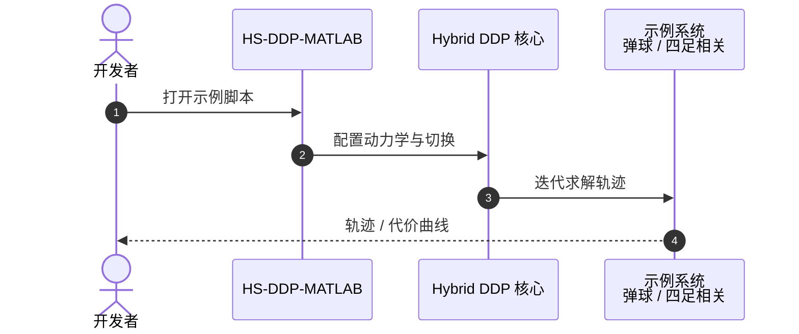

# Hybrid Systems DDP for Whole-Body Motion Planning

## 一句话定义

**Li & Wensing（圣母大学，[arXiv:2006.08102](https://arxiv.org/abs/2006.08102)）** 提出 **HS-DDP**：把 Differential Dynamic Programming 扩展到**状态切换混合系统**，用冲击感知步进、增广拉格朗日处理切换约束，并优化切换时刻，服务腿足全身运动规划。

## 英文缩写速查

| 缩写 | 英文全称 | 简要说明 |
|------|----------|----------|
| DDP | Differential Dynamic Programming | 轨迹优化的二阶方法族 |
| HS-DDP | Hybrid Systems DDP | 本文混合系统扩展 |
| AL | Augmented Lagrangian | 处理切换约束的增广拉格朗日 |
| STO | Switching Time Optimization | 切换时刻优化 |
| TO | Trajectory Optimization | 轨迹优化总称 |

## 为什么重要

- 腿足本质是 hybrid（触地/离地冲击），标准平滑 DDP 不够。
- 为 [MHPC](./paper-mhpc.md) 等模型层级预测控制提供可配对的 TO 后端叙事。
- MATLAB 示例仓降低算法入门成本。

## 核心信息

| 项 | 内容 |
|----|------|
| **机构** | 圣母大学（University of Notre Dame） |
| **方法** | impact-aware DDP + AL + STO |
| **开源** | **部分开源** [HS-DDP-MATLAB](https://github.com/ROAM-Lab-ND/HS-DDP-MATLAB) |

## 核心原理

1. **Impact-aware DDP：** 显式处理触地冲击映射。
2. **AL 切换约束：** 把模式切换条件纳入可数值求解形式。
3. **STO：** 利用混合结构优化接触切换时刻，而非只优化连续控制。

## 源码运行时序图

## 工程实践

| 项 | 建议 |
|----|------|
| 入门 | 先跑弹球等低维 hybrid 示例，再看四足 bounding |
| 与 MPC | HS-DDP 偏离线/规划；在线部署常嵌进 MHPC 或缩短时域 |
| 真机 | 需另接状态估计与跟踪控制器（如 Mini Cheetah 栈） |

## 评测

| 维度 | 要点 |
|------|------|
| 问题类 | 固定序列/时刻可扩展的 hybrid TO |
| 应用 | 腿足全身运动规划 |
| 代码 | MATLAB 公开示例 |

## 结论

**总判：** HS-DDP 把「触地冲击 + 切换约束 + 切换时刻」收进 DDP 工具箱，是读懂 Notre Dame 腿足最优控制线的算法锚点。

- 真影响：hybrid 事件可微分规划。
- 次要代价：MATLAB 原型 ≠ 实时嵌入式。
- 部署：算法验证用官方 MATLAB；真机跟踪另选。

## 与其他工作对比

| 对照对象 | 差异要点 |
|----------|----------|
| 标准平滑 DDP | 假设动力学连续可微；HS-DDP 显式处理触地冲击映射、切换约束（AL）与切换时刻（STO） |
| [MHPC](./paper-mhpc.md) | MHPC 是在线模型层级预测控制；HS-DDP 偏离线/规划 TO 后端，二者同属 ROAM 工具链、可配对使用 |
| [Mini Cheetah 栈](./mit-mini-cheetah.md) | HS-DDP 只产出全身轨迹，真机部署需另接状态估计与跟踪控制器（如 Cheetah-Software 栈） |

## 局限与风险

- 接触序列仍常需先验或启发式。
- 高维全身实时性挑战大。

## 关联页面

- [MHPC](./paper-mhpc.md)
- [Optimal Control](../concepts/optimal-control.md)
- [MIT Mini Cheetah](./mit-mini-cheetah.md)
- [MPC](../methods/model-predictive-control.md)

## 参考来源

- [论文归档](../../sources/papers/hs_ddp_legged_arxiv_2006_08102.md)
- [HS-DDP-MATLAB](../../sources/repos/roam-lab-nd-hs-ddp-matlab.md)

## 推荐继续阅读

- arXiv：<https://arxiv.org/abs/2006.08102>
- 代码：<https://github.com/ROAM-Lab-ND/HS-DDP-MATLAB>
