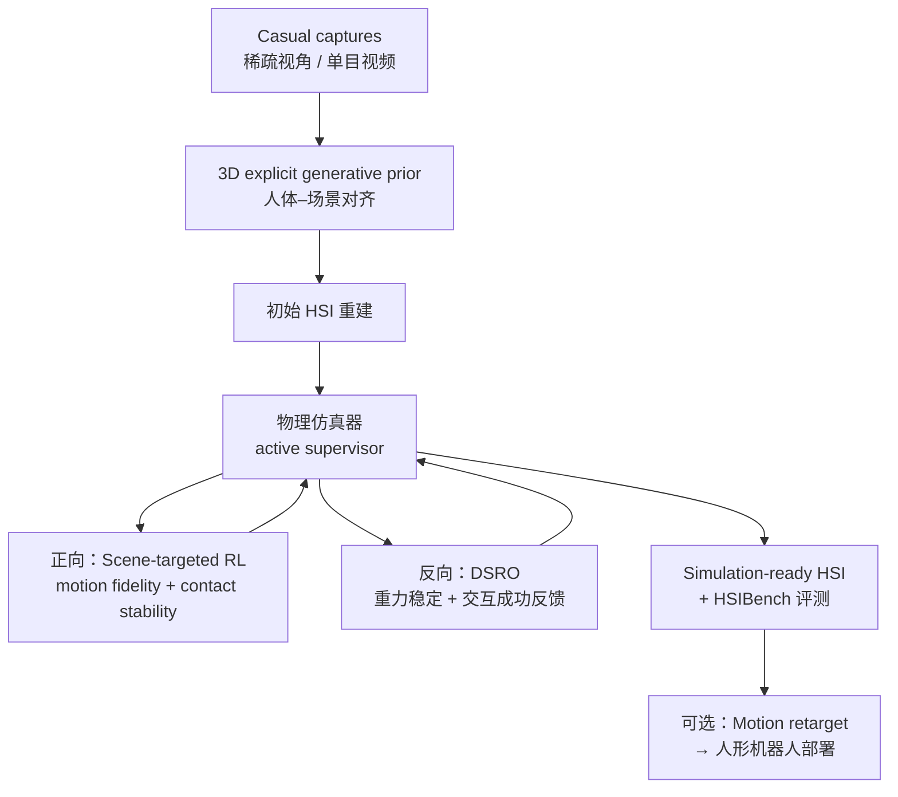

# HSImul3R：物理在环的 simulation-ready 人–场景交互重建

**HSImul3R**（*Physics-in-the-Loop Reconstruction of Simulation-Ready Human–Scene Interactions*，arXiv:[2603.15612](https://arxiv.org/abs/2603.15612)，[项目页](https://yukangcao.github.io/HSImul3R/)）由 **NTU S-Lab、上海 AI Lab、ACE Robotics** 等提出：从 **稀疏视角图像或单目视频** 重建 **可直接进物理引擎** 的人–场景交互（HSI），用 **仿真器作 active supervisor** 的 **双向优化** 同时 refine **人体动力学** 与 **场景几何**，并发布 **HSIBench** 基准；项目页展示优化后人体运动 **可迁移部署到人形机器人**。

## 一句话定义

**把物理仿真器嵌入 HSI 重建闭环：正向用 scene-targeted RL 在 motion fidelity 与 contact stability 下优化人体运动，反向用 DSRO 据仿真反馈 refine 场景几何，输出 simulation-ready 的 3D HSI 而非仅视觉 plausible 的重建。**

## 英文缩写速查

| 缩写 | 英文全称 | 简要说明 |
|------|----------|----------|
| HSI | Human–Scene Interaction | 人与场景物体（坐、扶、搬等）的交互 |
| DSRO | Direct Simulation Reward Optimization | 反向 pass：用仿真稳定/交互奖励优化场景几何 |
| RL | Reinforcement Learning | 正向 pass：scene-targeted RL 优化人体运动 |
| Sim2Real | Simulation to Real | 仿真就绪重建 → 重定向/控制 → 真机部署链路 |

## 为什么重要

- **感知–仿真鸿沟：** 纯视觉重建常 **看起来对、仿真里倒**；具身 AI 与人形部署需要 **contact-stable、重力一致** 的 HSI，不是 mesh 好看即可。
- **仿真器当监督者：** 与 [DIMOS](./paper-dimos-human-scene-motion-synthesis.md) 等 **RL 合成运动** 或 [COINS](./paper-coins-compositional-human-scene-interaction.md) 等 **静态姿态生成** 不同，本文强调 **physics-in-the-loop 重建**——优化目标直接对齐物理引擎可执行性。
- **机器人接口：** 与 [PhysHSI](./paper-amp-survey-15-physhsi.md)、[TokenHSI](./paper-bfm-38-tokenhsi.md) 等 **控制侧 HSI** 互补：前者解决 **怎么在真机做交互**，HSImul3R 解决 **怎么从 casual video 得到可仿真/可 retarget 的交互资产**。

## 流程总览

## 源码运行时序图

**不适用**（截至 2026-09-10）：官方仓库 [yukangcao/HSImul3R](https://github.com/yukangcao/HSImul3R) 仅有 README 与 `docs/` 静态资源，**无** 可辨识的训练/推理/数据加载入口；待代码发布后应按 `sources/repos/hsimul3r.md` 补全 `sequenceDiagram`。

## 核心机制（归纳）

### 1）3D explicit generative prior

- 在重建管线前注入 **显式 3D 生成先验**，改善人体 mesh/运动与场景几何的 **初始对齐**，为后续物理优化提供合理初值。

### 2）正向 pass：Scene-targeted RL

- 在仿真中 **优化人体运动**，双重监督：
  - **Motion fidelity** — 不偏离观测/先验过远；
  - **Contact stability** — 交互接触在物理引擎中稳定、可执行。

### 3）反向 pass：DSRO（Direct Simulation Reward Optimization）

- 用仿真反馈 **refine 场景几何**（物体 pose、支撑关系等）。
- **四类反馈（项目页）：**
  - Type 1 — 物体在重力下未稳定；
  - Type 2 — 人体交互过程中物体未稳定；
  - Type 3 — 物体稳定但 **无 meaningful interaction**；
  - Type 4 — 物体稳定且 **有有效交互**（目标状态）。

### 4）HSIBench

- **16-view 同步采集**，覆盖多样 **场景物体、受试者、动作** 的人–场景交互；用于评测 reconstruction → simulation-ready 质量（细节以论文为准）。

## 工程实践

| 项 | 说明 |
|----|------|
| 输入模态 | 稀疏视角图像、单目视频（casual captures） |
| 输出 | Simulation-ready 3D HSI（人体运动 + 场景几何） |
| 评测 | HSIBench + 论文 extensive experiments |
| 机器人链路 | 优化人体运动 → [Motion Retargeting](../concepts/motion-retargeting.md) → 人形控制栈（对照 [PhysHSI](./paper-amp-survey-15-physhsi.md)） |
| 复现入口 | [GitHub](https://github.com/yukangcao/HSImul3R) — **占位仓库**，见下节开源状态 |

## 局限与风险

- **开源状态（2026-09-10 项目页 + 仓库核查）：** GitHub 已建库但 **无可运行代码/权重/HSIBench 下载脚本** → **部分开源（占位）**；选型时勿假设可立即复现 pipeline。
- **≠ 端到端真机控制器：** 本文是 **重建 + 物理 refine**；落地机器人仍需 retarget、跟踪或 AMP/RL 控制层。
- **≠ 静态姿态库：** 与 [COINS](./paper-coins-compositional-human-scene-interaction.md) 不同，强调 **动态、可仿真** 的交互轨迹。
- **仿真器依赖：** DSRO 与 scene-targeted RL 的质量受 **物理引擎参数、接触模型** 影响；跨引擎迁移需重新标定。

## 实验与评测

- 论文与项目页报告：相对现有 HSI 重建，HSImul3R 产生 **首个 stable、simulation-ready** 的重建结果，并展示 **人形机器人部署** 视频。
- **量化表格、消融与 HSIBench 协议** 以 [PDF](https://arxiv.org/pdf/2603.15612) 与项目页为准；本页为知识库归纳，不替代原文数字。

## 结论

**HSImul3R 把 HSI 重建的评价标准从「视觉 plausible」推到「仿真器可执行」，双向物理优化是核心，3D 先验与 HSIBench 是工程落地配套。**

1. **仿真器必须是 active supervisor** — 正向 RL 保 motion + contact，反向 DSRO 修场景；单 pass 视觉重建不够。
2. **DSRO 四类反馈** — 区分「重力不稳 / 交互不稳 / 无交互 / 有效交互」，避免把 Type 3 误判为成功重建。
3. **与控制栈分工** — 输出是 **simulation-ready 资产**，不是 G1 策略；接 [PhysHSI](./paper-amp-survey-15-physhsi.md) 类控制前需 retarget 与接触验证。
4. **HSIBench** — 16-view 同步数据是评测 reconstruction→simulation 的关键基准，发布进度需跟踪仓库。
5. **复现风险** — 截至入库日 **占位 GitHub**，论文结论的可复现性 **待代码/数据发布** 后再评估。
6. **选型读法** — 需要 **从手机/稀疏相机得到可进 Isaac/MuJoCo 的 HSI** 时优先考虑；仅需 SMPL 动画合成可看 [DIMOS](./paper-dimos-human-scene-motion-synthesis.md)。

## 与其他页面的关系

- 运动 **合成**（RL）：[DIMOS](./paper-dimos-human-scene-motion-synthesis.md)
- 静态 **语义姿态**：[COINS](./paper-coins-compositional-human-scene-interaction.md)
- 人形 **HSI 控制**：[PhysHSI](./paper-amp-survey-15-physhsi.md)、[TokenHSI](./paper-bfm-38-tokenhsi.md)
- 任务：[loco-manipulation](../tasks/loco-manipulation.md)；概念：[Motion Retargeting](../concepts/motion-retargeting.md)

## 参考来源

- [hsimul3r_arxiv_2603_15612.md](../../sources/papers/hsimul3r_arxiv_2603_15612.md) — 论文归档与 wiki 映射
- [hsimul3r-github-io.md](../../sources/sites/hsimul3r-github-io.md) — 项目页与开源核查
- [hsimul3r.md](../../sources/repos/hsimul3r.md) — GitHub 占位仓库结构
- 论文：<https://arxiv.org/abs/2603.15612>

## 推荐继续阅读

- [HSImul3R 项目页](https://yukangcao.github.io/HSImul3R/) — Pipeline 动画与人形迁移演示
- [arXiv:2603.15612](https://arxiv.org/abs/2603.15612) — 完整方法与 HSIBench 细节
- [PhysHSI（真机 HSI 控制）](./paper-amp-survey-15-physhsi.md) — 重建资产之后的控制侧对照
