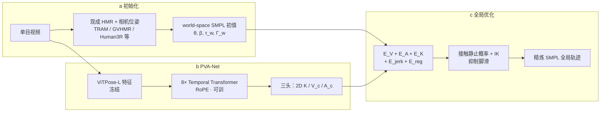

# HTD-Refine：对齐高阶时序动力学的单目人体运动恢复

**HTD-Refine**（arXiv:2605.26879，CVPR 2026 Oral Award Candidate，浙大 / Ant / UT Austin）研究 **单目 world-grounded Human Motion Recovery（HMR）** 中「**位置误差低但运动不自然**」的瓶颈：轨迹常 **过平滑** 或 **抖动**，根因是缺乏可靠的 **高阶时序线索**（速度、加速度）。方法不替换现有 HMR 网络，而是以 **PVA-Net** 预测的速度–加速度场 + 2D 关键点，对 **TRAM / GVHMR / Human3R** 等初始化做 **序列级后处理优化**，在 EMDB-2、RICH 等野外基准上同时改善 **Jitter、MPJVE/MPJAE、WA/W-MPJPE**。

## 为什么重要

- **机器人上游质量：** [Whole-Body Tracking Pipeline](../concepts/whole-body-tracking-pipeline.md) 与 [Motion Retargeting Pipeline](../concepts/motion-retargeting-pipeline.md) 中，**GVHMR / WHAM** 等视频估计源噪声会在 **GMR 重定向与 tracking 奖励** 里被放大；HTD-Refine 提供 **与具体 HMR 骨干解耦** 的动力学精炼层，适合作为「视频 → SMPL → 机器人」链路的 **可选后处理**。
- **指标维度扩展：** 除 MPJPE / RTE 外，论文强调 **MPJVE（速度）** 与 **MPJAE（加速度）**，把「感知自然度」从隐式平滑 prior 转为 **可监督、可优化** 的目标——与动捕级工业管线（OptiTrack 等）对高频细节的诉求对齐。
- **加速度相对速度的尺度鲁棒性：** 在相机系监督 **二阶差分**，减轻单目 **全局尺度歧义** 与 **低频相机漂移** 对一阶速度的污染，这是选择 acceleration field 而非仅 velocity matching 的核心设计论据。

## 流程总览

## 核心机制（归纳）

### 1）Initialization（沿用基线 HMR）

- 相机系 SMPL $\{\theta^t, \beta, \tau_c^t, \Gamma_c^t\}$ 与外参 $\{R_c^t, t_c^t\}$ 经式 (1)(2) 合成 **world 根朝向与平移**；局部关节角与 shape 不变。
- 初始化 **位置大致正确** 但 **缺高阶动力学**，为后续精炼提供 $E_{\text{reg}}$ 锚点。

### 2）PVA-Net（Position–Velocity–Acceleration）

| 组件 | 说明 |
|------|------|
| 骨干 | **ViTPose-L** 提每帧空间特征（冻结） |
| 时序 | **8 层 Transformer + RoPE**，建模 onset / reversal / rhythm |
| 输出 | 2D keypoints $K^t$；相机系速度 $V_c^t$、加速度 $A_c^t$ |
| 训练 | BEDLAM、RICH、H36M；$L_H + L_V + L_A + L_{\text{tgm}}$ |
| 动机 | 速度受尺度/漂移影响大；**加速度** 强调曲率事件，监督更干净 |

相对单帧 ViTPose，PVA-Net 提供 **时序稳定 2D** 与 **显式高阶 3D 场**，供优化阶段同时约束几何与动态。

### 3）全局 Motion Optimization

- **变量：** 优化 $\theta_w, \Gamma_w, \tau_w$（$\beta$ 固定）；经 SMPL + 投影得 $\mathbf{K}, \mathbf{V}_c, \mathbf{A}_c$。
- **能量（式 10）：** 对齐 PVA 的 $E_V, E_A, E_K$ + **jerk 平滑** $E_{\text{jerk}}$ + **贴近初始化** $E_{\text{reg}}$（$\lambda_{\text{jerk}}, \lambda_{\text{reg}} = 10^4$ 量级）。
- **尺度校准：** 深度标定相机轨迹与人体速度幅值一致后再优化。
- **后处理：** 速度阈值 $\xi_v=0.1$ 得静止概率 $p_s$，IK 锁定接触脚/手，减 **foot sliding**。

### 4）插件式增强基线

论文在 **同一实验条件** 下对 TRAM、GVHMR（用 TRAM 估计相机轨迹）、Human3R 做 **+HTD-Refine** 对比，说明框架 **不绑定单一 HMR 架构**，而是通用 **post-hoc refinement**。

## 实验要点

| 基准 | 设定 | 代表性增益（+HTD-Refine） |
|------|------|---------------------------|
| **EMDB-2** | 移动相机，25 序列 | GVHMR Jitter **17.2→7.2**，WA-MPJPE **118.7→69.2** |
| **RICH test** | 静态相机，191 视频 | TRAM Jitter **18.7→4.2**；GVHMR **13.0→3.6** |
| **动力学** | MPJVE / MPJAE | 各 baseline **24–72%** MPJAE 下降（EMDB-2） |

完整表格见 [参考来源](#参考来源) 与 [项目页](https://zju3dv.github.io/htd-refine/)。

## 与其他工作对比

| 维度 | HTD-Refine | 隐式时序 HMR（GVHMR / WHAM / TRAM） | 生成/平滑先验（HuMoR / RoHM / LEMO） |
|------|------------|--------------------------------------|--------------------------------------|
| 角色 | **后处理插件** | 端到端或分阶段 **HMR 主干** | 序列级 **先验采样/优化** |
| 动力学监督 | **显式** 速度 + 加速度场 | 隐式平滑 / 自回归 rollout | 学习分布或 smoothness 项 |
| 2D 证据 | 强约束 $E_K$ + PVA 2D | 训练或 rollout 内嵌 | 易与帧级证据漂移 |
| 算力 | 轻量 PVA-Net + 序列优化 | 取决于主干 | 扩散/VAE 通常更重 |
| 可组合性 | **+TRAM / +GVHMR / +Human3R** | 单模型 | 常独立管线 |

## 常见误区

1. **「又一个端到端 HMR」：** HTD-Refine 是 **后处理**；仍需 TRAM/GVHMR 等提供初始化与外参，不能单独从像素回归 world SMPL。
2. **「只优化平滑度」：** jerk 项存在，但 **$E_V/E_A$ 对齐视频预测高阶场** 才是恢复 **高频合法运动** 的关键；纯滤波会压制真实瞬态（论文对比 TRAM traj filter）。
3. **「等于 HuMoR / RoHM 生成先验」：** 那些方法 **隐式采样/平滑** 全序列；HTD-Refine **显式** 用单目预测的 velocity–acceleration，并强约束 **2D 重投影**。
4. **「可直接送 GMR 无需筛选」：** 动态质量提升 ≠ 消除 **几何 retarget 风险**；下游仍建议 [物理可行性门控](../concepts/motion-retargeting-pipeline.md) 与 tracking 消融。

## 与机器人知识库的衔接

- **视频 → SMPL：** 与 [GENMO](../methods/genmo.md)、[ExoActor](../methods/exoactor.md) 等「像素→人体运动」接口 **互补**——HTD-Refine 改善 **已有 HMR 轨迹的时间动力学**，可接在 GVHMR 输出与 [GMR](../methods/motion-retargeting-gmr.md) 之间。
- **数据策展：** [HY-Motion 1.0](../methods/hy-motion-1.md) 等大规模 T2M 管线用 **GVHMR→SMPL-H** 建库；HTD-Refine 类精炼 **可能** 降低视频侧 jitter/脚滑，但需单独验证对文本对齐与过滤规则的影响。
- **应用动机（论文 §1）：** 自然动态轨迹服务于 **人形模仿学习**、角色动画、步态/健康分析等——与 WBT 参考采集动机一致。

## 英文缩写速查

| 缩写 | 英文全称 | 简要说明 |
|------|----------|----------|
| Retargeting | Motion Retargeting | 将人体/动物动作映射到目标机器人骨架 |
| GMR | General Motion Retargeting | 把人体/视频动作重定向为机器人可执行参考 |
| SMPL | Skinned Multi-Person Linear Model | 常见人体参数化模型与重定向源 |
| IK | Inverse Kinematics | 满足末端/姿态约束求解关节角的运动学逆解 |
| VAE | Variational Autoencoder | 变分自编码器，学习隐变量生成表示 |
| WBT | Whole-Body Tracking | 全身参考运动跟踪控制 |

## 参考来源

- [HTD-Refine（arXiv:2605.26879）](../../sources/papers/htd_refine_arxiv_2605_26879.md)
- [HTD-Refine 项目页](../../sources/sites/htd-refine-zju3dv-github-io.md)
- Wei et al., *Natural Human Motion Recovery by Aligning High-Order Temporal Dynamics from Monocular Videos*, CVPR 2026

## 关联页面

- [Motion Retargeting Pipeline](../concepts/motion-retargeting-pipeline.md)、[Whole-Body Tracking Pipeline](../concepts/whole-body-tracking-pipeline.md)
- [GMR](../methods/motion-retargeting-gmr.md)、[GENMO](../methods/genmo.md)、[ExoActor](../methods/exoactor.md)

## 推荐继续阅读

- [arXiv:2605.26879](https://arxiv.org/abs/2605.26879) — PVA-Net 架构与能量项权重
- [项目页](https://zju3dv.github.io/htd-refine/) — EMDB / RICH 视频对比与 Oral 信息
- GVHMR、TRAM 原文 — HTD-Refine 所增强的 baseline 初始化协议
