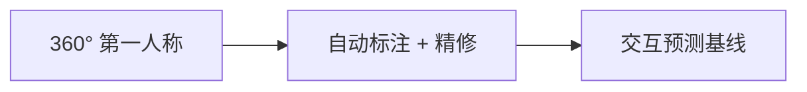
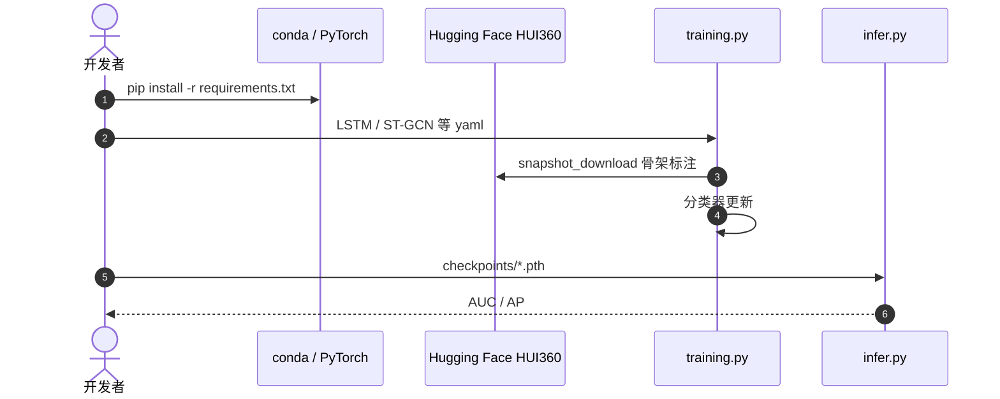

# HUI360：社交机器人要先预测人会不会靠近

**HUI360**（*A 360° Egocentric Dataset and Baselines for Human-Robot Interaction Anticipation*；[arXiv:2608.11051](https://arxiv.org/abs/2608.11051)，[项目页](https://hucebot.github.io/hui360/)，[基线](https://github.com/hucebot/HUI360-Baselines)）由 **INRIA / CEA** 提出（FG 2026）：主动社交机器人缺的不是室内动作识别，而是野外、机器人第一人称、自然发生的「会不会来交互」。

## 一句话定义

**从移动机器人 360° 视角预测路人是否会与机器人交互，并提供可训练的骨架/关键点/mask 标注与跨数据集基线。**

## 英文缩写速查

| 缩写 | 英文全称 | 简要说明 |
|------|----------|----------|
| HUI360 | Human–robot interaction anticipation, 360° | 本文室内 Shelfy 集 |
| HRI | Human–Robot Interaction | 预测对象是交互意图而非导航目标 |
| SSUP-HRI | 既有户外移动机器人 HRI 集 | 本文另释 6M 标注做跨集评估 |
| ST-GCN | Spatial Temporal Graph Convolutional Network | 仓内最强 in-dataset 基线 |
| DTA | Data Transfer Agreement | 原始全景视频的 GDPR 门槛 |
| AUC / AP | Area Under Curve / Average Precision | 交互预测主指标 |

## 为什么重要

- 跟紧、让路、搭话都依赖「人会不会靠近」；第三人称监控数据对移动机器人不对齐。
- 360° 消除前向相机的背后盲区，但标注贵——本文把自动流水线也开源。
- 基线仓可 CPU 训练，适合先复现交互分类再接到跟随策略。

## 核心信息

| 项 | 内容 |
|----|------|
| **机构** | 法国国家信息与自动化研究所（INRIA）；法国原子能和替代能源委员会（CEA） |
| **会议** | FG 2026 |
| **开源** | **已开源**基线 + 处理后标注；原始视频 **DTA** |

## 核心原理

### 方法栈

Insta360 等全景 → Interact360 检测/分割/跟踪 → 人工精修 → 2D 姿态、面部关键点、mask。预测任务：约 2.1 s（32 帧）历史判断交互，训练截断约 1.1 s。

### 流程总览

## 源码运行时序图

官方基线 [hucebot/HUI360-Baselines](https://github.com/hucebot/HUI360-Baselines)（归档见 [sources/repos/hui360-baselines.md](../../sources/repos/hui360-baselines.md)）：

- **最短复现：** `python training.py -hp ./experiments/configs/in_hui/lstm_base.yaml --save_model`。
- **论文表：** 看 `legacy` 分支；主分支已更新数据与模型。

## 工程实践

| 项 | 建议 |
|----|------|
| 磁盘 | 骨架集约 59GB，首次训练会自动拉 |
| 指标 | 正例少（验证 68/407），优先看 AP 而不是准确率 |
| 原始视频 | 学术机构填 DTA，不要把 HF Videos 当默认可下载 |

## 实验与评测

项目页：室内滤后 **11 h**、375 次交互、>1M 检测。仓 README in-dataset：ST-GCN AUC **0.880** / AP **0.581**。另释 SSUP-HRI **6M** 标注做跨数据集评估。

## 与其他工作对比

相对 [Ego 9 篇地图](../overview/ego-9-papers-technology-map.md)：本页是机器人第一人称社交预测，不是人视频转策略。相对 [nav-ps-balance](./paper-nav-ps-balance.md)：HUI360 回答「会不会来」，跟随回答「来了怎么跟且不撞」。相对 [iCrowdNav](./paper-icrowdnav.md)：后者是人群让行控制，不是交互意图分类。

## 结论

**主动社交的第一步是预测交互，360° 机器人视角比监控摄像头更接近部署。**

1. **标注已开、原片受限** — 先用 HF 骨架跑基线。
2. **AP 比 AUC 更刺** — 正例稀。
3. **跨数据集才是卖点** — 只报 in-dataset 不够。
4. **接到跟随前先当感知头** — 不要和导航策略混训。

## 局限与风险

- GDPR / DTA 挡住多数工业复现原片。
- 基线是短窗分类，不是长期社交策略。
- 主分支与论文 `legacy` 数字可能不一致。

## 关联页面

- [接近–安全跟随](./paper-nav-ps-balance.md)
- [iCrowdNav](./paper-icrowdnav.md)
- [Ego 9 篇技术地图](../overview/ego-9-papers-technology-map.md)
- [视觉语言导航](../tasks/vision-language-navigation.md)

## 参考来源

- [HUI360 论文摘录](../../sources/papers/hui360_arxiv_2608_11051.md)
- [项目页归档](../../sources/sites/hucebot-hui360.md)
- [基线仓归档](../../sources/repos/hui360-baselines.md)
- [具身智能小站 10 篇盘点（2026-08-18）](../../sources/blogs/wechat_embodied_station_contact_predict_adapt_10_papers_2026-08-18.md)

## 推荐继续阅读

- [HUI360 项目页](https://hucebot.github.io/hui360/)
- [Hugging Face rlorlou/HUI360](https://huggingface.co/datasets/rlorlou/HUI360)
