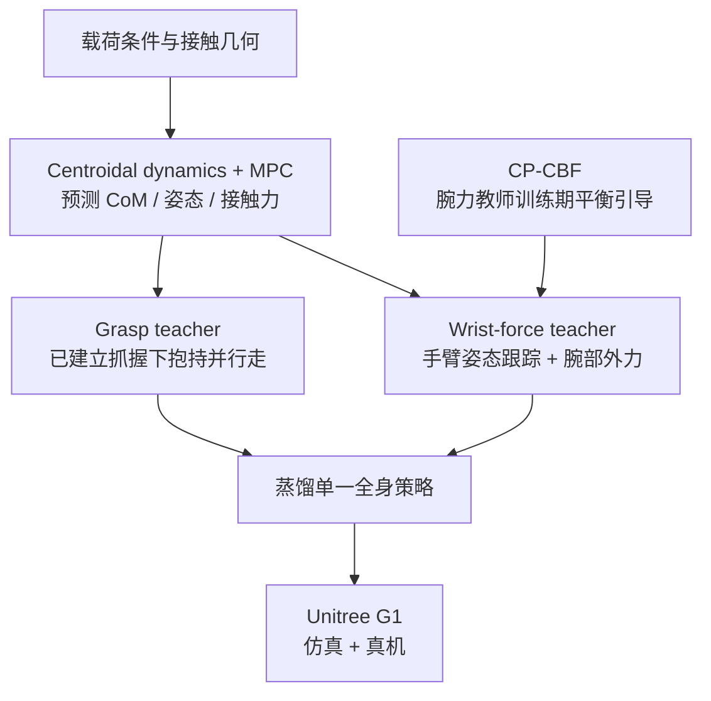

# HULK：重载人形机器人的全身移动操作

**HULK**（*Learning Whole-Body Forceful Loco-Manipulation for Humanoids*，[arXiv:2610.08970](https://arxiv.org/abs/2610.08970)，[项目页](https://www.hulk-forceful-wbc.com/)）面向载荷改变质心并持续占用上身驱动力的情形。方法以载荷动力学预测指导强化学习，并将两个专长策略蒸馏成单一全身控制策略，在 Unitree G1 仿真与真机上评估。

## 一句话理解

**MPC 预测“带着负载时身体和接触力该如何变化”，训练两类互补专家，再把能力压进一个 G1 全身策略。**

## 英文缩写速查

| 缩写 | 英文全称 | 简要说明 |
|---|---|---|
| MPC | Model Predictive Control | 根据载荷动力学预测生成训练奖励参照；策略学习时不直接执行完整 MPC 轨迹 |
| RL | Reinforcement Learning | 训练 wrist-force / grasp 两类 teacher |
| CP-CBF | Capture-Point Control Barrier Function | 捕获点控制障碍函数；用于腕力教师的训练期平衡引导 |
| CoM | Center of Mass | 质心；负载会改变系统质心与动力学 |
| DCM | Divergent Component of Motion | 发散分量运动；论文采用其 excursion / margin 衡量平衡状态 |
| WBC | Whole-Body Control | 同步调节躯干、双臂和下肢的控制方式 |

## 方法总览

- **MPC reward guidance：** 基于 centroidal model 预测加载动力学，生成 CoM、骨盆姿态与接触力参照，引导 RL 策略学习状态与交互力响应。MPC 是训练指导器，不是被部署的高层 planner。
- **Wrist-force teacher：** 学习在腕部持续受力时跟踪上肢姿势并保持平衡；论文专项抗推实验报告最高 130 N。
- **Grasp teacher：** 从已建立的多个 torso/arm grasp 出发，将物体反力纳入动力学指导，在抱持物体的同时行走。
- **CP-CBF：** 以 capture point 与可支撑区域构造平衡约束，在腕力教师训练时修正下肢关节目标并加入奖励；过滤器在部署时移除，不能视为运行时安全屏障。
- **Student：** 将腕力与抱持教师蒸馏到单一策略，统一 whole-body command interface。

## 实验与结果

### 仿真

每臂 10 kg 负载时，带 CP-CBF 的 wrist-force teacher 取得较低前向、侧向速度跟踪误差；论文报告相对于仅 MPC-guided RL aggregate balance metric 降低 **35.7%**。腕力教师在独立躯干推扰协议中承受最高 **130 N**。这两项衡量的是不同试验，不应合并成单个负载-推力结论。

### Unitree G1 真机

| 任务 | 共同负载成功率 | 单独负载扫描的最大完成质量 |
|---|---:|---:|
| 推 / 拉手推车 | 5/6 | 300 kg |
| 手提负载行走 | 4/4 | 12.25 kg |
| 胸前抱冰箱行走 | 4/4 | 7.0 kg |
| 侧身抱罐行走 | 4/4 | 6.1 kg |

手推车共同负载测试为 150 kg；各 carry 成功率使用论文规定的共同质量。最大质量来自独立 load sweep，并非上表成功率测试统一使用的质量。四项任务都要求行走。

## 工程状态与复现边界

- **论文 / 项目页：** arXiv v1 与论文链接的项目页已记录在来源档案。
- **官方代码：** arXiv v1 未直接给出仓库地址；项目页跳转目标目前无法读取，本次没有确认官方 GitHub 仓库。
- **复现边界：** 仿真依赖载荷模型、预定义腕部受力 / 稳定 grasp 及 humanoid 控制环境；真机任务也从可用的接触 / 抓持配置开始。
- 论文指出 centroidal 预测不显式验证关节层面的可执行性；抓取获取、重新抓握和快速接触转换不在已展示能力范围内。
- CP-CBF 属训练时的近似引导，部署时移除，不提供 runtime safety guarantee。

## 关联页面

- [Loco-Manipulation](../tasks/loco-manipulation.md) — 腿式平台边移动边操作的任务入口。
- [Humanoid Locomotion](../tasks/humanoid-locomotion.md) — 负载、平衡和运动控制的相关问题。
- [Unitree G1](./unitree-g1.md) — 真机验证平台。
- [Thor](./paper-hrl-stack-42-thor.md) 与 [FALCON](./paper-loco-manip-161-109-falcon.md) — 论文对比的全身交互控制基线。

## 参考来源

- [HULK 论文归档](../../sources/papers/hulk_arxiv_2610_08970.md)
- [HULK 项目页归档](../../sources/sites/hulk-forceful-wbc.md)
