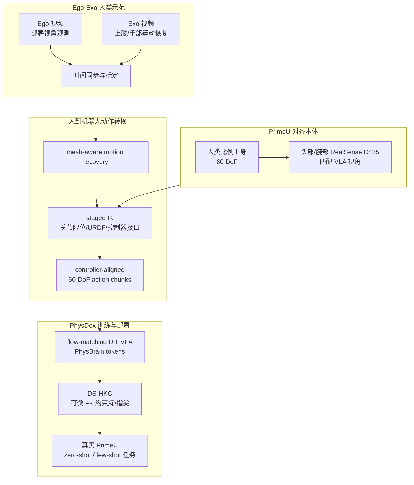

# Human-as-Humanoid

**Human-as-Humanoid: Enabling Zero-Shot Humanoid Learning from Ego-Exo Human Videos with Human-Aligned Embodiments** 是 ZGC EmbodyAI 等团队的 2026 项目论文/项目页工作，收录于 [具身智能研究室 Loco-Manip 接触专题](../../sources/blogs/wechat_embodied_ai_lab_loco_manip_contact_survey.md) **01 接触数据** 组：它不是从机器人遥操作采集动作，而是把同步 **Ego-Exo 人类视频** 转换为 **PrimeU 60-DoF humanoid** 的控制器对齐动作标签，再训练 **PhysDex** VLA 在真实高自由度上身任务中部署。

## 一句话定义

Human-as-Humanoid 用 **人形对齐硬件 + ego-exo 运动恢复 + 分阶段 IK + FK 感知 VLA 监督**，把人类第一/第三视角视频变成机器人可执行 action chunks，从而让高 DoF 人形在没有目标任务机器人示范的情况下学习接触丰富操作。

## 英文缩写速查

| 缩写 | 英文全称 | 简要说明 |
|------|----------|----------|
| VLA | Vision-Language-Action | PhysDex 的策略范式：视觉/语言条件下预测机器人动作块 |
| Ego-Exo | Egocentric + Exocentric | Ego 提供部署视角观测，Exo 提供抗遮挡运动恢复 |
| IK | Inverse Kinematics | 将恢复的人体末端/手部目标转为 PrimeU 关节动作 |
| FK | Forward Kinematics | DS-HKC 用可微 FK 约束腕部与指尖任务空间几何 |
| DS-HKC | Differentiable Structured Humanoid Kinematic Consistency | PhysDex 的 FK 感知监督，用于耦合 60 维动作 |
| DoF | Degrees of Freedom | PrimeU 上身含双 7-DoF 手臂、双 20-DoF 灵巧手、颈/腰共 60 DoF |

## 为什么重要

- **把视频数据变成 action supervision**：很多 ego 视频只有观测没有机器人动作，无法直接训练 VLA；Human-as-Humanoid 给出一条从人类视频到 **controller-aligned labels** 的转换链。
- **先缩小 embodiment gap**：PrimeU 的肩宽、臂展、手长和相机布局按成人男性操作比例设计，减少“先采人、后强行重定向”的几何误差。
- **兼顾部署视角与运动恢复**：Ego 流与真实策略输入对齐，Exo 流补足手部/上肢遮挡下的姿态恢复，二者同步后才进入 retargeting。
- **数据吞吐有明确收益**：项目页报告转换链约 **20 FPS**，human-only converted labels 相对遥操作达到 **4.8–7.2×** raw demonstration throughput gain。
- **对应接触专题的数据层问题**：它回答“带本体、带动作标签的高 DoF 操作数据从哪来”，与 [HumanoidUMI](./paper-humanoidumi.md) 的 robot-free VR-UMI 和 [VLK](./paper-vlk-synthetic-loco-manipulation.md) 的合成 VLK 数据形成三种数据入口。

## 流程总览

## 核心机制

### 1）Human-aligned embodiment：PrimeU 不是普通 retarget 目标

Human-as-Humanoid 的第一步不是写更复杂的重定向器，而是让机器人形态、相机布局、动作接口同时接近人类操作数据。PrimeU 上身包括 **两条 7-DoF 手臂、两只 20-DoF Wuji 灵巧手、3-DoF 颈部、3-DoF 腰部**，总计 **60 DoF**；项目页给出肩宽、肩到中指尖距离、手长等 anthropometric 对齐表，其中手长比值为 **1.00**，肩到中指尖 reach 比值为 **1.02**。

这种设计把一部分跨本体难题前置到硬件层：人类手到物体的相对几何更容易落入机器人可达空间，头/腕相机视角也更接近策略部署时看到的图像。

### 2）Ego-Exo 双流：观测与运动恢复分工

| 流 | 作用 | 为什么不能只用它 |
|----|------|------------------|
| Ego | 记录真实策略将看到的第一视角/腕部视角 | 手部和物体常被遮挡，不适合作为唯一运动恢复依据 |
| Exo | 从外视角恢复上肢、双手、物体附近运动 | 视角不等于部署输入，不能直接训练 ego VLA |
| 同步标定 | 把部署观测与可恢复运动配对 | 少了同步会出现 action-label 与图像错位 |

这也是它相对普通 egocentric learning 的关键：不是从视频“猜一个动作”，而是在采集时构造 **deployment observation + executable label** 的配对样本。

### 3）分阶段 IK：从人体运动到控制器动作块

Human-as-Humanoid 将恢复的人体运动通过 staged IK 映射到 PrimeU：

1. 读取 PrimeU 的 URDF、关节顺序、关节限位和控制器 convention。
2. 将人体腕、手、指尖等关键任务空间目标变成机器人末端/手部目标。
3. 分阶段求解躯干、手臂、灵巧手等关节，使输出直接落在 **60-DoF controller-aligned action chunks** 上。
4. 在转换阶段保留动作块而不是只存末端轨迹，避免训练时再做一次不一致的 retargeting。

### 4）PhysDex：FK 感知的 VLA 监督

PhysDex 是 flow-matching DiT 结构的 VLA，条件来自 PhysBrain VLM tokens；其关键监督不是简单逐维动作 L2，而是加入 **DS-HKC**：通过可微 FK 把 60 维关节动作重新投影到腕和指尖任务空间，检查动作是否保持接触几何。项目页的 action-interface diagnostics 显示，human-only tokenizer 在 100 个真实机器人 evaluation windows 上跨域重构误差低，mean normalized MAE 为 **0.0080**，mean EE error 为 **5.34 mm**。

## 实验与评测

| 维度 | 结果 |
|------|------|
| 转换速度 | human-to-humanoid conversion 约 **20 FPS** |
| 数据吞吐 | human video pipeline 较 teleoperation 高 **4.8–7.2×** |
| 动作空间诊断 | human-only → real robot eval：normalized MAE mean **0.0080**，EE error mean **5.34 mm** |
| zero-shot 任务 | magic-cube packing、cup stacking、ring toss、water pouring |
| few-shot 任务 | light-bulb installation、temperature sensing |

这些结果主要验证 **converted human labels 是否落在 PrimeU 可执行动作流形**，而不是通用 locomotion benchmark。

## 与相邻路线对比

| 路线 | 数据入口 | 主要优势 | 主要代价 |
|------|----------|----------|----------|
| Human-as-Humanoid | Ego-Exo 人类视频 → PrimeU action labels | 目标任务可无机器人示范，动作接口对齐 | 绑定 PrimeU 与 motion recovery / IK 质量 |
| [HumanoidUMI](./paper-humanoidumi.md) | PICO + UMI gripper robot-free keypoints | 硬件轻量，覆盖腰腿关键点 | 需要定制 gripper 与 SKR/WBC |
| [VLK](./paper-vlk-synthetic-loco-manipulation.md) | 3DGS 场景合成 VLK tuples | 可自动生成 ego 图像 + 语言 + G1 轨迹 | 标注/合成偏箱体与重建场景 |
| 真机遥操作 | 机器人内环示范 | 动作最贴近目标机器人 | 采集贵、占用硬件、操作门槛高 |

## 工程实践

| 维度 | 记录 |
|------|------|
| 平台 | PrimeU 60-DoF 上身人形；头部与腕部 Intel RealSense D435 |
| 数据 | 同步 ego-exo 人类视频；转换为控制器对齐 60-DoF action chunks |
| 训练 | PhysDex flow-matching DiT；DS-HKC 可微 FK 监督腕部/指尖几何 |
| 部署任务 | magic-cube packing、cup stacking、ring toss、water pouring；few-shot 还含 light-bulb installation、temperature sensing |
| 开源状态 | 截至 2026-07-22，项目页未列官方 GitHub/代码仓库；只提供项目页、视频、摘要与 BibTeX |
| 源码运行时序图 | **不适用**：没有可运行官方仓库或 README 入口，不能构造代码级运行时序 |

## 局限与风险

- **绑定 PrimeU 形态与接口**：action labels 依赖 PrimeU URDF、关节顺序、控制器 convention；迁移到 G1、H1 或其他上身平台需要重新 retarget 与重新校验 FK 误差。
- **人类视频不能替代接触力数据**：pipeline 更直接捕捉 kinematics，力/触觉/物体受力仍需机器人数据或额外传感器补足。
- **motion recovery 与 IK 误差会级联**：Exo 姿态估计错误、手指遮挡、IK 局部最优都会被写进训练标签。
- **zero-shot 的边界要说清**：项目页的 zero-shot 指 **目标任务无机器人示范**，不是无机器人模型、无标定、无真实部署验证。
- **复现暂受限**：无官方代码和硬件 CAD/URDF 发布时，外部团队难以复刻 20 FPS 转换链与 DS-HKC 训练细节。

## 关联页面

- [Loco-Manip 接触技术地图](../overview/loco-manip-contact-technology-map.md)
- [01 接触数据分类 hub](../overview/loco-manip-contact-category-01-contact-data.md)
- [Loco-Manipulation](../tasks/loco-manipulation.md)
- [VLA](../methods/vla.md)
- [Motion Retargeting](../concepts/motion-retargeting.md)
- [Whole-Body Control](../concepts/whole-body-control.md)
- [HumanoidUMI](./paper-humanoidumi.md)
- [VLK](./paper-vlk-synthetic-loco-manipulation.md)

## 参考来源

- [Human-as-Humanoid 来源摘录](../../sources/papers/human_as_humanoid_zgc_2026.md)
- [具身智能研究室 Loco-Manip 接触专题](../../sources/blogs/wechat_embodied_ai_lab_loco_manip_contact_survey.md)
- 项目页：<https://zgc-embodyai.github.io/Human-as-Humanoid/>

## 推荐继续阅读

- [Loco-Manip 接触五段链路技术地图](../overview/loco-manip-contact-technology-map.md)
- [UMI: Universal Manipulation Interface](https://umi-gripper.github.io/) — robot-free data collection 的桌面臂源头
- [Loco-Manipulation 任务页](../tasks/loco-manipulation.md)
