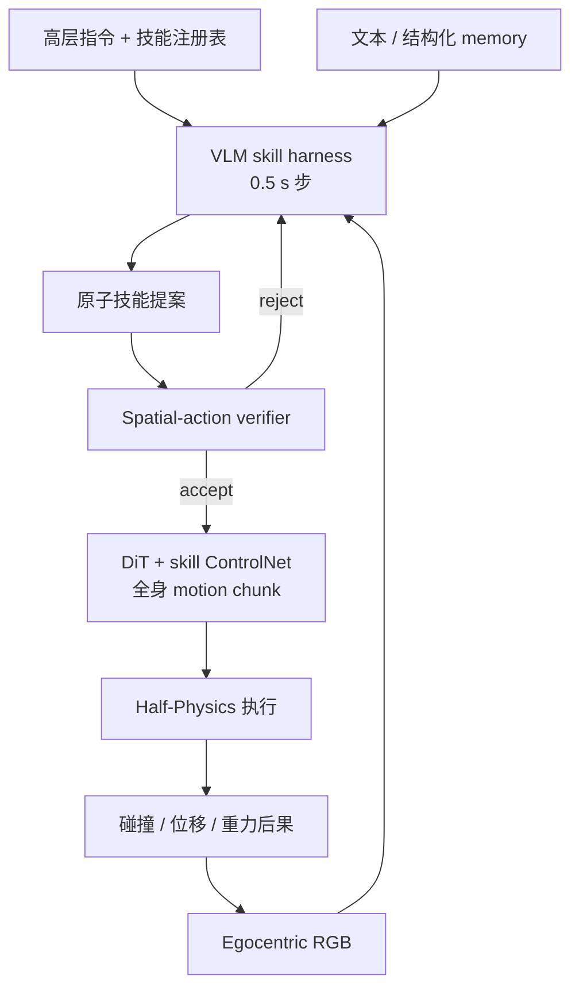
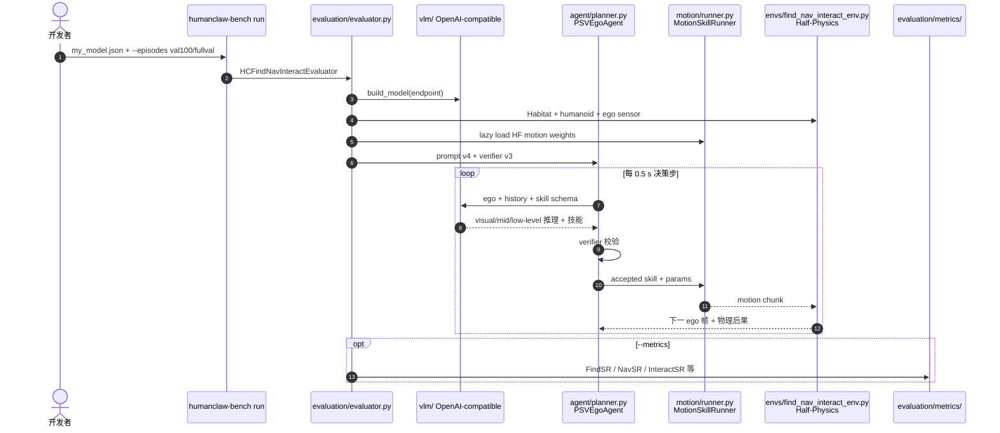

# HumanCLAW：VLM 能否通过身体行动？

**HumanCLAW**（*Can Vision-Language Models Act Through a Body?*，[arXiv:2607.27180](https://arxiv.org/abs/2607.27180)，[项目页](https://human-claw.github.io/)，[代码](https://github.com/Human-CLAW/HumanCLAW)）由 Meta、NTU、UW 等提出：在 **Half-Physics** 仿真闭环中，每 **0.5 s** 让 **冻结 off-the-shelf VLM** 输出原子全身技能，经 verifier 与 DiT 运动层落地，从而隔离 **action intelligence**（决定做什么）与 motor control（怎么执行）。

## 一句话定义

**HumanCLAW 把 VLM 当作「拥有身体的决策者」来测：在真实物理后果的 egocentric 闭环里，它能否持续选对原子全身技能——而不是在静态 VQA 里描述场景。**

## 英文缩写速查

| 缩写 | 英文全称 | 简要说明 |
|------|----------|----------|
| VLM | Vision-Language Model | 冻结的视觉–语言模型，作为技能决策器 |
| VLA | Vision-Language-Action | 端到端视觉–语言–动作策略（本文 **非** 训练 VLA，而是评测 VLM） |
| HSSD | Habitat Synthetic Scenes Dataset | 室内合成场景数据源；Bench 用 41 val houses |
| DiT | Diffusion Transformer | 全身运动 continuation 先验与 per-skill ControlNet 基座 |
| FindSR / NavSR / InteractSR | Find / Navigate / Interact Success Rate | Bench 三阶段 progressive success 指标 |

## 为什么重要

- **把「会看」与「会通过身体行动」分开测：** 同一 VLM 在 FindSR 可达 75%+，InteractSR 却普遍个位数——说明 manipulation/locomotion 榜单上的 VLA 分数 **不能外推** 到全身 egocentric 闭环决策。
- **工程可复现的 VLM 横评床：** Apache 2.0 完整 harness + HF motion 权重 + 固定 1,218-episode split；只需自备 VLM endpoint 与授权 HSSD。
- **诊断 embodied self-awareness 缺口：** 论文六条 findings 指向 **egocentric self-localization**、**body misawareness**、**reach≠interact**——为 VLA/VLM 预训练与 harness 设计提供可操作的 failure taxonomy。
- **与 VisionClaw 区分：** [VisionClaw](./paper-sa-2604-03486-visionclaw-always-on-ai-agents-through-smart-gla.md) 是可穿戴 **always-on agent**；HumanCLAW 是 **仿真全身 action intelligence** benchmark，同名不同问题。

## 核心信息

| 项 | 内容 |
|----|------|
| **机构** | Meta；南洋理工大学（NTU）；华盛顿大学（UW）；布朗大学（Brown）；西北大学（Northwestern） |
| **场景** | HSSD 41 validation houses |
| **回合** | **1,218** find–navigate–interact episodes（6 类目标家具/物体） |
| **决策步长** | **0.5 s** / step |
| **开源** | **已开源** 评测栈 + motion 权重；HSSD mesh 补充 **gated**；HSSD-Hab val **需授权** |

## 核心原理

### Action intelligence

在物理执行闭环中，**每时刻** 根据 egocentric 观测与高层指令，选择下一步 **可执行的原子全身技能**（walk、turn、sit 等）及其参数；motor layer 负责连续化，但 **成败归因于决策**——Half-Physics 排除 balance / tracking 失败。

### HumanCLAW 三解耦

| 模块 | 职责 |
|------|------|
| **VLM skill harness** | 三阶段：visual state → 2–3 s mid-level goal → 原子技能 + 参数 |
| **Verifier** | 短上下文 spatial-action outcome QA；accept / reject / renew |
| **Motion generator** | DiT continuation（5 历史 pose → 15 未来帧）+ **每技能 ControlNet** plug-and-play bag |
| **Half-Physics simulator** | Kinematic 人体 + **真实** 墙阻挡、物体碰撞、楼梯重力；反馈下一 ego 帧 |

### 流程总览

## 源码运行时序图

节点对齐 [`sources/repos/humanclaw.md`](../../sources/repos/humanclaw.md) 与 `docs/ARCHITECTURE.md`。

- **Smoke 入口：** `humanclaw-bench run --episodes one --model-config my_model.json --gpus auto`
- **论文 profile：** bundled hand-merged humanoid + `paper_fullval_v1` weights；finger-separated URDF 为可选扩展。

## 实验与评测

### HumanCLAW-Bench 任务

Progressive **find → navigate → interact**：

> find a `<category>`, navigate to it with zero distance, and finally sit on it.

六类目标：chair、bed、couch、potted plant、toilet、TV。可动物体动态化以测量 **object disturbance**。

### 指标

| 指标 | 含义 |
|------|------|
| **FindSR** | 目标在 ego 中 ≥100 semantic px 且模型 acknowledge |
| **NavSR** | 距目标 ≤20 cm 且 stopping |
| **InteractSR** | pelvis contact **sit** on target |
| **Coll. / #Dtb / dDtb** | 碰撞与物体扰动（body awareness） |
| **Motion Jerk** | 根节点 jerk（动作连贯性） |
| **Token cost** | 每步 in/out tokens |

难度：对最短无碰撞路径按 **geodesic distance**、**choice points**（转弯+穿房间）、**obstacle density** 分 easy/medium/hard。

### Leaderboard 摘要（论文 initial release，九 VLM）

| VLM | FindSR | NavSR | InteractSR |
|-----|--------|-------|------------|
| GPT-6 | 75.5% | 57.1% | **46.6%** |
| Gemini-3.1 | 64.9% | 42.4% | **16.8%** |
| Gemma-4-31B | 58.1% | 28.7% | 11.1% |
| Qwen3.6-27B | 51.0% | 20.9% | 0.2% |
| InternVL3.5-38B | 46.8% | 0.8% | 0.0% |

> 项目页 leaderboard 可在线更新；上表为论文/页内 initial 九模型对比，**勿与后续追加模型混读**。

## 工程实践

| 项 | 建议 |
|----|------|
| 环境 | Linux · Python 3.10+ · CUDA PyTorch · **patched Habitat-Sim（Bullet）** |
| 数据 | 授权 **HSSD-Hab val** + HF [HumanCLAW-HSSD](https://huggingface.co/datasets/HumanCLAW/HumanCLAW-HSSD)（gated mesh 补充） |
| 权重 | HF [HumanCLAW/HumanCLAW](https://huggingface.co/HumanCLAW/HumanCLAW) `paper_fullval_v1` |
| VLM | 复制 `configs/models/vllm_openai_compatible.json`，填 served model 与 endpoint |
| 规模 | `--episodes val100` 固定小子集；`fullval` = 1,218 episodes |
| GPU | `--gpus auto` 尊重 `CUDA_VISIBLE_DEVICES`；VLM server 与 eval GPU **分开预留** |
| 产物 | `--metrics` 与 `--video` 独立；无 metrics 时跳过语义渲染与指标累计 |

### 开源状态（2026-09-18 核查）

- **已开源：** 完整评测 harness、metric 定义、motion 训练实现、1,218-episode split 清单（Apache 2.0）。
- **已发布：** Hugging Face motion checkpoints。
- **部分 / 外部依赖：** HSSD baked mesh **gated**；官方 HSSD 场景需单独授权；VLM 权重与 API **自备**。

## 局限与风险

- **测的是 VLM + 固定 motion 层，不是端到端 VLA 训练：** 高 InteractSR 可能来自 motion prior 容错，低分则可靠归因于 **决策**。
- **仿真 Half-Physics：** 无真机 sim2real；kinematic 人体 + 选择性物理——结论适用于 **action planning** 诊断，非部署 guarantee。
- **Frozen VLM：** 不含 fine-tune 后潜力；harness 结构（memory / verifier / mid-level goal）消融表明 **推理脚手架** 可显著抬 NavSR，但无法单独解决 body awareness。
- **Leaderboard 漂移：** 页内标注部分模型为 arXiv 后续评测；对比时锁定 **同一 release 表格** 与 episode split。

## 结论

**HumanCLAW 用可复现的 Half-Physics 闭环证明：论文 initial release 评测的九个前沿 VLM 普遍缺乏 embodied self-awareness——会找、偶能到，但几乎不会在与身体相关的时刻做对交互决策。**

- **InteractSR 才是真门槛：** FindSR 50–75% 与 InteractSR 0–17% 的断崖说明，**静态具身 QA / 识别** 不能替代 **闭环全身 action intelligence**。
- **Navigation 瓶颈在 egocentric self-localization：** 68% 已 active-find 仍 Nav 失败，且 early-stop / never-confirm 双向错误——读 VLM 导航能力应优先看 **自身位移与到达确认**，而非 scene description 质量。
- **Body awareness 是 interaction 主因：** 腿/脚 unseen collision 占 28–45% steps；interaction failures 81% 与 body awareness 相关——future harness 需 **显式 body-state / contact memory**，而非堆 ego 帧。
- **结构化 reasoning scaffold 有效但不够：** compact memory、mid-level goal、verifier 可把 NavSR 从个位数拉到 ~27%，但 **不能** 单独解决 sit timing 与 relative body–object geometry。
- **工程入口清晰：** [Human-CLAW/HumanCLAW](https://github.com/Human-CLAW/HumanCLAW) + HF 权重；适合作为 **VLM 选型** 与 **agent harness** 设计的 stress test，而非 robot policy 训练集。

## 与其他页面的关系

- [VLA](../methods/vla.md) — 端到端策略 vs 本文「冻结 VLM 决策层」评测
- [HumanoidArena](./paper-humanoidarena.md) — 另一 egocentric 全身仿真 benchmark（分层 GMT 训练导向）
- [HarnessVLA](./paper-harness-vla.md) — 工程 harness 编排 VLA；HumanCLAW harness 编排 **VLM + 技能运动**
- [RoboBench](./robo-bench.md) — MLLM 操纵认知诊断；HumanCLAW 测 **全身闭环行动**
- [VisionClaw](./paper-sa-2604-03486-visionclaw-always-on-ai-agents-through-smart-gla.md) — 同名 Claw、不同问题（可穿戴 always-on agent）
- [具身评测基准选型闭环](../queries/embodied-eval-benchmark-selection-loop.md) — HumanCLAW 落在「冻结 VLM + 全身闭环行动」这一档；与 VLA 策略成功率榜不共享协议，选基准时按该页分层读

## 参考来源

- [humanclaw_arxiv_2607_27180.md](../../sources/papers/humanclaw_arxiv_2607_27180.md)
- [human-claw 项目页](../../sources/sites/human-claw-github-io.md)
- [humanclaw 仓库](../../sources/repos/humanclaw.md)

## 推荐继续阅读

- [HumanCLAW 项目页](https://human-claw.github.io/)
- [HumanCLAW GitHub](https://github.com/Human-CLAW/HumanCLAW)
- [Hugging Face Dataset: HumanCLAW-HSSD](https://huggingface.co/datasets/HumanCLAW/HumanCLAW-HSSD)
