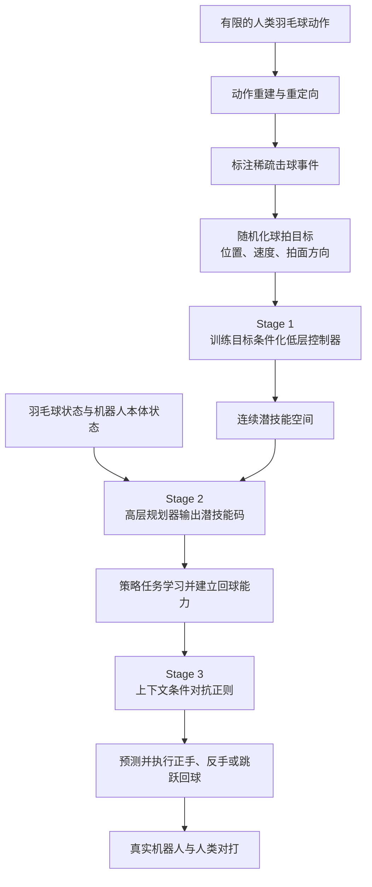

# Humanoid Badminton：从有限人类动作学习动态球拍技能

**Humanoid Badminton**（*Learning Dynamic Racket Skills from Limited Human Motion Data*，[arXiv:2609.31840](https://arxiv.org/abs/2609.31840)，[项目页](https://sunlight02.github.io/humanoid-badminton/)）提出一个三阶段分层强化学习框架：把有限的人类击球参考扩增成可执行技能，再按来球状态在线组合技能，并在 Unitree G1 上展示多种回球与人机对打。

## 一句话定义

从稀疏的人类击球动作中扩增连续、目标条件化的击球技能，由高层策略根据来球和机器人状态选择潜技能，让 G1 完成多风格回球。

## 英文缩写速查

| 缩写 | 英文全称 | 简要说明 |
|---|---|---|
| RL | Reinforcement Learning | 通过任务奖励训练技能与来球规划器 |
| MoCap | Motion Capture | 真机部署时提供羽毛球和机器人基座位置 |
| SR | Success Rate | 成功回球的发球比例 |
| AC | Average Consecutive Hits | 连续成功回球次数的平均值 |
| JFID | Jerk-based Fréchet Inception Distance | 本文用于比较生成动作与技能先验分布的指标 |

## 为什么重要

- 羽毛球把高速来球预测、精确接触和全身平衡压在同一个短时间窗口内，是检验人形机器人动态交互的严苛任务。
- 人类动作数据有限且经重建、重定向后仍有误差；直接跟踪难覆盖多变来球，纯任务优化又可能产生生硬动作。本文通过任务随机化把少量击球事件扩为可执行技能邻域。
- 与无动作先验的 [Annealed RL 羽毛球](./paper-notebook-humanoid-whole-body-badminton-via-multi-stage-re.md) 和从模仿逐步过渡到交互的 [LHBS](./paper-notebook-learning-human-like-badminton-skills-for-humanoi.md) 形成互补：本工作将人类动作当作可扩增的技能先验，并学习高层潜技能规划。

## 核心信息

| 项目 | 信息 |
|---|---|
| 作者 | Jingzhi Cui、Zhexiong Wang、Bangjie Xu、Pengyu Zhao、Youyuan Li、Zhi Su、Peng Ren、Mengdi Xu、Chao Yu、Yi Wu、Luyang Wang、Zhongyu Li |
| 机构 | 清华大学、香港具身智能实验室、香港中文大学、北京建筑大学、浙江大学、DeepCybo |
| 会议 | CoRL 2026（项目页标注已接收） |
| 仿真平台 | MJLab；Unitree G1，29 自由度 |
| 真机状态输入 | 动捕提供羽毛球与机器人基座位置；机器人本体传感器提供本体感知 |
| 开源状态 | 截至 2026-10-05，官方项目页未列可运行代码仓库、公开数据集或模型权重链接；项目页提供实机技能与人机对打演示视频 |

## 方法与流程

### 三阶段训练机制

1. **任务随机化动作扩增：** 从视频重建并重定向人类击球动作，标注稀疏击球事件；围绕每个事件随机采样球拍接触位置、速度和拍面方向，再用强化学习适配参考动作。由此得到覆盖不同来球条件的可执行目标条件化技能，而不是只拟合一条示范轨迹。
2. **潜技能规划：** 冻结低层技能控制器，训练高层规划器根据羽毛球状态历史和机器人状态输出连续潜技能码，在线组合击球技能完成回球。
3. **规划器正则化：** 在规划器已学会回球后，再加入上下文条件对抗正则，使潜技能的使用更贴近可执行技能分布。先建立任务能力、后加正则，避免过早限制潜空间探索。

## 工程实践

- **复现基线范围：** 论文在 MJLab 中使用 29 自由度 Unitree G1；羽毛球有显式球网、球拍网面、拍杆与手柄碰撞几何，使用 MuJoCo 接触求解器和随机化表面摩擦。
- **仿真评测协议：** 每个策略评测 1,000 个随机发球。成功要求球拍触球、羽毛球过网并落入对方有效场地；机器人跌倒计为失败。仿真连续击球 AC 上限为 10。
- **真机状态链路：** 仿真训练策略直接部署到实机；动捕提供球和机器人基座实时位置，本体传感器提供本体状态。论文为安全与动捕可视性移除了实体球网。
- **源码运行时序图：** **不适用（截至 2026-10-05）。** 官方项目页没有链接可运行训练、推理或部署代码，无法对齐源码模块绘制运行时序；公开复现路径暂时止于论文方法与项目页视频演示。

## 实验与评测

仿真中，本文方法总体回球成功率 SR 为 **88.3%**，平均连续回球 AC 为 **5.98**；Direct PPO 的 SR / AC 为 79.0% / 4.14，AMP 为 84.6% / 5.06。本文方法同时覆盖正手、反手和跳跃回球，并在表中取得最低关节加速度、关节力矩和 JFID。消融显示，没有任务随机化扩增时 SR 降至 57.0%、反手回球为 0；从训练一开始就施加规划器正则时 SR 降至 55.9%。

真机评测进行了 **20 轮连续人机对打**。作者报告 SR **89.4%**、平均连续成功回球 **8.42** 次、最长 **23** 次。正手、反手、跳跃回球分别为 60.2%、14.2%、15.0%。真机统计忽略人类侧失误，将机器人侧失误和跌倒计为失败；这是实机交互试验口径，不应和仿真 1,000 次随机发球的指标混为一谈。

## 与其他工作对比

| 维度 | 本文：Dynamic Racket Skills | Annealed RL 羽毛球 | LHBS |
|---|---|---|---|
| 人类动作先验 | 有；稀疏击球动作经目标随机化扩增 | 无 MoCap 专家动作先验 | 有；分阶段模仿后进入击球交互 |
| 技能组织 | 连续潜技能 + 高层规划器 | 单一全身任务策略 | 模仿、蒸馏、风格稳定、交互四阶段 |
| 真机任务展示 | 正手、反手、跳跃回球与人机连续对打 | 真机人机对打与机喂球 | 真机正手/反手挑球等 |
| 主要状态依赖 | 动捕提供羽毛球和机器人基座位置 | 项目特定部署管线 | 真机评测使用动捕状态 |
| 代码状态 | 官方项目页未列代码链接 | 官方代码待发布 | 官方项目页未列代码链接 |

## 结论

**本文的关键贡献是把少量人类击球事件扩成可执行技能空间，再通过分阶段潜技能规划兼顾回球能力与动作质量。**

1. **先扩技能再规划：** 随机化球拍接触目标并让低层控制器学会实现，是覆盖多种来球条件的基础。
2. **正则化放在能力建立之后：** 消融结果表明一开始就约束规划器会明显损害回球表现。
3. **解读真机数字时保留试验口径：** SR 89.4% 来自 20 轮人机对打，统计剔除了人类侧失误，不等于开放环境下的自主竞赛成功率。
4. **当前系统仍依赖外部状态测量：** 动捕提供球与基座位置，端侧视觉状态估计尚未成为论文报告的部署链路。

## 局限与风险

- **尚不能策略性落点：** 策略目标是把球回到对方有效区域，没有显式控制落点以实现战术性击球，暂不支持有战术意图的落点选择。
- **依赖仪器化场地：** 真机部署依赖动捕系统提供羽毛球和基座位置；用机载视觉和状态估计替代它仍是后续工作。
- **成功率不等于击球风格均衡：** 真机三类回球占所有机器人尝试的比例分别为正手 60.2%、反手 14.2%、跳跃 15.0%；整体 SR 应与技能分布一起读。
- **开源材料有限：** 截至 2026-10-05，项目页未提供可运行代码、权重或数据入口，暂不能独立复现实验流程。

## 关联页面

- [Humanoid Whole-Body Badminton：无人类动作先验的退火 RL](./paper-notebook-humanoid-whole-body-badminton-via-multi-stage-re.md)
- [LHBS：人形拟人羽毛球技能学习](./paper-notebook-learning-human-like-badminton-skills-for-humanoi.md)
- [人形机器人运动控制任务](../tasks/humanoid-locomotion.md)

## 参考来源

- [论文原始资料归档](../../sources/papers/humanoid-badminton-dynamic-racket-skills-arxiv-2609-31840.md)
- [项目页原始资料归档与开源核查](../../sources/sites/humanoid-badminton-dynamic-racket-skills.md)
- [arXiv HTML 全文](https://arxiv.org/html/2609.31840v1)
- [作者项目页](https://sunlight02.github.io/humanoid-badminton/)
- [Day 2：运动控制与运动先验](../../sources/blogs/humanoid_motion_intelligence_day2_locomotion_motion_priors_2026_10_03.md)

## 推荐继续阅读

- [arXiv PDF](https://arxiv.org/pdf/2609.31840v1)
- [项目页实机技能与人机对打演示](https://sunlight02.github.io/humanoid-badminton/)
