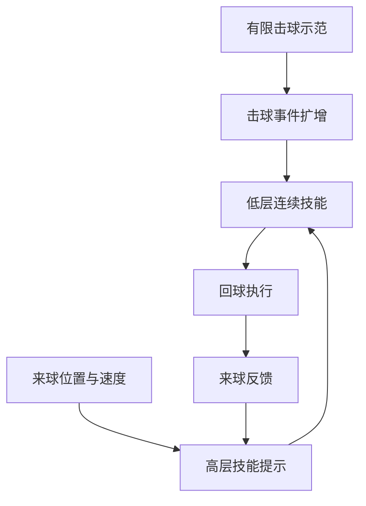

# Humanoid Badminton：从有限人类动作学习动态球拍技能

**Humanoid Badminton**（*Learning Dynamic Racket Skills from Limited Human Motion Data*，[arXiv:2609.31840](https://arxiv.org/abs/2609.31840)，[项目页](https://sunlight02.github.io/humanoid-badminton/)）研究人形机器人如何利用有限的人类击球动作，在来球运动中选择并执行多种回球技能。

## 一句话理解

动作示范提供身体协调经验，球的位置和速度决定何时调用哪项技能。

## 英文缩写速查

| 缩写 | 英文全称 | 简要说明 |
|---|---|---|
| G1 | Unitree G1 | 人形机器人平台 |
| Sim2Real | Simulation to Real | 仿真到真实机器人迁移 |

## 流程总览

以下按本页已归纳的机制与资料绘制，表示模块或阅读路径关系。

## 方法要点

- 通过击球事件扩增有限的动作示范。
- 低层学习连续技能表示，高层按来球状态提供技能提示。
- 文章报告 Unitree G1 实机展示正手、反手、跳起回球及人机对打。

## 与其他羽毛球工作区分

本页对应 *Learning Dynamic Racket Skills from Limited Human Motion Data*（arXiv:2609.31840）。已有 [Humanoid Whole-Body Badminton via an Annealed Reinforcement Learning Curriculum](./paper-notebook-humanoid-whole-body-badminton-via-multi-stage-re.md) 和 [Learning Human-Like Badminton Skills for Humanoid Robots](./paper-notebook-learning-human-like-badminton-skills-for-humanoi.md) 是不同论文，分别保留独立页面。

## 参考来源

- [arXiv:2609.31840](https://arxiv.org/abs/2609.31840)
- [项目页](https://sunlight02.github.io/humanoid-badminton/)
- [Day 2 文章来源索引](../../sources/blogs/humanoid_motion_intelligence_day2_locomotion_motion_priors_2026_10_03.md)

## 评测

文章报告 G1 真机正手、反手、跳起回球与人机对打演示；具体击球成功率以论文定义为准。

## 与其他工作对比

已有两篇人形羽毛球研究是不同论文：见 [Whole-Body Badminton](./paper-notebook-humanoid-whole-body-badminton-via-multi-stage-re.md) 与 [Human-Like Badminton Skills](./paper-notebook-learning-human-like-badminton-skills-for-humanoi.md)。

## 结论

该工作将有限击球示范转为可按来球状态调用的动态技能。

## 关联页面

- [paper-notebook-humanoid-whole-body-badminton-via-multi-stage-re](./paper-notebook-humanoid-whole-body-badminton-via-multi-stage-re.md)
- [paper-notebook-learning-human-like-badminton-skills-for-humanoi](./paper-notebook-learning-human-like-badminton-skills-for-humanoi.md)
