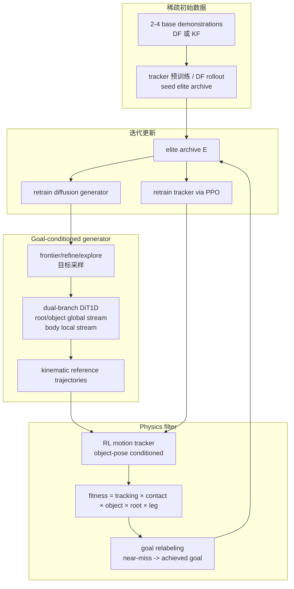

# Humanoid-DART

**Humanoid-DART: Humanoid Loco-Manipulation using Diffusion-guided Augmentation through Relabeling and Tracking**（arXiv:2606.26855，Max Planck Institute for Intelligent Systems 等）收录于 [具身智能研究室 Loco-Manip 接触专题](../../sources/blogs/wechat_embodied_ai_lab_loco_manip_contact_survey.md) **03 生成式补数** 组。它不是单纯用扩散模型生成漂亮轨迹，而是把 **goal-conditioned diffusion generator**、**physics-based evaluator** 和 **RL motion tracker** 放进迭代 curriculum，从少量示范逐步扩展可解目标空间。

## 一句话定义

Humanoid-DART 通过 **扩散生成候选轨迹 → RL tracker 物理验证 → fitness 过滤 elite → goal relabeling → 重新训练 generator/tracker** 的闭环，让 2–4 条初始示范扩展成覆盖连续目标空间的人形移动操作技能族。

## 英文缩写速查

| 缩写 | 英文全称 | 简要说明 |
|------|----------|----------|
| DART | Diffusion-guided Augmentation through Relabeling and Tracking | 本文核心迭代框架 |
| DiT | Diffusion Transformer | goal-conditioned motion generator 的主干 |
| RL | Reinforcement Learning | tracker 用 PPO 物理跟踪生成轨迹 |
| KF | Kinematically Feasible | 仅运动学可行的 seed，可能含接触/穿透问题 |
| DF | Dynamically Feasible | 动力学可行的 seed，实验中显著提升覆盖速度 |
| DDIM | Denoising Diffusion Implicit Models | generator 推理用 10 步确定性采样 |

## 为什么重要

- **解决 sparse demonstration coverage**：loco-manip 目标空间由机器人 root、物体位姿、接触时序共同定义，靠人工示范穷举不可行；Humanoid-DART 把目标空间探索转移到轨迹生成器。
- **生成器不直接控制真机**：扩散只负责给出 kinematic references，RL tracker 负责动力学执行与 sim2real，降低纯生成控制的风险。
- **near-miss 也能变训练信号**：goal relabeling 把“没到采样目标但物理有效”的 rollout 以 achieved goal 重新加入 archive，类似 HER 在轨迹生成层面的应用。
- **强调动态可行 seed 的价值**：实验显示 DF seed 比 KF seed 收敛快且覆盖高，提示生成式补数不能建立在错误接触/穿透轨迹上。
- **与 GRAIL/VLK 分工不同**：[GRAIL](./paper-grail.md) 与 [VLK](./paper-vlk-synthetic-loco-manipulation.md) 更偏数据工厂，Humanoid-DART 更偏 **目标空间自举与 curriculum**。

## 流程总览

## 核心机制

### 1）轨迹表示：机器人与物体共同归一化

每帧轨迹 $\tau_t$ 在机器人局部 yaw-aligned frame 表达，包含：

- root x-y displacement、root z height、root yaw；
- joint positions；
- root pitch/roll 的 6D rotation；
- object position/orientation 相对 robot base 的表示。

这样做有两个工程意义：一是把不同示范平移/旋转到可组合坐标系；二是用 robot-relative object pose 减少生成轨迹中的漂浮、穿透和接触错位。

### 2）Dual-branch diffusion transformer

生成器采用 dual-branch DiT1D：

| 分支 | 处理对象 | 作用 |
|------|----------|------|
| Global stream | root motion、object-relative features、task goal、motion history | 决定导航、物体位移和任务进度 |
| Local stream | body pose、joint-level local features | 生成全身姿态细节 |
| Cross-attention | local queries attend global keys | 让身体姿态与物体相对位置保持耦合 |

Structured partial unmasking 在训练时选择性暴露 future feature groups，迫使模型学习“物体位置 ↔ 全身姿态”的相关性。消融表明 single-branch success 从 **1.00** 降到 **0.25**，说明结构分解是关键。

### 3）Physics-based evaluator

扩散生成的轨迹可能运动学合理但物理不可行。Humanoid-DART 用 tracker 在 MuJoCo 中 rollout，再用 fitness 过滤：

- key body position tracking；
- link velocity；
- expected hand-object contact；
- root position/orientation；
- lower-limb joint pose；
- object pose error；
- fall / early termination zero gate。

这一步把“生成数据”变成“物理可执行 elite archive”，也是它与单纯 motion synthesis 的分界。

### 4）Dynamic motion tracker

Tracker 是 DeepMimic 风格的 object-contact 扩展：

- actor 观察 5-step reference horizon、proprioception 和 object pose；
- critic 额外访问 privileged simulation state；
- PPO + GAE 训练；
- adaptive trajectory/state-level sampling 加速；
- domain randomization 覆盖 object pushes、friction、mass。

论文在 Unitree G1 上展示 push、kick、pick-and-place 等轨迹，说明 tracker 不是只在 kinematic space 做选择。

### 5）Curriculum 与 goal relabeling

目标空间被离散为 bins，例如 pick-and-place 的 box goal displacement $(x,y)$ 网格。根据当前 elite set 到 bin center 的距离，划分：

- **Refine**：靠近已有 elite，继续提高质量；
- **Explore**：中等距离，优先扩展覆盖；
- **Frontier**：远离已有 elite，小概率尝试更远目标。

若生成/执行偏离采样目标但实际达到另一个有效目标，则 relabel 为 achieved goal 加入 archive，避免早期 generator 系统性偏差导致样本浪费。

## 工程实践

| 维度 | 记录 |
|------|------|
| 平台 | Unitree G1，29 actuated DoF；操控 box，friction/mass randomized |
| 仿真 | MuJoCo + mjlab GPU RL；single NVIDIA RTX 5090 |
| 控制 | tracker 50 Hz；MuJoCo timestep 0.005，decimation 4 |
| pipeline | 4 generations，每 generation 10 iterations；每 iteration 采样 3000 candidate trajectories |
| 任务 | push、kick、hand-off、pick-and-place |
| 初始数据 | 每任务 2–4 sparse base demonstrations |
| 开源状态 | 论文附录称 **will open-source the codebase upon acceptance**；截至 2026-07-22 未发现官方仓库 |
| 源码运行时序图 | **不适用**：代码尚未公开，无法对应 README/CLI 入口 |

## 实验与评测

### 与 baseline 的最终覆盖率

| Method | Push cov. | Kick cov. | Hand-off cov. | Pick-and-place cov. |
|--------|-----------|-----------|---------------|---------------------|
| Humanoid-DART | **61.1** | **54.8** | **51.5** | **96.4** |
| Parameterised Motion | 3.86 | 23.89 | 24.4 | 5.7 |
| Hierarchical Diff. + RL | 2.2 | 2.6 | 32.0 | 6.2 |

Humanoid-DART 覆盖更广，但部分任务 average fitness 不一定最高，因为它覆盖了更大目标空间；Parameterised Motion 在狭窄区域可以保持较高质量。

### Seed 数量与动态可行性

| Init | # demos | t20 | t50 | t80 | Coverage | Fitness |
|------|---------|-----|-----|-----|----------|---------|
| DF | 1 | 1.82 h | 3.64 h | - | 77.3 | 3.69 |
| DF | 2 | 1.2 h | 2.0 h | 3.65 h | 91.2 | 4.17 |
| DF | 4 | 0.6 h | 1.5 h | 3.3 h | **96.4** | **4.9** |
| KF | 2 | 2.38 h | - | - | 28.8 | 1.37 |

结论：更少但动态可行的 seed，比有接触/穿透瑕疵的 kinematic seed 更适合自举。

## 与相邻路线对比

| 路线 | 扩展数据的方式 | 物理过滤 | 适合问题 |
|------|----------------|----------|----------|
| Humanoid-DART | diffusion generator 在目标空间采样并迭代扩 archive | RL tracker + fitness + relabeling | 连续目标空间覆盖 |
| [HumanoidMimicGen](./paper-humanoidmimicgen.md) | 技能 DAG + whole-body planning 从少量 demo 合成轨迹 | cuRobo / Homie / 成功 rollout | 固定技能结构的数据生成 |
| [GRAIL](./paper-grail.md) | 3D assets + video priors 生成大规模 4D HOI | tracker 与 sim2real 验证 | 全数字数据工厂 |
| Parameterised Motion | 参数化单技能族 | 局部高质量但覆盖窄 | 低维目标变化 |

## 局限与风险

- **对象和地形范围窄**：评测集中在单一 box geometry 与平地；多物体、多材质、非平坦地形仍待扩展。
- **fitness 需手工设计**：过滤质量依赖 contact/object/root/leg 等权重，未来需学习型 quality scorer。
- **archive 可能继承 seed bias**：生成器会放大初始示范偏差；KF seed 已显示明显失败。
- **真机展示不等于全闭环感知**：论文主要验证生成轨迹可在 G1 上执行，感知/规划闭环不是重点。
- **代码未开放**：无法复查 curriculum 参数、network config、reward terms 和 sim2real 设置。

## 关联页面

- [Loco-Manip 接触技术地图](../overview/loco-manip-contact-technology-map.md)
- [03 生成式补数分类 hub](../overview/loco-manip-contact-category-03-generative-data.md)
- [Loco-Manipulation](../tasks/loco-manipulation.md)
- [Reinforcement Learning](../methods/reinforcement-learning.md)
- [Diffusion Motion Generation](../methods/diffusion-motion-generation.md)
- [Sim2Real](../concepts/sim2real.md)
- [GRAIL](./paper-grail.md)
- [HumanoidMimicGen](./paper-humanoidmimicgen.md)
- [VLK](./paper-vlk-synthetic-loco-manipulation.md)

## 参考来源

- [Humanoid-DART 来源摘录](../../sources/papers/humanoid_dart_arxiv_2606_26855.md)
- [具身智能研究室 Loco-Manip 接触专题](../../sources/blogs/wechat_embodied_ai_lab_loco_manip_contact_survey.md)
- arXiv: <https://arxiv.org/abs/2606.26855>

## 推荐继续阅读

- [Diffusion Motion Generation](../methods/diffusion-motion-generation.md)
- [Reinforcement Learning](../methods/reinforcement-learning.md)
- DynaRetarget: <https://arxiv.org/abs/2602.06827>
