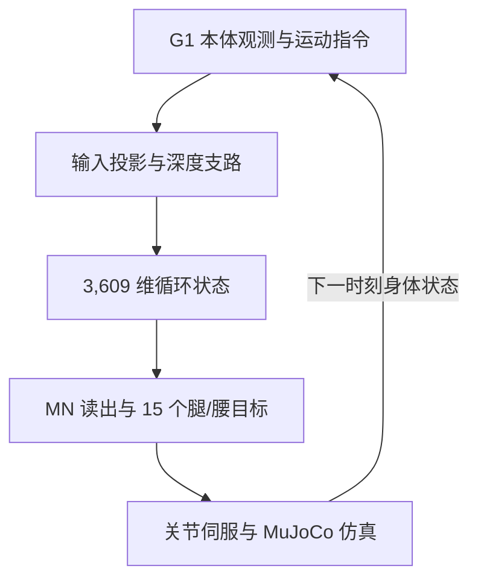

# 果蝇启发循环控制器的人形行走分析

**Humanoid Locomotion with a Fly-Inspired Recurrent Controller**（[arXiv:2609.27001](https://arxiv.org/abs/2609.27001)）把一个带果蝇神经元类别标注的循环网络接入 MuJoCo Unitree G1 仿真，并用轨迹记录和状态干预分析该 checkpoint 的有效控制路径。论文是 arXiv 预印本，页面标注为模拟研究、尚未同行评审。

## 一句话定义

这项工作分析固定循环控制器在 G1 仿真中如何通过持续的内部状态、本体观测和运动指令维持行走，并检验哪些输入支路在该 checkpoint 中实际影响动作。

## 英文缩写速查

| 缩写 | 英文全称 | 简要说明 |
|------|----------|----------|
| RNN | Recurrent Neural Network | 持续携带内部状态的循环网络，是本研究被测控制器的计算核心 |
| G1 | Unitree G1 Humanoid Robot | 论文在 MuJoCo 中使用的 29 个驱动关节人形模型 |
| MN | Motor-Neuron-Labelled Units | 论文用来选择 135 个核心状态并映射至 15 个腿/腰目标的神经元类别标签 |
| DN | Descending-Neuron-Labelled Units | 1,286 个被标为 descending 的核心项；不等于另一个独立深度 bottleneck |
| ONNX | Open Neural Network Exchange | 论文材料中 checkpoint 的部署模型格式 |

## 为什么重要

- **把“生物启发”落实到可检查的闭环接口。** 论文把观测投影、循环状态更新、受限读出、关节目标映射与物理仿真分开描述，便于追问运动是由网络状态、身体反馈还是环境分支支撑。
- **最有力的结果是对 checkpoint 的机制定位。** 每次策略调用前清零循环状态后，名义 yaw 条件下成功从 19/21 变为 0/21，说明该实现依赖跨调用保留的 motor state。
- **读数必须连同评测边界看。** 61/63 是固定模拟场景上的存活和前进距离指标，不是通用地形鲁棒性，也不是 G1 真机成功率。

## 核心机制

### 控制器与身体的闭环

论文研究的是已提供的 T_graph checkpoint。网络核心有 **3,609 个连续人工状态**；元数据把它们标注为 1,286 个 DN 项、2,188 个 IN 项和 135 个 MN 项。作者明确将 “fly-inspired” 用于描述带有这些生物学类别标注的人工循环表示；材料没有提供所选原始生物连接关系、图提取规则或训练配置。因此，结果说明的是这个人工模型的功能接口，不能直接解释为果蝇真实神经回路已被复刻。

G1 的 29 个关节中，策略输出映射到 12 个腿部和 3 个腰部目标；另 14 个手臂关节使用固定保持目标。策略每 20 个物理步更新一次：策略频率 50 Hz，MuJoCo 物理仿真频率 1 kHz。

| 模块 | 输入 / 状态 | 输出与作用 |
|------|-------------|------------|
| 身体与指令观测 | 82 维：重力投影、角速度、平面/偏航指令、关节位置与速度、上一时刻 raw action | 不含直接的 base 线速度观测 |
| 深度支路 | 36×32 深度图；256 维内部状态 | 生成 128 维 bottleneck；论文评测持续使用归一化零深度输入 |
| 循环核心 | 3,609 维连续状态，随调用保留 | 汇总当前输入与前序状态，形成 motor readout |
| MN 读出与动作映射 | 135 个 MN 标签状态 | 映射为 15 个腿/腰关节目标，随后由位置伺服作用于身体 |
| 身体与环境 | MuJoCo G1、地形、伺服目标 | 下一时刻的关节与姿态反馈进入策略 |

### 反馈回路

图展示论文描述的闭环接口。评测中深度输入固定为归一化零值；深度支路的有效性要结合后文干预结果判断。

## 实验与评测

| 项目 | 论文设定与结果 |
|------|----------------|
| 机器人与环境 | MuJoCo 中的 Unitree G1；7 种固定地形：平地、粗糙地面、上/下坡、上/下楼梯、离散台阶 |
| 控制条件 | 速度 0.3、0.5、0.8 m/s；初始 yaw −0.05、0、0.05 rad；总计 63 个固定条件 |
| 成功定义 | 存活 12 秒，且前进距离达到指令速度与时长的 70% |
| T_graph | 61/63 条件成功；失败为粗糙地形的一次高度查询边界终止，以及上楼梯时仍站立但前进距离不足 |
| R1 参考 | 62/63；额外使用 187 个特权地形高度样本，因此不是同等观测条件的算法对照 |
| 清零循环状态 | 名义 yaw 的 21 个条件从 19/21 降到 0/21；每次调用前清零整个 3,609 维状态 |
| 深度 / upstream 干预 | 对 252 个记录状态替换深度输入或清零 upstream state，raw action 无变化；被测 rollout 中 descending bottleneck 输出为零 |
| 策略 / 仿真频率 | 策略 50 Hz，MuJoCo physics 1 kHz |

**结果该怎么读：** 清零整个状态同时破坏状态携带和循环交互，因此它支持“当前 checkpoint 的行为依赖递归状态”，但不是分别量化每一个神经元的因果贡献。深度支路不改变本次实验动作，也不能推出深度感知在训练中从未起作用。

成功标准只考察存活与向前位移，没有把侧向偏移纳入成功判据。论文报告一个离散台阶 0.8 m/s rollout 以成功终止，但其横向偏移达 3.17 m，已偏出标称 6 m 宽通道；所以不能只看 61/63 就概括为精准路径跟踪。

## 源码运行时序图

**不适用：** 截至 2026-10-04，arXiv 页面未链接公开代码仓库或可下载 inference bundle。论文提到的 T_graph ONNX、仿真接口及作者持有的分析归档没有公共归档标识；完整评测复跑需另行授权。

## 工程实践与复现边界

- **可借鉴的分析方法：** 固定 checkpoint，记录完整本体观测与内部状态；按条件枚举地形、速度和初始偏航；再分别替换深度、上游状态、循环状态与身体/指令输入，比较 raw action 与闭环终止情况。
- **不要混用比较对象：** R1 使用额外特权高度观测；它只能提供该评测设置下的参考，不构成同输入预算的模型优劣比较。
- **不是本体实验：** 所有结果来自仿真与软件检查；接触参数、自碰撞设置和固定场景限定了结论范围。
- **不能据此宣称生物结构带来优势：** 论文没有给出匹配资源的普通 RNN、随机连边网络或不同网络规模对照，3,609 是状态数量描述，不是效率优势证明。
- **公开性有限：** 未发现作者提供的 GitHub、项目站或公开模型下载。原始图提取、checkpoint 训练来源与配置未公开，复现完整结果依赖权限受限的 inference bundle。

## 与相关方法的关系与对比

- **[步态生成](../concepts/gait-generation.md)** 常以相位变量或耦合振荡器显式组织节律；本文则研究学习得到的高维循环状态及其与 G1 身体反馈的作用。两者的网络规模、训练方式和评测并未对齐，不能直接比较优劣。
- **[人形行走](../tasks/humanoid-locomotion.md)** 提供任务侧背景；本文只证明固定仿真条件下达到给定的存活/位移标准。
- **[强化学习](../methods/reinforcement-learning.md)** 是相关策略训练背景，但本文公开材料没有给出该 checkpoint 的完整训练目标和配置。

## 结论

**这篇论文最有价值的证据是：对当前 T_graph checkpoint，持续保留的循环状态是维持所测仿真行走的关键；它没有证明果蝇连接组结构优于标准控制器。**

1. **状态持久性值得优先验证：** 每次调用前清零状态使名义 yaw 成功从 19/21 变成 0/21，是该论文最直接的机制干预结果。
2. **输入路径的结论有适用范围：** 252 个状态上的深度 / upstream 替换不改变动作，指向被测 checkpoint 和合成零深度设置，不代表所有训练或部署时的深度感知都无用。
3. **成功率不是路径质量：** 61/63 只统计存活与足够前进；至少一个通过条件仍有显著侧向漂移。
4. **R1 不是等条件基线：** 它有 187 个额外地形高度观测，比较时必须标出感知预算差异。
5. **机制分析与架构优势是两种问题：** 需要普通 RNN、不同图结构与参数/算力匹配对照，才能检验连接组拓扑是否带来收益。
6. **复现目前受公开性限制：** 公开论文有接口与结果说明，但完整模型包、图提取流程和训练配置没有公开链接。

## 关联页面

- [人形行走](../tasks/humanoid-locomotion.md)
- [步态生成](../concepts/gait-generation.md)
- [强化学习](../methods/reinforcement-learning.md)

## 参考来源

- [论文与一手资料归档](../../sources/papers/humanoid-fly-inspired-rnn_arxiv_2609_27001.md)
- [senlanke 人形/四足运控周更](../../sources/blogs/wechat_senlanke_weekly_humanoid_quadruped_2026-09-21_25.md)
- [arXiv:2609.27001 HTML](https://arxiv.org/html/2609.27001)
- [arXiv:2609.27001 PDF](https://arxiv.org/pdf/2609.27001)

## 推荐继续阅读

- [arXiv HTML 正文与补充材料](https://arxiv.org/html/2609.27001)
- [MaleCNS v1.0 资料](https://male-cns.janelia.org/download/)
