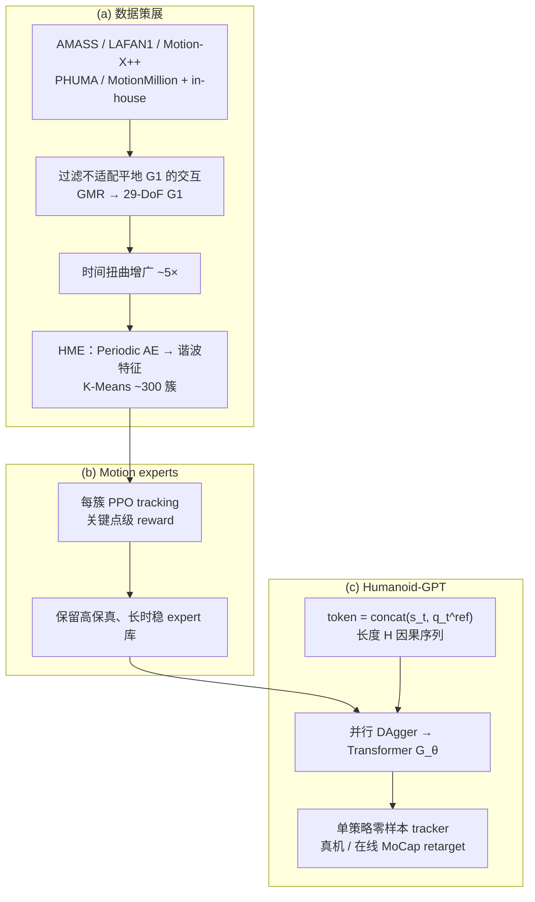

# Humanoid-GPT（Scaling Data and Structure for Zero-Shot Motion Tracking）

**Humanoid-GPT** 是清华、Galbot、上交、北大与期智等团队的 **人形全身在线 motion tracking** 工作（arXiv:2606.03985，项目页标注 **CVPR 2026**）：在 **约 20 亿帧** Unitree G1 重定向运动上，用 **Harmonic Motion Embedding (HME)** 组织数据多样性，先训 **~300 个簇级 PPO expert**，再以带 **RoPE** 的 **因果 Transformer + DAgger** 蒸馏为 **单一通才 tracker**，在仿真与真机上同时追求 **高动态敏捷** 与 **训练外零样本泛化**。

## 英文缩写速查

| 缩写 | 英文全称 | 简要说明 |
|------|----------|----------|
| G1 | Unitree G1 Humanoid | 宇树入门级教育科研人形平台 |
| PPO | Proximal Policy Optimization | 人形/足式 locomotion 中最常用的 on-policy 策略梯度算法 |
| DAgger | Dataset Aggregation | 迭代收集策略诱导状态下的专家标注以纠偏的模仿学习方法 |
| MLP | Multi-Layer Perceptron | 多层感知机，处理本体向量等低维输入 |
| WBT | Whole-Body Tracking | 全身参考运动跟踪控制 |
| PD | Proportional–Derivative | 关节位置/阻抗底层控制，策略输出常为其 setpoint |
| AMASS | Archive of Motion Capture as Surface Shapes | 大规模统一人体动捕数据集 |
| MoCap | Motion Capture | 动作捕捉，参考动作与演示数据的主要来源 |
| ONNX | Open Neural Network Exchange | 跨框架神经网络模型交换格式 |
| MuJoCo | Multi-Joint dynamics with Contact | 接触丰富的刚体物理仿真引擎 |
| DoF | Degrees of Freedom | 自由度，人形通常 20–50+ 关节 |
| GMR | General Motion Retargeting | 把人体/视频动作重定向为机器人可执行参考 |
| RL | Reinforcement Learning | 通过与环境交互最大化长期回报来学习策略的范式 |
| RoPE | Rotary Position Embedding | 旋转位置编码，用于因果 Transformer 的时序位置建模 |

## 为什么重要

- 在 [运动小脑 64 篇技术地图](../overview/humanoid-motion-cerebellum-technology-map.md) 中归类为 **D 全身跟踪基座**（29/64）：跟踪策略：海量动作帧和 Transformer 化。
- **打破「敏捷 vs 泛化」叙事**：论文将既有 MLP tracker 在百万～亿级帧上的 trade-off 归因于 **规模与结构不匹配**，并用 **2B 帧 + Transformer** 给出同时改进两端的证据。
- **数据工程可复用**：公开 **多 mocap 源聚合 + G1 retarget + 时间扭曲增广 + HME 度量（gstd / log-volume）** 的完整管线，对任何「通才 WBT」数据策展有直接参考价值。
- **与 SONIC 的正交对照**：SONIC（[方法页](../methods/sonic-motion-tracking.md)）在 **~100M 帧 + MLP** 上已证明 scaling；Humanoid-GPT 推进到 **Transformer + 2B 帧 + expert 蒸馏**，站点提供 **四类并排真机对比**（daily / dance / high-dynamic / balance）。
- **在线因果结构**：测试时 **不可见未来**；模型用 **GPT 式因果注意力** 输出关节 PD 目标，与部署约束一致，并支持 DAgger 的 **并行多步监督**（一次前向对齐整段 teacher 动作）。

## 流程总览

## 核心机制（归纳）

### 数据与 HME

| 组件 | 作用 |
|------|------|
| **2B 帧语料** | 相对常见 **7.2M–100M** 训练集放大 **约 20×–200×**；含 in-house 真实场景覆盖 |
| **HME** | 关节谐波幅值/频率统计 → 序列嵌入；**gstd** 与 **log-volume** 量化 latent 多样性 |
| **~300 簇** | 每簇 **1k–2k** 序列；支撑 **分簇 expert** 与 **diversity-balanced 采样** |

论文强调：**多样性 + 平衡** 缺一不可——仅多样性仍会过拟合高频模式；仅平衡会限制能力上界。

### Expert 与蒸馏

- **Expert 策略** $\pi: \mathcal{G} \times \mathcal{S} \mapsto \mathcal{A}$：特权本体 + 参考姿态 $q_t^{ref}$ → 低层动作 → PD 力矩。
- **奖励**：躯干/四肢/脚/骨盆等 **关键点** 位置、$\mathrm{SO}(3)$ 姿态、速度残差的加权和指数项 + 自碰撞/平滑惩罚。
- **Humanoid-GPT**：多 expert 并集 $\mathcal{T}$ 上 **DAgger**；**SmoothL1** 监督 Transformer 输出的 **整段历史动作**（式 2），推理取 **最新 token 位** 输出。

### 与代表性 tracker 对比（公开 Table 1 摘要）

| 方法 | 低层结构 | 敏捷 | 零样本 | 训练帧量级 |
|------|----------|------|--------|------------|
| TWIST | MLP | ✗ | ~ | 9.2M |
| Any2Track | MLP | ✓ | ✗ | 9.1M |
| **SONIC** | MLP | ✓ | ✓ | **100M** |
| **Humanoid-GPT** | **Transformer** | ✓ | ✓ | **2.0B** |

### Scaling 与部署（论文 Table 2 + 项目页）

- **数据 scaling**：Humanoid-GPT-S 从 **2M→20M** tokens，SR 与 MPKPE 持续改善；**2B** 上 Humanoid-GPT-B SR **90.43%**（AMASS-test）。
- **模型 scaling**：同 **2B** 数据下 **Humanoid-GPT-L（80.4M）** SR **92.58%**；MLP/TCN 在 2B 上增益 **饱和**，且 **小数据大模型过拟合**（2M 时 MLP-L 弱于 MLP-S）。
- **真机**：训练外舞蹈 MPJPE/MPJVE 接近仿真；在线 MoCap→G1 **全身遥操作** 无需任务微调。
- **延迟**：ONNX + TensorRT，RTX 4090 **<1.5ms**（项目页：约 **5×** TWIST）。

## 开源工程（官方仓库，2026-06-19）

官方 [GitHub](https://github.com/GalaxyGeneralRobotics/Humanoid-GPT) 已发布 **推理 / 评测 / 真机部署** 与 ONNX checkpoint **`pns_wo_priv216.onnx`**；**完整训练代码与 2B 训练数据** 仍标注为计划中。

| 模块 | 路径 / 入口 | 说明 |
|------|-------------|------|
| Gradio demo | `python -m scripts.app` | 交互式跟踪演示 |
| 单条 / 批量推理 | `scripts.inference` | `--load_path` 指向 ONNX；`--mocap_path` 为 `.npz` 轨迹 |
| 并行评测 | `scripts.eval_parallel` | 文件夹批量 SR / MPJPE 等 |
| keypoint 转换 | `tracking/convert_qpos2kpt.py` | retarget 后 `qpos` → policy 输入 |
| 仿真 / 真机播放 | `deploy.play_track` | `--real --net <nic>` 上 G1；见 `deploy/DEPLOY.md` |
| 机载 Jetson | `deploy/onboard_deploy/` | Orin 机载部署 |
| HME / GQS / Transformer | `projects/hme`、`projects/gqs`、`projects/tracking_transformer` | 与论文数据策展、质量筛选、策略结构对应 |

- **动作格式**：`.npz` 含 `qpos`，或 `root_pos` / `root_rot` / `dof_pos`。
- **G1 硬件版本**：`G1_VERSION` 环境变量（默认 `5010`），资产在 `storage/assets/unitree_g1_${G1_VERSION}/`。
- **依赖**：Python 3.12、CUDA 12.x、`pip install -e ".[cuda]"`；仿真侧 **MuJoCo-MJX**。

## 评测

- **平台**：仿真 **MuJoCo** + 真机 **Unitree G1（29-DoF）**；参考经 GMR retarget 到 G1 关节空间。
- **仿真 held-out**：**AMASS-test**（训练未见 split）；对比 GMT / TWIST / Any2Track 与多规模 Humanoid-GPT 变体。
- **指标**：**SR**（稳定跟踪比例）、**MPJPE**（rad）、**MPJVE**（rad/s）、**RootVelErr**（m/s）、**MPKPE**（mm）。
- **仿真亮点（Table 2）**：Humanoid-GPT-L @ 2B — SR **92.58%**，MPJPE **0.0735**，MPKPE **40.99 mm**；同 2B 下 TCN-L SR **89.05%** 且 MPKPE **56.15 mm**。
- **真机（Table 3，训练外舞蹈）**：四支未见舞曲上 MPJPE/MPJVE 整体优于 GMT / TWIST / Any2Track；Humanoid-GPT-B 在多数 clip 上 MPJVE 最低。
- **定性**：项目页 **训练外** 真机片段（digging / disinfection / soccer / security 等）与相对 **SONIC** 的四类并排视频；完整协议与随机种子以 **PDF** 为准。

## 常见误区或局限

- **不是「纯端到端 RL 单策略」**：通才能力来自 **数百 expert 蒸馏**；expert 训练与簇质量仍占大量算力与工程。
- **平台与场景绑定**：主证据为 **Unitree G1、平地、无显式物体交互**（坐椅/楼梯等已滤除）；跨硬件仍需 retarget 与动力学对齐。
- **零样本定义需读协议**：仿真以 **AMASS-test** 等 held-out split 为主；真机强调 **训练外舞蹈/居家 clip**，不等同于任意野外视频直接可用。
- **对比 SONIC 的公平性**：帧数差 **20×**、结构不同（MLP vs Transformer）；读对比视频时应同时考虑 **数据策展、蒸馏与部署栈** 差异。
- **开源覆盖不完整**：推理、评测、真机部署与 **ONNX checkpoint** 已发布，但 **2B 训练数据与完整训练管线** 尚未开源；复现论文 scaling 仍依赖后续 release。
- **视频估计动作**：论文称规模化后可从 video-estimated motion 获益，但公开仓库当前以 mocap / retarget `.npz` 为主，野外视频直用需自建管线。

## 与其他页面的关系

- [SONIC（规模化运动跟踪）](../methods/sonic-motion-tracking.md) — 同任务 **MLP + 100M** scaling 基线；Humanoid-GPT 可视为 **结构升级 + 数据再放大** 的后续前沿。
- [BeyondMimic](../methods/beyondmimic.md) — 同属高质量仿真跟踪，但 Humanoid-GPT 强调 **零样本泛化 + Transformer scaling**，而非单动作极限拟合。
- [DAgger](../methods/dagger.md) — 蒸馏阶段核心算法；与 AssistMimic 等 **expert→generalist** 管线同族。
- [人形运动跟踪方法选型](../queries/humanoid-motion-tracking-method-selection.md) — 将 Humanoid-GPT 纳入「规模化通才 tracker」分支。
- [Whole-Body Tracking Pipeline](../concepts/whole-body-tracking-pipeline.md) — retarget → tracker → 真机闭环上下文。

## 推荐继续阅读

- 论文：<https://arxiv.org/abs/2606.03985>
- 项目页：<https://qizekun.github.io/Humanoid-GPT/>
- 代码：<https://github.com/GalaxyGeneralRobotics/Humanoid-GPT>
- 对照：[SONIC 项目页](https://nvlabs.github.io/GEAR-SONIC/)

## 参考来源

- [humanoid_gpt_arxiv_2606_03985.md](../../sources/papers/humanoid_gpt_arxiv_2606_03985.md) — arXiv 策展摘录
- [humanoid-gpt-qizekun-github-io.md](../../sources/sites/humanoid-gpt-qizekun-github-io.md) — 项目页公开主张与对比演示
- [humanoid_gpt_galaxy_general_robotics.md](../../sources/repos/humanoid_gpt_galaxy_general_robotics.md) — 官方代码仓库索引

## 关联页面

- [SONIC（规模化运动跟踪）](../methods/sonic-motion-tracking.md)
- [BeyondMimic](../methods/beyondmimic.md)
- [DAgger](../methods/dagger.md)
- [Imitation Learning](../methods/imitation-learning.md)
- [Whole-Body Control](../concepts/whole-body-control.md)
- [人形运动跟踪方法选型](../queries/humanoid-motion-tracking-method-selection.md)
