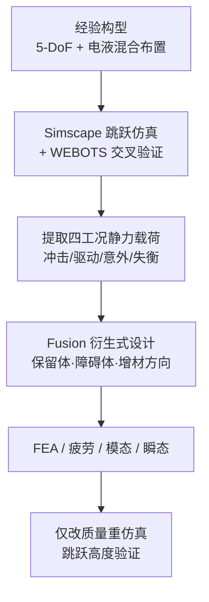

# 动力学仿真驱动的人形机器人下肢衍生式设计

**罗元春 / 纵怀志 / 周蕾\* / 张军辉**（[浙江大学](https://www.zju.edu.cn/) 流体动力基础件与机电系统全国重点实验室；[中航工业西安飞行自动控制研究所](https://www.facri.com/)），*华中科技大学学报（自然科学版）* 2026, 54(6): 1–7，DOI [10.13245/j.hust.260645](https://doi.org/10.13245/j.hust.260645)；学报页 <http://xb.hust.edu.cn/thesisDetails#10.13245/j.hust.260645&lang=zh>。

## 一句话定义

**先用高动态跳跃仿真把关节力矩与姿态变成可静力反算的多工况载荷，再在保留体/障碍体约束下做衍生式生长式轻量化，把电液混合人形下肢的大腿与小腿连杆减重六成以上，并用重仿真证明跳跃高度跟着抬升。**

## 英文缩写速查

| 缩写 | 英文全称 | 简要说明 |
|------|----------|----------|
| EHA | Electro-Hydrostatic Actuator | 本文髋/膝俯仰用的自研电静液执行器 |
| DoF | Degree of Freedom | 单腿 5 自由度配置 |
| FEA | Finite Element Analysis | 优化后强度与瞬态应力验证 |
| SLM | Selective Laser Melting | Ti6Al4V 增材工艺；疲劳 S-N 取 SLM 试验数据 |
| PD | Proportional–Derivative | Simscape 起跳轨迹跟踪控制 |
| CoM | Center of Mass | 0.3 m 竖跳所需离地初速由能量守恒反推 |

## 为什么重要

- **把「质量螺旋」接到可算的设计闭环：** [负载与质量螺旋](../overview/humanoid-actuator-102-load-and-mass-spiral.md) 讲远端质量为何贵；本文给出一条可操作路径——仿真提工况 → 衍生式减连杆质量 → 同一控制下跳跃高度上升。
- **电液混合布置可读：** 大力矩关节走 EHA+连杆，姿态/带宽敏感关节走电机直驱，是对 [机械布局 L1–L2](../concepts/humanoid-mechanical-layout-design.md) 的具体实例，也便于与 [PRS 直线腿](../concepts/planetary-roller-screw-humanoid-leg-actuation.md) 对照。
- **衍生式 ≠ 传统拓扑去料：** 不以固定初始几何抠材料，而在制造与装配约束下「生长」候选拓扑，并显式选增材方向约束——对 Stage 2 结构详设有方法论参考价值。

## 核心信息

| 项 | 内容 |
|----|------|
| **机构** | 浙江大学（ZJU）流体动力基础件与机电系统全国重点实验室；中航工业西安飞行自动控制研究所（AVIC FACRI） |
| **期刊** | 华中科技大学学报（自然科学版）Vol.54 No.6，页 1–7（2026） |
| **平台** | 自研电液混合人形下肢样机（仿真为主；未报整机商品名） |
| **指标** | 骨盆静载 30 kg；原地竖跳 ≥0.3 m；大/小腿长 400 mm |
| **开源** | **确认未开源** — 无项目页 / GitHub / CAD；仅学报 PDF/WORD |

## 核心原理

### 流程总览

### 构型与驱动分工

| 关节 | 驱动 | 传动要点 | 选型量级（文内） |
|------|------|----------|------------------|
| 髋俯仰 / 膝俯仰 | 自研 EHA（3.18 kg） | 髋：三角连杆无死点；膝：四连杆避死点 | 推力至 12 kN / 540 mm/s |
| 髋滚转 | 电机直驱 | 紧凑布置 | 云深处 J80-27P，84 N·m |
| 踝俯仰 / 滚转 | 双电机 + 平行四边形 | 同向俯仰、差动滚转 | J60-10，30.5 N·m |

### 仿真读点（表 1）

- 起跳阶段膝俯仰最大力矩 **402.4 N·m**、髋俯仰 **219.1 N·m** → **执行器选型依据**。
- 落地瞬间膝俯仰峰值 **2188.9 N·m**、踝俯仰 **435.8 N·m** → **结构强度依据**（短时冲击，不要求执行器持续输出）。
- WEBOTS 对起跳关键关节最大力矩误差 **<3%**；基线跳跃高度 **0.303 m**。

### 衍生式优化边界

- **目标：** \(\min M(x)\)，多方案解集用欧氏距离均匀铺开。
- **约束：** 应力 ≤ 屈服/安全系数、位移上限、保留体（安装座/法兰）、障碍体（走线/执行器本体/运动包络）、增材方向。
- **材料/工艺：** Ti6Al4V + 金属增材；最终取 **y 向增材**方案。

## 评测与结果

| 指标 | 经验设计 | 衍生式后 |
|------|----------|----------|
| 大腿连杆质量 | 7.75 kg | **2.90 kg（−62.5%）** |
| 小腿连杆质量 | 5.97 kg | **2.29 kg（−61.6%）** |
| 跳跃高度（同控制重仿真） | 0.303 m | **0.327 m** |
| 多工况最大等效应力（大/小腿） | — | 592.7 / 643.5 MPa（低于许用） |
| 一阶模态（大/小腿） | — | 156.83 / 70.25 Hz（相对 <10 Hz 激励有裕量） |
| 起跳瞬态最大等效应力 | — | 701.2 MPa（0.176 s 窗口，骨盆 30 kg 负载） |

## 与相邻工作对比

| 维度 | 本文 | 传统拓扑优化减重 | PRS / 纯电旋转腿 |
|------|------|------------------|------------------|
| 驱动 | 电液混合（EHA + 电机） | 视平台而定 | 多为电机+丝杠或旋转关节 |
| 结构生成 | **衍生式生长** + 多工况 | 固定设计域去料 | 常经验截面 / 标准型材 |
| 工况来源 | **跳跃动力学仿真反算** | 常人工设静载 | 负载预算或供应商曲线 |
| 闭环验证 | 减重后**重仿真动态指标** | 多为静强度达标即停 | 真机步态/续航 |
| 开源 | 无 | 视项目 | 部分开源平台有 CAD |

## 结论

**这篇的真贡献是「动态工况 → 衍生式连杆 → 动态指标再验证」的贯通，而不是又一个经验削薄案例；数字上大腿/小腿减重约 62%，跳跃高度再抬约 8%。**

1. **选型读表 1 的分工：** 起跳匀加速定 EHA/电机规格，落地峰值只进结构强度，不要拿落地 2000 N·m 级力矩去买持续额定执行器。
2. **电液混合是布置答案：** 髋/膝俯仰吃功率密度与抗冲击，踝与髋滚转吃空间与带宽——与「全家一种执行器」路线相反。
3. **衍生式相对拓扑优化的差别：** 突破初始几何限制 + 显式制造方向约束；工程落地仍依赖 Fusion 一类工具与增材工艺。
4. **模态裕量是控制友好信号：** 小腿一阶 70 Hz 仍远高于文内 <10 Hz 运动激励，但力控带宽仍可能被局部柔度卡住（见 [机械布局 L4](../concepts/humanoid-mechanical-layout-design.md)）。
5. **复现边界清晰：** 无 CAD/代码；可迁移的是流程与工况拆分，不是可下载样机。
6. **对照 PRS 腿：** 同是直线推力思维，本文 EHA 走液压功率密度，[PRS 路线](../concepts/planetary-roller-screw-humanoid-leg-actuation.md) 走机电丝杠——选型时先锁任务动态等级再选介质。

## 局限与风险

- **开源与复现：** 截至 2026-08-03 **无官方代码/CAD**；Simscape / Fusion / WEBOTS 工程不可直接下载。
- **验证层级：** 动态性能提升来自**仿真重跑**；文内未给减重后的整机真机跳跃统计。
- **衍生式静载近似：** 时变载荷被抽成四类静力工况，异常冲击/失衡为估算项，覆盖不全真实跌倒谱。
- **平台专用：** EHA 与云深处电机规格、连杆几何与增材方向强绑定；换纯电旋转腿需重做工况与保留体。
- **材料工艺：** SLM Ti6Al4V 疲劳数据与连接界面（复材/金属混合时）仍是工程风险点，见 [机身与材料](../overview/humanoid-hardware-101-chassis-materials.md)。

## 工程实践

| 项 | 说明 |
|----|------|
| **可借鉴清单** | ① 任务指标→DoF/尺寸；② 混合驱动分工；③ 跳跃仿真分阶段；④ 起跳/落地载荷分流；⑤ 保留/障碍体；⑥ 强度+疲劳+模态+瞬态；⑦ 仅改质量重仿真 |
| **工具链（文内）** | SolidWorks 质量属性 → Simscape Multibody → WEBOTS 交叉验证 → Fusion 360 衍生式 → ANSYS 疲劳 |
| **源码运行时序图** | **不适用**（确认未开源，无可运行训练/推理/部署入口） |
| **部署读法** | 把本文当作 [整机硬件路线 Stage 1–2](../../roadmap/depth-humanoid-hardware-design.md) 的电液混合案例，不要当成 RL 控制论文 |

## 参考来源

- [动力学仿真驱动的人形机器人下肢衍生式设计（学报归档）](../../sources/papers/humanoid_leg_generative_design_hust_j_260645.md)
- 罗元春 等，*动力学仿真驱动的人形机器人下肢衍生式设计*，[DOI 10.13245/j.hust.260645](https://doi.org/10.13245/j.hust.260645)，学报页 <http://xb.hust.edu.cn/thesisDetails#10.13245/j.hust.260645&lang=zh>

## 关联页面

- [人形整机机械布局设计](../concepts/humanoid-mechanical-layout-design.md)
- [人形腿部行星滚柱丝杠直线驱动](../concepts/planetary-roller-screw-humanoid-leg-actuation.md)
- [Humanoid Hardware 101 · 机身与材料](../overview/humanoid-hardware-101-chassis-materials.md)
- [Actuator 102 · 负载与质量螺旋](../overview/humanoid-actuator-102-load-and-mass-spiral.md)
- [人形硬件选型指南](../queries/humanoid-hardware-selection.md)
- [人形整机硬件设计纵深路线](../../roadmap/depth-humanoid-hardware-design.md)
- [人形并联/连杆关节运动学](../concepts/humanoid-parallel-joint-kinematics.md)
- [人形机器人](./humanoid-robot.md)

## 推荐继续阅读

- 学报原文 PDF（详情页「阅读全文 PDF」）：<http://xb.hust.edu.cn/thesisDetails#10.13245/j.hust.260645&lang=zh>
- Zong et al., *Integrating kinematic and dynamic factors with generative design…*, Virtual and Physical Prototyping 2025（本文参考文献 [18]，同源衍生式+动力学思路）
