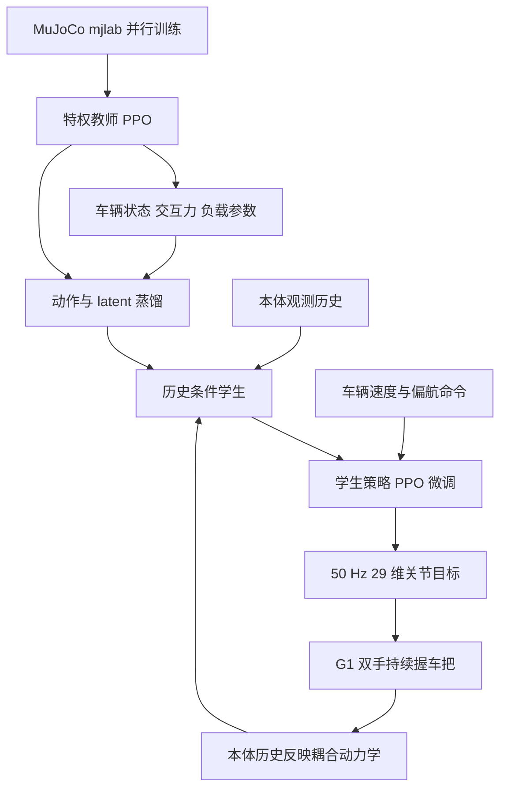

# Humanoid Rickshaw Pulling：用 G1 牵引重载两轮车

*Humanoid Rickshaw Pulling: Whole-Body Locomotion under Coupled Wheeled Loads*（[arXiv:2610.04238](https://arxiv.org/abs/2610.04238)）把持续双手接触、平衡和车辆运动控制合成一个耦合全身控制问题。Unitree G1 通过定制手部末端执行器握住车把，让被动两轮车承重，并以腿部推进、车把反作用力转向。

- **论文：** [arXiv 摘要](https://arxiv.org/abs/2610.04238) · [HTML v1](https://arxiv.org/html/2610.04238v1) · [PDF](https://arxiv.org/pdf/2610.04238)
- **视频：** [论文演示](https://youtu.be/eqnAlQLjZF8)
- **作者：** Yangzhi Yang、Xiansheng Lin、Zhaoming Xie、Xiaobin Xiong
- **机构：** Legged AI Lab、Shanghai Innovation Institute
- **代码状态：** 论文版本未列独立 GitHub 仓库；论文与视频不代表可复现代码已发布。

## 一句话理解

**机器人不把重物抱起来，而是抓住被动两轮车的把手，让轮子承载负载；全身策略一边推进车辆，一边利用接触反力稳定身体。**

## 方法图

## 机器人、车辆和策略接口

- **机器人：** Unitree G1，论文硬件使用 29 个驱动关节；两个 Dex1-1 gripper 加装 6061 铝定制末端执行器。
- **车辆：** 为 G1 定制的被动两轮车，空车质量 22.8 kg；轮子支撑车体与乘员负载，G1 通过把手施力推进和转向。
- **动作接口：** policy 以 50 Hz 输出 29 维动作，再经 nominal pose 与缩放矩阵转为关节位置目标，由 PD 跟踪；夹爪采用固定闭合目标。
- **学生观测：** 97 维本体信息，包括角速度、重力投影、任务命令、关节位置/速度、夹爪速度和前一动作。部署学生不直接读取车辆状态、接触力或负载参数。

## 三阶段控制学习

### S0：带特权信息的教师

教师训练时读取车辆状态、左右手交互力、机器人相对车身位姿和负载质量/惯量等仿真信息。历史编码 TCN 加静态参数分支形成 12 维交互 latent；PPO 使用带额外车辆、接触和随机化信息的 asymmetric critic。

### S1：学生从历史估计交互状态

学生仅以本体历史预测 12 维 latent。先冻结教师动作头，训练学生适应模块复现教师动作与 latent。历史响应中包含负载、车身状态等当前观测不直接提供的信息。

### S2：针对学生估计误差微调

latent 预测和教师真值并不完全一致。作者解冻动作头，再用 PPO 微调学生，适应估计误差并优化稳定及车辆跟踪。

### 奖励与随机化

奖励组合车辆速度跟踪、躯干直立、角动量、步距/抬脚/防滑、机器人与车辆相对位置、双手把手位置、相对偏航、车身俯仰和关节限位等目标。随机化包括车质量、重心/惯量、滚阻、轮阻尼、地面摩擦、坡度、观测噪声和外力扰动。训练用 MuJoCo mjlab、8,192 并行环境、两张 NVIDIA H200，论文报告约 11 小时。

## 结果与指标边界

| 实验 | 论文报告 | 解释 |
|---|---:|---|
| 仿真质量扫描 | 20–120 kg；速度命令 0.6–2.0 m/s | 20–60 kg 是训练随机化质量范围，更重质量用于测试泛化 |
| 实机装载质量 | 60、90、115 kg | 指 loaded rickshaw mass，即装载后车辆系统总质量 |
| 实机动作 | 起步、持续牵引、转弯、停止 | 同一策略，不针对乘员/质量重新调参 |
| 最重实机配置 | 约为 G1 自身质量的 3.15 倍 | 论文报告的 loaded rickshaw 配置 |
| 训练 | 8,192 环境、2×H200、约 11 小时 | 论文描述的训练配置；policy 部署频率为 50 Hz |

作者报告，多数测试速度/负载条件下机器人 CoT proxy 低于空载步行；最重负载且高速时不再成立。接触分析显示把手反力可与步态同步，对侧向与滚转平衡提供阻尼样作用。CoT 是关节功率代理指标，不等于电池端实测能耗。

## 复现边界

- **质量口径：** 115 kg 是装载后人力车总质量，不是 G1 额外抱起或背负 115 kg；轮子承载车体和乘员。
- **任务前提：** 实验从双手已握稳把手开始，抓握获取和失手恢复是作者列出的后续方向。
- **场景范围：** 论文未构成自主导航、避障与任意地形运输系统。
- **观测边界：** 教师使用的 privileged state 只在仿真训练；部署学生以本体历史隐式推断。
- **代码状态：** 截至所引用的 arXiv v1 未附专属代码仓库；若后续有发布需重新核实授权、仿真资产与配置。

## 关联页面

- [人形运动任务](../tasks/humanoid-locomotion.md)
- [全身移动操作](../tasks/loco-manipulation.md)
- [FALCON](./paper-loco-manip-161-109-falcon.md)
- [论文来源归档](../../sources/papers/humanoid_rickshaw_pulling_arxiv_2610_04238.md)

## 结论

贡献不只是“G1 拉动 115 kg”，而是展示如何把被动轮承载、持续双手接触与腿部推进建模成部分可观测的耦合控制问题。115 kg 是实机装载车辆总质量；当前论文证据不包含自主抓握、路径规划或电池能耗测量。

## 参考来源

- [arXiv 论文](https://arxiv.org/abs/2610.04238)
- [arXiv HTML v1](https://arxiv.org/html/2610.04238v1)
- [实验视频](https://youtu.be/eqnAlQLjZF8)
