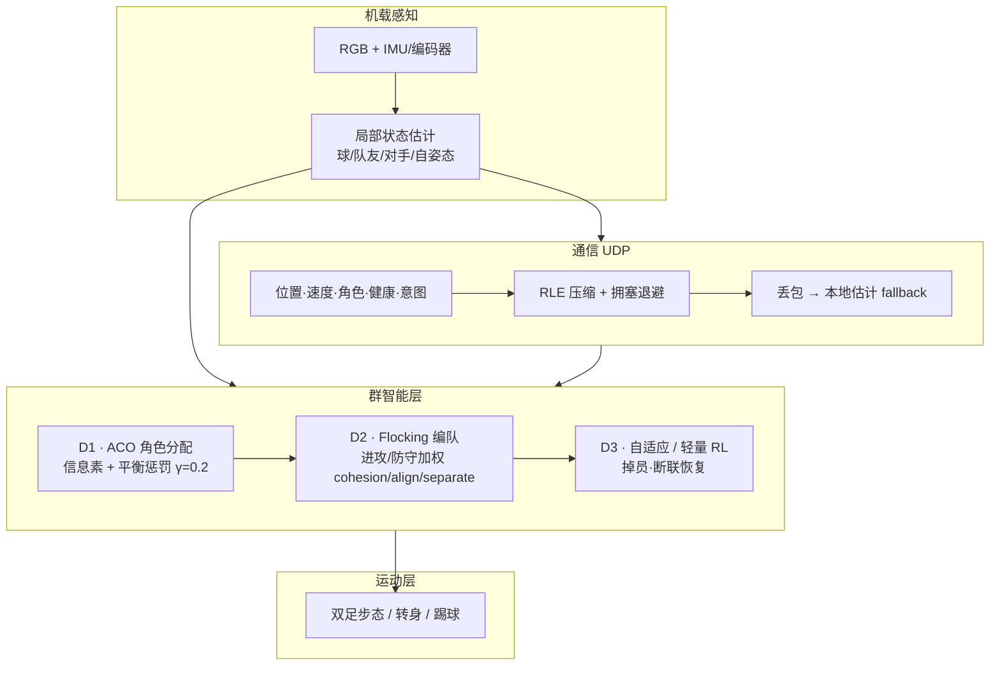

---

type: entity
tags:
  - paper
  - humanoid
  - soccer
  - swarm-intelligence
  - multi-robot
  - decentralized-control
  - robocup
  - aco
  - flocking
status: complete
updated: 2026-06-12
venue: "Sensors 2025, 25(11):3496"
doi: "10.3390/s25113496"
related:
  - ../tasks/humanoid-soccer.md
  - ../concepts/humanoid-multi-robot-coordination.md
  - ../methods/marl.md
  - ./paper-notebook-a-hierarchical-model-based-system-for-high-perfo.md
  - ../methods/htwk-gym.md
sources:
  - ../../sources/papers/humanoid_soccer_swarm_intelligence_sensors_2025.md
  - ../../sources/papers/robocup_spl_limited_communication_coordination_arxiv_2401_15026.md
summary: "Sensors 2025：面向人形足球队的去中心化群智能框架——轻量 UDP + ACO 蚁群角色分配 + Reynolds flocking 编队 + 自适应故障恢复；Webots 4v4 相对集中式基线进球 +25–40%、控球 +8–10%，角色重分配约 2.3 s。"
tags: [paper, humanoid, soccer, swarm-intelligence, multi-robot, decentralized-control, robocup, aco, flocking, sfu]

---

# Swarm Intelligence for Collaborative Play in Humanoid Soccer Teams

**Nadiri & Rad（Sensors 2025, 25(11):3496）** 提出面向 **人形足球机器人队** 的 **生物启发式去中心化群控框架**：在部分可观测、高动态对抗场上，用 **本地传感 + 轻量 UDP + 涌现式协调** 替代依赖全局视觉/中央服务器的集中式战术，并在 Webots 人形仿真中验证相对集中式/静态角色的显著增益。

## 一句话定义

**把蚁群信息素做动态角色拍卖、把 Reynolds  flocking 做进攻/防守编队，再用 UDP 广播最少状态并在丢包/掉员时本地 fallback——让人形足球队像鸟群一样自组织，而不是等中央服务器下指令。**

## 英文缩写速查

| 缩写 | 英文全称 | 简要说明 |
|------|----------|----------|
| ACO | Ant Colony Optimization | 蚁群优化；本文用于去中心化角色分配 |
| UDP | User Datagram Protocol | 轻量无连接通信，承载位置/角色/健康等字段 |
| MARL | Multi-Agent Reinforcement Learning | 多智能体强化学习；本文对比其离线训练与数据需求 |
| SPL | Standard Platform League | RoboCup 标准平台联赛（NAO 人形）；通信配额持续收紧 |
| RL | Reinforcement Learning | 强化学习；本文 D3 层用于轻量在线适应与故障恢复 |
| PSO | Particle Swarm Optimization | 粒子群优化；实验对照基线之一 |

## 为什么重要

- **直接命中「人形 + 多机 + 群控」交叉空白：** 既有 swarm 文献多服务轮式/覆盖任务；人形足球同时要求 **双足稳定、快速角色切换、有限机载视觉**——本文是少数 **专为人形足球队** 设计的 swarm 框架。
- **与 RoboCup 通信趋势同向：** SPL 队均 WiFi 包量近年 **断崖式下降**（见 [人形多机协调](../concepts/humanoid-multi-robot-coordination.md) 与对照源 [robocup_spl_limited_communication_coordination_arxiv_2401_15026.md](../../sources/papers/robocup_spl_limited_communication_coordination_arxiv_2401_15026.md)）；本文 UDP + 本地决策是 **带宽友好** 的另一条路。
- **可量化 swarm vs 集中式：** 4v4 Webots 报告 **进球 +25–40%**、控球 **+8–10%**、角色重分配 **2.3±0.4 s**（集中式 **5.1±0.6 s**）；20% 丢包或单机失效时性能降幅 **约 8–10%**。
- **与 ARTEMIS 冠军栈形成对照轴：** [ARTEMIS](paper-notebook-a-hierarchical-model-based-system-for-high-perfo.md) 走 **集成感知–导航–集中 behavior planner** 真机夺冠；本文走 **全去中心化涌现**——代表人形足球群控两条主流范式（见 [人形多机协调](../concepts/humanoid-multi-robot-coordination.md)）。

## 架构总览

## 核心机制

### ACO 角色分配

- 角色集：门将、后卫、中场、前锋；周期 **100 ms** 更新信息素 $\tau_i[r]$。
- 适应度：距球距离、踢球能力、电量/健康、场上情境（球在己方半场则偏防守）。
- **平衡惩罚** $\text{penalty}(r)=\gamma\cdot\max(0,n(r)-1)$ 防止多人抢同一高信息素角色（$\gamma=0.2$）。
- 网格搜索超参：**α=1.0, β=2.0, ρ=0.5**。

### Flocking 编队

- Reynolds 三规则：**cohesion**（支援聚团）、**alignment**（同向运动）、**separation**（防碰撞/扎堆）。
- 按当前角色对三权重做 **进攻/防守调制**，支持中场转前锋等 **动态阵型**（Figure 7 轨迹快照）。

### 通信协议

- **UDP** 小包：序号、机器人 ID、时间戳、位姿、速度、角色、优先级、电量、可选意图；**>10 Hz** 目标。
- **RLE** 压缩静止字段；拥塞时降频/裁剪非关键 payload。

## 实验摘要（Webots 4v4）

| 指标 | ACO + flocking vs 集中式/静态 |
|------|------------------------------|
| 进球 | **+25–40%** |
| 控球 | **+8–10%** |
| 传球成功率 | **+15–25%** |
| 角色重分配延迟 | **2.3±0.4 s** vs **5.1±0.6 s** |
| 20% 丢包 / 单机失效 | 控球/进球约 **−8–10%**（集中式降幅更大） |

**扩展场景：** 4v3 人少、**>50% 丢包**、角球/边线开球——相对标准 4v4 降幅 **<15%**。

## 常见误区与局限

- **不是真机群控论文：** 截至发表，验证主要在 **Webots R2025a**；双足噪声、真草、联赛规则差异待实机复现。
- **不等于 MARL 端到端：** 与 [MARL](../methods/marl.md) 离线自博弈不同，本文强调 **零/极少训练、毫秒级本地规则**；D3 仅为轻量 RL 信号而非深度策略。
- **通信并非零：** 仍需周期性 UDP；与 [SPL 市场拍卖式协调](../../sources/papers/robocup_spl_limited_communication_coordination_arxiv_2401_15026.md) 的 **事件驱动极低带宽** 是不同设计点。
- **参数需按场地调：** 信息素蒸发、 flocking 距离阈值对 KidSize 4v4 调优，换 Adult-Size 或更多球员需重标定（作者声称计算可线性扩展）。

## 与其他页面的关系

- [Humanoid Soccer](../tasks/humanoid-soccer.md) — 任务总览；单机 RL 射门（PAiD/RoboNaldo）与 **多机战术层** 正交
- [人形多机协调](../concepts/humanoid-multi-robot-coordination.md) — 集中式 vs 去中心化选型
- [ARTEMIS 人形足球系统](paper-notebook-a-hierarchical-model-based-system-for-high-perfo.md) — 集中 behavior planner 真机对照
- [MARL](../methods/marl.md) — 学习式多体协调另一主线

## 参考来源

- [humanoid_soccer_swarm_intelligence_sensors_2025.md](../../sources/papers/humanoid_soccer_swarm_intelligence_sensors_2025.md)
- [robocup_spl_limited_communication_coordination_arxiv_2401_15026.md](../../sources/papers/robocup_spl_limited_communication_coordination_arxiv_2401_15026.md) — SPL 有限通信对照
- 论文 PDF：<https://doi.org/10.3390/s25113496>

## 推荐继续阅读

- Nadiri, F., & Rad, A. B. (2025). *Swarm Intelligence for Collaborative Play in Humanoid Soccer Teams*. Sensors, 25(11), 3496.
- Affinita, D., et al. (2023). *Multi-Agent Coordination … with Limited Communication*. arXiv:2401.15026.
- Wang, Q., et al. (2025). *A Hierarchical, Model-Based System for High-Performance Humanoid Soccer*. arXiv:2512.09431.
