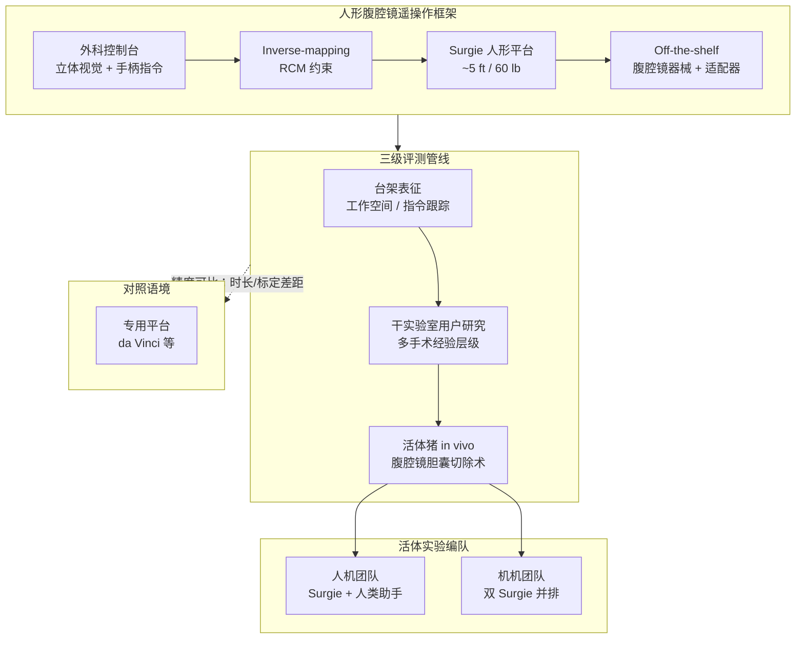

# Humanoid Surgeon（In Vivo Laparoscopic Feasibility）

**Humanoid Surgeon**（*In vivo feasibility study of humanoid robots in surgery*，Zekai Liang / Michael Yip 等，**UCSD ARCLAB × 外科**，**Nature 2026**，[DOI:10.1038/s41586-026-10796-x](https://doi.org/10.1038/s41586-026-10796-x)，[项目页](https://humanoid-surgeon.github.io/)）对 **当代通用人形机器人** 能否承担 **微创手术（MIS）** 给出首个 **活体（in vivo）** 证据链：在延续 [LapSurgie](https://arxiv.org/abs/2510.03529) 的 **inverse-mapping + RCM** 腹腔镜遥操作框架上，用 **off-the-shelf 器械** 完成 **猪模型腹腔镜胆囊切除术**，并与 **da Vinci 类专用平台** 对照讨论临床就绪度。

## 一句话定义

**用轻量可移动的人形机器人（Surgie）在现有手术室工作流中遥操作通用腹腔镜器械，经台架→干实验室→活体猪三级评测证明腹腔镜胆囊切除的可行性，同时暴露标定频率与手术时长等距临床部署仍远的工程瓶颈。**

## 英文缩写速查

| 缩写 | 英文全称 | 简要说明 |
|------|----------|----------|
| MIS | Minimally Invasive Surgery | 微创手术；本文聚焦腹腔镜路径 |
| RCM | Remote Center of Motion | 远程运动中心约束；器械支点固定在腹壁戳卡 |
| OR | Operating Room | 手术室；人形优势之一是可融入既有 OR 布局 |
| Teleop | Teleoperation | 外科医生在控制台远程驱动人形执刀 |
| da Vinci | da Vinci Surgical System | Intuitive 专用多臂手术机器人对照基准 |
| Cholex | Cholecystectomy | 胆囊切除术；本文 in vivo 主任务 |

## 为什么重要

- **证据层级跃迁：** 从 [LapSurgie](../entities/paper-notebook-lapsurgie-humanoid-robots-performing-surgery-via.md) 的用户研究与台架验证，推进到 **Nature 级 in vivo 猪模型完整手术**——回答「通用人形离真实手术还有多远」这一此前缺位的实证问题。
- **部署叙事不同于专用手术机器人：** Surgie 约 **5 ft / 60 lb**（新闻稿），相对 **~1800 lb、需改造 OR** 的专用系统，更契合 **偏远/资源不足/野战医疗** 等「难以添置专用手术岛」的场景（见 UCSD 新闻稿与 [Humanoids in Hospitals](../entities/paper-notebook-humanoids-in-hospitals-a-technical-study-of-huma.md) 姊妹路线）。
- **通用人形 vs 专用平台权衡：** 同一硬件可覆盖 **手术辅助、器械递送、术后清理** 等全身任务，而非单一功能的手术臂；代价是当前 **标定与时长** 仍显著弱于成熟商用手术机器人。
- **临床–工程联合范式：** UCSD **Center for the Future of Surgery** 与 ARCLAB 合署验证，体现 MIS 评测必须 **外科主导 + 机器人栈落地** 的双轨迭代。

## 流程总览

## 核心机制（归纳）

### 1）遥操作与器械接口

- **控制链：** 外科医生在控制台操作 → 立体视觉实时反馈 → 人形双臂执持 **标准腹腔镜器械**（经适配器）。
- **运动学：** 延续 LapSurgie 的 **inverse-mapping**，对手持 **manual-wristed** 器械维持 **RCM**，使腹壁戳卡处支点稳定。
- **与专用机器人差异：** 无需整机专用器械生态，但依赖人形 **双臂协调 + 适配器** 在狭窄术野内复现专用多臂布局。

### 2）Surgie 平台与术式

- **平台：** 团队昵称 **Surgie** 的 UCSD 人形；轻量、可移动，可站在常规 OR 内（新闻稿：与现有工作流融合度超预期）。
- **In vivo 任务：** **腹腔镜胆囊切除术** — 布署、戳卡、牵拉、分离、夹闭、肝床摘除（项目页 Fig. 4–5）。
- **编队：**
  - **人机：** 一台 Surgie 主操 + 人类助手；
  - **机机：** 两台 Surgie 并排协作完成同一术式。

### 3）分层评测设计

| 阶段 | 目的 | 要点 |
|------|------|------|
| Benchtop | 技术可行性 | 手术工作空间覆盖、**command-execution tracking**（Fig. 2） |
| Dry-lab | 人因与临床就绪度 | 不同手术经验操作员；相对专用平台的任务表现 |
| In vivo porcine | 活体安全与完整术式 | 完整 MIS 流程；世界首次报道级 **人形 in vivo 手术** 可行性（UCSD 新闻稿） |

### 4）相对 da Vinci 类平台的结论与缺口

- **精度：** 共同作者 Shanglei Liu 称遥操作人形精度 **可与专用手术机器人系统相当**（UCSD 新闻稿）。
- **时长：** 明显长于成熟专用系统；类比早期 robotic cholecystectomy **~6 h → ~30 min** 的商用演进，团队认为随迭代可改善。
- **标定：** 术中需 **多次重新标定** — 当前主要工程痛点之一。
- **远程：** **Latency** 仍是向偏远社区 **远程手术** 扩展前需优化的维度。

## 评测与结果

| 阶段 | 设置要点 | 主要结论 |
|------|----------|----------|
| 台架 | 工作空间 + command-execution tracking | 量化人形术野可达性与指令跟踪误差（Fig. 2） |
| 干实验室 | 多手术经验层级操作员 | 相对专用平台评估任务表现与临床就绪度 |
| In vivo 猪 | 腹腔镜胆囊切除术 | **完整 MIS 流程**成功；人机/机机两种编队（Fig. 4–5） |
| 对照 | da Vinci 类专用平台 | 精度可比；**时长与标定频率**显著落后成熟商用系统 |

## 常见误区

1. **in vivo 猪模型 = 临床已可用：** 本文为 **preclinical feasibility**；监管、长期安全性、大规模 RCT 均未覆盖。
2. **精度相当 = 全面替代 da Vinci：** 作者强调的是 **teleoperated precision** 可比，而非 **吞吐量、标定负担、无菌流程、器械生态** 已等价。
3. **人形优势在「更巧的手」：** 核心叙事是 **部署弹性 + 全身任务扩展**（移动、递器械、清理 OR），而非单指灵巧度已超专用手术臂。
4. **LapSurgie 与本文重复：** [LapSurgie](../entities/paper-notebook-lapsurgie-humanoid-robots-performing-surgery-via.md) 是框架与用户研究前序；**Nature 2026** 是同一技术线的 **活体系统评估升格**。

## 与其他页面的关系

- **前序框架：** [LapSurgie（Paper Notebooks 待深读）](../entities/paper-notebook-lapsurgie-humanoid-robots-performing-surgery-via.md) — inverse-mapping + RCM 手持腹腔镜（arXiv:2510.03529）
- **医院通用人形：** [Humanoids in Hospitals（计划实体）](../entities/paper-notebook-humanoids-in-hospitals-a-technical-study-of-huma.md) — 同一 UCSD 线医院场景替代体研究
- **任务层：** [Teleoperation](../tasks/teleoperation.md) — 手术遥操作与专用/通用人形对照；[Manipulation](../tasks/manipulation.md) — 器械级精细操作
- **分类索引：** [Paper Notebooks · Teleoperation](../overview/paper-notebook-category-07-teleoperation.md)

## 核心信息

| 字段 | 内容 |
|------|------|
| 机构 | 加州大学圣地亚哥分校（UCSD）— Jacobs School of Engineering（ARCLAB / ECE）+ Department of Surgery |
| 平台 | Surgie 人形（~5 ft，~60 lb） |
| 术式 | 腹腔镜胆囊切除术（活体猪） |
| 发表 | Nature，2026-07-08 在线 |
| 代码 | 项目页 Code 暂占位；预印本线曾有 Zenodo 腹腔镜人形代码记录，待官方 GitHub 放出后补链 |

## 参考来源

- [humanoid_surgeon_nature_2026.md](../../sources/papers/humanoid_surgeon_nature_2026.md)
- 项目页：<https://humanoid-surgeon.github.io/>
- 论文：<https://doi.org/10.1038/s41586-026-10796-x>
- UCSD 新闻：<https://today.ucsd.edu/story/surgeons-use-teleoperated-humanoid-robots-to-perform-live-surgery-a-world-first>

## 推荐继续阅读

- [机器人论文阅读笔记：LapSurgie](https://imchong.github.io/Humanoid_Robot_Learning_Paper_Notebooks/papers/07_Teleoperation/LapSurgie__Humanoid_Robots_Performing_Surgery_via_Teleoperated_Handheld_Laparoscopy/LapSurgie__Humanoid_Robots_Performing_Surgery_via_Teleoperated_Handheld_Laparoscopy.html)
- [机器人论文阅读笔记：Humanoids in Hospitals](https://imchong.github.io/Humanoid_Robot_Learning_Paper_Notebooks/papers/06_Manipulation/Humanoids_in_Hospitals__Humanoid_Surrogates_for_Dexterous_Medical_Interventions/Humanoids_in_Hospitals__Humanoid_Surrogates_for_Dexterous_Medical_Interventions.html)
- [LapSurgie arXiv:2510.03529](https://arxiv.org/abs/2510.03529) — 同团队腹腔镜人形遥操作框架前序
- [Humanoids in Hospitals arXiv:2503.12725](https://arxiv.org/abs/2503.12725) — 医院场景人形替代体技术路线
- [UCSD ARCLAB · Humanoid Robots for Medicine](https://ucsdarclab.com/projects/humanoid-robots-for-medicine/)
- [LapSurgie（wiki 计划实体）](../entities/paper-notebook-lapsurgie-humanoid-robots-performing-surgery-via.md)
