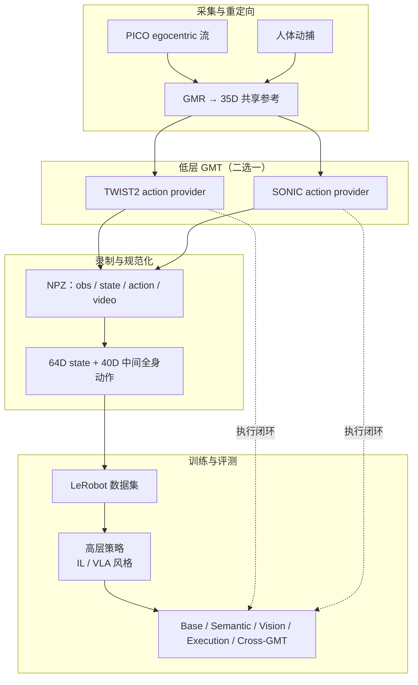

# HumanoidArena（Egocentric Hierarchical Whole-body Benchmark）

**HumanoidArena** 是香港科技大学（广州）、北京工业大学、哈尔滨工业大学（深圳）、深圳北理莫斯科大学与京东探索研究院等团队的 **仿真优先人形全身学习基准**（arXiv:2606.17833，2026-06-16）：将策略学习表述为 **分层决策**——**高层策略**把 egocentric 视觉、本体与语言指令映射为 **紧凑中间全身动作（40D）**，再由低层 **General Motion Tracker (GMT)** 执行为稳定人形运动。基准强调 **腿足结构必要** 的 **7 项 HOI/HSI 任务**，并从 **扰动条件泛化** 与 **GMT 条件迁移** 两轴系统诊断 **policy–tracker 接口**；实验表明分层控制能解多样腿关键交互，但性能 **强 tracker 条件化**、**跨 GMT 迁移仍脆弱**。

## 一句话定义

**不只看任务成功率，而是用共享中间全身动作接口，在双 GMT 后端与多轴扰动下评测 egocentric 分层全身策略的可执行性与可转移性。**

## 英文缩写速查

| 缩写 | 英文全称 | 简要说明 |
|------|----------|----------|
| GMT | General Motion Tracker | 低层全身运动跟踪器，执行高层中间动作 |
| HOI | Human-Object Interaction | 人–物交互任务（如踢球、搬箱） |
| HSI | Human-Scene Interaction | 人–场景交互任务（如开门、坐沙发） |
| GMR | General Motion Retargeting | 人体动作到机器人空间的共享上游重定向 |
| VLA | Vision-Language-Action | 视觉-语言-动作多模态高层策略范式 |
| IL | Imitation Learning | 从示范学习高层策略的范式 |

## 为什么重要

- **接口缺口：** 既有工作多评 **端到端任务** 或 **纯 tracking**，较少把 **中间全身动作是否可执行、可迁移** 当作一等公民。
- **腿足必要性：** 7 项任务要求 **落脚、平衡、姿态调整与全身转向**——避免把下肢当「平面运输」而掩盖分层接口问题。
- **双 GMT 对照：** 同一 **35D 上游参考** 下 **TWIST2** 与 **SONIC** 提供 **不同低层动力学**——直接 stress-test **跨后端迁移**。
- **工程闭环：** PICO egocentric 遥操作 → GMR → Isaac Lab 录制 → **LeRobot** 数据集 → 开源 checkpoint 与仿真资产，降低复现门槛。

## 核心信息

| 字段 | 内容 |
|------|------|
| 机构 | 香港科技大学（广州）、北京工业大学、哈尔滨工业大学（深圳）、深圳北理莫斯科大学、京东探索研究院 |
| 出处 | 2026-06-16 · arXiv:2606.17833 |
| 论文/项目 | <https://arxiv.org/abs/2606.17833> |
| 项目页 | <https://humanoidarena.github.io> |
| 机体 | Unitree G1（Isaac Lab 仿真） |
| 低层 GMT | [TWIST2](./paper-twist2.md)、[SONIC](../methods/sonic-motion-tracking.md) |

## 任务套件（7 项）

| 任务 | 类型 | 下肢关键能力（归纳） |
|------|------|---------------------|
| **Football** | HOI | 接近球、触球时机、踢球时全身平衡 |
| **DoubleDesk** | HOI | 跨台面搬运、踏步、reach 与全身转向 |
| **P&PBox** | HOI | 蹲姿、姿态变化、高位搁放 |
| **OpenDoor** | HSI | 把手操作、转身、穿门 egocentric 感知 |
| **SitSofa** | HSI | 障碍导航、坐姿过渡与下肢对齐 |
| **Boxing** | HSI | 蹲击、高度自适应全身调整 |
| **VisNavi** | HSI | 受限场景 egocentric 视觉导航 |

每项任务均在 **TWIST2** 与 **SONIC** 两套 GMT 下提供示范与评测入口。

## 评测协议

| 轴 | 诊断目标 | Football 示例（项目页） |
|----|----------|-------------------------|
| **Base** | 默认任务性能基线 | 原始球位范围、场景与光照 |
| **Semantic** | 高层语义/目标 grounding | 球门外观替换、任务语义不变 |
| **Vision** | 视觉观测鲁棒性 | 光照方向变化 |
| **Execution** | 控制/执行几何敏感性 | 扩大球初始化范围 → 不同接近与触球时机 |
| **Cross-GMT** | 中间动作跨 tracker 可迁移性 | 固定高层策略，TWIST2 ↔ SONIC 换后端 |

## 核心结构

| 模块 | 内容 |
|------|------|
| **共享遥操作上游** | PICO egocentric 流 + 人体动捕 → **GMR** → **35D** 机器人空间参考（policy-facing 语义统一） |
| **双 GMT 低层** | Isaac Lab 内 TWIST2 / SONIC **action provider** 各自解释为 G1 可执行目标 |
| **数据规范化** | NPZ 录制 → **64D state** + **40D intermediate whole-body action**；多视角 ego（主/左右腕） |
| **训练栈** | LeRobot 兼容数据集 → IL / VLA 风格高层策略训练 |
| **Benchmark** | in-GMT + 四扰动轴 + cross-GMT 联合报告 |

### 流程总览

## 实验与评测（摘要）

- **正向：** 分层接口下，代表 IL 与 VLA 风格策略可完成 **多样腿关键 HOI/HSI**（项目页 P&PBox / Football / OpenDoor 成功–失败–超时对比）。
- **Tracker 条件化：** 同一高层在不同 GMT 下性能差异大——**低层选择不是可忽略实现细节**。
- **跨 GMT 脆弱：** Cross-GMT 显示 **中间全身动作表征** 尚不能无缝在 TWIST2 与 SONIC 间迁移——基准价值在于暴露 **可转移表征** 研究空白。
- **扰动分解：** Vision / Semantic / Execution 轴可定位失败来自 **感知、语义 grounding 还是执行几何**，而非单一成功率数字。

## 常见误区或局限

- **误区：** 认为分层控制「高层学好就行」——HumanoidArena 显示 **tracker 后端与中间动作设计** 强耦合。
- **误区：** 把 **腿当运输层** 评 loco-manip——本基准任务 **结构上需要** 落脚、平衡与姿态重组。
- **局限：** **仿真优先**；真机闭环与 sim2real 未作为主叙事；结果表在项目页部分仍为占位，定量对比以 **论文 PDF** 为准。
- **边界：** 与 [HumanoidMimicGen](./paper-humanoidmimicgen.md)（合成示范 + 九任务 IL 基准）互补——HumanoidArena 聚焦 **分层 policy–GMT 接口诊断**，而非纯数据缩放。

## 与其他工作对比

| 工作 | 关系 |
|------|------|
| **[HumanoidMimicGen](./paper-humanoidmimicgen.md)** | 同为 G1 仿真 loco-manip 基准，互补：HumanoidMimicGen 走 **合成示范 + 九任务 IL 数据缩放**，HumanoidArena 走 **分层 policy–GMT 接口诊断**，把「中间全身动作是否可执行/可迁移」当一等公民。 |
| **[TWIST2](./paper-twist2.md) / [SONIC](../methods/sonic-motion-tracking.md)** | 二者作为 HumanoidArena 的 **两套可互换低层 GMT 后端**（同一 35D 上游参考、不同低层动力学），构成 cross-GMT 迁移 stress-test 的对照轴，而非竞争基准。 |
| **[GMT](./paper-gmt.md)** | 提供 General Motion Tracking 方法锚点（Adaptive Sampling + MoE）；HumanoidArena 复用「高层中间动作 → 低层跟踪」分层语义，转而评测该接口的可执行性与可转移性（后端为 TWIST2/SONIC，非 Chen et al. 原文策略）。 |
| **端到端 loco-manip / 纯 tracking 评测** | 多数既有工作只评 **端到端任务成功率** 或 **纯 motion tracking**；HumanoidArena 用共享中间动作接口 + 四扰动轴 + cross-GMT，显式暴露 policy–tracker 接口瓶颈。 |

## 关联页面

- [Loco-Manipulation（任务）](../tasks/loco-manipulation.md) — 全身 loco-manip 与分层控制语境。
- [Teleoperation（任务）](../tasks/teleoperation.md) — PICO egocentric 采集与示范管线。
- [Whole-Body Control](../concepts/whole-body-control.md) — 高层–低层分工与 WBC 背景。
- [TWIST2（论文实体）](./paper-twist2.md) — GMT 后端与便携全身采集前序。
- [SONIC（方法页）](../methods/sonic-motion-tracking.md) — 规模化 tracking GMT 对照后端。
- [GMT（论文实体）](./paper-gmt.md) — General Motion Tracking 方法锚点。
- [Imitation Learning](../methods/imitation-learning.md) — 高层 IL baseline 语境。
- [VLA](../methods/vla.md) — VLA 风格高层策略对照。
- [GMR（方法）](../methods/motion-retargeting-gmr.md) — 共享上游重定向。
- [Isaac Lab](./isaac-lab.md) — 仿真宿主与录制环境。
- [HumanoidMimicGen](./paper-humanoidmimicgen.md) — 另一 G1 loco-manip 仿真基准对照。
- [具身大模型评测基准选型闭环](../queries/embodied-eval-benchmark-selection-loop.md) — 本页可归入其 ③ 策略任务成功率评测层：人形分层全身控制基准，测 policy–tracker 接口可执行性/可转移性

## 参考来源

- [HumanoidArena 论文摘录（arXiv:2606.17833）](../../sources/papers/humanoidarena_arxiv_2606_17833.md)
- 论文 PDF：<https://arxiv.org/pdf/2606.17833>
- 项目主页：<https://humanoidarena.github.io>

## 推荐继续阅读

- [TWIST2 项目页](https://yanjieze.com/projects/TWIST2/) — GMT 后端与便携采集栈
- [SONIC / GEAR-SONIC](https://nvlabs.github.io/GEAR-SONIC/) — 另一 GMT 后端
- [HumanoidMimicGen](https://arxiv.org/abs/2605.27724) — G1 合成 loco-manip 数据基准对照
- [LeRobot](https://github.com/huggingface/lerobot) — 数据集与训练栈格式
