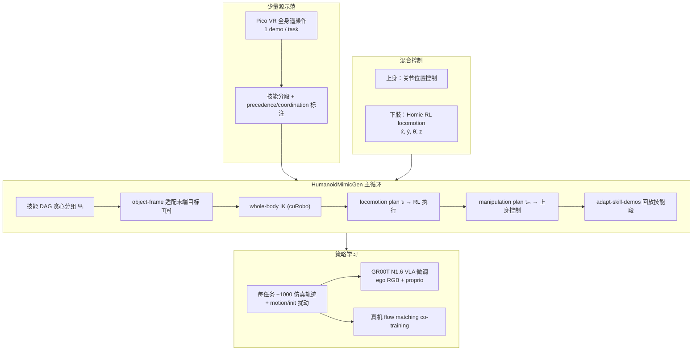

# HumanoidMimicGen

**HumanoidMimicGen** 是 NVIDIA 与 UT Austin 团队的 **人形 loco-manipulation 合成示范生成** 论文（arXiv:2605.27724，OpenReview `ekzk7TSLKr`；**ICRA 2026 Synthetic Data for Robot Learning Workshop Best Paper Finalist**）：把 **MimicGen / SkillGen / DexMimicGen** 的 **object-centric 技能片段适配** 推进到 **需全身平衡与行走的双足 G1**，并发布 **九任务仿真基准** 与 **sim-and-real co-training** 真机验证。

## 英文缩写速查

| 缩写 | 英文全称 | 简要说明 |
|------|----------|----------|
| VLA | Vision-Language-Action | 视觉–语言–动作多模态策略，本文以 GR00T N1.6 微调 |
| BC | Behavior Cloning | 从示范状态–动作对监督学习策略 |
| IK | Inverse Kinematics | 由末端/约束目标反解全身关节配置 |
| DAG | Directed Acyclic Graph | 技能 precedence 约束构成的有向无环执行图 |
| PSR | Policy Success Rate | 策略 rollout 任务成功率（论文主指标） |
| Loco-Manip | Loco-Manipulation | 行走与操作动力学耦合的全身任务 |

## 为什么重要

- **填补 MimicGen 谱系的人形空白**：固定臂/移动底座的 **task-space OSC** 假设在双足人形上不成立；HumanoidMimicGen 用 **混合控制 + 静/动解耦规划** 把「少量遥操作 → 大规模 IL 数据」推到 **loco-manipulation**。
- **单示范 → 千级高质量数据**：九任务平均 PSR **0.89**（VLA），相对 **DexMimicGen+ 0.33**、**100 条真人 demo 0.48** 显示 **规划驱动生成** 可超越单纯堆人力采集。
- **系统化数据–策略研究台**：同一基准上 ablation **motion noise / init randomization / 架构（VLA vs Flow vs DP）**，为 loco-manip 数据工程提供可复现实验协议。
- **真机 co-training 增益**：合成数据 + 有限真机示范，平均成功率 **0.71 vs 0.51（+20%）**，与社区 **sim-and-real co-training** 主线一致。

## 流程总览

## 核心机制（归纳）

### 问题 formulation 与技能适配

- 状态含机器人关节 $q$、物体/末端 **SE(3)** 位姿；动作为 **关节位置目标**。
- 源示范切分为 **object-centric skills** $\psi=\langle e,f,d^\psi\rangle$，带 **precedence** $\mathcal{P}$ 与 **coordination** $\mathcal{C}$；后者转译为额外 precedence，形成 **DAG**。
- 空间不变适配：$a'[e]=s'[f]{s^\psi_0[f]}^{-1}a^\psi[e]$；双手任务需 **pick-before-place** 等约束（如 Table-to-Shelf）。

### 混合动作空间（§4.1）

- **低层**：全关节位置控制 API。
- **高层**：**(i)** 臂/手/躯干关节命令；**(ii)** 基座 $[\dot{x},\dot{y},\dot{\theta},z]$。
- **Homie** RL controller 将基座命令映射为 **动态可行** 腿关节；遥操作与数据生成共用该层次结构。

### 全身数据生成（§4.3）

对每组可并行技能 $\Psi_i$：

1. 适配各 skill 起始末端目标 $T[e]$；
2. **whole-body IK** 批量求 $q''$；
3. 构造 **switch config** $q'$（当前上身 + 目标腿）；
4. **plan-motion** 腿关节 $\tau_l$ → **control-locomotion**（RL，跟踪不完美故用 achieved $q'$）；
5. **plan-motion** 上身 $\tau_m$ → **control-manipulation**；
6. **adapt-skill-demos**：逐步 IK 跟踪适配后的 skill 动作序列。

**cuRobo 后端**：自动 mesh→碰撞球分解、GPU batch IK/规划；对预期接触对 **缩小碰撞球** 缓解 over-approximation 不可行。

### 数据质量扰动（§4.4）

| 策略 | 机制 | 去掉后平均 PSR |
|------|------|----------------|
| **Motion noise** | 执行 $a+\epsilon$，标签存 $a$ | **0.89 → 0.49** |
| **Init pose randomization** | 基座初始位姿扰动 | **0.89 → 0.51** |

### G1 Loco-Manipulation Benchmark（9 任务）

| 任务 | 考察点 |
|------|--------|
| Box Lift Floor | 地面抓取 + 垂直 reach |
| Push Button | 接近 + 单臂接触 |
| Box Lift | 短距 reposition + 抓取 |
| Push Shelf Forward | **长时域**（~1230 steps）全身推 |
| Drill Lift / Drill PnP | 单/双臂 +  tabletop |
| Box Table to Shelf | **双手 precedence**（pick→place） |
| Pick Drill From Holder | 接触 rich 抽取 |
| Drill Lift Obstacle | **多段导航** + 操作 |

初始状态随机采样 **物体位姿 + 机器人 root**；成功为二值条件。

## 实验与评测

### 仿真（Table 1 摘要）

- 数据：每任务 **1 人类 demo → 1000 生成成功轨迹**。
- **HumanoidMimicGen + VLA 平均 PSR 0.89**；DexMimicGen+ **0.33**；100 human demos **0.48**；单 human demo **0.26**。
- 长时域：**Push Shelf Forward 1.00**（DexMimicGen+ 0.35）；**Box Lift Floor 0.97**（单 demo 0.14）。

### 策略架构 ablation（同 1000 HumanoidMimicGen demos）

| 架构 | 平均 PSR |
|------|----------|
| **VLA（GR00T N1.6）** | **0.89** |
| Flow Matching（AdaFlow） | 0.86 |
| Diffusion Policy | 0.51 |

### 真机 co-training（G1 + OAK-D）

| 任务 | Real-only | Co-training |
|------|-----------|-------------|
| ThrowBottle | 0.60 | 0.75 |
| BoxToCart | 0.35 | 0.60 |
| PickCanister | 0.50 | 0.75 |
| PickCanisterWithObstruction | 0.60 | 0.75 |
| **平均** | **0.51** | **0.71** |

## 常见误区或局限

- **需人工技能/约束标注**：与 DexMimicGen、SkillGen 类似，**precedence/coordination** 与 locomotion 子段需标注；未来或可用 foundation model 辅助。
- **固定技能序列结构**：难以泛化到需 **新技能组合或高层 replan** 的任务。
- **刚体 object-frame 适配**：对 **类内几何变化大** 或 **模糊接触 affordance** 有限（论文指向 CP-Gen 等方向）。
- **DexMimicGen+ 非公平 upper bound**：baseline 故意 **无 motion planning / 碰撞检查**，用于凸显全身规划必要性，不应误读为 DexMimicGen 原论文真机上限。
- **真机用 flow matching、仿真 VLA 主结果**：架构选择与数据规模在不同阶段分开报告，对比时需看 **附录 I** 协议。

## 与其他工作对比

| 方法 | 平台 | Locomotion | 全身规划 | 典型单-demo→大规模 |
|------|------|------------|----------|-------------------|
| **MimicGen** | 固定臂 | ✗ | 末端 OSC | ✓（操作） |
| **DexMimicGen** | 双臂灵巧 | ✗ | 双手协调 | ✓（双手） |
| **MoMaGen** | 移动底座 | 规划 + 适配 | 可见性约束 | ✓（mobile manip） |
| **DexMimicGen+**（本文 baseline） | G1 | 直线插值 base | 弱 IK、无碰撞规划 | 0.33 avg |
| **HumanoidMimicGen** | **G1 双足** | **Homie RL + leg plan** | **cuRobo WBIK + 技能 DAG** | **0.89 avg** |

与 [LEGS](./paper-legs-embodied-gaussian-splatting-vla.md)、[OASIS](./paper-loco-manip-04-oasis.md) 等 **合成视觉演示** 路线互补：HumanoidMimicGen 强调 **物理可执行轨迹 + 规划闭环**，而非纯渲染增广。

与 [Homie](./paper-loco-manip-161-129-homie.md)：**Homie** 提供 **下肢 RL 控制器**；HumanoidMimicGen 在其上构建 **数据生成与 IL 基准**。

## 关联页面

- [Loco-Manipulation](../tasks/loco-manipulation.md)
- [Imitation Learning](../methods/imitation-learning.md)
- [VLA](../methods/vla.md)
- [DexMimicGen](./paper-notebook-dexmimicgen-automated-data-generation-for-bimanu.md)
- [GR00T N1](./paper-hrl-stack-34-gr00t_n1.md)
- [GR00T Visual Sim2Real](./gr00t-visual-sim2real.md)
- [运动小脑 survey 索引](./paper-humanoidmimicgen.md)
- [161 篇 survey 索引](./paper-humanoidmimicgen.md)

## 推荐继续阅读

- 项目页：<https://humanoidmimicgen.github.io/>
- MimicGen：<https://arxiv.org/abs/2310.17595>
- Homie：<https://homietele.github.io/>
- cuRobo：<https://github.com/NVlabs/curobo>

## 参考来源

- [HumanoidMimicGen 论文摘录](../../sources/papers/humanoidmimicgen_arxiv_2605_27724.md)
- Lin et al., *HumanoidMimicGen: Data Generation for Loco-Manipulation via Whole-Body Planning*, arXiv:2605.27724, 2026. <https://arxiv.org/abs/2605.27724>
- OpenReview：<https://openreview.net/forum?id=ekzk7TSLKr>
