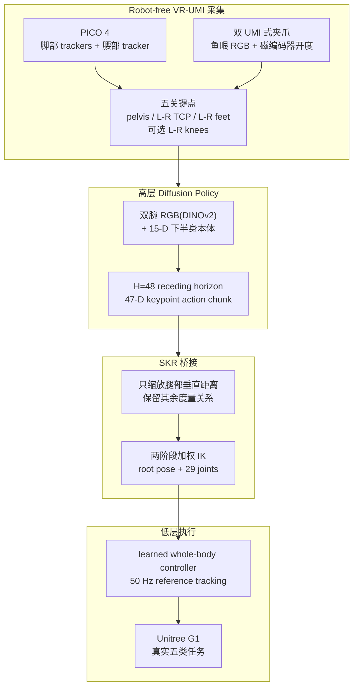

# HumanoidUMI

**HumanoidUMI: Bridging Robot-Free Demonstrations and Humanoid Whole-Body Manipulation**（arXiv:2606.27239，BAAI）收录于 [具身智能研究室 Loco-Manip 接触专题](../../sources/blogs/wechat_embodied_ai_lab_loco_manip_contact_survey.md) **01 接触数据** 组。它把 **Universal Manipulation Interface（UMI）** 的无机器人示范思想扩展到人形全身：操作者穿戴 PICO VR 并手持 UMI 式夹爪即可采集全身关键点、腕部视觉与夹爪动作，随后通过高层策略、空间关键点重定向和低层全身控制器迁移到 **Unitree G1**。

## 一句话定义

HumanoidUMI 用 **VR-UMI robot-free data collection → sparse keypoint Diffusion Policy → Spatial Keypoint Retargeting → learned whole-body controller** 的层级结构，把自然人类示范变成可部署的人形全身操作技能。

## 英文缩写速查

| 缩写 | 英文全称 | 简要说明 |
|------|----------|----------|
| UMI | Universal Manipulation Interface | 无目标机器人、便携手持示教范式；本文扩展到人形全身 |
| SKR | Spatial Keypoint Retargeting | 保留任务相关度量几何的稀疏关键点重定向模块 |
| WBC | Whole-Body Control | 低层全身控制器跟踪 SKR 生成的 G1 参考 |
| TCP | Tool Center Point | 左右夹爪工具中心点，是五关键点动作的一部分 |
| VR | Virtual Reality | PICO 4 追踪腰、脚和手持控制器，用于 robot-free 采集 |
| GMR | General Motion Retargeting | 对照方法；全局/局部缩放会扭曲关键点度量结构 |

## 为什么重要

- **采集阶段不占用人形机器人**：相对 TWIST2/CLONE/Touch Dreaming 等 robot-in-the-loop 遥操作，HumanoidUMI 让人可以在没有 G1 的情况下采集训练示范。
- **保留全身任务语义**：只采手部轨迹无法表达弯腰、迈步、站稳、投掷蓄力；五关键点（骨盆、双 TCP、双脚）显式表达手、脚、腰协同。
- **关键点而非全关节动作**：高层策略不直接预测 G1 关节，降低跨人到机器人的形态耦合；SKR 和 WBC 负责落地到机器人本体。
- **数据效率有真机证据**：论文比较 10 分钟有效示范数量，HumanoidUMI 在 bimanual、throw trash、walk + coffee 上均快于 TWIST2；novice 在 walking coffee delivery 上为 **61 vs 1** 条。
- **与 WT-UMI 互补**：[WT-UMI](./paper-loco-manip-07-wt-umi.md) 更强调触觉/力监督与全身遥操作，HumanoidUMI 更强调 **robot-free** 数据入口。

## 流程总览

## 核心机制

### 1）Robot-free data collection hardware

采集系统由两部分组成：

| 模块 | 记录内容 | 作用 |
|------|----------|------|
| PICO 4 VR + 腰/脚 trackers | pelvis、left foot、right foot 等 6-DoF 姿态 | 捕获支持腿、迈步、弯腰等全身意图 |
| 双 instrumented grippers | 左右腕部 fisheye RGB、夹爪宽度、手持控制器 6-DoF | 复刻 UMI 的腕部视角与抓取动作 |
| 在线 SKR 可视化 | 采集时预览重定向后 humanoid motion | 及时发现不可达或不自然示范 |

系统通过 Pico SDK 与 XRoboToolkit 获得 SMPL 格式身体表示，再转换到机器人关键点坐标系。对于下肢参与更强的任务，可加入左右膝关键点形成七关键点版本。

### 2）High-level Diffusion Policy

高层策略是 Diffusion Policy 的全身扩展，动作空间不是关节，而是稀疏任务空间：

- **观测**：左右腕部 RGB 图像编码为 DINOv2 特征，融合三帧历史的 **15-D lower-body proprioception**（12 个腿关节 + 3 个腰关节）和 diffusion step。
- **动作**：默认 **47-D**，由五个关键点各自的 3D translation + 6D rotation 加两个夹爪宽度组成；七关键点版本为 **65-D**。
- **时序**：每次预测 **H=48** 的 receding-horizon chunk。
- **局部系监督**：未来关键点姿态相对 query-time pelvis / keypoint frame 编码，减少世界坐标差异带来的跨 episode 泛化问题。

### 3）Spatial Keypoint Retargeting（SKR）

SKR 的核心思想是“少缩放，保几何”：

1. 将人类关键点变换到机器人坐标系，以初始 pelvis 对齐。
2. 对足/膝等腿部相关关键点，只在 pelvis-local 的垂直方向乘以高度补偿系数（论文实验中 leg scale 为 **0.75**）。
3. 对 TCP、手部相对空间关系不做全局 rescale，保留抓取/放置任务中的度量距离。
4. 通过加权 IK 求解 robot-native reference：root position、root orientation、29 个 G1 关节。
5. 第一阶段优先足端支撑和朝向，第二阶段细化 pelvis 与 TCP；七关键点版本额外激活膝部约束。

这解释了为什么 GMR 替换 SKR 会显著降低桌面操作任务成功率：全局缩放会把“人手到物体”的真实空间关系扭曲掉。

### 4）Low-level whole-body controller

低层控制器在 MJLab 中训练，用本体反馈跟踪 SKR 输出的短时 reference motion chunk。输入包含当前 proprioceptive state 与重采样 reference window，输出 **29-D residual joint-position action**，再经裁剪/缩放和 PD 控制发送到 Unitree G1。这个分层让高层策略只关心任务几何，平衡与接触稳定由 WBC 负责。

### 5）实验任务与消融

| 任务 | 考察能力 |
|------|----------|
| Cluttered tabletop pick-and-place | 腕部视觉定位、单臂抓取、放置 |
| Bimanual vegetable collection | 双臂协调与对象切换 |
| Dynamic ball shooting | 时序敏感释放；latency matching 关键 |
| Under-table waste disposal | 后退、屈膝、躯干下探、受限空间释放 |
| Walking coffee delivery | 前行、稳定停止、伸手递送 |

论文报告：替换 SKR 为 GMR 会降低前两类 manipulation 成功率；去掉 latency matching 会伤害 dynamic shooting；去掉膝关键点会削弱 under-table / walking delivery 这类腰腿协同任务。

## 实验与评测

| 评测问题 | 证据 |
|----------|------|
| Robot-free demos 能否部署 | G1 上完成桌面 pick-place、双臂蔬菜收集、动态投球、桌下扔垃圾、行走递咖啡 |
| SKR 是否必要 | GMR 替换 SKR 后 manipulation 成功率下降 |
| 延迟匹配是否必要 | dynamic ball-shooting 去掉 latency matching 后下降 |
| 膝关键点是否必要 | under-table / walking delivery 中五关键点不如七关键点可靠 |
| 采集效率 | 10 分钟有效示范数高于 TWIST2；novice walking coffee delivery 为 **61 vs 1** |

## 与相邻路线对比

| 路线 | 采集是否需要目标机器人 | 中间表示 | 适合任务 |
|------|------------------------|----------|----------|
| HumanoidUMI | 否 | 五/七关键点 + wrist RGB + gripper width | 腰腿参与的全身操作 |
| [Human-as-Humanoid](./paper-human-as-humanoid.md) | 否 | Ego-Exo 视频转 60-DoF action labels | PrimeU 高 DoF 上身操作 |
| [WT-UMI](./paper-loco-manip-07-wt-umi.md) | 更偏全身/触觉遥操作 | 触觉/力监督接触接口 | force-aware manipulation |
| TWIST2 类遥操作 | 是 | 机器人本体动作 | embodiment-consistent 数据 |

## 工程实践

| 维度 | 记录 |
|------|------|
| 机器人 | Unitree G1，29 actuated DoF |
| 采集设备 | PICO 4 VR、脚/腰 trackers、双手持 gripper、fisheye wrist cameras、磁编码器 |
| 控制频率 | 低层 whole-body controller 50 Hz；高层预测 H=48 chunk |
| 关键软件 | DINOv2 图像编码、Diffusion Policy、mink/MuJoCo IK、MJLab whole-body controller、Unitree SDK |
| 项目页核查 | <https://baai-aether.github.io/HumanoidUMI> 页面按钮标注 **Code(Coming Soon)** |
| 编号不一致 | 项目页 BibTeX 写作 **BifrostUMI / arXiv:2605.03452**，而本页按用户指定与 arXiv 抓取记录维护 **HumanoidUMI / arXiv:2606.27239**；复现时需核对官方后续命名 |
| 源码运行时序图 | **不适用**：没有可运行官方代码仓库；项目页只显示 code coming soon |

## 局限与风险

- **关键点表示有上限**：五关键点适合大幅全身几何，但对手指灵巧操作、接触力和物体微姿态表达不足。
- **低层控制器是强假设**：如果 WBC 不支持某种姿态/接触，高层再准确也无法部署。
- **硬件仍需定制**：采集不需要 G1，但需要 PICO trackers 与双 gripper，且要做时间同步、相机延迟和夹爪延迟校准。
- **跨平台复用需重新标定**：SKR 的 leg scale、IK frame offset、controller action scale 都与 G1 形态绑定。
- **代码未开放**：外部目前无法完整验证采集、SKR、WBC 训练和部署栈。

## 关联页面

- [Loco-Manip 接触技术地图](../overview/loco-manip-contact-technology-map.md)
- [01 接触数据分类 hub](../overview/loco-manip-contact-category-01-contact-data.md)
- [Loco-Manipulation](../tasks/loco-manipulation.md)
- [Teleoperation](../tasks/teleoperation.md)
- [Diffusion Policy](../methods/diffusion-policy.md)
- [Motion Retargeting](../concepts/motion-retargeting.md)
- [Whole-Body Control](../concepts/whole-body-control.md)
- [WT-UMI](./paper-loco-manip-07-wt-umi.md)
- [BifrostUMI](./paper-bifrost-umi.md)

## 参考来源

- [HumanoidUMI 来源摘录](../../sources/papers/humanoidumi_arxiv_2606_27239.md)
- [具身智能研究室 Loco-Manip 接触专题](../../sources/blogs/wechat_embodied_ai_lab_loco_manip_contact_survey.md)
- arXiv: <https://arxiv.org/abs/2606.27239>
- 项目页：<https://baai-aether.github.io/HumanoidUMI>

## 推荐继续阅读

- [UMI 项目页](https://umi-gripper.github.io/)
- [BifrostUMI canonical 页](./paper-bifrost-umi.md) — 项目页重命名/编号对照
- [Teleoperation 任务页](../tasks/teleoperation.md)
