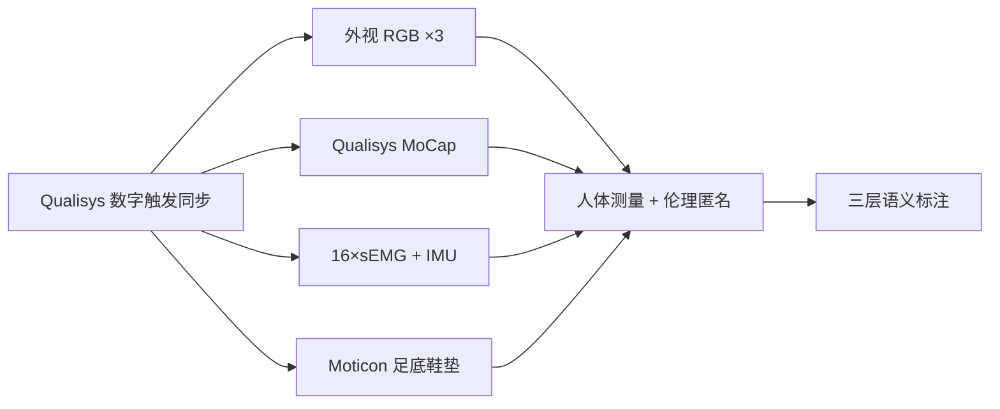

# HUMAPS-4D：足底压力也能推断全身 3D 运动吗？

**HUMAPS-4D**（*A Multimodal Dataset for HUman Motion Analysis with Physiological and Semantic informations*；[CVPR 2026 PDF](https://openaccess.thecvf.com/content/CVPR2026/papers/Dabrowski_HUMAPS-4D_A_Multimodal_Dataset_for_HUman_Motion_Analysis_with_Physiological_CVPR_2026_paper.pdf)，[项目页](https://humaps4d.wp.imt.fr/)）由 **IMT Nord Europe / Institut Mines-Télécom / 里尔大学** 提出：在隐私法规收紧、摄像头难落地的场景里，用 **可穿戴生物力学信号 + 可选视觉监督** 做全身 3D 运动分析与语义理解。

## 一句话定义

**14 小时、32 被试、30 类日常动作的统一多模态人体 4D 数据集：外视 RGB + MoCap + sEMG/IMU + instrumented insoles，并配帧级语义分割、动作描述与临床风格运动评估文本，用于鞋垫动作识别与足底→上身 3D 姿态推断 benchmark。**

## 英文缩写速查

| 缩写 | 英文全称 | 简要说明 |
|------|----------|----------|
| HUMAPS-4D | HUman Motion Analysis with Physiological and Semantic informations | 本文多模态 4D 人体运动数据集 |
| IPS | Instrumented Plantar Pressure / Insole Pressure System | Moticon OpenGo 足底压力鞋垫（每脚 16 传感器） |
| sEMG | Surface Electromyography | 16 路表面肌电，1259 Hz |
| MoCap | Motion Capture | Qualisys 光学动捕，120 Hz，42 marker + 26 joint |
| LOSO | Leave-One-Subject-Out | 鞋垫动作识别评测协议（32 被试留一） |
| MPJPE | Mean Per Joint Position Error | 3D 关节位置误差（cm） |
| DUA | Data Usage Agreement | 学术数据使用协议，获取数据集门槛 |

## 为什么重要

- **视觉与生物力学长期割裂**：计算机视觉要大规模多视角视频 + 语义；生物力学要精确足底压力、sEMG 与个体人体测量——HUMAPS-4D 在 **同一采集协议** 下对齐两者。
- **隐私友好运动感知**：人脸模糊 + 鞋垫/可穿戴推理路线，适合居家辅助、协作机器人、运动监测等 **不宜布摄像头** 的场景。
- **对人形研究的间接价值**：虽非机器人真机数据，但 **高质量全身 MoCap + 语义分段** 可作重定向/模仿学习的 **人体先验**；足底→姿态链路提示 **稀疏可穿戴 → 全身状态估计** 的可行边界。
- **benchmark 可复现起点**：论文给出鞋垫动作识别与足底 3D 姿态基线数字，并计划 2026 年公开 challenge。

## 核心信息

| 项 | 内容 |
|----|------|
| **机构** | 北方高等电信学院（IMT Nord Europe）；法国国立高等矿业电信学校联盟（Institut Mines-Télécom）；里尔大学（Université de Lille） |
| **会议** | CVPR 2026 |
| **规模** | 32 被试 × 10 session × 30 动作/段；14 h；>5.76M 同步帧 |
| **开源** | **数据部分开放**（签署 DUA 后邮件申请）；**官方代码截至 2026-09-06 未发布** |

## 核心结构

### 模态与采样

| 模态 | 设备 / 率 | 内容 |
|------|-----------|------|
| MoCap | Qualisys 11×Miqus M3 @120 Hz | 42 3D marker、26 joint、quaternion；可按骨盆中心化 + 人体测量缩放 |
| sEMG | Del sys Trigno 16 电极 @1259 Hz | 肌电 mV；可相对参考收缩归一化 |
| IMU | 嵌入 EMG 电极 @148 Hz | 各传感器 3 轴加速度 + 3 轴角加速度 |
| IPS | Moticon OpenGo 双鞋垫 @100 Hz | 每脚 16 路压力、加速度、姿态、总力、压力中心 |
| RGB | 3×720p @120 Hz | 外视三视角；内外参；人脸模糊 |

### 语义三层（paired language corpora）

1. **帧级时序分割** — 30 类动作边界；
2. **原子动作描述** — 粗粒度进行中动作文本；
3. **临床风格运动评估** — 姿态、协调、代偿策略、平衡等专家式叙事。

### 采集管线

## 源码运行时序图

**不适用** — 项目页截至入库日（2026-09-06）未提供可运行官方代码仓库；论文描述 baseline 架构（鞋垫编码器 + MoCap 约束、SolePoser 风格双流姿态网络），但无公开 `train.py` / 评测脚本入口。数据获取需先签署 DUA（见 [sources/sites/humaps4d.md](../../sources/sites/humaps4d.md)）。

## 工程实践

| 项 | 建议 |
|----|------|
| 数据申请 | 下载 DUA → 签署 → 邮件 `benjamin.allaert@imt-nord-europe.fr` |
| 评测协议 | 动作识别用 **LOSO**；足底姿态用 **4-fold**（每次 8 被试验证） |
| 窗口长度 | 动作识别 baseline 用 **3 s** 滑窗（鞋垫 300 样本 @100 Hz） |
| 模态融合 | 训练可用 MoCap/RGB/sEMG 作监督，推理可仅鞋垫 |
| 许可边界 | **仅限非商业科研与教育**；勿假设可商用或二次分发 |

## 实验与评测

### 任务 1：鞋垫动作识别（LOSO）

| 动作类 | 纯鞋垫 | 纯 MoCap | 鞋垫+MoCap 融合 |
|--------|--------|----------|-----------------|
| Static | 85.61% | 85.66% | 87.59% |
| Locomotion | 89.08% | 88.47% | **93.84%** |
| Dynamic | 74.36% | 92.05% | 87.57% |
| Interaction | 73.84% | 84.83% | 85.71% |
| Postural | 90.53% | 96.31% | **96.89%** |
| **All** | 82.71% | 89.45% | **90.33%** |

动态/交互类纯鞋垫明显吃亏（跳跃期足底信号稀疏、上肢主导动作难从脚推断）；跨模态监督可部分弥补。

### 任务 2：足底→16 关节 3D 姿态（4-fold CV）

| 指标 | 总体 |
|------|------|
| MPJPE ↓ | **31.1 ± 0.8 cm** |
| Inconsistency ↓ | **7.5 ± 0.1 cm** |
| MPJAE ↓ | **13.3 ± 1.5°** |

论文强调：即使训练时用 MoCap 约束，**仅凭足底仍远难逼近真值**；双臂不在推断范围。

## 与其他工作对比

| 数据集 / 工作 | 关系 |
|---------------|------|
| **SolePoser / P2P-Insole** | 同类「鞋垫→全身姿态」；规模与语义标注更弱，且代码/数据多未公开 |
| **MovePort / Smart-insole** | 生物力学向；被试/动作/视觉覆盖更窄 |
| **[HUMOTO](./paper-notebook-humoto-a-4d-dataset-of-mocap-human-object-intera.md)** | 4D 人-物交互 MoCap；无 sEMG/足底/临床语义层 |
| **[LaFAN1](./lafan1-dataset.md)** | 小规模高质量 BVH 步态；无可穿戴生理信号 |
| **[人形参考运动数据集选型](../comparisons/humanoid-reference-motion-datasets.md)** | 机器人重定向主线；HUMAPS-4D 偏 **人体感知/生物力学 + 隐私友好推断** |

## 结论

**HUMAPS-4D 的价值在于用统一协议把「计算机视觉的大规模语义」和「生物力学的个体化生理测量」绑在一起，并诚实标出鞋垫 alone 的能力上限。**

- 真正稀缺的是 **模态齐全 + 语义三层 + 人体测量** 的同分布数据，而非又一个纯 RGB-MoCap 对。
- 鞋垫动作识别上，**跨模态训练监督**（MoCap 等）能把全类平均从 82.7% 拉到 90.3%，但 dynamic/interaction 仍暴露足底信息瓶颈。
- 足底→3D 姿态 baseline 约 **31 cm MPJPE** —— 说明「只穿鞋就能重建全身」在工程上仍远未就绪，不宜过度承诺。
- 对人形落地应读作 **人体运动先验与稀疏传感上限研究**，不是可直接喂给 G1 的策略数据。
- 获取摩擦在 **DUA 流程**；复现论文数字需等官方代码或自行实现附录 baseline。
- 2026 年计划公开 challenge —— 适合跟踪语义分割与隐私友好多模态融合新结果。

## 局限与风险

- **无公开代码**：baseline 细节在论文/附录，自行复现成本高。
- **DUA 门槛**：不像 HF 一键下载；跨国合规需预留时间。
- **动作域**：30 类日常/技能动作，**非操作物体-rich HOI**；与 loco-manipulation 机器人任务有 gap。
- **姿态推断不含双臂**；interaction 类上肢信息主要依赖 MoCap 监督而非鞋垫。
- **健康被试棚拍**；病理 gait / 野外长期穿戴漂移未覆盖。

## 关联页面

- [运动重定向](../concepts/motion-retargeting.md)
- [运动数据质量](../concepts/motion-data-quality.md)
- [人形参考运动数据集选型](../comparisons/humanoid-reference-motion-datasets.md)
- [HUMOTO](./paper-notebook-humoto-a-4d-dataset-of-mocap-human-object-intera.md)
- [模仿学习](../methods/imitation-learning.md)

## 参考来源

- [HUMAPS-4D 论文摘录](../../sources/papers/humaps4d_cvpr_2026.md)
- [项目页归档](../../sources/sites/humaps4d.md)
- [CVPR 2026 Open Access PDF](https://openaccess.thecvf.com/content/CVPR2026/papers/Dabrowski_HUMAPS-4D_A_Multimodal_Dataset_for_HUman_Motion_Analysis_with_Physiological_CVPR_2026_paper.pdf)

## 推荐继续阅读

- [HUMAPS-4D 项目页](https://humaps4d.wp.imt.fr/)
- [SolePoser（UIST 2024）](https://doi.org/10.1145/3654777.3676456) — 鞋垫全身姿态先行工作
- [P2P-Insole（arXiv:2505.00755）](https://arxiv.org/abs/2505.00755) — 足底压力 + 运动传感器姿态估计对照
