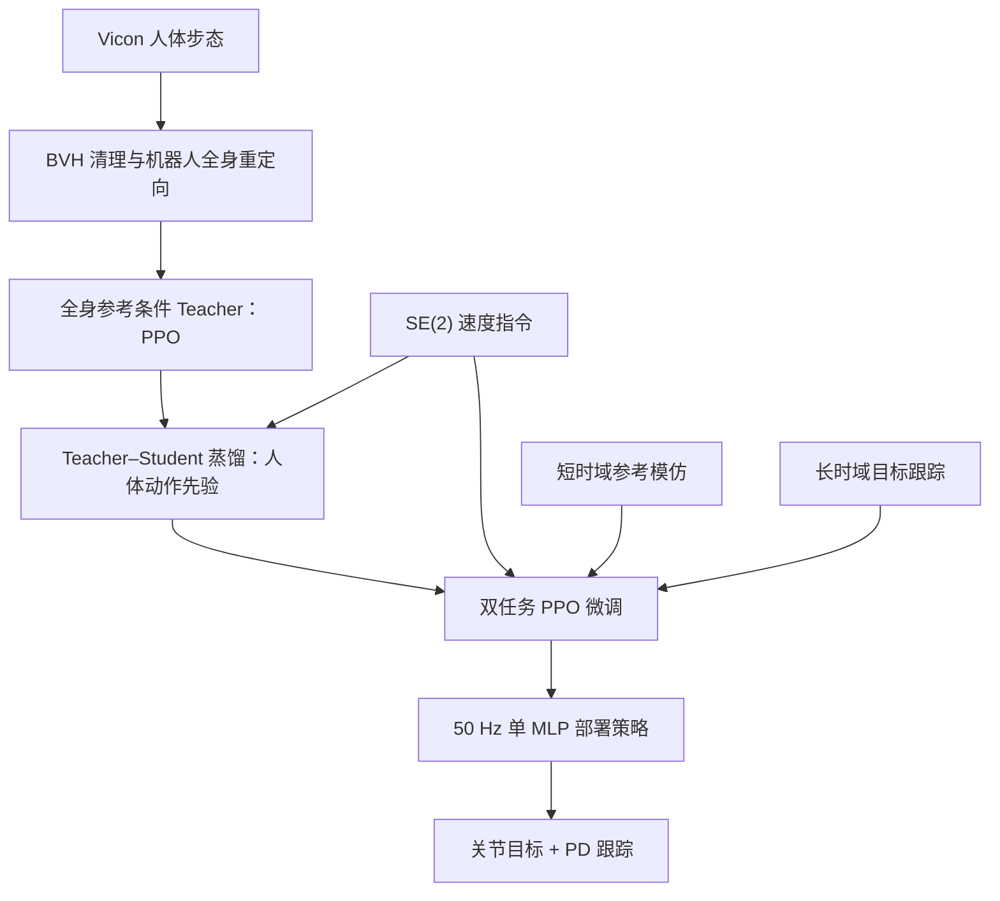

# HuMBLE：人类动作驱动的具身 locomotion

## 一句话定义

**HuMBLE**（*Human Motion-Driven Behavior Learning for Embodied Locomotion*）是一套将人体运动风格与速度指令跟踪结合的人形 locomotion 学习配方：先从 retarget 后的全身人体步态学习紧凑运动先验，再在保持风格的同时扩展指令覆盖，最终以单个轻量策略在真机上执行。

## 英文缩写速查

| 缩写 | 英文全称 | 简要说明 |
|------|----------|----------|
| SE(2) | Special Euclidean group in 2D | 本文用纵向/横向速度与转向率表达的底盘运动命令 |
| RL | Reinforcement Learning | 用于训练参考动作 teacher 和第二阶段策略微调 |
| PPO | Proximal Policy Optimization | HuMBLE 两阶段强化学习使用的策略优化算法 |
| MLP | Multilayer Perceptron | 部署时把本体状态与速度命令映射为关节动作的网络 |
| PD | Proportional-Derivative Control | 低层关节位置目标跟踪器 |
| BVH | Biovision Hierarchy | 动捕骨架轨迹的中间文件格式 |
| DAgger | Dataset Aggregation | 学生 rollout 后由 teacher 标注动作的蒸馏方式 |
| GC-RSI | Goal-Conditioned Reference-State Initialization | 按目标速度从相近人体参考状态初始化微调环境 |
| ONNX | Open Neural Network Exchange | G1 上策略推理计时使用的模型运行时格式/生态 |

- **论文：** [arXiv:2610.10489](https://arxiv.org/abs/2610.10489)（cs.RO，2026-10-07）
- **机构：** RAI Institute、Boston Dynamics、Carnegie Mellon University
- **验证平台：** Boston Dynamics Atlas R1、Atlas D1；Unitree G1
- **开放状态：** 论文公开；未发现公开训练仓库或策略权重。论文称 G1 数据和对应底层结果数据将发布，Atlas 数据受专有约束不公开。

## 为什么重要

纯命令跟踪 RL 可以学会走稳、响应快，但常出现僵硬或缺少全身协调的步态；直接模仿人体动作则容易被数据集覆盖范围限制，遇到未出现过的侧移、转向或高速组合指令时泛化不足。HuMBLE 将**风格获取**和**命令空间扩展**拆为两阶段处理。

## 方法流程

### 阶段一：获取人体运动先验

论文使用约 **3 小时、528,214 帧** 的人体步态动捕数据。轨迹覆盖不同速度与方向，包括慢走、正常/快速步行、慢跑、冲刺、侧步和转向。经 BVH 清理后，研究者通过两阶段 spacetime / kinematic retargeting 将动作映射到机器人形态，并用轨迹计算纵向速度、横向速度与转向率指令；左右镜像用于平衡方向覆盖。

第一阶段训练一个接收全身参考的 teacher，再用 teacher–student / DAgger 式动作标注和学生 rollout 蒸馏出策略先验。学生仅接收部署时可用的 proprioception 与 SE(2) 速度指令，不在运行时读取人体动作参考。

### 阶段二：兼顾风格与泛化的 RL 微调

HuMBLE 用并行的两类环境继续训练先验策略：

- **短时域 reference-guided imitation：** 通过显式参考轨迹跟踪回报，局部保留步态风格；缩短 episode，避免部分可观测条件下不断累积的跟踪偏差让参考回报失效。
- **长时域 goal-conditioned tracking：** 随机采样速度指令、在 episode 中重采样指令，直接优化命令跟踪、正则与存活回报，以补足数据稀疏区域。
- **GC-RSI 初始化：** 根据目标速度，从相近指令对应的参考帧中取样并施加小扰动，减少冷启动时命令与姿态不匹配造成的早期摔倒。
- **比例控制风格—响应折中：** 标称参考/目标环境比例为 50:50；仅用目标跟踪会退化出不自然步态，仅用参考跟踪则难以执行 OOD 侧移并可能摔倒。

### 工程实践：部署接口

输入由机载本体感知与 **SE(2) 平面速度指令**（纵向速度、横向速度与转向率）构成：状态估计线速度、IMU 角速度和重力投影、关节位置/速度以及上一时刻动作。单个 MLP 以 **50 Hz** 预测关节动作，再经动作缩放和默认关节姿态变成关节目标，由低层 PD 控制器跟踪。G1 上实测策略推理平均 **1.1 ms**（Jetson AGX Orin CPU、ONNX Runtime）；Atlas 推理时间因保密协议未公布。

## 实验与评测

论文在 Atlas R1、Atlas D1 与 Unitree G1 上评估风格保真度、SE(2) 命令覆盖、响应速度、抗扰性与仿真到真机迁移。定性步态出现同步摆臂、支撑腿膝伸展、类脚跟着地和脚跟到脚尖滚动。

Atlas R1 的大部分命令区域中，跟踪误差与不使用人体先验的 Tabula Rasa RL 基线相当；多数代表性命令的 sim-to-real 误差差值在 **0.05 m/s**（线速度）和 **0.10 rad/s**（角速度）范围内。论文另报告 Atlas R1 推扰测试在主要方向上可承受最高 **1400 N**。这些结果分别是指定平台和论文测试协议下的量化结果，不代表对任意地形或任意推力方向的保证。

高速度下，Tabula Rasa 基线通常能更快达到大指令目标；HuMBLE 加速更平滑、更符合参考数据。快速斜向行走等在动捕中欠覆盖的指令区域也仍是主要误差来源。演示还把策略作为 joystick 命令执行器，以及自主导航和箱体跑酷层级控制中的底层 locomotion 模块。

## 结果读法与边界

| 维度 | 论文支持的结论 | 边界 |
|---|---|---|
| 风格和可控性 | 显式人体参考回报 + 任意 SE(2) 目标跟踪，兼顾动作风格与指令覆盖 | 两者存在 Pareto 折中，环境分配比例需调整 |
| 实机部署 | 在 Atlas R1/D1 与 Unitree G1 展示/评测；G1 CPU 推理 1.1 ms | 需要高质量本体估计与机器人专用 retarget/训练，Atlas 低层参数未公开 |
| 数据 | 约三小时动捕，528,214 帧，覆盖多速度与方向 | 不是无限命令覆盖；稀疏区域表现较弱 |
| 开放复现 | 论文与补充材料公开 | 截至论文版本未给公开代码/权重；G1 数据尚属“将发布”，Atlas 数据不可公开 |
| 任务范围 | 平地步态、侧步、转弯与高层系统集成演示 | 论文明确将复杂地形留作后续；尚未验证 loco-manipulation 或语义指令 |

## 与其他工作对比

- [GaitSpan](./paper-gaitspan-humanoid-locomotion-walking-running.md) 从冻结行走策略出发，在不使用人体演示的条件下扩展到走—慢跑—跑；HuMBLE 则直接以人体步态获取风格先验，再做速度命令微调。
- [CReF](./paper-cref.md) 侧重单深度视觉感知与地形行走；HuMBLE 目前针对平地、以本体感知为主。
- 本文方法由 teacher–student 蒸馏和多任务 RL 组成，**不应简单标记为 AMP 判别器式训练**。

## 结论

**总体判断：HuMBLE 的主要价值是把人体步态风格蒸馏为低延迟、可转向的策略，并用显式双任务微调补足人体数据本身没有覆盖的指令区域。**

1. **先验和泛化分开学：** teacher–student 先取得全身动作风格，参考模仿 + goal tracking 再调节风格与命令覆盖，不能只做其中一项。
2. **运行时负担低：** 单 MLP、50 Hz 部署；论文报告 G1 上 Jetson AGX Orin CPU 推理 1.1 ms，无需部署生成式动作采样器。
3. **数据分布仍决定边界：** 快速斜向、侧向加转向等稀疏命令是误差/稳定性风险区；GC-RSI 和多任务目标训练是关键补充。
4. **真机数字按平台理解：** Atlas R1 的最高 1400 N 是论文指定推扰测试结果；更激进命令下 HuMBLE 响应慢于 Tabula Rasa 基线。
5. **复现入口有限：** G1 动捕与结果数据仅承诺后续发布，Atlas 数据不能公开；论文没有给出可用的训练代码或策略权重。

## 源码运行时序图

**不适用（截至 2026-10-10）：** arXiv v1 未链接公开源码仓库、可运行入口或策略权重，因此没有可核验的官方训练/部署调用路径。论文公开和“数据将发布”不等于代码已开源。

## 局限与风险

- 论文实验主要是平地标准 locomotion；复杂地形需要另外加入地形观测和相应训练设计。
- 速度指令由轨迹估算并标注；该做法适合 SE(2)，不直接解决自然语言等高层命令监督问题。
- MLP 的容量边界尚未系统研究；论文将 loco-manipulation、遥操作等多行为扩展留作未来工作。
- 部署依赖稳定的机载速度估计；作者指出 Unitree G1 在非结构化室外环境可能出现较大速度估计噪声与漂移。

## 关联页面

- [人形机器人 locomotion 任务](../tasks/humanoid-locomotion.md)
- [人形 AMP 与运动先验综述](../overview/humanoid-amp-motion-prior-survey.md)
- [GaitSpan：从走路到跑步的技能生长](./paper-gaitspan-humanoid-locomotion-walking-running.md)
- [CReF：深度条件人形行走](./paper-cref.md)

## 参考来源

- [HuMBLE 来源摘录](../../sources/papers/humble_arxiv_2610_10489.md)
- [论文摘要 / 版本记录](https://arxiv.org/abs/2610.10489)
- [论文 HTML 全文与补充材料](https://arxiv.org/html/2610.10489v1)
- [论文 PDF](https://arxiv.org/pdf/2610.10489)

## 推荐继续阅读

- [HuMBLE arXiv HTML 全文与补充材料](https://arxiv.org/html/2610.10489v1)
- [参考：GaitSpan 论文页](./paper-gaitspan-humanoid-locomotion-walking-running.md)
